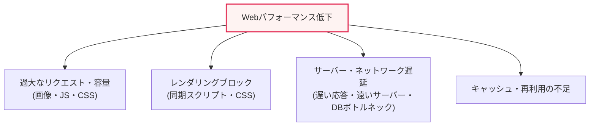
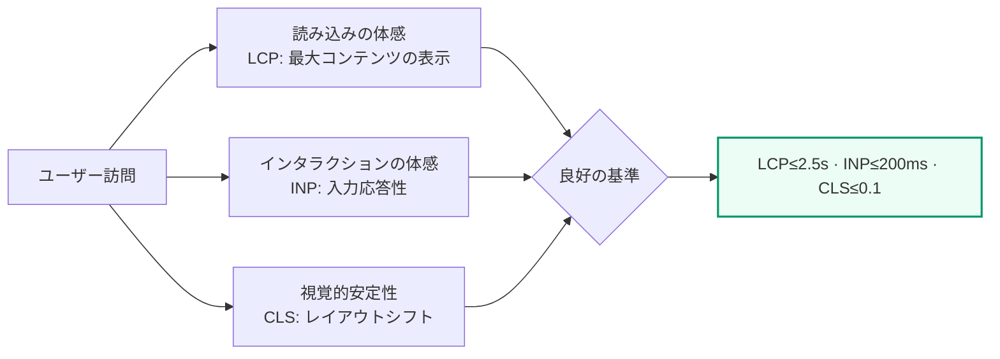

# Webパフォーマンス管理とフロントエンド最適化

## 1. 概要

### A. 定義
> **Webパフォーマンス管理(Web Performance Management)**とは、Webベースのサービスの**応答速度・読み込み時間・インタラクションの応答性を測定・分析・改善**し、ユーザー体験(UX)とビジネス成果を同時に高める継続的なエンジニアリング活動である。モバイルファースト・SPA(Single Page Application)の時代において、Webパフォーマンスはそのままユーザー満足・離脱・コンバージョン率・検索順位に直結する。

Webパフォーマンスが単なる「技術的完成度」の問題を超えて**ビジネス指標**として扱われる根本的な理由は、「**遅いWebはすなわちユーザー離脱と売上損失**」だからである。多数の業界調査が、ページの読み込みが1秒遅れるごとに直帰率が上昇し、コンバージョン率が有意に低下することを報告している。Googleが公開した事例では、読み込み時間が1秒から3秒に延びると直帰の確率が約32%増加し、1秒から5秒に延びると約90%増加すると報告されており、Amazon・Walmartなども100ms単位の遅延が売上・コンバージョンに数%の影響を与えると発表している(数値はサービス・時点によって異なり得るため、絶対値よりも「遅延はすなわち損失」という傾向として解釈すべきである)。

特にネットワークが不安定で、CPU・画面が小さいモバイル環境では、パフォーマンス低下がより致命的である。Webパフォーマンスはサーバー(バックエンド)とブラウザ(フロントエンド)の双方で決まるが、興味深いことに、実際のユーザーが体感する読み込み時間の相当部分(経験的にしばしば「大半」)は、サーバー応答後にブラウザがリソースをダウンロードしてパース・レンダリングする**フロントエンド領域**で発生する。すなわち、サーバーがいかに速くHTMLを返しても、重い画像・JavaScript・CSSを受け取って画面を描画する過程に時間がかかれば、ユーザーは「遅いサイト」と認識する。そのため、フロントエンド最適化が体感パフォーマンス改善の中核的なてことなる。

### B. バックエンドとフロントエンドの役割分担
パフォーマンスは、サーバーが最初のバイトを返すまでの時間(TTFB)と、その後ブラウザが画面を完成させるまでの時間に分かれる。バックエンドは高速な応答・効率的なクエリ・適切なキャッシュヘッダーによってTTFBを下げ、フロントエンドは受け取ったリソースをいかに速く描画し、操作可能にするかを担う。両領域は相互依存的であり、サーバーが遅ければいくらフロントエンドを最適化しても最初の画面は遅れ、サーバーが速くてもフロントエンドが重ければユーザーは依然として待たされる。本ノートは体感パフォーマンスへの効果が大きいフロントエンドに焦点を当てるが、両領域をあわせて管理すべきという前提は維持する。

### C. 登場背景と必要性
かつては「サーバー増設・回線増強」というインフラ観点のパフォーマンス改善が支配的であった。しかし、SPA・リッチメディア・サードパーティスクリプト(広告・分析・チャットボット)が普及するにつれて、ブラウザで実行・レンダリングすべきコード量が爆発的に増え、ユーザーの期待水準もともに高まった。これに加えて**検索エンジンがパフォーマンスをランキングシグナルとして反映**(GoogleのCore Web Vitalsに基づくページエクスペリエンスシグナル)するようになり、Webパフォーマンス管理は「あればよいもの」から、SEO・コンバージョン・ブランド信頼を左右する**必須の競争力**へと格上げされた。また、低スペック端末・低帯域ネットワークの利用者を含む**包摂的なパフォーマンス(Inclusive Performance)** の観点からも、重いWebは特定の層をサービスから排除する結果を招くという点が注目されるようになった。

## 2. Webパフォーマンスを決定する読み込みパイプラインと低下要因

Webパフォーマンスを改善するには、まず「なぜ遅いのか」を構造的に理解しなければならない。ユーザーがURLを入力してから画面が完成するまでには、**DNS参照 → TCP/TLS接続 → サーバー処理 → 応答送信 → ブラウザのパース(HTML/CSS) → リソースのダウンロード → レンダリング(レイアウト・ペイント) → スクリプト実行**というパイプラインを経る。これら各段階がボトルネックとなり得るが、低下要因はおおむね以下の四つに収れんする。

**第一に、過大なリソース**である。最適化されていない大容量画像、使用しないコードまで含んだ重いJavaScriptバンドル、膨大なCSSは、ダウンロード・パース時間を増大させる。特にJavaScriptは単に「ダウンロードする時間」だけでなく「パース・コンパイル・実行」にCPUを消費するため、同じ容量でも画像より低スペック端末ではるかに大きな負担を与える。これが「画像よりJavaScriptのほうが高くつく」というフロントエンドの格言の背景である。

**第二に、レンダリングブロック(Render-Blocking)**である。ブラウザは`<head>`内の同期スクリプトやスタイルシートに出会うと、画面の描画を止めてそれを先に処理する。CSSOMが完成しなければレンダーツリーを構築できず、パーサーブロッキングスクリプトはDOM構築を停止させるからである。結果として「内容はすでに受信したのに画面は真っ白」という状態が長引く。

**第三に、サーバー・ネットワーク遅延**である。TTFB(Time To First Byte)を左右するサーバー処理時間、DBクエリのボトルネック、ユーザーから物理的に遠いオリジンサーバー、繰り返される往復(RTT)がこれに該当する。

**第四に、キャッシュ・再利用の不足**である。変化しないリソースを訪問のたびに再ダウンロードすれば、帯域と時間が浪費される。キャッシュポリシー・CDNがなければ、初回訪問と再訪問のパフォーマンス差がなくなる。

これに加えて、読み込み中に要素がずれて画面が跳ねる**レイアウトの不安定性**も体感品質を大きく低下させる。画像・広告・フォントが遅れて読み込まれ、すでに描画されたコンテンツを押し出すと、ユーザーが押そうとしたボタンが突然移動して誤クリックを誘発する。これらの要因は互いに絡み合っているため、一つだけを手直ししても体感改善は限定的である。したがって最適化は個別手法の羅列ではなく、「どの指標のどのボトルネックを先に叩くか」という優先順位の問題として取り組むべきである。

| 低下要因 | 代表的な症状 | 関連指標 |
|---|---|---|
| **過大なリソース** | 大きな画像・重いJSバンドル、長いダウンロード | LCP, Total Blocking Time |
| **レンダリングブロック** | 同期スクリプト・CSSが最初の画面を遅延(白紙) | FCP, LCP |
| **サーバー・ネットワーク遅延** | 遅い最初のバイト、DBボトルネック、遠いサーバー | TTFB |
| **キャッシュ不足** | 再訪問でも毎回再ダウンロード | 再訪問時の読み込み時間 |
| **レイアウトの不安定性** | 読み込み中に要素がずれて誤クリック | CLS |

## 3. ユーザー中心のパフォーマンス指標: Core Web Vitals

「何を測定するか」は「何を改善するか」を決定する。かつての`onload`完了時点のような技術指標は、ユーザーの体感との乖離が大きかった。そこでGoogleは**実際のユーザー体験を代弁する指標**としてCore Web Vitalsを提示し、今日ではパフォーマンス管理の事実上の標準言語となった。

**LCP(Largest Contentful Paint)**は、ビューポート内で最も大きなコンテンツ(たいていはヒーロー画像・見出し)が描画される時点であり、「読み込みがどれだけ速く体感されるか」を表す。推奨基準は2.5秒以下である。**INP(Interaction to Next Paint)**は2024年にFID(First Input Delay)を置き換えた指標で、ページの存続期間全体におけるユーザー入力への応答遅延を総合して「インタラクションがどれだけ滑らかか」を測定し、200ms以下が推奨される。**CLS(Cumulative Layout Shift)**は読み込み中に要素が予期せずずれる度合いで「視覚的安定性」を表し、0.1以下が推奨される。これら三つの指標は**フィールドデータ(実ユーザー、RUM)**と**ラボデータ(Lighthouseなどの合成計測)**の二種類で収集するが、改善の判断は必ず実ユーザーの分布(特に75パーセンタイル)を基準にしなければならない。ラボで速くても低スペック利用者のフィールドで遅ければ、改善されたことにはならないからである。

## 4. フロントエンド観点のWeb最適化方策

最適化戦略の中核原理は「**小さく、少なく、近くに、後で、前もって**」と要約できる。リソースを**小さく**(圧縮)し、リクエストを**少なく**し、CDNによってユーザーの**近くに**置き、今すぐ必要でないものは**後で**(遅延)読み込み、まもなく使うものは**前もって**(プリロード・プリフェッチ)準備する。この原理を実際の手法に落とし込むと次のとおりである。

**A. リソースの最小化・圧縮.** JS・CSSをMinify(空白・コメントの除去)し、転送層でGzipまたはBrotliにより圧縮する。Brotliはテキストリソースにおいて、Gzipに比べて通常15~25%高い圧縮率を示し、同じコンテンツをより少ないバイト数で転送する。これに加えて**Tree Shaking**で使用しないコードをバンドルから除去すれば、実行コストまで削減できる。原理は単純である — 転送・パースすべき絶対量を減らすことが最も確実な改善である。

**B. 画像・メディアの最適化.** Webトラフィックの多くを占める画像は、最適化の効果が最も大きい。WebP・AVIFのような次世代フォーマットは、同等画質でJPEG/PNGに比べて25~50%以上容量を削減する。また`srcset`・`sizes`でデバイス解像度に合ったサイズを配信し(レスポンシブ画像)、画面外の画像は`loading="lazy"`で**遅延読み込み**して初期ロードから除外する。動画は自動再生の代わりにポスター画像+オンデマンド読み込みを適用する。

**C. リクエスト数の削減と転送の効率化.** かつてのHTTP/1.1では接続あたりの同時リクエスト制約のため、バンドル・スプライトでリクエスト数を減らすのが定石であった。しかし**HTTP/2のマルチプレキシング**は一つの接続で多数のリクエストを並列処理するため、過度なバンドルはかえってキャッシュ効率を損なう可能性がある。したがってプロトコルに合わせて戦略を調整しなければならない — これが「リクエストを無条件に減らせ」ではなく「文脈に合わせて減らせ」である理由である。HTTP/3(QUIC)はUDPベースで接続確立・パケットロス回復を改善し、モバイル環境のパフォーマンスをさらに引き上げる。

**D. キャッシュ・CDNの活用.** `Cache-Control`・`ETag`でブラウザキャッシュを活用して再訪問時の再ダウンロードをなくし、静的リソースはファイル名にハッシュを付けて(キャッシュバスティング)長期キャッシュと即時更新を両立させる。**CDN**はコンテンツをユーザーの地理的近傍のエッジサーバーに複製して物理的距離(RTT)を縮め、これはオリジンサーバーの性能と無関係に全世界のユーザーの体感を均質化する。

**E. レンダリングの最適化.** スクリプトに`async`(順序に依存しない独立スクリプト)・`defer`(DOMパース後に順番どおり実行)を適用してパーサーブロッキングをなくし、最初の画面に必要な最小限のスタイルだけをインライン化する**Critical CSS**で白紙時間を短縮する。**コード分割**によりルート・コンポーネント単位でバンドルを分割し、初期ロードでは今の画面に必要なコードだけをダウンロードする。

| 方策 | 中核手法 | 主に改善される指標 |
|---|---|---|
| **リソースの最小化・圧縮** | Minify, Brotli/Gzip, Tree Shaking | LCP, TBT |
| **画像・メディアの最適化** | WebP/AVIF, レスポンシブ(srcset), Lazy Loading | LCP |
| **リクエスト数削減・転送効率化** | HTTP/2・3マルチプレキシング, 条件付きバンドル | LCP, TTFB |
| **キャッシュ・CDN** | Cache-Control/ETag, ハッシュバスティング, エッジキャッシュ | 再訪問・TTFB |
| **レンダリングの最適化** | async/defer, Critical CSS, コード分割 | FCP, INP |
| **レイアウトの安定化** | width/heightの明示, フォントスワップ用の予約領域 | CLS |

## 5. 比較と実務事例: 手法選択の文脈

同じ目的であっても、状況によって最適な手法は異なる。**バンドル vs. 多数ファイル**が代表的である。HTTP/1.1の時代にはファイルを結合してリクエスト数を減らすのが有利であったが、HTTP/2以降は細かく分割してキャッシュヒット率と並列ダウンロードを高めるほうが有利な場合が多い。差が生じる理由は、ボトルネックが「接続数の制約」から「転送・キャッシュ効率」へ移ったためである。実務上の含意は、「ベストプラクティスはプロトコル・CDN構成に依存する」という点である。

**レンダリング戦略の比較**も重要である。CSR(Client-Side Rendering)は初期ロードが重いがその後のインタラクションが速く、SSR(Server-Side Rendering)は最初の画面(FCP・LCP)が速いが、サーバー負荷とTTFBが増える可能性がある。SSG(Static Site Generation)は事前生成により最も速い初期ロードを提供するが、動的データに弱い。近年はこれらを折衷した**ハイドレーションの遅延・アイランドアーキテクチャ・ストリーミングSSR**が広がり、「静的に速く見せ、必要な部分にだけインタラクションを付ける」方向へと収れんしつつある。

実務の改善事例として、あるコマースサービスがヒーロー画像をWebPに切り替え、遅延読み込み・プリロードを適用してLCPを4秒台から2秒台に下げ、コンバージョン率を改善したタイプの事例が広く報告されている。また、大手メディアサイトがサードパーティの広告スクリプトを`async`化し、ファサード(プレースホルダー)パターンで遅延読み込みしてINP・TBTを大きく下げた事例もある。共通の教訓は**最も高くつくリソース(大容量画像・サードパーティJS)をまず狙え**ということであり、「測定 → ボトルネック特定 → 最大効果の箇所から優先改善」という順序が成果を左右する。

## 6. 深掘り: パフォーマンス予算・パフォーマンス文化と最新動向

パフォーマンスは一度改善して終わるプロジェクトではなく、デプロイのたびに回帰を監視すべき**継続的な品質特性**である。これを制度化するツールが**パフォーマンス予算(Performance Budget)**である。例えば「JSバンドル ≤ 170KB(gzip)、LCP ≤ 2.5s」のように定量的な上限を定め、これを超える変更はCIパイプラインで警告・ブロックする。Lighthouse CIをビルドに統合すれば、PRごとにパフォーマンススコアを自動測定し、性能劣化をコードレビューの段階で捕捉できる。このようにパフォーマンスを**組織文化・プロセス**として内在化することが、一回限りのチューニングよりも持続可能な成果を生む。

測定方式は**合成モニタリング(Synthetic、ラボ)**と**リアルユーザーモニタリング(RUM、フィールド)**を併用しなければならない。合成は統制された環境で回帰を素早く捕捉し、RUMは実ユーザーの端末・ネットワーク分布の体感を反映する。二つのデータが食い違う場合(ラボは速いがフィールドは遅い)、低スペック・低帯域の利用者の比重が大きいというシグナルである可能性があり、改善優先順位を調整する根拠となる。

最新動向としては、(1) FIDを置き換えた**INPのCore Web Vitalsへの正式編入(2024)**によりインタラクション応答性の最適化が浮上し、(2) **HTTP/3(QUIC)** の採用拡大によりモバイル・高損失ネットワークのパフォーマンスが改善されつつあり、(3) **エッジコンピューティング・エッジレンダリング**によってロジックそのものをユーザーの近くで実行する流れ、(4) 画像フォーマットの**AVIF採用拡大**とブラウザのネイティブ遅延読み込みの標準化が続いている。これらの流れに共通する方向性は、「演算とコンテンツをユーザーにより近く、より必要なときだけ」である。

## 7. 考慮事項と示唆(技術士の観点)

1. **測定が改善の出発点である.** Core Web Vitals(LCP・INP・CLS)をRUMで常時測定し、75パーセンタイルを基準にボトルネックを特定しなければならない。「測定なき最適化」は体感と無関係な枝葉のチューニングに終わりやすく、改善の優先順位(最も高くつくリソースから)をデータで決めてこそ、投資対効果が最大化される。
2. **フロントエンド最適化の比重とトレードオフを認識する.** 体感読み込み時間の相当部分がフロントエンドで発生するため、リソース・レンダリングの最適化はサーバーチューニングと同程度(時にはそれ以上)に効果的である。ただし、バンドル・SSR・プリロードなどは状況によって得失が分かれるため、プロトコル(HTTP/2・3)・CDN・ユーザー端末の分布という文脈に合わせて手法を選択しなければならない。
3. **パフォーマンスをプロセスとして内在化する.** パフォーマンス予算・Lighthouse CIで回帰を自動監視し、パフォーマンスをデプロイゲートとして「組織文化」として管理してこそ持続可能となる。パフォーマンスは一回限りのプロジェクトではなく、保守・運用段階まで続く品質特性である。
4. **アクセシビリティ・包摂性の観点を含める.** 低スペック端末・低帯域の利用者を排除しないよう、「最も遅いユーザー基準」の最適化を考慮すべきであり、これはSEO・コンバージョンだけでなく、サービスの社会的責任・ユーザー層の拡大ともつながる。
5. **セキュリティとパフォーマンスのバランスとサードパーティ管理.** 広告・分析などのサードパーティスクリプトはパフォーマンス・安定性・プライバシーの主要な変数であるため、ファサード・遅延読み込み・サブセット読み込みで影響を制御し、必要性に対するコストを定期的に再評価しなければならない。

## 参考資料
- web.dev, "Core Web Vitals" — https://web.dev/articles/vitals
- web.dev, "Interaction to Next Paint (INP)" — https://web.dev/articles/inp
- MDN Web Docs, "Web performance" — https://developer.mozilla.org/en-US/docs/Web/Performance
- Google Lighthouse — https://developer.chrome.com/docs/lighthouse/overview

---

> **一言まとめ**: Webパフォーマンスはユーザー満足・コンバージョン・SEOに直結し、体感パフォーマンスの相当部分がフロントエンドで決まるため、*リソース圧縮・画像最適化・リクエスト削減・キャッシュ/CDN・レンダリング最適化・遅延読み込み* をプロトコル・文脈に合わせて適用し、**Core Web Vitals(LCP・INP・CLS)** の測定と**パフォーマンス予算に基づく継続的管理**によって回帰なく運用しなければならない。
