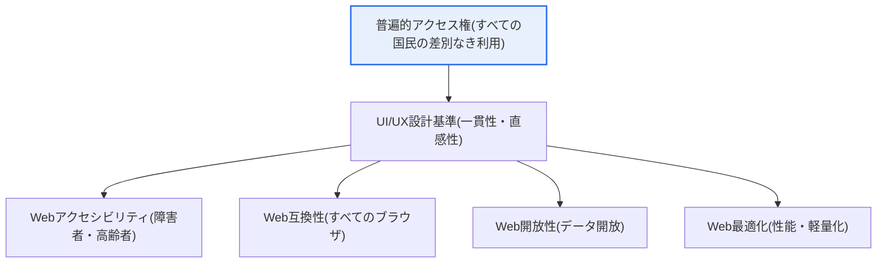
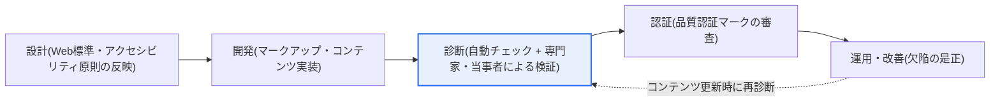

# 電子政府Webサイトの品質 — Webアクセシビリティ・互換性・開放性・最適化

## 1. 概要

### A. 概念
> 電子政府Webサイトの品質とは、**UI/UX設計基準**とともに**Webアクセシビリティ・Web互換性・Web開放性・Web最適化**という四つの品質要件を満たし、すべての国民がどのような環境においても差別なく電子政府サービスを利用できるよう保証することである。

公共Webサイトにこの品質基準が求められる根本的な理由は、「**電子政府サービスはすべての国民が例外なく利用できなければならない**」という公共性(publicness)にある。民間サービスは収益性のために特定の利用者層や特定のブラウザ・機器環境を狙って最適化する自由がある。しかし電子政府は性格が異なる。税の申告、各種証明書の発行、福祉の申請といったサービスは国民の権利行使に直結するため、障害者・高齢者を含む全国民が、どのブラウザ・OS・機器を使っていても**同等の水準でアクセス**できなければならない。特定の環境でしか動作しない公共サービスは、その環境を持たない国民の権利を事実上排除することになるからである。

そのため政府は、Webサイトが備えるべき品質を四つの軸で規定している。障害者・高齢者も認識・操作できなければならず(**アクセシビリティ**)、どのブラウザでも同じように表示され動作しなければならず(**互換性**)、データを機械が読み取り再利用できるよう開かれていなければならず(**開放性**)、誰の回線でも速く読み込まれなければならない(**最適化**)。これに画面・ナビゲーション・用語を一貫して設計するUI/UX基準が加わり、使いやすさを高める。重要なのは、この品質基準が単なる推奨ではなく、**「知能情報化基本法」・「障害者差別禁止法」など法令に基づく義務**であるという点である。すなわち電子政府のWeb品質は、技術指針を超えて、公共サービスの**普遍的アクセス権(universal access)** を制度的に保障する仕組みとして理解すべきである。

### B. 登場背景と必要性
品質基準が制度化された背景には三つの流れがある。第一に、**デジタル転換に伴うサービスの移行**である。オフラインの窓口で処理していた行政が大量にオンラインへ移行したことで、Webにアクセスできなければサービスそのものを受けられない状況が生じた。Web品質がそのまま国民のサービスアクセス権となったのである。第二に、**特定技術への依存問題への反省**である。かつて韓国の公共Webは特定のブラウザ・プラグイン(ActiveXなど)に依存しており、他のブラウザの利用者や新しい機器の利用者が排除される問題が繰り返された。これがWeb標準・Web互換性を強制する直接的な背景となった。第三に、**情報格差(digital divide)解消の要求**である。障害者・高齢者・低スペック機器の利用者が取り残されないよう、アクセシビリティと最適化を義務化して格差を制度的に縮めようとするものである。結局、電子政府のWeb品質は「見栄えのよいサイト」ではなく、「誰も排除しないサイト」をつくるための最低要件といえる。

### C. UI/UX設計基準
電子政府Webサイトは、利用者中心・一貫性・直感性・明確性・効率性・アクセシビリティ・柔軟性などの設計原則に従い、画面・ナビゲーション・コンテンツを一貫して構成するよう推奨されている。[[gov-ui-ux-guideline]]

この設計基準が四つの品質要件の土台となる理由は、いかにアクセシビリティ・互換性を個別に守っても、画面構成や用語・ナビゲーションがサイトごとにばらばらであれば、国民がサービスを習得する学習コストが大きくなるからである。特に複数の省庁・機関がそれぞれ異なるWebサイトを運営する電子政府の特性上、**一貫性**は、利用者が一つのサイトで身につけた使い方を他のサイトにもそのまま適用できるようにする中核的な価値である。直感性・明確性は行政用語に慣れていない一般国民も迷わないようにし、柔軟性は多様な機器・画面サイズに対応するレスポンシブ設計へとつながる。すなわちUI/UX設計基準は審美性の問題ではなく、四つの品質要件が実際の使いやすさへと統合されるよう束ねる骨格に当たる。

## 2. 4大品質要件 — 全体構造

電子政府のWeb品質は、UI/UX設計基準を土台として四つの品質要件がバランスを取る構造である。以下の構造図は品質要件間の関係を示している。四つの要件は独立して存在するのではなく、「すべての国民の差別なき利用」という共通目標をそれぞれ異なる角度から支えている。

| 品質 | 内容 | 代表的な準拠基準・手段 |
|---|---|---|
| **Webアクセシビリティ** | 障害者・高齢者など誰もが認識・操作・理解可能 | KWCAG(代替テキスト・キーボードアクセス・コントラスト比) |
| **Web互換性** | 特定のブラウザ・プラグインに依存せず同一に動作 | W3C Web標準(HTML/CSS文法の遵守) |
| **Web開放性** | 検索エンジン・機械がデータにアクセス・収集可能 | robotsの許可、オープンフォーマット、メタデータ |
| **Web最適化** | ページの軽量化・キャッシュで高速な読み込み・性能を確保 | リソース圧縮、キャッシュ、レンダリング最適化 |

これら四つの要件はしばしば相互補完的であるが、時に緊張関係に置かれる。例えば派手な視覚効果を入れると審美性は上がるが、アクセシビリティ・最適化が悪化し得る。したがって品質管理とは四つの要件の一つを最大化することではなく、**四つの要件が最低基準以上でバランスを取るよう設計・検証すること**である。このバランス感覚こそが、電子政府Web品質の実務の本質である。

## 3. 各品質要件の詳細

### A. Webアクセシビリティ — 四要件の中核
四つの要件の中でも、法的強制力と波及力が最も大きいのが**Webアクセシビリティ**である。視覚・聴覚・肢体などの障害を持つ人や高齢者もWebコンテンツを**知覚(Perceivable)・操作(Operable)・理解(Understandable)** し、堅牢に(Robust)利用できるようにするものであり、韓国では国家標準である**KWCAG(韓国型Webコンテンツアクセシビリティ指針)** に従う。KWCAGは国際標準W3C WCAGを韓国の実情に合わせて反映したもので、最新改訂版であるKWCAG 2.2(2022年改訂)は**4原則・14指針・多数の検査項目**で構成されている。

具体的には、画像に意味を説明する**代替テキスト(alt)** を提供し、マウスなしで**キーボードだけですべての機能を操作**できるようにし、色だけで情報を伝えず(色覚特性への配慮)、テキストと背景の間に**十分なコントラスト比**を確保し、動画に字幕・手話を提供することなどが含まれる。こうした項目が必要な理由は、障害の種類ごとに情報を受け取る経路が異なるからである。視覚障害者はスクリーンリーダー(screen reader)で代替テキストを音声で聞き、肢体障害者はキーボード・支援機器で操作し、ロービジョン・色弱の利用者はコントラスト比に依存する。アクセシビリティは「障害者差別禁止法」上の義務でもあり、未対応の場合は差別とみなされ得るという点で、他の要件よりも遵守の圧力が強い。

KWCAGの骨格は、国際標準WCAGと同様に**知覚可能・操作可能・理解可能・堅牢**という四原則(POUR)である。「知覚」はコンテンツが感覚で知覚可能でなければならないこと(代替テキスト・字幕・コントラスト比)、「操作」は操作手段が多様でなければならないこと(キーボードアクセス・十分な時間・発作誘発の禁止)、「理解」は内容と操作が予測可能でなければならないこと(可読性・一貫性・エラー訂正)、「堅牢」は支援技術が安定して解釈できなければならないこと(文法遵守・名前と役割の提供)を意味する。これら四原則が個々の検査項目の根拠となるため、実務では項目を暗記するよりも「この要素は四原則のうち何のためのものか」を理解するほうが応用に有利である。

### B. Web互換性 — 標準遵守による依存からの脱却
**Web互換性**とは、特定のブラウザやプラグインに依存せず、どのブラウザでもコンテンツが同じように表示され動作するようにする要件である。その実現手段は**W3C Web標準(HTML・CSS・ECMAScript)の遵守**である。標準を守ればブラウザごとに異なって解釈される余地が減り、Chrome・Edge・Safariなどどこでも一貫した結果が得られる。かつて韓国の公共Webが特定ブラウザ専用技術(ActiveXなど)に依存して他のブラウザの利用者を排除していた問題を根本的に解消しようとするのが、この要件の趣旨である。互換性はアクセシビリティとも噛み合う。標準に準拠したマークアップでなければ、スクリーンリーダー・支援技術がコンテンツを正確に解釈できないからである。

### C. Web開放性 — 機械が読める公共データ
**Web開放性**とは、検索エンジンのクローラーやデータ収集プログラムがWebサイトの情報にアクセス・収集できるよう開いておく要件である。robots.txtで正当なクローラーのアクセスを不当に遮断せず、データを閉鎖的なフォーマットに閉じ込めず(オープンフォーマット・構造化メタデータの提供)、情報が検索・再利用されるようにすることが核心である。これは公共データ開放政策に直結する。公共情報は国民の資産であるため、特定の画面に閉じ込められることなく、機械が読み取って他のサービス・研究・産業で再利用できなければならないという開放の哲学が根底にある。

開放性が実務でしばしば損なわれるのは、「情報を画像・PDF・Flashなどに閉じ込める」場合である。例えば統計表を画像1枚だけで掲示すると、人の目には見えても機械は読み取れず、スクリーンリーダーも解釈できないため、アクセシビリティまで同時に損なう。逆に同じデータをテキスト・表・オープンAPIで提供すれば、検索・再利用・アクセシビリティを同時に満たすことができる。このように開放性はアクセシビリティと原理的に接しているため、両者をあわせて考慮するのが効率的である。

### D. Web最適化 — 誰の回線でも速く
**Web最適化**とは、ページを軽量化し、キャッシュ・圧縮を適用して読み込み速度と性能を確保する要件である。画像・スクリプトの容量を減らし、不要なリソースを除去し、ブラウザキャッシュとレンダリング最適化で体感速度を高める。最適化が品質要件に含まれる理由は、性能がそのままアクセシビリティの問題でもあるからである。低スペック機器や遅い回線(農山漁村、低所得層)を使う国民にとって、重いページは事実上利用不可能と同じである。したがって最適化は単なる技術的効率ではなく、**情報格差解消の手段**として位置づけられる。

具体的には、画像フォーマット・解像度の最適化と遅延読み込み(lazy loading)、スクリプト・スタイルの圧縮(minify)とバンドル縮小、静的リソースのキャッシュ・CDN活用、そして初期レンダリングを早める手法などが動員される。災害の告知や申請の殺到時のようにトラフィックが急増する瞬間にも、サービスが遅くなったり停止したりしてはならないため、最適化は平常時の体感速度だけでなく**高負荷状況における可用性**までを包含する概念として広く理解するのが望ましい。

## 4. 比較 — 民間Web品質との違い、そして適用事例

電子政府のWeb品質と一般的な民間のWeb品質は、目指すところが根本的に異なる。民間はコンバージョン率・滞在時間のような**ビジネス成果**を最適化し、ターゲット顧客・環境に集中する自由がある。一方、電子政府は成果指標よりも**普遍的アクセス権と公平性**を優先し、「最も不利な環境の利用者」を基準に品質を設定する点が決定的な違いである。

| 観点 | 民間Web品質 | 電子政府Web品質 |
|---|---|---|
| **最優先の価値** | ビジネス成果(コンバージョン・収益) | 普遍的アクセス権・公平性 |
| **対象の基準** | 主要ターゲット利用者 | 全国民(最も脆弱な環境が基準) |
| **アクセシビリティ** | 任意・推奨 | 法的義務(障害者差別禁止法) |
| **強制力** | 自主 | 法令・品質診断・認証 |

この違いは具体的な事例に表れる。例えば政府代表ポータル・行政手続きサイトは、スクリーンリーダー利用者のためにすべての画像に代替テキストを入れてキーボードナビゲーションを保証し、Web標準の遵守によって特定ブラウザへの依存をなくす方式で品質を管理している。また公共データポータルは、Web開放性の原則に従ってデータを機械可読なオープンフォーマット(例: OpenAPI・CSV・JSON)で提供し、民間がそれを活用したアプリ・サービスをつくれるようにしている。このように電子政府のWeb品質は抽象的な規範ではなく、実際のサービス設計・運用に具体的に反映される実務基準である。

過去の事例は、この基準の必要性を逆説的に示している。かつて韓国の公共・金融Webは、特定のブラウザでしか動作しないプラグイン(例: ActiveX)ベースの認証・決済に依存していたため、他のブラウザや新しい機器を使う国民がサービスを受けられなかったり、多数のプログラムの強制インストールを求められたりする問題が繰り返された。これはWeb互換性の欠如がそのまま利用者の排除につながった典型的な事例であり、その後のWeb標準への移行とプラグイン撤廃政策の直接的な動機となった。同様に、アクセシビリティを考慮しない画像中心のページは視覚障害者がスクリーンリーダーでまったく利用できず、事後に莫大な再作業コストを払うケースが多かった。こうした失敗経験が、「品質は設計初期に内在化しなければならない」という原則を裏付けている。

## 5. 深掘り — 品質認証・診断制度と最新動向

電子政府のWeb品質は宣言にとどまらず、**認証・診断制度**によって管理される。代表的なものとして、アクセシビリティに優れたWebサイト・モバイルアプリに付与する**Webアクセシビリティ品質認証(認証マーク)** 制度があり、指定された認証機関がKWCAGへの適合可否を審査してマークを付与する。また政府レベルの**定期的なWebサイト品質診断**を通じて、公共Webのアクセシビリティ・互換性の水準を周期的に測定し、改善課題を導出する。こうした制度は、品質を「一度つくって終わり」ではなく、継続的に点検・改善する管理対象にするという点に意義がある。

以下のプロセス詳細図は、品質が設計–開発–診断–認証–改善と循環しながら管理される流れ(PDCA)を示している。特にコンテンツが更新されるたびに再診断へ戻る循環構造が核心であり、このループが途切れると、初期に確保した品質が時間とともに浸食される。

この循環で特に重要な段階は**診断**である。診断は、自動チェックツールで違反を広範にスクリーニングした後、代替テキストの意味的妥当性のように自動化では判断が難しい部分を専門家と障害当事者が実際の利用で検証する二元構造が望ましい。認証はこの診断結果が一定水準以上であることを公式に確認する仕組みであり、運用・改善段階は発見された欠陥を是正して次の診断へ戻すフィードバックの役割を担う。

最近の動向は三つの方向に要約される。第一に、**モバイルアクセシビリティへの拡張**である。サービス利用がモバイル中心へ移るにつれ、Webアクセシビリティ指針がモバイルアプリのアクセシビリティ指針へと拡張・整備されつつある。第二に、**デジタルインクルージョン(digital inclusion)への視点の拡大**である。単に障害者のアクセスを超えて、高齢者・低学歴層・多文化背景の利用者まで包含するよう、「やさしい言葉(easy read)」、多言語対応、認知アクセシビリティなどが強調されている。第三に、**AI・自動化ベースの品質チェック**である。アクセシビリティ違反を自動検出するツールや、代替テキストの自動生成といったAI支援技術が発展するにつれ、品質検証を常時化・自動化しようとする試みが増えている。これは開発後の手作業による点検に依存していた慣行の限界を補うものである。

## 6. 考慮事項と示唆

1. **設計初期から品質を内在化(built-in)しなければならない.** アクセシビリティ・互換性は開発が終わった後に付け足すと再作業コストが非常に大きくなる。Web標準の遵守とアクセシビリティへの配慮を企画・設計段階から反映する「アクセシビリティ優先(accessibility-first)」のアプローチがコスト・品質の両面で有利であり、これはソフトウェア工学において欠陥を早期に捕捉するほどコストが低くなるという原理と一致する。

2. **認証・定期診断による継続的な品質管理体制を整えなければならない.** Webアクセシビリティ品質認証と定期診断を通じて品質水準を定量的に測定し、発見された欠陥を改善するPDCAサイクルを制度化しなければならない。品質は一回限りの成果物ではなく、コンテンツが更新されるたびに再検証すべき運用対象であることを前提としなければならない。

3. **四要件間のバランスとトレードオフを管理しなければならない.** 審美性・機能性を高めようとしてアクセシビリティ・最適化を損なうケースが多い。要件間の衝突点(例: 視覚効果 vs コントラスト比、機能追加 vs 性能)を設計原則と検証チェックリストで事前に調整し、特定要件の最大化ではなく全体のバランスを目指さなければならない。

4. **モバイル・デジタル弱者の包摂へと範囲を拡大しなければならない.** Webを超えてモバイルアプリのアクセシビリティ、やさしい言葉・多言語・認知アクセシビリティまで包含するデジタルインクルージョンの視点へと拡張し、「誰一人取り残さない(no one left behind)」電子政府を目指さなければならない。これは国連の持続可能な開発目標(SDGs)の包摂性という価値とも通じる。

5. **自動化・AIを活用しつつ人による検証を併用しなければならない.** 自動アクセシビリティチェックツールとAI支援技術で検証を常時化すれば効率は大きく向上するが、文脈・意味の妥当性(例: 代替テキストが実際に意味を伝えているか)には依然として人の判断が必要である。自動化は広範なスクリーニングに、専門家・当事者による検証は実効性の確認に配置する二元的な検証戦略が望ましい。

6. **国際標準・法制度の変化に継続的に整合させる必要がある.** KWCAGは国際標準WCAGの改訂を反映して進化し、関連法制もデジタル環境の変化に合わせて改正される。したがって一時点の認証に安住せず、標準・法令の改訂動向を常に追跡してサイトを更新しなければならず、調達・契約段階の要件(提案依頼書・監理基準)にも最新の品質基準を反映し、発注段階から品質を強制することが実効的である。

## 参考資料
- 国立電波研究院、韓国型Webコンテンツアクセシビリティ指針(KWCAG)関連の国家標準 — https://www.rra.go.kr/ko/reference/kcsList_view.do?nb_seq=5247&nb_type=6
- 韓国型Webコンテンツアクセシビリティ指針(KWCAG)2.2 — https://a11ykr.github.io/kwcag22/

---

> **一言まとめ**: 電子政府Webサイトの品質は*UI/UX設計基準とWebアクセシビリティ・互換性・開放性・最適化*で構成され、すべての国民がどのような環境でも差別なく利用できるよう保証する普遍的アクセス権の仕組みであり、特にKWCAGに基づくWebアクセシビリティは法的義務として設計初期から内在化し、認証・定期診断によって継続的に管理しなければならない。
