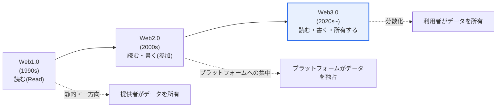
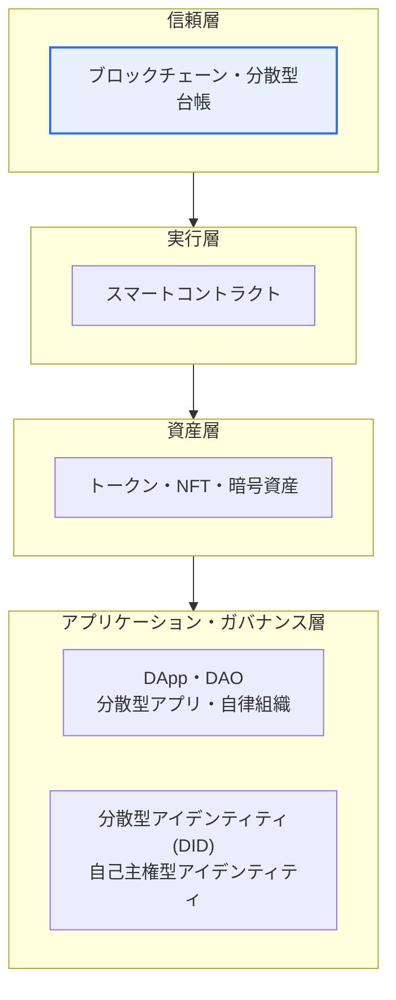

# Web3.0(Web 3.0)

## 1. 概要

### A. 導入背景と概念
> 中央のプラットフォームがデータと収益を独占するWeb2.0の限界を克服するために、**ブロックチェーンに基づく分散化によってデータ・デジタル資産の所有権を利用者に取り戻す**次世代のWeb。「読む-書く-所有する(Read-Write-Own)」Webとして定義される。

Web3.0の中核的な発想は、「**データとデジタル資産の主をプラットフォームから利用者へ**」取り戻すことである。Web2.0では利用者がコンテンツ・データを生み出すが、その価値は巨大プラットフォーム(検索・SNS・電子商取引)がほとんどを持っていった。利用者は自分のデータに対する統制権も、そこから生じる収益も持てず、プラットフォームがアカウントを停止すれば、それまで積み上げた資産と人間関係のネットワークを一瞬で失う**ロックイン(lock-in)** の状態に置かれた。Web3.0は、ブロックチェーンとトークンによって、利用者が自らのデータ・デジタル資産を直接所有・取引・移転できるようにしようとする試みである。中央の仲介者がいなくても暗号技術と合意アルゴリズムによって信頼が保証されるため、特定企業のサーバーではなく分散ネットワークがサービスの信頼基盤を支える。

ただし、Web3.0という用語は一つの定義に収れんせず、**二つの観点が並存**している点に留意しなければならない。一つは上で説明した**ブロックチェーンに基づく「分散型の所有」** という観点で、現在の産業・メディアで最も広く通用している意味である。もう一つは、ティム・バーナーズ=リーが早くから提示した**「セマンティックWeb(Semantic Web)」** の観点で、データに意味(オントロジー・メタデータ)を付与し、機械が理解・推論する「インテリジェントなWeb」を指す。最近ではAIの発展と相まって、「知能化」という第三の軸まで加えて議論されることもある。答案ではこの多義性を認識しつつ、通常はブロックチェーンに基づく分散化の観点を中心に記述するのが無難である。

### B. 必要性
プラットフォームによる独占の深刻化によってデータ主権・プライバシー・公正な分配の問題が大きくなるにつれ、利用者が自分のデータを統制し、その価値を取り戻せる新たなWebパラダイムへの要求が高まった。具体的には、①少数のプラットフォームにデータ・権力が集中する**中央集権リスク**(単一障害点、検閲、恣意的な方針変更)、②創作・貢献の価値が創作者に還元されない**分配の不公正**、③プラットフォームへのロックインによる**移植性・相互運用性の欠如**が背景となっている。Web3.0は、こうした構造的問題に対する技術的な代替案として提示された。

### C. 二つの観点の並存
先述のとおりWeb3.0は一つの定義に収れんしないため、二つの観点の違いを明確に区別しておくと答案構成が安定する。「分散型の所有」の観点は、信頼の主体を人・機関からコード・合意へ移すことに重点があり、「セマンティックWeb」の観点は、データを人ではなく機械が理解できるよう構造化することに重点がある。両観点は対立するというより相互補完的であり、最近ではAIを媒介として収れんする流れが見られる。

| 区分 | 分散型所有(ブロックチェーン)の観点 | セマンティック・インテリジェントWebの観点 |
|---|---|---|
| **中核価値** | データ・資産の所有・移転 | データへの意味付与・機械による理解 |
| **信頼基盤** | 分散型台帳・合意アルゴリズム | オントロジー・メタデータ・標準 |
| **代表的な技術** | ブロックチェーン・スマートコントラクト・トークン | RDF・OWL・セマンティックタグ付け・AI |
| **主な議論の時期** | 2020年代以降の産業言説 | 2000年代のW3C標準の言説 |

## 2. Webの進化とWeb3.0の位置づけ

Webは、情報を一方的に消費していた段階から、利用者が参加・生産する段階を経て、今や自らが生み出した価値を所有する段階へと進化してきた。この進化の方向を「接続 → 参加 → 所有」と要約すると、Web3.0の位置づけが明確になる。

Web1.0が少数のつくった情報を多数が読むだけの静的・一方向のWebであったとすれば、Web2.0はブログ・SNS・オープンAPIを通じて誰もが参加・生産できる一方で、そのデータと収益はプラットフォームが統制する参加型のWebであった。Web2.0はユーザー体験とネットワーク効果を爆発的に拡大させたが、まさにそのネットワーク効果が勝者総取りとプラットフォーム独占に帰結したという逆説を抱えている。Web3.0はこの独占構造をブロックチェーンによって覆し、利用者が自ら生み出した価値を**所有**するWebを目指す。

| 区分 | Web1.0 | Web2.0 | Web3.0 |
|---|---|---|---|
| **中核的な行為** | 読む(Read) | 読む・書く(参加) | 読む・書く・所有する(Own) |
| **構造** | 静的・一方向 | プラットフォーム集中 | 分散型 |
| **データの主体** | 提供者が所有 | プラットフォームが独占 | 利用者が所有 |
| **信頼基盤** | サイト運営者 | プラットフォーム事業者 | コード・合意アルゴリズム |
| **価値の分配** | 限定的 | プラットフォームに偏在 | 貢献者・所有者中心 |

ここで留意すべき点は、Webの進化が前段階を完全に置き換える「断絶的な交代」ではなく、**累積的な拡張**であるということである。今日でもWeb1.0的な静的ページとWeb2.0的なプラットフォームは依然として支配的であり、Web3.0はその上に「所有」という新たな層を載せようとする試みと見るのが現実に即している。

## 3. 主な特徴と技術要素

Web3.0を支える技術は、ブロックチェーンを中心に階層的に組み合わされている。最下層で分散型台帳が信頼の土台を提供し、その上に自動実行される契約と資産表現、そして利用者が直接使うアプリケーション・組織・アイデンティティの層が積み重なる。

**ブロックチェーン・分散型台帳(信頼層)** は、データを多数のノードに複製・連結して改ざんを事実上不可能にし、中央の管理者がいなくても「記録の真正性」を保証する。この不変性と透明性がWeb3.0全体の信頼の根幹である。ここから派生する実務的な特性が、**検閲耐性**(特定の主体が恣意的に記録を消したり阻止したりできない)と**可用性**(単一障害点が存在しない)である。

**スマートコントラクト(実行層)** は、条件が満たされるとコードが自ら実行される契約であり、「コードこそが法である(Code is Law)」というスローガンのとおり、仲介者なしに約束を自動的に履行する。例えば決済が確認されると自動的に所有権が移転するようコードで規定すれば、エスクローのような仲介機関は不要になる。ただしコードに欠陥があればそのまま実行されて大規模な被害につながるため(例: リエントランシー攻撃)、監査(audit)と検証が必須である。

**トークン・NFT(資産層)** は、デジタル資産の所有と取引を証明する。代替可能トークン(FT)は通貨・ポイントのように同一の価値を持ち、非代替性トークン(NFT)は美術品・コレクターズアイテム・会員権のように固有性を表現する。トークンは単なる資産を超えて、ネットワーク参加者にインセンティブを配分する**トークンエコノミー(Token Economy)** の手段であり、利用者をサービスの「ユーザー」から「利害関係者・所有者」へと転換させる仕組みとなる。

**DApp・DAO・DID(アプリケーション・ガバナンス層)** は、利用者が直接触れる層である。DAppは中央サーバーの代わりにブロックチェーン上で動作する分散型アプリケーションであり、DAOはスマートコントラクトで意思決定・資金執行を自動化した分散型自律組織である。DID(分散型アイデンティティ)は、プラットフォームに依存せず利用者が自らのアイデンティティ情報を直接保管・提示する自己主権型アイデンティティ(SSI)技術であり、マイデータと同じ流れにある。

| 技術要素 | 階層 | 役割 |
|---|---|---|
| **ブロックチェーン** | 信頼 | 分散・不変・透明なデータ基盤 |
| **スマートコントラクト** | 実行 | 条件付き自動実行の契約コード |
| **トークン・NFT** | 資産 | デジタル資産の所有・取引の証明、トークンエコノミー |
| **DApp・DAO** | アプリケーション・ガバナンス | 分散型アプリ・自律組織の運営 |
| **分散型アイデンティティ(DID)** | アイデンティティ | 自己主権型アイデンティティ(SSI) |

## 4. サービス活用方策と事例

Web3.0は特定の分野に限定されず、金融・コンテンツ・アイデンティティ・ゲームなどへと拡張する。分野ごとの活用は、共通して「仲介者の排除」と「利用者による所有」という二つの原理で説明される。

**金融(DeFi、分散型金融)** は、銀行・証券会社のような仲介者なしにスマートコントラクトで預け入れ・貸付・交換を行う。例えばイーサリアムベースの貸付プロトコルでは、利用者が時価1,000万ウォン相当の暗号資産を担保として預け入れると、担保掛目(例: 70%)に応じてコードが自動的に700万ウォン相当を貸し付け・利息精算し、担保価値が清算しきい値を下回ると、人の介入なしに即座に清算まで実行する。このように審査・執行・清算がコードで自動化されることで仲介コストと時間が大きく削減されるが、反対にコードの欠陥や急激な相場変動がそのまま損失に直結するリスクも同時に大きくなる。**コンテンツ・創作**の領域では、NFTでデジタル創作物のオリジナル性と所有権を証明し、スマートコントラクトにロイヤリティ条件を組み込んで二次取引のたびに創作者へ収益が自動分配されるよう設計できる。**アイデンティティ・認証**ではDIDによってプラットフォームに依存しない自己主権型アイデンティティを実現し、**ゲーム・メタバース**ではアイテムをNFTとして実際に所有(P2E、Play to Earn)し、ゲームの外へも資産を移転できる。

伝統的金融と比較すると、DeFiの違いが鮮明になる。核心は「信頼を誰が/何が保証するか」が変わるという点であり、この転換がアクセス性・透明性という利点と、規制の空白・技術リスクという負担を同時に生む。

| 区分 | 伝統的金融 | DeFi |
|---|---|---|
| **信頼の保証** | 銀行・監督機関 | スマートコントラクト・合意 |
| **アクセス性** | 口座・審査が必要 | ウォレットさえあれば誰でも |
| **透明性** | 内部帳簿(非公開) | オンチェーンで公開・検証可能 |
| **リスク** | 機関の信用・システミックリスク | コードの脆弱性・清算・規制の空白 |

| 分野 | 活用 | 中核原理 |
|---|---|---|
| **金融(DeFi)** | 分散型の預け入れ・貸付・交換 | 仲介者のいない自動精算 |
| **コンテンツ・創作** | NFTによるオリジナル性証明・ロイヤリティ自動分配 | 創作者による所有・収益化 |
| **アイデンティティ・認証** | DIDによる自己主権型アイデンティティ | プラットフォーム非依存 |
| **ゲーム・メタバース** | アイテムのNFT所有・経済(P2E) | 資産のゲーム外への移転 |
| **データ主権** | 個人データの所有・報酬 | マイデータとの連携 |

## 5. 深掘り: 限界と最新の論争

Web3.0の理想は強力であるが、実用化には構造的な限界が伴うという点をバランスよく見る必要がある。第一は**スケーラビリティ・性能の限界**である。すべてのノードが取引を検証・複製する構造上、処理量(TPS)が中央集権型システムに比べて低く手数料(gas)が高いため、大衆向けサービスには負担となる。これを緩和するために、レイヤー2(ロールアップ)、シャーディング、プルーフ・オブ・ステーク(PoS)への移行などが推進されており、特に代表的なプラットフォームがプルーフ・オブ・ワークからプルーフ・オブ・ステークへ移行したことで、エネルギー消費を大きく削減したとされている(具体的な数値は出典によってばらつきがあるため断定は避ける)。

第二は「**分散化のパラドックス**」である。表面的には分散化を標榜しながら、実際には少数の取引所・ウォレット・インフラ提供者に接点が集中したり、トークンの大半を初期参加者が保有して事実上中央集権と変わらなかったりするという批判が提起されている。一部ではこれを「Web2.5」と呼ぶこともある。第三は**規制・消費者保護の空白**である。ラグプル(投資資金を回収して姿を消す行為)、相場操縦、マネーロンダリングなどの副作用が繰り返される中で、各国は暗号資産利用者の保護と市場の健全性のための規制体系を整備しつつある。第四は**ユーザビリティ(UX)** の問題であり、秘密鍵の管理・ウォレット連携・手数料の概念などは、一般利用者にとって依然として高い参入障壁である。

こうした限界のため、Web3.0を「次世代Webの確定した未来」と見るよりも、**データ主権・自己主権型アイデンティティ(SSI)・マイデータ・トークンエコノミー**のような個別要素が制度圏との接点を広げながら選別的に定着していく過程として理解するほうが正確である。技術士の観点では、「分散か中央か」という二分法よりも、どの領域で分散化が実質的な価値をもたらすのか(検閲耐性・透明性・資産の移転性が重要な領域)を見極める選別的適用の視点が求められる。

## 6. 考慮事項と示唆

1. **理想と現実のギャップを直視する.** データ所有権・分散化という理想は魅力的であるが、スケーラビリティ・性能の限界、分散化のパラドックス、規制の不確実性、ユーザビリティの問題が実用化の障害となっている。理想をそのまま信奉するよりも、領域ごとに実益を見極める冷静な適用戦略が必要である。
2. **副作用を先制的に管理する.** トークン投機、ラグプル・相場操縦のような詐欺、スマートコントラクトの脆弱性、マネーロンダリングなどの負の側面を、監査・規制・セキュリティ(コード監査、KYC/AML)で統制できなければ、技術そのものが信頼を失う。
3. **データ主権・マイデータの流れと連携する.** DID・SSIなど個人が自らのデータを統制する政策・技術の流れと接しており、分散化の理想が制度圏との接点を広げる方向へ発展している。マイデータ・電子署名・分散型アイデンティティ標準(W3C DID/VC)との整合性の確保が鍵である。
4. **相互運用性・標準化が普及の条件である.** チェーン間で資産・データをやり取りするクロスチェーン・ブリッジの安全性、ウォレット・アイデンティティの標準化が確保されてこそ、断片化したエコシステムが実質的なネットワークとして統合される。ブリッジは大規模ハッキングの標的となってきたため、セキュリティ検証が特に重要である。
5. **AI・セマンティックの観点との融合に注目する.** 最近ではブロックチェーンに基づく所有の観点とセマンティック・AIに基づく知能化の観点を結合する議論が増えており、Web3.0を単一の定義ではなく「所有+知能」の複合的な進化として広く展望する視点が有効である。

## 参考資料
- W3C, "Decentralized Identifiers (DIDs) v1.0", https://www.w3.org/TR/did-core/
- Ethereum Foundation, "Web3 / Ethereum 概要", https://ethereum.org/en/web3/

---

> **一言まとめ**: Web3.0は*ブロックチェーンに基づく分散化によってデータ・資産の所有権を利用者に取り戻す*次世代Webであり、スマートコントラクト・トークン・DApp・DIDを技術要素としてDeFi・NFT・自己主権型アイデンティティに活用されるが、スケーラビリティ・分散化のパラドックス・規制・ユーザビリティの限界から、データ主権などの個別要素が制度圏との接点を広げながら選別的に定着していく過程と見るのが正確である。
