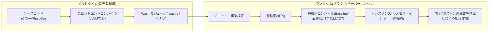
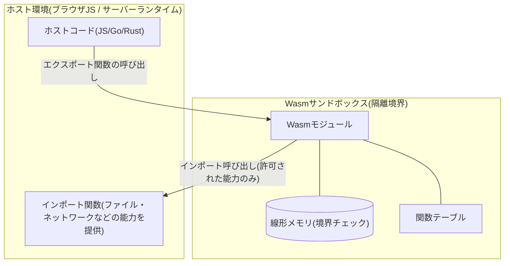

# WebAssembly(WebAssembly, Wasm)

## 1. 概要

### A. 定義
> **WebAssembly(Wasm)** は、スタックベースの仮想マシンのための**移植可能なバイナリ命令フォーマット(portable binary instruction format)** であり、C/C++・Rust・Goなど多様な言語をコンパイルして、**ブラウザを含むさまざまな実行環境でネイティブに近い速度で安全に実行**するためのW3C標準技術である。

Wasmは「Web上でアセンブリのように高速なコードを動かす」という発想から出発したが、本質は特定の言語やブラウザに依存しない**コンパイルターゲット(compilation target)** であるという点にある。すなわちWasm自体は人が直接記述する言語というよりも、上位言語がコンパイルされて到達する**低水準の中間表現であり配布フォーマット**である。テキストフォーマット(WAT)とバイナリフォーマット(.wasm)が1対1で対応し、実際の配布・転送にはパースと検証が速いバイナリフォーマットを用いる。

### B. 登場背景と必要性
Web上で計算集約的な処理(画像・映像処理、ゲーム、CAD、暗号演算)を行うには、JavaScriptだけでは性能と予測可能性が不足していた。JavaScriptは動的型付け・JIT最適化に依存するため、実行性能がランタイムの状況によって大きく揺れ動き、パース・最適化のコストも大きい。これを補おうとしたasm.js(JavaScriptの最適化可能なサブセット)の経験を土台に、ブラウザ4社(Google・Mozilla・Microsoft・Apple)が共同で**標準バイナリフォーマット**を設計したものがWebAssemblyである。

Wasmが必要な理由は三つに要約される。第一に、**性能の予測可能性**である。すでに型が確定したバイナリコードであるためパースが速く、検証後ただちに機械語へコンパイルされ、ネイティブに近い一貫した性能を発揮する。第二に、**言語の多様性**である。既存のC/C++・Rust資産をWebへ移植できるため、「Web=JavaScript」という制約を取り払う。第三に、**強力な隔離(sandbox)** である。線形メモリとケイパビリティ(capability)ベースのインターフェースにより任意のシステム資源にアクセスできないため、信頼できないコードを安全に実行する基盤となる。この第三の特性のおかげで、Wasmは今日ブラウザを超えてサーバーレス・エッジ・プラグインのランタイムへと拡張されている。

## 2. 実行構造と処理フロー

Wasmの実行は、大きく**コンパイル(ビルド)段階**と**ランタイム(ロード・検証・実行)段階**に分かれる。以下の図は、上位言語からWasmモジュールが作られて実行されるまでの全体パイプラインを示している。

ビルドタイムでは、上位言語がLLVMのようなコンパイラを経てWasmバイナリモジュールに変換される。このモジュールは関数・グローバル・メモリ・テーブルなどの定義と、ホストから受け取るべき**インポート(import)**、ホストに公開する**エクスポート(export)** を宣言する。ランタイムでは、まずバイナリを**デコード**して構造的に正しいかを検査した後、**静的な型検証**を行う。この検証段階はWasmのセキュリティの核心であり、実行前にスタックのアンダーフロー/オーバーフロー、型の不一致、範囲外への分岐などをすべて排除する。検証を通過したモジュールだけが機械語にコンパイルされ、エンジンによっては高速な起動のための**ベースラインコンパイル**と最高性能のための**最適化コンパイル**を併用(tiering)したり、事前コンパイル(AOT)したりする。

### A. スタックベースの仮想マシンと線形メモリ
Wasmは**スタックマシン**モデルを用いる。各命令はオペランドスタックから値を取り出して演算し、結果を再びスタックに積む。値の型はi32・i64・f32・f64と参照型程度と単純であり、検証とコンパイルが容易である。プログラムが使用するヒープデータは**線形メモリ(linear memory)** と呼ばれる連続したバイト配列に格納され、このメモリはホストが所有し境界チェックを強制するため、モジュールは自身に許可された領域の外を読み書きできない。以下の図は、Wasmモジュールとホストが相互作用する隔離構造を表している。

この構造の核心は、**モジュールはホストが明示的に渡した能力(capability)しか使用できない**という点である。ファイルアクセス・ネットワーク・システムコールはすべてインポートとして注入され、注入されなければその機能はそもそも存在しない。この「デフォルトでは何もできない(deny-by-default)」モデルが、Wasmを信頼境界として用いる根拠である。

### B. ホストとの相互作用とWASI
ブラウザでは、JavaScript API(`WebAssembly.instantiate`)を通じてモジュールをロードし、DOM・fetchなどはJSを経由して呼び出す。ブラウザの外(サーバー・エッジ)では標準のシステムインターフェースが必要であり、これを規定したものが**WASI(WebAssembly System Interface)** である。WASIはファイル・時計・標準入出力のようなOS機能を**ケイパビリティベース(capability-based)** で公開し、例えば特定のディレクトリハンドルだけを渡せば、モジュールはその配下のパスにしかアクセスできない。これにより、コンテナよりも軽量で起動の速い隔離実行単位をつくることができる。

## 3. 活用類型と事例

Wasmの適用領域は急速に広がっている。代表的な類型を原理とともに整理すると次のとおりである。

| 活用領域 | 内容 | 代表事例・効果 |
|---|---|---|
| ブラウザ高性能アプリ | 計算集約ロジックをWasmへ移植 | Figma(デザインツール), AutoCAD Web, ゲームエンジン(Unity/Unreal) |
| サーバーレス・エッジ | ミリ秒単位のコールドスタートで関数実行 | Fastly Compute, Cloudflareエッジランタイム |
| プラグイン・拡張 | 信頼できないサードパーティコードを安全に隔離 | Envoyプロキシフィルタ, DB/SaaS拡張 |
| 移植可能な配布 | 一度ビルドして複数アーキテクチャで実行 | エッジ-クラウド共通アーティファクト |

具体的な事例として、**Figma**はC++で書かれたレンダリングエンジンをWasmにコンパイルし、ブラウザでデスクトップアプリに近い編集性能を実現し、初期読み込み時間を大きく短縮したとされている。サーバー側では、コンテナが通常数百ミリ秒以上かかるコールドスタートを、Wasmランタイムは**1ミリ秒程度**にまで縮められるため、リクエストごとにインスタンスを新たに立ち上げるエッジコンピューティングに有利である。ただし具体的な数値はワークロード・エンジンによって異なり得るため、一般化して理解するのが安全である。

### A. コンテナ・JavaScriptとの比較

Wasmはしばしばコンテナ・JavaScriptの代替と誤解されるが、実際には**隔離単位**と**実行ターゲット**としての性格が異なる。違いが生じる理由は、隔離レベルと起動コストのトレードオフにある。

| 区分 | WebAssembly | コンテナ(Docker) | JavaScript |
|---|---|---|---|
| 隔離方式 | VMレベルの言語サンドボックス | OSのnamespace・cgroup | 言語ランタイムによる隔離 |
| コールドスタート | 非常に速い(μs~ms) | 相対的に遅い(数百ms) | 速い |
| イメージサイズ | 数百KB~数MB | 数十~数百MB | - |
| 言語の多様性 | 多数の言語をコンパイル | 任意のバイナリ | 単一 |
| 成熟度・エコシステム | 発展途上(特にGC・DOMアクセス) | 非常に成熟 | 非常に成熟 |

コンテナは任意のLinuxバイナリと完全なファイルシステムを格納できるため汎用性が高いが、イメージが重く起動が遅い。一方Wasmは、格納できるものが限られる代わりに**軽量・高速でアーキテクチャに依存しない**。したがって両者は代替関係というよりも、「重い隔離(コンテナ)の中でよりきめ細かなマルチテナント隔離(Wasm)」のように**階層的に組み合わされる**傾向がある。JavaScriptと比べると、性能の一貫性と言語の自由度が強みであるが、DOMへの直接アクセスがなく、ガベージコレクション言語のサポートがようやく成熟段階に入りつつあるという点を考慮しなければならない。

## 4. 深掘り — 標準の進化とコンポーネントモデル

Wasmは初期(MVP)以降、複数の拡張を標準化しながら適用範囲を広げてきた。**スレッド・SIMD**は並列・ベクトル演算の性能を引き上げ、**参照型・GCプロポーザル**はJava・Kotlin・C#などのマネージド言語を効率的にコンパイルする道を開いた。特に注目すべきは**コンポーネントモデル(Component Model)** と**WIT(WebAssembly Interface Types)** である。従来のWasmモジュールはi32・f64のような低水準の値しかやり取りできず、文字列・構造体のような高水準の型を異なる言語のモジュール間で受け渡すのが煩雑であった。コンポーネントモデルはインターフェースを言語中立的に記述し、異なる言語でつくったコンポーネントを**レゴのように組み立て**られるようにすることで、「言語に関係なく再利用可能な移植可能コンポーネント」という長期ビジョンを具体化する。

こうした流れの上で、**WASI Preview 2** はケイパビリティベースのインターフェースをコンポーネントモデルの上に再定義して標準化の軸を移し、サーバーサイドWasmエコシステム(例: サーバーレス関数、拡張プラグインランタイム)の土台となりつつある。標準の詳細は引き続き改訂中であるため、実際の採用時には、使用しようとするエンジンと言語ツールチェーンがどのプロポーザル(proposal)段階をサポートしているかを確認することが重要である。

## 5. 考慮事項と示唆

技術士の観点では、WebAssemblyの導入は単なる性能最適化を超えて、アーキテクチャ・セキュリティ戦略と噛み合う。

- **適用判断の基準**: 計算集約的で言語の移植性が必要なワークロードにWasmは有利である。逆にI/O中心であったり既存のコンテナエコシステムへの依存度が高かったりする場合は利得が限定的であるため、「高速な隔離・マルチテナント・移植性」の要求が明確なときに選択的に導入する。
- **セキュリティのトレードオフ**: 言語サンドボックスは強力であるが、インポートで渡した能力の範囲がそのまま攻撃対象領域となる。**最小権限(deny-by-default)の原則**に従って必要な能力だけを注入し、サプライチェーン(モジュールの出所・署名)の検証を併用しなければならない。線形メモリ内部の論理バグ(例: Cコードのメモリエラー)は依然として存在し得ることも認識しておく必要がある。
- **成熟度・エコシステムの展望**: DOMへの直接アクセスの欠如、GC言語サポートの成熟途上、デバッグ・ツールの相対的な未整備などは、まだ過渡期の制約である。ただしコンポーネントモデル・WASIの標準化によってサーバー・エッジ・プラグイン領域での採用が加速する傾向にあるため、中長期のロードマップに**選択肢として反映**するのが合理的である。
- **関連技術の観点**: Wasmはサーバーレス・エッジコンピューティング、サービスメッシュ(Envoyフィルタ)、ゼロトラスト(信頼できないコードの隔離)、マルチクラウドの移植性戦略と自然に結びつく。したがって個別技術として見るよりも**軽量な隔離実行層**というアーキテクチャの軸として理解し、コンテナ・オーケストレーションとの階層的な組み合わせを設計代替案として検討すべきである。

## 参考資料
- WebAssembly公式サイト: https://webassembly.org/
- W3C WebAssembly Core Specification: https://www.w3.org/TR/wasm-core-2/
- WASI: https://wasi.dev/
- Bytecode Alliance(Component Model): https://bytecodealliance.org/

---
> **一言まとめ**: WebAssemblyは、多様な言語をコンパイルしてブラウザ・サーバー・エッジでネイティブに近い速度で安全に実行する移植可能なバイナリフォーマットであり、ケイパビリティベースの隔離とコンポーネントモデルを通じて軽量な隔離実行層へと拡張されつつある。
