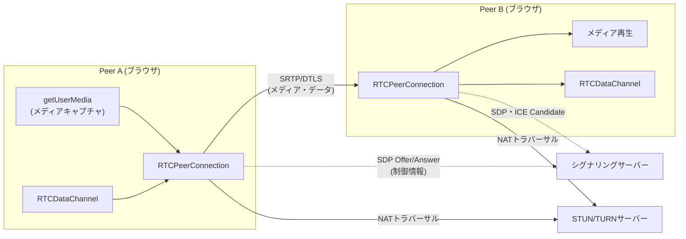
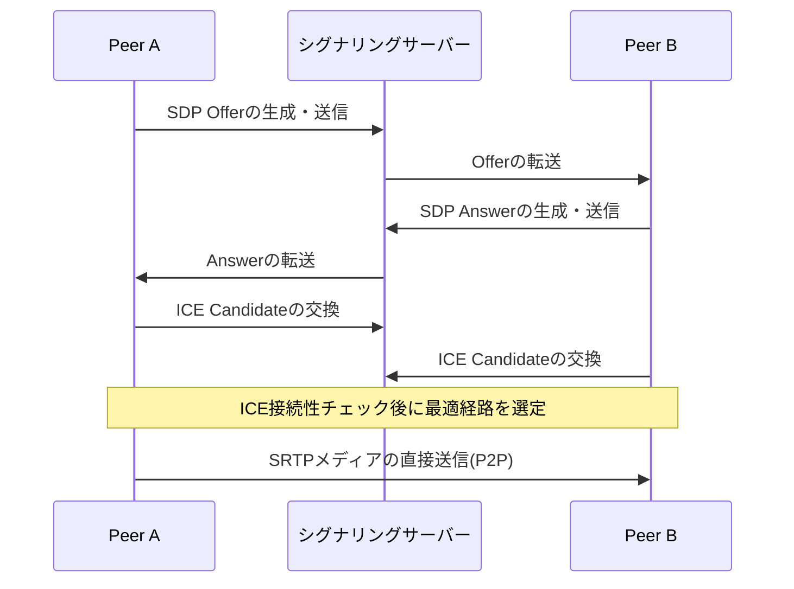

# WebRTC(Web Real-Time Communication)

## 1. 概要

> **WebRTC**は、別途のプラグインやネイティブアプリケーションのインストールなしに、Webブラウザとモバイルアプリの間でオーディオ・ビデオ・任意のデータを**P2P(Peer-to-Peer)**でリアルタイムに伝送できるようにするオープン標準技術群である。W3CがJavaScript APIを、IETFが伝送・メディアプロトコルを標準化した。

WebRTCが登場する以前、Web上でのリアルタイムのビデオ・音声通信は、Flashや別途のプラグイン、あるいは各ベンダー独自のSDKに依存しなければならなかった。これはインストールの負担、セキュリティの脆弱性、クロスプラットフォームの互換性問題を引き起こした。2011年にGoogleが関連するコーデック・エンジン技術をオープンソースとして公開し標準化が進められたことで、「ブラウザに内蔵された標準APIだけでリアルタイム通信を実現する」という目標が実現した。特にCOVID-19以降、リモートワーク・遠隔教育・オンライン診療が爆発的に増えたことで、WebRTCはビデオ会議(Google Meet、大半のWebベース会議ソリューション)、リアルタイム顧客対応、クラウドゲームのストリーミング、IoT映像監視の中核基盤技術として定着した。

WebRTCの本質的な価値は**遅延時間の最小化**にある。一般的なHTTPベースのストリーミングが数秒の遅延を持つのとは異なり、WebRTCはUDPベースのP2P経路を用いて数百ミリ秒以下の超低遅延通信を目指す。そのためにブラウザは、メディアキャプチャ、コーデックネゴシエーション、NATトラバーサル、暗号化、輻輳制御をすべて標準スタックの中で自動的に処理する。

## 2. 全体構造

WebRTCは大きく**シグナリング(Signaling)層**と**メディア/データ伝送層**に分かれる。興味深いのは、シグナリング方式を標準が規定していないという点であり、開発者がWebSocket・HTTPなど任意のチャネルで自由に実装できるよう委ねている。一方、実際にメディアをやり取りする経路とセキュリティは厳格に標準化されている。

中核となるJavaScript APIは三つである。第一に**`getUserMedia()`**は、カメラ・マイクにアクセスしてメディアストリームを取得する。第二に**`RTCPeerConnection`**はP2P接続の中核オブジェクトであり、コーデックネゴシエーション・NATトラバーサル・暗号化・輻輳制御を統括する。第三に**`RTCDataChannel`**は、オーディオ・ビデオ以外の任意のバイナリ・テキストデータを低遅延で交換する通路であり、リアルタイムチャット・ファイル転送・ゲーム状態の同期に使われる。`RTCDataChannel`は内部的にSCTPをDTLSの上で使用しており、信頼性(再送の有無)と順序保証の有無をチャネルごとに柔軟に設定できるという特徴がある。

## 3. 接続確立の手順 — シグナリングとNATトラバーサル

WebRTC接続は、「制御情報はシグナリングサーバーを経由して交換し、実際のデータはP2Pで直接流れる」という原則で動作する。二つのピアは互いのメディア形式・コーデック・ネットワークアドレスを知る必要があり、これを**SDP(Session Description Protocol)** 形式のOffer/Answerで交換する。

最も難しい問題は**NAT/ファイアウォールの通過**である。大半の端末はプライベートIPの背後にあり、相手が直接接続すべきグローバルアドレスを知ることができない。これを解決するフレームワークが**ICE(Interactive Connectivity Establishment)**であり、二種類の補助サーバーを活用する。

| 区分 | STUN | TURN |
|------|------|------|
| 役割 | 端末のグローバルIP・ポートの確認 | メディアを中継(Relay) |
| トラフィック経路 | P2P直接接続 | サーバー経由 |
| サーバー負荷 | 低い(アドレスを知らせるだけ) | 高い(トラフィックを転送) |
| 使用時点 | 大半のケース | P2Pが不可能な対称型NATなど |

STUNサーバーは端末に「あなたのグローバルアドレスはこれである」と知らせるだけなので負荷がほとんどなく、この情報でP2P直接接続を試みる。しかし**対称型NAT(Symmetric NAT)**や厳格な企業ファイアウォール環境では直接接続が不可能であり、その場合はTURNサーバーが両端末のメディアを代わりに中継する。TURNはトラフィックをそのまま運ぶため帯域コストが大きく、実務では全セッションの約10~20%程度がTURN経由になるとされているため、TURNサーバーの容量算定がサービス品質とコストの中核変数となる。

## 4. セキュリティとメディア伝送

WebRTCは**セキュリティが選択ではなく必須**として強制された構造である。すべてのメディアは**SRTP(Secure RTP)**で暗号化され、暗号鍵のネゴシエーションとデータチャネルの保護は**DTLS(Datagram TLS)**によって行われる。すなわち平文での伝送は原理的に不可能である。また、ブラウザはカメラ・マイクへのアクセス時に必ずユーザーの明示的な同意を得て、HTTPS(セキュアコンテキスト)でのみAPIが動作するようにすることで、盗聴・無断キャプチャのリスクを低減している。

メディアコーデックとしては、映像にVP8・VP9・AV1・H.264、音声にOpusが広く用いられる。特に**Opus**は音声から音楽まで広い帯域を低遅延で処理し、事実上の標準音声コーデックとして定着した。ネットワーク状況が悪化すると、ブラウザの輻輳制御アルゴリズム(例: GCC、Google Congestion Control)が伝送レート・解像度・フレームレートを動的に下げ、途切れを最小化する。

ただし多人数会議のように参加者が増えると、純粋なP2P(Mesh)方式では各端末がすべての相手に個別のストリームを送らなければならず、アップロード帯域とCPUが急激に増加する。このため実務では、中央に**SFU(Selective Forwarding Unit)** または**MCU(Multipoint Control Unit)** サーバーを置き、ストリームを選択的に転送したり合成したりする。例えば5人の会議では、Meshは端末あたり4本のアップストリームが必要であるが、SFUは端末あたり1本のアップストリームをサーバーへ送るだけで済むため、スケーラビリティが大きく改善される。

## 5. 類似技術の比較

リアルタイム通信の候補技術を比較すると、WebRTCの位置づけが明確になる。HLS/DASHのようなHTTPベースのストリーミングはCDNと相性がよく大規模視聴に有利であるが、数秒の遅延があるため双方向の会話には不向きである。WebSocketは双方向であるがTCPベースであるため、メディアのリアルタイム性には限界がある。WebRTCはUDPベースのP2Pで超低遅延の双方向通信に特化しているが、NATトラバーサル・サーバーインフラ(STUN/TURN/SFU)構築の負担が大きいというトレードオフがある。

| 項目 | WebRTC | HLS/DASH | WebSocket |
|------|--------|----------|-----------|
| 遅延 | 超低遅延(<500ms) | 数秒 | 低い |
| 方向性 | 双方向P2P | 単方向 | 双方向 |
| 伝送 | UDP(SRTP) | TCP/HTTP | TCP |
| 大規模視聴 | 難しい(SFUが必要) | 優秀 | 普通 |

## 6. 考慮事項と示唆

**第一に、インフラ設計がサービス品質を左右する.** WebRTC自体は無料の標準であるが、安定した接続率のためにはSTUN・TURN・SFUサーバーを地域分散配置しなければならない。特にTURN中継トラフィックのコストとSFUのCPU・帯域容量が中核的な原価要因であるため、予想同時セッション数とTURN経由率を根拠にサイジングしなければならない。

**第二に、スケーラビリティと遅延のトレードオフをアーキテクチャで解決しなければならない.** 少人数・超低遅延が重要であればMesh/SFUを、大規模視聴中心であればWebRTC-SFUにHLSを併用するハイブリッド構造が現実的である。最近では遅延を短縮したLL-HLS、そしてWebRTCベースの大規模配信(WHIP/WHEP)の標準化が進んでおり、選択肢が広がりつつある。

**第三に、セキュリティとプライバシーを設計段階から内在化しなければならない.** SRTP・DTLSによって伝送は保護されるが、SFUを経由した瞬間にエンドツーエンド暗号化(E2EE)が破られる可能性がある。機密性の高い会議にはInsertable StreamsベースのE2EEの適用を、そしてSTUNを通じたIP露出(プライバシー問題)への方針上の対応を検討すべきである。

**第四に、標準・エコシステムの動向を継続的に追跡しなければならない.** AV1コーデックの採用拡大、WebTransport・WebCodecsなど隣接する低遅延APIの台頭、ブラウザごとの実装差などは、サービスの互換性に直接影響する。技術士の観点では、単なる機能実装を超えて、接続成功率(SLA)・コスト・セキュリティ・スケーラビリティを総合したアーキテクチャ意思決定の能力が求められる。

---

> **一言まとめ**: WebRTCは、ブラウザ標準API(`getUserMedia`・`RTCPeerConnection`・`RTCDataChannel`)とICE(STUN/TURN)・SRTP/DTLSを組み合わせ、プラグインなしで超低遅延のP2Pリアルタイムオーディオ・ビデオ・データ通信を実現するオープン技術であり、インフラのサイジング・スケーラビリティ・セキュリティのトレードオフがサービスの成否を左右する。
