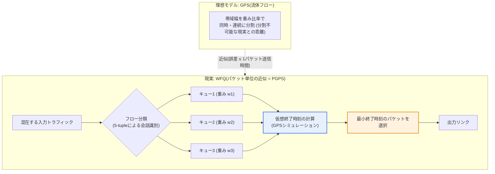

# WFQ(Weighted Fair Queuing)

## 1. 概要

### A. 定義
> **WFQ**は、ネットワークのキューイング(待ち行列)手法であり、**複数のトラフィックフロー(flow)に重みを付与して帯域幅を公平に分割・配分**するスケジューリング方式である。重要度の高いトラフィックにより多くの帯域幅を与えつつも、低いフローが飢餓状態(starvation)に陥らないよう最低限の取り分を保証する。理論的には、理想的な流体モデルである**GPS(Generalized Processor Sharing)をパケット単位で近似(PGPS)** したものとして定義される。

WFQが必要とされる根本的な理由は、「**限られた帯域幅をいかに公平かつ効率的に分けるか**」というQoSの中核問題にある。最も単純なキューイングであるFIFO(先入れ先出し)は到着順に処理するため、大容量のファイル転送(例: 数百MBのバックアップトラフィック)一つがキューを独占すると、ビデオ通話やVoIPのような遅延に敏感なトラフィックが後ろで際限なく押し出される。これをキューの独占(hogging)といい、特に低速のWANリンクで致命的となる。反対に、すべてのフローに均等に分配する単純な公平キューイング(Fair Queuing)には、重要なトラフィックとそうでないトラフィックを区別できないという限界がある。

WFQはこれら両方の問題を同時に解決する。各トラフィックフローを区別して別々のキューに入れ、フローごとに**重み(weight)** を設定して帯域幅をその比率で配分する。すると優先度の高い(重みの大きい)トラフィックはより多くの帯域を得て速く処理される一方で、低いフローも最低限の取り分を保証され飢餓を回避する。すなわち「**差別化された公平性(differentiated fairness)**」を実現することがWFQの本質である。これは音声・映像・データが混在するコンバージドネットワークにおいて各サービスの品質を守るのに効果的であり、今日ではルーター・スイッチのQoSにおける事実上の標準スケジューラとして定着している。

### B. 登場背景と理論的なルーツ
1980年代末、インターネット上で音声・映像などのリアルタイムトラフィックと大容量データが共存し始めると、単純なFIFOではQoSを保証できず、差別化された公平なキューイングが必要になった。WFQは1989年にDemers・Keshav・ShenkerがSIGCOMM論文「Analysis and Simulation of a Fair Queueing Algorithm」で提案し、その後1993年にParekh・Gallagerが理想的な流体モデルである**GPS**とそのパケット近似である**PGPS(Packet-by-Packet GPS)** の理論を確立し、数学的な遅延上限(delay bound)を証明した。核心的な結論は「**PGPSはいかなる到着パターンにおいても、GPSとの差が最大1パケットの送信時間以内にとどまる**」というものであり、WFQが理想的な公平配分を実用上きわめて近く模倣できることを保証する。この理論的基盤のおかげで、WFQは単なるヒューリスティックではなく**定量的なQoS保証**が可能な手法として認められている。

### C. 特徴
WFQは、**フローの自動分類**(別途設定なしに5-tupleなどで会話を識別)、**重みに比例した配分**、**飢餓の防止**(すべてのアクティブフローにサービスを巡回)、**適応的な帯域再配分**(アイドルフローの取り分をアクティブフローが分け合う)という四つの性質を持つ。特に最後の性質(work-conserving)のおかげでリンクが空く瞬間がなく、帯域の利用率が高い。

## 2. GPS理想モデルとWFQの関係 — 全体構造

WFQを理解するには、まずその理想形であるGPSを知る必要がある。GPSは複数のフローを**同時に、無限に細かく分割して(流体のように)** 重みの比率どおりにサービスする仮想的なモデルである。例えばフローA・B・Cの重みが3:2:1であれば、GPSは毎瞬間、帯域幅を正確に3/6、2/6、1/6に分けて流す。しかし実際のパケットは分割できないため、一度に一つずつしか送出できない。WFQは「**GPSであればこのパケットはいつ送信を終えていたか**」を計算し(仮想終了時刻)、その順序どおりに実際にパケットを送出することでGPSを近似する。

上の構造図で核心となるのは、GPS(理想)とWFQ(現実)を結ぶ点線である。WFQはパケットごとに内部でGPSをシミュレーションして仮想終了時刻というタイムスタンプを付け、その値が最も小さいパケットから先に送る。こうすることで実際の送信順序が理想的な流体配分の終了順序とほぼ一致するようになり、公平性と遅延保証を同時に得られる。

## 3. 動作原理 — 仮想時間と仮想終了時刻

WFQの心臓部は**仮想時間(virtual time, V(t))** と**仮想終了時刻(virtual finish time, F)** である。仮想時間はGPSサーバーがどれだけ仕事を進めたかを表す内部時計であり、アクティブフローの数と重みの合計に応じて進む速度が変わる。各パケットが到着すると、WFQはそのパケットがGPSでいつ送信を終えるかを次のように計算する。

式`F(i,k) = max(F(i,k-1), V(a)) + L(i,k)/w_i`における各項の意味を読み解いてみよう。**`max(...)`の項**は、「このフローの直前のパケットがまだ終わっていなければその後に続けて、すでに終わっていれば現時点(仮想時間)から開始する」という意味である。このおかげで、長く休止していたフローが突然バーストして帯域を独占することを防ぐ。**`L/w_i`の項**はパケット長Lを重みwで割った値であり、重みが大きいほどこの増分が小さくなって終了時刻が早まり、結果として先に送信される。すなわち**重みの大きいフローのパケットほどタグが小さく、優先的にサービス**される構造である。

この方式が優れている理由は、**パケットサイズに関係なく公平**である点にある。単純なラウンドロビン(WRR)はキューを一巡する際にパケットの「個数」で分けるため、大きなパケットだけを送るフローが小さなパケットのフローよりも実際にはより多くのバイトを持っていくという不公平が生じる。一方WFQは終了時刻の計算に**バイト単位の長さL**を反映するため、パケットサイズがばらばらでもバイト基準で正確に重みの比率を守る。これがWFQがWRRより理論的に優れている核心的なポイントである。

重みは実務ではトラフィックのマーキング値で決める。例えばCiscoのフローベースWFQは、**IP Precedence値(0~7)** が高いほど大きな重みを付与し、Precedence 5の音声がPrecedence 0の一般データよりも数倍多くの帯域を得るよう自動調整する。実際には、Precedence値に(Precedence+1)に反比例する内部重みを割り当てる方式で実装されており、優先度が一段階上がるごとに相対的な帯域の取り分が大きくなる(具体的な定数はIOSバージョンによって異なるため一般化している)。

### A. 終了時刻の計算 — 段階的な数値例
概念を具体化するために簡単な例を見てみよう。フローA(重み2)とフローB(重み1)があり、便宜上、仮想時間を実時間と同じとし、パケット長はサービス時間の単位で表すと仮定する。次の順序で終了時刻タグが付けられる。

- **t=0**: AのパケットA1(長さ4)が到着。直前の終了時刻がないため`F(A1)=max(0,0)+4/2=2`。
- **t=0**: BのパケットB1(長さ3)が到着。`F(B1)=max(0,0)+3/1=3`。
- **選択**: 二つのタグのうち最小はA1(2)であるため、**A1を先に送信**する。重みの大きいAが同時点の競合で先行する。
- **t経過後**: AのA2(長さ4)が到着。`F(A2)=max(F(A1)=2, V)+4/2=2+2=4`。
- **選択**: 待機中のタグはB1(3)、A2(4)。最小は**B1(3)を送信** → 続いてA2(4)。結果の送信順序はA1→B1→A2である。

このシーケンスで注目すべき点は、重みが2倍のAが同じ時間窓でBよりおよそ2倍多くのバイト(A1+A2=8 vs B1=3に続いて継続)を送り出しながらも、Bが完全に押し出されることなく途中で必ずサービスされるということである。これが「差別化された公平性」が実際のタグ演算で実現される姿であり、純粋な優先度キューであれば、B1はAのトラフィックが途切れるまで送信されなかったであろう。

## 4. 類型と拡張 — Flow-based WFQ、CBWFQ、LLQ、DRR

WFQは一つの固定アルゴリズムではなく、複数の派生・拡張形態へと発展した。元祖である**フローベースWFQ(Flow-based / conversation-based)** は、送信元・宛先IP、プロトコル、ポートなどの5-tupleで会話を自動識別し、キューを動的に生成する。Ciscoでは伝統的に2.048 Mbps以下の低速シリアルインターフェースのデフォルトスケジューラであり、別途のクラス定義なしでも少量のリアルタイムトラフィックを大量のバルクトラフィックから保護する。ただしフローごとに状態を保持するため、数万のフローが通過する大型コアルーターでは**スケーラビリティ(scalability)の限界**がある。

このスケーラビリティ問題を解決するために**CBWFQ(Class-Based WFQ)** が登場した。CBWFQは個々のフローではなく**ユーザーが定義したクラス(例: 音声・ビデオ・業務トラフィック・その他)** 単位でキューを作成し、各クラスに帯域幅を絶対値(kbps)または百分率で保証する。フロー数がいくら多くてもキューはクラス数(最大64個など)に限定されるため、コア網でも予測可能で管理しやすい。実務のQoS設計の大半はCBWFQを基盤としている。

しかしCBWFQだけでは、VoIPのように**遅延・ジッタにきわめて敏感なトラフィック**を完全に保護するのは難しい。重み配分だけでは、最悪の場合、音声パケットが他のキューの後ろで少し待たされることがあるからである。そこで**LLQ(Low Latency Queuing)** は、CBWFQに**厳格な優先度キュー(strict priority queue)** を一つ追加し、音声トラフィックは他のいかなるキューよりも先に即時送信する一方で、定められた帯域上限(policer)を超えると切り捨てて他クラスの飢餓を防ぐ。今日の企業音声網QoSの事実上の標準がLLQである。

一方、計算複雑度の面では、WFQの終了時刻によるソートはフロー数Nに対してO(log N)のコストがかかる。超高速ハードウェアではこのソートコストさえ負担となるため、これをO(1)に単純化した**DRR(Deficit Round Robin)** が広く使われている。DRRは各キューに「デフィシット(deficit)」カウンタとクォンタム(quantum)を設けてバイト単位の公平性を近似するものであり、ラウンドロビンの低い実装コストとWFQのバイト公平性を折衷した形態である。実際の高性能スイッチASICのスケジューラは、相当数がDRRまたはその変形を採用している。

## 5. 他のキューイング手法との比較

以下の表は代表的なキューイング手法を整理したものであるが、表だけでは「なぜ」そのような違いが生じるのかがわかりにくい。表の後の記述で、違いの原因と実務上の含意を説明する。

| 手法 | 中核方式 | 強み | 弱み |
|---|---|---|---|
| **FIFO** | 単純な先入れ先出し | 実装が単純・オーバーヘッド最小 | QoS非保証、キュー独占のリスク |
| **PQ(優先度キューイング)** | 高優先度を絶対優先 | 最優先トラフィックの遅延最小 | 低いキューの飢餓 |
| **WRR** | 重み付きラウンドロビン(パケット数) | 実装が容易、差別化が可能 | パケットサイズによる不公平 |
| **WFQ** | 重み比例 + バイト公平 | 飢餓防止・バイト公平 | フロー状態の保持、スケーラビリティ |
| **CBWFQ** | クラスベースWFQ | 帯域保証・スケーラビリティ | リアルタイムの遅延保証が弱い |
| **LLQ** | CBWFQ + 厳格な優先度 | 音声の遅延・ジッタ最小 | 優先度帯域の超過時に破棄 |

FIFOはQoSを守れず、純粋な優先度キューイング(PQ)は高優先度が帯域を独占して低いトラフィックが飢餓に陥る可能性がある。WRRは差別化は可能であるが、先述のとおりパケットの「個数」で分けるため、大きなパケットのフローが不当に有利になる。WFQはバイト単位の重み配分によってこれら三つの問題をすべて克服するが、フローごとの状態保持のため、大規模網ではCBWFQへ拡張し、音声のように遅延保証が必要であればLLQで補強するのが実務の定石である。すなわちこれらは競合技術ではなく、**要求水準に応じて重ねて使う階層的なツール**として理解すべきである。

具体的な数値例として、155 Mbpsのリンクで音声(重み5)・ビデオ(3)・データ(1)の三つのフローがすべてバーストすると、WFQは帯域を約5/9(≈86 Mbps)・3/9(≈52 Mbps)・1/9(≈17 Mbps)に分ける。もしデータフローがしばらく休止すると、その取り分は音声・ビデオが5:3の比率で分け合うため、リンクが遊ぶことはない(work-conserving)。このように定量的な配分とアイドル帯域の再利用を同時に達成することが、WFQの実質的な価値である。

## 6. 深掘り — 実務のQoS設計と最新動向

実務においてWFQ系統は**DiffServ(Differentiated Services)** アーキテクチャと組み合わせて使われる。DiffServは網の境界でパケットのDSCPフィールドにクラスをマーキング(marking)し、コアルーターはそのマーキングに従って**PHB(Per-Hop Behavior)** を適用するが、このPHBを実際に実装するスケジューラこそがCBWFQ・LLQである。例えばEF(Expedited Forwarding、音声)はLLQの優先度キューに、AF(Assured Forwarding、業務)はCBWFQの帯域保証キューにマッピングする。したがってWFQは、QoSポリシーの「分類→マーキング→スケジューリング→輻輳回避(WRED)」パイプラインにおいて**スケジューリング段階を担う中核エンジン**といえる。

ある産業適用事例として、支社と本社を低速WANで接続する企業網でビデオ会議の途切れが頻発していた場合、本社ルーターの出力にLLQを設定して音声・ビデオ(EF/AF41)を優先処理し、ファイル共有・バックアップを下位クラスにまとめて帯域を制限することで、会議品質を安定化させる方式が典型的である。この際、優先度キューに過度な帯域を割り当てると他の業務トラフィックが飢餓に陥るため、通常は優先度帯域をリンクの33%以内に制限する設計慣行が通用している。

最新動向としては、データセンター・5G伝送網で超低遅延の要求が高まるにつれ、**PIFO(Push-In First-Out)ベースのプログラマブルスケジューラ**や時間確定ネットワーキング(**TSN**)のタイムアウェアシェーパー(Time-Aware Shaper)など、WFQのアイデアをハードウェアのラインレートで一般化しようとする研究が活発である。ただしこれらの新技術も「重みに比例して公平に、飢餓なく分ける」というWFQの根本原理の上に立っており、WFQは依然としてキューイング理論の基準点(reference)として有効である。技術士の観点では、WFQを個別の手法ではなく、**GPSという理想形から出発してCBWFQ・LLQ・DRRへと分化し、DiffServ・TSNへと拡張されるQoSスケジューリング系譜の中心軸**として記述することが高得点の戦略である。

## 7. 考慮事項と示唆

1. **差別化と公平性のバランス**がWFQの中核的な価値である。WFQは重要トラフィックの優遇と最低帯域の保証を同時に達成し、純粋な優先度方式(PQ)の飢餓問題と純粋な公平方式の無差別問題の両方を克服する。設計時には重みの設定がそのままサービスのSLAに直結するため、トラフィック特性の分析に基づく重みの算定が成否を左右する。
2. **スケーラビリティのトレードオフを考慮**しなければならない。フローベースWFQはきめ細かいがフロー状態の保持コストが大きいため、コア・大規模網ではクラスに集約したCBWFQ、超高速ハードウェアではO(1)複雑度のDRRを選択するのが合理的である。規模と精度の間のバランス点を組織の環境に合わせて設定しなければならない。
3. **リアルタイムトラフィックはLLQで補強**する。WFQの重み配分だけではVoIP・ビデオの遅延・ジッタの上限を保証するのは難しい。厳格な優先度キューを加えたLLQでリアルタイムトラフィックを即時処理しつつ、policerで帯域を制限して他クラスの飢餓を防ぐ二重の安全装置が必要である。
4. **QoSポリシーの一部として統合設計**する。WFQは分類(classification)・マーキング(marking)・輻輳回避(WRED)と組み合わさり、DiffServ全体のポリシーにおけるスケジューリング段階として動作する。単独のチューニングではなく、エンドツーエンド(end-to-end)で一貫したDSCPマーキングとPHBマッピングが前提となってこそ、実際の品質が保証される。
5. **展望: ハードウェアのラインレート・プログラマブルスケジューリングと連携**する。データセンター・5G・TSNなどの超低遅延領域において、WFQの公平性の原理はプログラマブルスケジューラ・タイムアウェアシェーパーへと進化しているため、WFQを静的な知識ではなく次世代QoSの理論的土台として理解・連携する視点が求められる。

## 参考資料
- Demers, Keshav, Shenker, "Analysis and Simulation of a Fair Queueing Algorithm" (SIGCOMM 1989): https://www.cs.emory.edu/~cheung/Courses/558/Syllabus/11-Fairness/WFQ.html
- Weighted fair queueing 概要: https://en.wikipedia.org/wiki/Weighted_fair_queueing
- Packet Scheduling(WFQ/Virtual Clock)講義資料(UT Austin): https://www.cs.utexas.edu/~lam/396m/slides/Packet_scheduling.pdf
- Cisco, "Quality of Service — Congestion Management(WFQ/CBWFQ/LLQ)" 構成ガイド: https://www.cisco.com/c/en/us/support/docs/quality-of-service-qos/qos-congestion-management/index.html

---

> **一言まとめ**: WFQは、理想的な流体モデルGPSをパケット単位で近似(PGPS)し、*トラフィックフローに重みを付与して仮想終了時刻の順に帯域幅をバイト単位で公平に配分する*キューイング手法であり、FIFOの独占・PQの飢餓・WRRのサイズによる不公平をすべて解決し、CBWFQ・LLQ・DRRへと拡張され、DiffServ・TSNと連携してエンドツーエンドのQoSを実現する。
