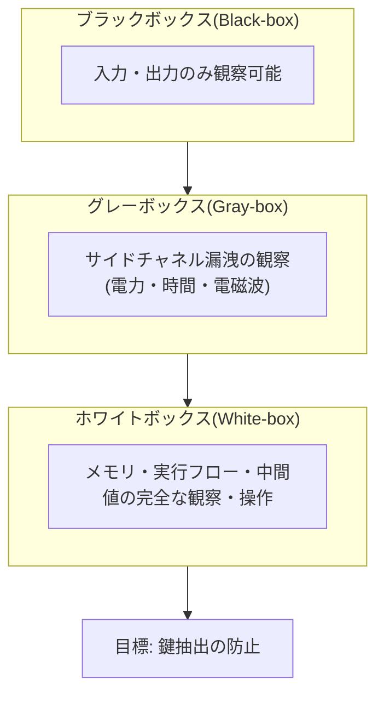
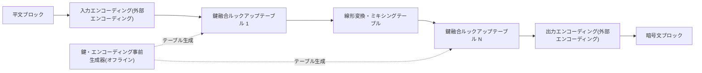

# ホワイトボックス暗号(White-box Cryptography)

## 1. 概要

> **ホワイトボックス暗号(White-box Cryptography, WBC)**とは、攻撃者が暗号の実行される端末・メモリ・実行フローを完全に観察・操作できる環境(ホワイトボックス攻撃モデル)を想定したうえでも、秘密鍵が露出しないよう、鍵をアルゴリズムの実装内部に数学的に融合・秘匿するソフトウェアベースの鍵保護技術である。

伝統的な暗号解析は、攻撃者が暗号アルゴリズムの入力(平文)と出力(暗号文)しか見られない**ブラックボックスモデル**を前提として発展してきた。この観点では、AES・RSAのような標準アルゴリズムは鍵を知らない限り安全であると証明され、実際に鍵はサーバーの保護されたメモリやHSM・スマートカードのようなハードウェアの安全領域に保管するのが定石であった。問題は、スマートフォン・セットトップボックス・PCのように利用者が全面的に制御する端末で暗号演算が実行される場合である。こうした端末では、攻撃者がすなわち端末の所有者であるか端末を奪取した者であり、デバッガでメモリをダンプし、実行を停止させ、命令をトレースすることができる。いかに強力なアルゴリズムであっても、実行中にメモリにロードされた鍵がそのまま読み取られれば、たった一度のダンプで無力化される。

ホワイトボックス暗号は、まさにこのギャップを埋めるために登場した。2002年にChowらがDRM環境を狙ってAES・DESのホワイトボックス実装を提案したのが始まりであり、核心となるアイデアは「鍵をメモリに置かず、アルゴリズムそのものに溶け込ませる」ことである。すなわち特定の鍵について事前計算された巨大なルックアップテーブル(lookup table)の形で暗号を実装し、実行中のどこにも鍵の値が原形のまま現れないようにする。これにより、ハードウェアセキュリティモジュールなしに純粋なソフトウェアだけで、敵対的な端末において鍵を保護することが目標である。

ホワイトボックス暗号の中核的な特徴は三つに集約できる。第一は**鍵の実装への内在化**であり、鍵が独立したデータではなくアルゴリズムのコード・テーブルの一部となることで、分離抽出を困難にする。第二は**ソフトウェア専用性**であり、特定のハードウェアに依存しないため、移植性と配布・更新の自由度が高い。第三は**確率的・時間的な安全性**であり、絶対的な不可逆性ではなく、攻撃コストと所要時間を引き上げることで、鍵更新周期内には事実上抽出が困難になるようにする相対的な防御であるという点である。この三つの特徴が、ホワイトボックスがどこに強く、どこに弱いかをそのまま規定する。

必要性を具体的な場面として描いてみると明確になる。有料放送アプリがコンテンツを再生するには復号鍵をメモリに載せて演算しなければならないが、root化されたスマートフォンで攻撃者がデバッガをアタッチし、鍵がロードされる瞬間のメモリをダンプすれば、その鍵でコンテンツを無断で複製・再配布できる。同様に、モバイルカード決済アプリがカードドメイン鍵をソフトウェアで処理するのであれば、端末を掌握した攻撃者がその鍵を抜き取って偽造・改ざん取引を試みることができる。このように「実行端末そのものが敵対的」な状況で、すべての演算をサーバーに送ることもできず、ハードウェアの安全領域も使えないとき、ソフトウェアだけで鍵を守らなければならないという要求がホワイトボックス暗号を生み出した。

ただし、ホワイトボックス暗号は万能ではなく、ハードウェアベースの保護を完全に代替することはできない。ソフトウェアで実装される以上、十分な時間と資源を投入した攻撃者は理論上鍵を抽出でき、実際に多数の商用ホワイトボックス実装がサイドチャネル類似の攻撃で破られた事例が報告されている。したがってホワイトボックス暗号は絶対的な安全ではなく、**攻撃コストを経済的に負担し難い水準まで引き上げる「遅延・上昇」の統制**として理解すべきであり、鍵更新・サーバー検証・難読化・完全性検証などと組み合わせる多層防御(Defense in Depth)の一要素として設計することが核心である。

こうした位置づけは、技術士答案において特に重要である。ホワイトボックスを「ソフトウェアでつくったHSM」のように記述すれば誇張となり、逆に「どうせ破られるので無意味だ」とすれば産業の現実を見落とす。正確な観点は、ホワイトボックスはハードウェアセキュリティが存在しない広範な端末において鍵露出のリスクを実務的に低減する現実的な折衷案であり、その限界を運用・アーキテクチャレベルの他の統制で補ってはじめて完成する、というものである。

## 2. 攻撃モデルの区分とホワイトボックスの脅威前提

ホワイトボックス暗号の必要性は、攻撃者が何を観察・操作できるかについての前提、すなわち攻撃モデルを区分することで明確になる。同じAESであっても、攻撃者がアクセスできる情報の範囲によって、求められる保護水準がまったく異なるからである。以下の概念図は、三つの攻撃モデルの観察範囲の違いを示している。

**ブラックボックスモデル**は、攻撃者が暗号モジュールを一つの閉じた箱と見なし、入出力しか扱えないと仮定する。伝統的な暗号学の安全性証明が立脚する地盤であり、サーバー側の暗号のように実行環境が信頼できる場合に有効である。このモデルではアルゴリズムの数学的強度がそのまま安全性であり、鍵は保護されたストレージにあると前提する。ホワイトボックスが狙う問題はまさにこの前提、すなわち「実行環境は信頼できる」という仮定が崩れた状況であるため、ブラックボックスの安全性証明がそのままでは成立しないことを認識するのが出発点である。

**グレーボックスモデル**は、実行そのものは直接見えないが、消費電力・演算時間・電磁波放射のような物理的なサイドチャネル(side-channel)情報を観察できると見なす。スマートカード・IoT端末への攻撃で現実化しており、DPA(差分電力解析)のような手法で鍵を復元する。ここではマスキング・定数時間実装などのサイドチャネル対策が求められる。グレーボックスはブラックボックスとホワイトボックスの中間地帯であり、観察情報が部分的・間接的であるという点が核心である。重要な洞察は、このサイドチャネル解析の統計手法が、後述するDCAを通じてそのままホワイトボックスに移植されたという点であり、これは三つのモデルが断絶しているのではなく、攻撃観察範囲の連続線上にあることを示している。

**ホワイトボックスモデル**は最も強い攻撃前提であり、攻撃者が実行環境を完全に掌握し、メモリを読み、中間計算値を閲覧し、任意の時点で実行を止め、命令を改ざんできると見なす。DRMコンテンツ保護、モバイル決済アプリ、ゲームクライアントのように、信頼できない端末で実行されるソフトウェアがこのモデルの対象である。この場合に鍵を守るには「鍵が実行中のどこにも原形で存在しない」ようにしなければならず、これがホワイトボックス暗号の本質的な要求である。

| 区分 | 観察範囲 | 代表的な脅威 | 対応技術 |
|------|-----------|-----------|-----------|
| ブラックボックス | 入力・出力 | 暗号解析・総当たり | 強力なアルゴリズム・十分な鍵長 |
| グレーボックス | サイドチャネル漏洩 | DPA・タイミング攻撃 | マスキング・定数時間・ノイズ |
| ホワイトボックス | メモリ・実行の全体 | メモリダンプ・鍵抽出・コードリフティング | 鍵融合・エンコーディング・難読化・完全性検証 |

## 3. 実装原理と構造

ホワイトボックス暗号の実装は、標準アルゴリズムの数学的定義を変えることなく、鍵が関与する演算を事前計算されたテーブルの形に置き換える過程として要約される。攻撃者がテーブルを覗いても鍵を逆算できないよう、各段階の入出力に秘密のエンコーディング(ランダムな可逆変換)をかぶせ、値そのものをかき混ぜることが核心である。以下はホワイトボックスAES実装の典型的な処理構造である。

以下の四つの原理は、順に積み重なる防御層として理解するとよい。前の層が破られる場合に備えて、次の層が攻撃の難度を再び引き上げる構造である。

**第一に、鍵のテーブル融合(Key Embedding).** 標準AESにおいて、ラウンド鍵とのXOR・S-box・MixColumnsのような演算は実行時に鍵を使用する。ホワイトボックス実装は、特定の鍵についてこれらの演算をオフラインで事前計算し、「入力バイト → 出力バイト」をマッピングするルックアップテーブルに置き換える。実行時にはテーブルを参照するだけであるため、鍵がコードやメモリに別途存在しない。例えば8ビット入力を受け取るテーブルは256個のエントリを持ち、複数のテーブルを連鎖させて一つのラウンドを構成する。

テーブルサイズと性能の関係もこの段階で決まる。入力ビット幅が大きいほど表現力は高まるが、テーブルが指数関数的に大きくなるため、8ビット単位に細かく分割して複数のテーブルを連鎖させる折衷が一般的である。この設計上の選択が、そのままアプリの容量と演算量を左右する。

**第二に、内部・外部エンコーディング(Encoding)による秘匿.** テーブルをそのまま置くだけでは、攻撃者が標準AESの構造と照合して鍵を復元できてしまう。これを防ぐために、各テーブルの出力にランダムな可逆関数(内部エンコーディング)を適用し、次のテーブルの入力でその逆関数を吸収させて相殺する。その結果、個々のテーブルの値は無意味にかき混ぜられるが、全体を連鎖させると正しい暗号文が得られる。さらに最初の入力と最後の出力にも外部エンコーディングを適用すると、この実装は標準AESではなく「エンコーディングが合成された変形関数」となり、他のシステムとの相互運用のためにはエンコーディングをあわせて管理しなければならない。

**第三に、難読化・完全性保護との組み合わせ.** テーブルベースの秘匿だけでは、コードリフティング(実装全体をコピーしてオラクルのように再利用する攻撃)やテーブル抽出を防ぐのは難しい。したがって実際の製品は、コード難読化、制御フロー平坦化、アンチデバッグ、実行完全性検証、端末バインディング(デバイス固定)をあわせて適用する。また、サーバーが定期的に新しいテーブル(新しい鍵)を配信して流出した実装の寿命を短縮する**鍵更新(rotation)** 戦略を併用する。

**第四に、サイドチャネル対策手法の内蔵.** 初期のホワイトボックスはエンコーディングだけで値を隠せば十分と見ていたが、後述するDCA攻撃が中間値の統計的な偏りをそのまま利用したことで、この仮定は崩れた。そこで現代の実装は、ハードウェアのサイドチャネル対策から借用したマスキング(中間値にランダムなマスクを乗算・加算して統計的相関を除去)とシャッフリング(演算順序のランダム化)、ダミー演算の挿入をソフトウェアに移植している。結局ホワイトボックスの設計は、「値の秘匿(エンコーディング)」と「統計の秘匿(マスキング)」をともに備えてこそ、実戦の攻撃に耐えられる。

ホワイトボックス実装の処理原理を段階として要約すると次のとおりである。

- **事前生成(オフライン):** 特定の鍵・エンコーディングでラウンド演算を事前計算し、ルックアップテーブルの集合をつくる。
- **鍵融合:** ラウンド鍵をテーブル値に吸収させ、実行コード・メモリに原形の鍵が残らないようにする。
- **エンコーディング合成:** 内部・外部エンコーディングでテーブル値と入出力をかき混ぜ、標準構造との照合を遮断する。
- **サイドチャネル強化:** マスキング・シャッフリング・ノイズで中間値の統計的漏洩を抑制する。
- **ランタイム保護:** 難読化・アンチデバッグ・完全性検証・端末バインディングで、実装そのものの複製・抽出を妨害する。

## 4. 応用事例と攻撃手法の比較

ホワイトボックス暗号は、信頼できない端末での暗号演算が不可避な産業で広く使われている。共通する条件は三つである。暗号演算が利用者の制御する端末で行われ、その端末に頼れるハードウェアの安全領域がないかアクセスが制限されており、それでも鍵を守るべき経済的価値が大きいという点である。この条件をすべて満たす代表的な分野が、コンテンツ保護とモバイル決済である。

代表的なものとして、**DRM(デジタル著作権管理)** では、セットトップボックス・スマートフォンのメディアプレーヤーがコンテンツ復号鍵を扱わなければならないが、ハードウェアのセキュリティ領域がない場合や移植性が必要な場合にホワイトボックスで鍵を保護する。**モバイル決済**では、HCE(Host Card Emulation)方式がセキュアエレメント(SE)チップなしにアプリのソフトウェアだけでカードのクレデンシャルを処理するため、EMVトークン・ドメイン鍵をホワイトボックスで包み、メモリダンプに備える。このほか、OTP生成器、ゲームクライアントのチート防止、ソフトウェアライセンス保護などにも適用される。

これらの応用に共通するのは、「演算は敵対的な端末で行うが、鍵の実質的な統制権は事業者が握らなければならない」という要求である。例えばHCE決済では、実際のカードマスター鍵を端末に置かず、使用範囲・回数が制限されたドメイン鍵だけをホワイトボックスで配信し、短い周期で交換する。流出してもその鍵でできることが時間・範囲の面で制限されるよう設計するものであり、ホワイトボックスの脆弱性を鍵のライフサイクル統制で補完する典型的なパターンである。

具体的な産業適用の数値感覚も重要である。ルックアップテーブル方式のホワイトボックスAESは、鍵一つあたり数百KBから数MBに及ぶテーブルを含み、アプリ容量と初期読み込み・演算の負担を増やす。それでも有料放送・モバイル決済事業者がこれを受け入れる理由は、ハードウェアのセキュリティ領域を持たない数億台の多様な端末に同一のソフトウェアを即座に配布・更新できるという運用上の利点が大きいからである。移植性と配布の俊敏性という便益が、資源負担というコストを相殺しているわけである。

しかし、ホワイトボックス実装はさまざまなホワイトボックス特化型攻撃の標的となる。最も基礎的な脅威はメモリダンプであり、鍵が融合されていない粗雑な実装であれば、実行中のメモリから鍵パターンをスキャンするだけで抽出される。鍵融合がなされていても、実装全体を丸ごとコピーして正規のオラクルのように再利用する**コードリフティング**が可能であり、これは鍵を抽出せずに保護を迂回するため、端末バインディングとサーバー側の検証で防がなければならない。

さらに脅威となるのは、ハードウェアのサイドチャネル攻撃をソフトウェア計測に移し替えた自動化手法である。**DCA(Differential Computation Analysis)** は、実行中のメモリアクセス・中間値のトレースを大量に収集した後、電力解析の統計手法(差分解析)をそのまま適用し、エンコーディングを知らなくても鍵を復元する。2016年に公開されたこの手法は、当時の複数の商用ホワイトボックスを比較的少ないトレースで無力化し、エンコーディングだけではサイドチャネル情報の漏洩を防げないことを示した。**DFA(Differential Fault Analysis)** は、実行途中で特定の中間値にフォールト(fault)を注入し、正常出力とフォールト出力の差分から鍵を逆算するものであり、理論上は少数のフォールト注入だけでAES鍵を復元できるほど強力である。これに対抗して最新の実装はマスキング・シャッフリング、冗長計算・フォールト検出、トレースへのノイズ挿入などを導入しているが、攻撃と防御が循環し続ける様相である。

| 攻撃手法 | 原理 | 特徴 | 対策 |
|-----------|------|------|------|
| メモリダンプ・鍵スキャン | 実行中のメモリから鍵パターンを探索 | 最も基礎的 | 鍵融合(原形の鍵が不在) |
| コードリフティング | 実装全体のコピー・オラクル再利用 | 鍵抽出なしで迂回 | 端末バインディング・サーバー検証 |
| DCA | 計算トレースの差分解析 | エンコーディング無関係、自動化 | マスキング・ノイズ・シャッフリング |
| DFA | フォールト注入後の差分解析 | 少数のフォールトで復元 | 冗長計算・フォールト検出 |

これらの攻撃に共通する教訓は、「値を隠すこと」と「情報漏洩をなくすこと」は異なるという点である。エンコーディングは中間値の外形を変えるだけで、その値が鍵と持つ統計的相関は残しておくため、DCAのような解析が相関をそのまま取り出してしまう。したがって堅牢なホワイトボックスは、外形の秘匿(エンコーディング)に加えて、相関の除去(マスキング)と実装複製の防止(端末バインディング)を必ず併用しなければならず、この三つの軸がそれぞれ鍵抽出・サイドチャネル・コードリフティングという異なる攻撃ベクトルに対応する。

## 5. 深掘り — 標準化動向とハードウェアセキュリティとの関係

ホワイトボックス暗号は、公式の国際アルゴリズム標準が存在しないという点が特徴であり弱点でもある。AESのように公開検証を経た単一の標準がなく、各ベンダーが独自方式を非公開で実装するケースが多いため、「隠蔽によるセキュリティ(security by obscurity)」という議論がある。暗号学のケルクホフスの原理は「アルゴリズムが公開されても鍵さえ守れば安全でなければならない」と要求するが、ホワイトボックスは鍵を実装に溶け込ませる特性上、実装が公開されると安全性が揺らぐという生来の緊張を抱えている。このため、ホワイトボックスの強度を客観的に評価・認証する体系が不十分である点が産業上の課題として指摘されている。これに対して学界・産業界は、CHES(Cryptographic Hardware and Embedded Systems)学会の**WhibOx**ホワイトボックスコンテストのような公開検証の場を通じて実装の堅牢性を競ってきたが、多数の出品作が大会期間内に破られ、ソフトウェアだけによる完全な鍵保護がいかに難しいかを繰り返し確認させた。決済分野では、EMVCoのSBMP(Software-Based Mobile Payment)要件がソフトウェアベース決済のセキュリティ基準を提示し、ホワイトボックス・難読化・端末完全性検証を事実上要求している。

WhibOxコンテストの繰り返された結果が示す示唆は明確である。公開された単一のホワイトボックス実装は、時間の十分ある専門家の前ではたいてい崩れるため、安全性を実装の秘密性一か所に依存してはならないということである。これは先に強調した鍵更新・多層防御の根拠でもある。すなわち、個々の実装はいつか破られるという前提を受け入れ、破られる前に鍵を替え、破られても被害が拡散しないようサーバー検証と異常検知を重ねておく運用が、実質的な安全をつくる。

ハードウェアセキュリティとの関係も重要な論点である。TEE(Trusted Execution Environment)・SE(Secure Element)・TPMのようなハードウェアのトラストアンカーがあれば、鍵を隔離された領域で扱えるため原則としてより強力である。しかしハードウェア方式は端末の種類ごとにサポートがまちまちであり、TEE APIへのアクセスが制限されていたり、旧型・低価格端末にはそもそも存在しなかったりするため、移植性と配布範囲に限界がある。ホワイトボックスは純粋なソフトウェアであるため、どの端末にも配布可能で更新が容易という長所がある反面、安全性の上限が低い。両者の特性を整理すると、選択基準が明確になる。

- **信頼基盤:** TEE・SEはハードウェアによる隔離に根ざしているため安全性の上限が高い一方、ホワイトボックスはソフトウェア難読化に依存するため上限が低い。
- **移植性・配布:** TEEは端末・OS・チップセットのサポートがまちまちでAPIアクセスも制限されるが、ホワイトボックスはどの端末にも配布・更新できる。
- **性能・容量:** TEEは隔離領域での演算でオーバーヘッドが小さいが、ホワイトボックスは大型テーブルにより容量・演算の負担が大きい。
- **侵害対応:** TEEは鍵を物理的に隔離するため流出そのものが困難であり、ホワイトボックスは流出を前提として鍵更新周期でリスクを管理する。

したがって実務では、「TEEがあればTEE、なければホワイトボックスへフォールバック」するハイブリッド戦略と、ホワイトボックスで一次防御しつつサーバー側のリスクベース認証・不正取引検知(FDS)で残余リスクを吸収する多層設計が定着しつつある。予想される出題の方向としては、①ブラック・グレー・ホワイトボックスの攻撃モデルを比較し、②ホワイトボックスの実装原理(鍵融合・エンコーディング)を説明し、③DCAなどの攻撃とハードウェア(TEE)に対するトレードオフを論じる構成が有力である。

## 6. 考慮事項と示唆

技術士の観点では、ホワイトボックス暗号は単独のソリューションではなく、信頼できない実行環境を保護する戦略の一つの軸として扱うべきである。導入の可否と強度は、保護資産の価値、端末の信頼水準、性能・容量の制約、規制要件を総合して決定し、以下をバランスよく考慮する。

- **適用戦略(リスクベースの選択):** 保護対象の鍵の価値と端末の信頼水準を評価し、ハードウェアのセキュリティ領域が利用可能であればTEE/SEを優先し、移植性・配布範囲が重要であればホワイトボックスを採用しつつ、両者をフォールバック構造で組み合わせる。ホワイトボックスだけで高価値資産を単独防御しない。

- **関連技術:** ホワイトボックスは、コード署名・アプリ完全性検証、RASP(ランタイムアプリケーション自己保護)、端末改ざん検知(root化・脱獄検知)、トークン化、サーバー側FDSと連携してはじめて防御線が完成する。これらはそれぞれ実装保護・環境検証・取引検証という異なる層を担う。

- **トレードオフ(性能・サイズ vs 安全性):** ルックアップテーブル方式は、鍵一つに数百KB~数MBのテーブルと追加演算を要求するため、アプリサイズ・メモリ・性能の負担が大きい。エンコーディング・マスキングを強化するほど安全性は上がるが資源消費も大きくなるため、バランス点を設計しなければならない。低スペックのIoT・モバイル端末ではこの負担がユーザビリティに直接影響するため、対象端末群の資源特性をまず把握しなければならない。

- **鍵のライフサイクル・更新:** 流出を完全には防げないという前提の下、サーバーが定期的に新しいホワイトボックステーブルを配布して流出した実装の寿命を短縮し、侵害検知時には即座に鍵を廃棄・交換する運用体制を整える。これはホワイトボックスの安全性を「時間」で補完する中核的な統制である。

- **多層防御との連携:** ホワイトボックスは、コード難読化・アンチデバッグ・完全性検証・端末バインディング・サーバー検証・不正取引検知(FDS)と組み合わさってはじめて実効性を持つ。どの一層が破られても他の層が攻撃コストを高めるよう設計する。

- **検証・コンプライアンス:** 自社実装の強度を盲信せず、第三者による侵入評価と公開ベンチマーク(WhibOxなど)で堅牢性を定期的に点検する。決済分野では、EMVCo・PCI関連の要件と整合するようにホワイトボックス・完全性・端末検証を設計し、侵害時の鍵廃棄・ロールバック手順を事前に用意する。

- **標準化・評価体系:** ケルクホフスの原理と相反する構造的な限界を踏まえ、実装の秘密性だけに依存しないよう公開検証・第三者評価を制度化し、強度の等級・認証基準を確立する努力が必要である。

- **展望:** サイドチャネル型の自動攻撃(DCA・DFA)の高度化と防御手法が競争し続ける中で、耐量子アルゴリズムのホワイトボックス実装、AIベースの攻撃自動化への対応などが研究課題として浮上している。ホワイトボックスは、ハードウェアセキュリティが届かない領域を埋める補完材としての役割を今後も担っていくと見込まれる。

## 参考資料
- Chow et al., White-Box Cryptography and an AES Implementation (2002) — https://link.springer.com/chapter/10.1007/3-540-36492-7_17
- Bos et al., Differential Computation Analysis: Hiding Your White-Box Designs is Not Enough (CHES 2016) — https://eprint.iacr.org/2015/753
- CHES WhibOx Contest — https://whibox.io/contests/
- EMVCo, Software-Based Mobile Payment Security Requirements — https://www.emvco.com

---
> **一言まとめ**: ホワイトボックス暗号は、攻撃者が実行環境を完全に掌握したホワイトボックスモデルにおいても、鍵をルックアップテーブル・エンコーディングによってアルゴリズムに融合・秘匿して保護するソフトウェア技術であり、DRM・モバイル決済などに使われるが、DCA・DFA攻撃に脆弱であるため、難読化・鍵更新・ハードウェア(TEE)・多層防御と組み合わせなければならない。
