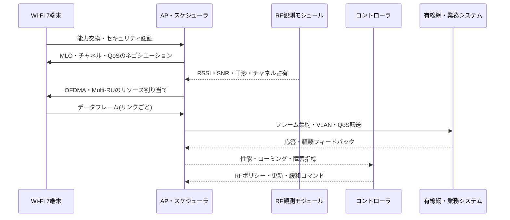

# Wi-Fi 7(IEEE 802.11be)に基づく高性能・低遅延無線LAN設計

## 1. 概要

> **定義**: Wi-Fi 7は、IEEE 802.11be-2024の技術に基づく次世代無線LANの世代であり、2.4GHz・5GHz・6GHz帯で広いチャネル、マルチリンク、高次変調と精緻なリソース割り当てを活用して、高いスループット・低い遅延・高い信頼性を目指す。

Wi-Fiは、オフィスのインターネット接続手段を超えて、製造ロボット、ビデオ会議、XR、医療機器、物流端末といった業務システムのアクセス網となりつつある。
端末数とトラフィックが増加するにつれ、平均速度を高めるだけの方式ではユーザー体験と業務品質を保証することが難しくなっている。
無線区間の混雑、干渉、端末の移動、チャネル占有の競合と再送が、遅延のテールを長くするからである。

Wi-Fi 7の核心は、単一リンクの最高速度を高めることにとどまらない。
複数の周波数リンクを状況に応じて使い分け、広いチャネルと高次変調を組み合わせ、リソース単位を細かく分けて無線媒体を活用する。
したがって設計者は、APと端末の仕様を比較するだけでなく、周波数計画、有線バックホール、電源・熱、認証、可観測性、アプリケーションの遅延要求を統合的に検討しなければならない。

IEEE 802.11be-2024は、IEEE SAが2024年9月26日にボード承認を記録し、2025年7月22日に発行したアクティブな標準である。
IEEEはこの改訂でPHYとMACを修正し、少なくとも一つの運用モードにおいて、MACサービスアクセスポイント基準で30Gbit/s以上の最大スループットと、改善された最悪遅延・ジッタをサポートするよう定義している。
これは実測のユーザー速度が常に30Gbit/sであるという意味ではなく、標準が目標とする条件と測定点を明示したものである。

Wi-Fi AllianceのWi-Fi CERTIFIED 7は、IEEE標準そのものとは区別される相互運用性認証プログラムである。
製品の箱にWi-Fi 7の機能が記載されているという事実と、公式認証を完了したという事実は同じではないため、公共・企業の調達ではサポート機能の一覧と認証状態を別途確認しなければならない。

本答案では、Wi-Fi 7の構造と中核技術、導入手順、Wi-Fi 6・有線・5Gとの比較、企業・製造の事例、セキュリティ・運用上の考慮事項と技術士の観点からの示唆を論述形式で整理する。

## 2. 登場背景と目標

### A. 既存無線LANの限界

Wi-Fi 6とWi-Fi 6Eは、OFDMA、BSS Coloring、Target Wake Timeといった機能によって多数端末環境を改善した。
しかし複数のAPが隣接チャネルで競合し、端末が異なる帯域のうち一つだけを選択すると、瞬間的な干渉とリンク品質の低下を避けるのは難しい。
特に4K・8K映像、XRレンダリング、コラボレーションアプリケーションは、平均帯域幅だけでなく一定の遅延と損失パターンを要求する。

従来の単一リンク接続では、5GHzチャネルに干渉が生じても、端末が別のリンクへ即座にトラフィックを移すことは難しい。
チャネルを再選択し、認証・接続状態を調整する間にパケット遅延が大きくなり得る。
Wi-Fi 7はMLOによって複数のリンクを一つの論理的な接続として管理し、リンク障害・混雑に対する回復の余地を広げる。

また、セル密度の高いオフィスや工場では、広いチャネルを無条件に使用することが有利とは限らない。
320MHzチャネルは一つのリンクの潜在スループットを高めるが、利用可能な周波数が十分でなければ隣接AP間の再利用性が低下し、一部地域ではDFS・規制・干渉の制約が生じる。
したがって高性能機能は、周波数資源と端末能力を考慮した選択的な適用でなければならない。

### B. Wi-Fi 7の設計目標

第一の目標は高いスループットである。
320MHzチャネルと4096-QAMは、信号品質が十分な近距離で一度により多くのデータを伝送できるようにする。
ただし変調次数が高くなるほど必要な信号対雑音比が大きくなるため、壁・距離・人の移動・干渉が多い環境では低いMCSに落ちる可能性がある。

第二の目標は、マルチリンクを用いた遅延・信頼性の改善である。
MLOは、2.4GHz・5GHz・6GHzのリンクを端末とAPが調整して同時に使用したり、一つのリンクを待機・補助リンクとして活用したりする。
アプリケーションデータがどのリンクに配置されるかは、実装モード、電力、リンク品質、規制条件によって異なるため、「常に2倍の速度」と解釈してはならない。

第三の目標は、多数端末のリソース効率である。
Multi-RUと改善されたOFDMAの運用は、チャネルリソースの小さな単位を複数のユーザーに分けて割り当てられるようにする。
工場のセンサーのように少量の短いパケットを送る端末と映像端末を同じ方式で扱うのではなく、トラフィック特性に合わせて無線リソースを配分できる。

第四の目標は、拡張されたサービス品質である。
標準が低い最悪遅延とジッタを目指していても、無線網全体の品質はAP、スイッチ、認証サーバー、アプリケーションのキューとともに決まる。
したがってWi-Fi 7は、QoS、有線QoS、可観測性と障害対応が結合したときにはじめて、業務サービスの遅延目標に貢献する。

## 3. Wi-Fi 7の参照構造と動作原理

### A. 全体構成

```mermaid
flowchart LR
    DEV1[Wi-Fi 7端末<br/>MLO STA] -. 2.4 GHz .-> AP[Wi-Fi 7 AP<br/>MLO・OFDMA]
    DEV1 -. 5 GHz .-> AP
    DEV1 -. 6 GHz .-> AP
    DEV2[レガシー端末<br/>Wi-Fi 5/6] --> AP
    AP --> SW[マルチギガビットスイッチ<br/>PoE・VLAN・QoS]
    SW --> CTRL[無線LANコントローラ<br/>ポリシー・RF管理]
    SW --> AUTH[AAA/RADIUS<br/>802.1X認証]
    SW --> APP[業務システム・インターネット・エッジ]
    MON[可観測性・ログ・無線分析] --> CTRL
    MON --> SW
```

Wi-Fi 7端末(STA)は、サポートする帯域とリンク数、空間ストリーム数、チャネル幅と変調方式をAPとネゴシエーションする。
端末が三つの帯域をすべてサポートしているからといって、すべての帯域で常に同時に送受信するわけではない。
バッテリー、アンテナ構成、国ごとの周波数規制、APの実装ポリシーによって、リンク数と使用方式が異なる。

APは複数の無線リンクを管理しながら、スケジューリング、フレーム伝送、セキュリティ暗号化とローミング支援を行う。
複数のリンクの状態を合わせて判断するため、APのCPU・メモリ・無線チップセットの処理能力とファームウェアの成熟度が重要である。
高密度環境では、AP1台の最高速度よりも、AP間のチャネル再利用と同一チャネル干渉をあわせて評価しなければならない。

有線バックホールは無線性能の上限を決定する。
マルチリンク端末が高いスループットを発生させる場合、2.5GbE・5GbE・10GbE以上のアップリンク、十分なPoE電力、スイッチバッファとVLAN設計が必要である。
APだけを交換して1GbEバックホールをそのままにすると、無線PHY速度と実際の業務スループットの間にボトルネックが生じる。

無線LANコントローラまたはクラウド管理プラットフォームは、チャネル・出力・SSID・ポリシー・ファームウェアを集中管理する。
集中管理が停止しても既存のAPが安全な設定でサービスを継続できるよう、ローカルの自律性と構成キャッシュを設計しなければならない。
RADIUS、証明書、ログ収集と時刻同期もまた、無線接続の運用品質に含まれる。

### B. 中核技術のデータフロー



接続の初期に、APと端末はサポート帯域、空間ストリーム、チャネル幅、MLO能力、セキュリティポリシーを交換する。
このネゴシエーション結果が低い水準に決まると、APが最上位製品であっても、端末の実際の接続はWi-Fi 6の水準にとどまる可能性がある。
運用者は、接続能力と実際のネゴシエーション結果を区別してダッシュボードに表示しなければならない。

APスケジューラは、無線チャネルの占有状態とキューを見て、どの端末にどの時間・周波数リソースを与えるかを決定する。
OFDMAは一つのチャネルを複数のResource Unitに分けて複数の端末を同時にサービスする方式であり、Multi-RUは端末・フレームの要求に合わせてリソース単位を組み合わせる方向へ拡張される。
スケジューラは、公平性、優先度、遅延、スループットとバッテリー節約の間でポリシーを選択する。

測定データはRSSI一つでは不十分である。
SNR、MCSの変化、再送率、チャネル占有率、パケット遅延の分布、ローミング失敗と認証時間までをあわせて見てこそ、原因を区別できる。
例えば、RSSIは高いが隣接APのチャネル占有率が高い場合、再送が増加することがある。

## 4. 中核技術と設計ポイント

### A. 320MHzチャネルと6GHz

Wi-Fi CERTIFIED 7の技術概要は、320MHzチャネルをWi-Fi 7の中核機能として提示している。
広い連続チャネルは一度に伝送できるシンボルとデータ量を増やすが、同一地域に配置できる非重複チャネルの数を減らす可能性がある。
結局、単一APのピーク性能と多数APの空間再利用の間で設計上の決定を下さなければならない。

6GHz帯は、広いチャネルと比較的新しい周波数資源を提供するという長所がある。
一方で、国ごとの使用条件、屋内・屋外の規制、端末のサポート状況と壁の透過損失を確認しなければならない。
6GHzのみを使用するよう設計すると古い端末のアクセス性が低下するため、2.4GHz・5GHzとの共存ポリシーが必要である。

オフィスの会議室のようにAP間の距離が十分で端末が固定された領域では、320MHzを選択できる。
逆に生産ラインや病棟のように複数のAPが密に配置される場所では、80MHzまたは160MHzを複数のセルで再利用するほうが、全体の容量と安定性に有利な場合がある。

### B. 4096-QAMと物理層

4096-QAMは、一つのシンボルにより多くのビットを載せて伝送効率を高める高次変調方式である。
しかしシンボル間の間隔が狭くなるため雑音と干渉に敏感であり、APと端末の間の信号品質が良好なときにのみ高いMCSが維持される。
したがって製品広告の最高PHY速度を、すべての位置のユーザー速度として提示してはならない。

実際の設計では、セル端のMCS、最小SNR、再送率と95・99パーセンタイルの遅延を測定する。
信号を強くするために出力だけを上げると、隣接セル間の干渉と端末のバッテリー負担が大きくなる可能性がある。
出力・チャネル幅・AP間隔・アンテナ配置の組み合わせを、現場測定によって最適化しなければならない。

### C. MLO(Multi-Link Operation)

MLOは、端末とAPが複数のリンクを一つの論理的な接続として管理できるようにするWi-Fi 7の代表的な機能である。
リンクを同時に使用するSTR方式はスループットと遅延の改善余地があり、リンクを交互に使用・省電力化する方式は電力と干渉を削減できる。
具体的な動作は、チップセット・ファームウェア・端末の電源ポリシーと認証プロファイルによって異なり得る。

MLOの設計では、リンクごとのセキュリティ状態と再送、パケット順序、リンク切り替え時間を考慮する。
5GHzは範囲が広く6GHzはチャネルに余裕があっても、壁を挟むとリンク品質が変わる可能性がある。
一つのリンクの品質低下を検知して別のリンクへトラフィックを移す基準が敏感すぎるとピンポン切り替えが発生するため、ヒステリシスと最小維持時間を設ける。

MLOがすべての遅延問題を解決するわけではない。
バックホールのキューが飽和していたりアプリケーションサーバーが遅かったりすれば、無線リンクを追加してもエンドツーエンドの遅延は減らない。
したがって無線・有線・サーバー区間のタイムスタンプを連結し、ボトルネックの位置を確認しなければならない。

### D. OFDMAとMulti-RU

OFDMAは、チャネル全体を小さなリソース単位に分割し、APが複数の端末に同時に割り当てる方式である。
短いセンサーパケットを送るために大きなチャネル全体を独占する無駄を減らすことができ、多数端末のアクセス遅延を低減できる。
ただし端末ごとのリソース単位が小さすぎると、制御オーバーヘッドが大きくなり、大容量端末のスループットが低下する可能性がある。

Multi-RUは、端末の能力とトラフィックに合わせて複数のリソース単位を組み合わせる柔軟性を高める。
スケジューラは、映像端末の連続データとセンサー端末の短周期メッセージを区別して割り当てなければならない。
公平性アルゴリズムが特定の種類の端末ばかりを優先し続けると他の端末の遅延が悪化するため、サービスごとのSLAと最大待ち時間をあわせて適用する。

### E. 512 compressed Block Ackと信頼性

Wi-Fi CERTIFIED 7の技術概要は、最大512個のMPDUをまとめて確認できるcompressed Block Ack機能を主要機能として説明している。
フレームを効率的に確認すれば大規模データ伝送の確認オーバーヘッドを削減できるが、損失がまとまり全体の再送遅延へと拡大しないよう、再送・バッファのポリシーを点検しなければならない。
映像とファイル転送はスループット、制御トラフィックと対話型業務は遅延を優先するといった差別化ポリシーが必要である。

| 機能 | 改善しようとする問題 | 期待効果 | 注意点 |
|---|---|---|---|
| 320MHz | チャネルあたりの伝送量不足 | 高いピークスループット | 周波数再利用・干渉 |
| MLO | 単一リンクの混雑・切断 | スループット・回復力・遅延の改善 | 端末・APの実装差 |
| 4096-QAM | シンボルあたりのビット数の制限 | 良好な信号環境での効率向上 | 高いSNRが必要 |
| OFDMA | 多数端末の競合 | きめ細かな同時リソース配分 | スケジューラの公平性 |
| Multi-RU | リソース単位の硬直性 | トラフィックごとのリソース組み合わせ | 制御オーバーヘッド |
| Block Ack | 確認フレームのオーバーヘッド | 大容量伝送の効率 | 損失・バッファ・再送 |

表の機能は、互いに独立したスイッチではない。
広いチャネルでスループットを高め高次変調を使っても、干渉が大きくなればMCSが下がる可能性がある。
したがって機能ごとの数値よりも、サービスレベルでスループット・遅延・損失・電力の結果を検証しなければならない。

## 5. 構築・運用手順

### A. 要件と現場調査

まず、ユーザー・業務・端末・空間ごとの要求を分類する。
会議室のビデオ会議は遅延とアップリンク品質が重要であり、物流端末は移動中のローミングと認証成功率が重要であり、センサーは短いパケットとバッテリーが重要である。
要求を「Wi-Fi 7導入」と表現するのではなく、サービスKPIと障害影響として表現しなければならない。

現場調査では、壁・金属構造・機械設備・電磁波源・既存AP・チャネル占有を測定する。
工場ではモーターや溶接設備が干渉を生むことがあり、病院では機器の電波適合性と業務停止リスクを別途検討する。
測定結果を平面図と時間帯別トラフィックに結合してこそ、AP数とチャネル幅を合理的に決定できる。

次に、端末の能力とローミングポリシーを調査する。
Wi-Fi 7のAPを設置しても、既存の端末がすべてMLO・6GHz・4096-QAMを使用できるわけではない。
世代が混在する環境では、レガシー端末が新規端末のリソースを過度に占有しないよう、SSID・帯域・ポリシーを区分することができる。

### B. 設計・試験・段階的展開

設計段階では、RF計画、有線バックホール、VLAN、QoS、認証、モニタリング、障害時の迂回経路をあわせて作成する。
APごとのチャネルと出力を自動最適化に任せる場合でも、業務上重要な領域の最小カバレッジと最大セル重複の基準を明示する。
6GHz・5GHz・2.4GHzの役割を分け、特定の帯域が使用できない場合のデフォルト動作を定義する。

試験は、機能・性能・相互運用・セキュリティ・障害試験に区分する。
MLOリンク1本の切断、6GHzの見通し外区間、APの再起動、コントローラの切断、RADIUSの遅延、スイッチアップリンクの飽和、ローミング中のビデオ通話といったシナリオを含める。
平均速度だけで合格とせず、95・99パーセンタイルの遅延、パケット損失、再送、認証時間と復旧時間を基準とする。

展開は、ラボ、限定されたフロア・ライン、業務ピークの低い時間帯、全体への拡大の順で進める。
各段階の進入条件と中止条件を定め、既存APに戻せる構成と機器を一定期間維持する。
変更後には同じ位置で前後の測定を行い、無線性能が実際の業務成果につながったかを確認する。

### C. 可観測性とサービスレベル管理

観測データは、AP・端末・コントローラ・スイッチ・AAA・アプリケーションを一つの流れとして連結しなければならない。
接続速度、MCS、チャネル幅、リンク数、RSSI、SNR、再送率、チャネル占有率、ローミング、認証とアプリケーションの応答時間をあわせて見る。
端末名だけで分析するとユーザー・業務・位置ごとの影響分析が難しいため、資産識別子とサービスタグを管理する。

障害の分類も階層化する。
接続そのものができない場合は認証・周波数・電波・IP割り当てをまず確認し、接続はできるが遅い場合はRF再送・スケジューラ・バックホール・サーバーのキューを区別する。
イベントと性能指標の時刻同期を合わせれば、AP交換やチャネル変更のような措置の効果を客観的に評価できる。

## 6. 技術比較と適用判断

### A. Wi-Fi 6・Wi-Fi 7の比較

Wi-Fi 6が多数端末の効率と省電力を大きく改善したとすれば、Wi-Fi 7はその上に、より広いチャネル、MLO、高次変調ときめ細かなリソース運用を組み合わせる。
しかしWi-Fi 7の利点は、すべての環境で同じ比率で現れるわけではない。
端末がWi-Fi 6で1GbEバックホールのみを使用しているのであれば、APだけをWi-Fi 7に替えても投資効果は限定的となる可能性がある。

| 区分 | Wi-Fi 6/6E | Wi-Fi 7 |
|---|---|---|
| 代表的な標準 | 802.11ax | 802.11be-2024 |
| 中核的な方向性 | 高密度効率・省電力 | スループット・マルチリンク・低遅延 |
| チャネル幅 | 環境に応じて20~160MHz | 最大320MHz機能 |
| リンク運用 | 主に単一リンク | MLOで複数リンクを管理 |
| 変調 | 1024-QAM | 4096-QAMをサポート |
| 導入判断 | 端末・AP交換の範囲 | 端末・RF・バックホール・運用の統合 |

この比較は、世代が高いほど常に優れているという意味ではない。
高密度オフィスでは、小さなチャネルを複数のセルで再利用するWi-Fi 6の設計のほうが、広いチャネル一つよりも安定する場合がある。
逆に、XR・無線バックホール・高画質映像のように高い瞬間スループットと低い遅延が重要な領域では、Wi-Fi 7機能の価値が大きくなる。

### B. Wi-Fi 7・5G・有線の比較

有線イーサネットは予測可能な物理経路と高い安定性を提供するが、移動性と設置の柔軟性が低い。
5Gプライベートネットワークは広範な移動性・SIMベースの管理・通信事業者との連携に強みがあり、Wi-Fi 7は既存のIP網・端末エコシステム・屋内構築コストの面で有利な場合がある。
三つのうち一つを一括して選択するよりも、業務の移動性、電波環境、セキュリティドメイン、運用能力とTCOを比較しなければならない。

| 判断基準 | 有線イーサネット | Wi-Fi 7 | プライベート5G |
|---|---|---|---|
| 移動性 | 低い | 屋内・ローカルの移動 | 広域の移動 |
| 設置の柔軟性 | 配線が必要 | AP配置が必要 | 基地局・コアが必要 |
| 固定遅延 | 最も予測可能 | RF環境の影響 | 無線・コアの影響 |
| 端末エコシステム | 成熟 | 非常に広い | モジュール・SIMが必要 |
| 適合事例 | サーバー・固定設備 | オフィス・XR・屋内IoT | 工場の移動体・キャンパス |

例えば、生産ラインの固定検査装置は有線を優先し、作業者のタブレットと移動型カメラにはWi-Fi 7を適用し、工場全体を移動するAGVはプライベート5Gと比較することができる。
この際、同一アプリケーションが複数のアクセス網を使用できるよう、認証・アドレス・QoS・観測モデルを共通化すれば、切り替えコストを削減できる。

## 7. 事例: 製造工場の無線映像検査とAGV

製造企業が、高解像度の映像検査カメラ、AGV、保守用タブレットを一つの無線インフラで接続すると仮定する。
映像検査は瞬間的なアップリンクのスループットが大きく、AGVはローミング遅延と接続の持続性が重要であり、タブレットはユーザーの移動性と認証の利便性が重要である。
同じSSIDで最高速度だけを提供する方式では、三つの要求を同時に満たすことは難しい。

まずカメラの区域では6GHzと広いチャネルを検討しつつ、AP間の干渉とバックホールを測定する。
AGVの移動経路では5GHz・6GHzリンクの連続性を確保し、MLOの切り替え時間とローミング失敗を試験する。
タブレットと既存のセンサーは別のポリシーで配置し、低優先度のトラフィックが映像・制御トラフィックを圧迫しないようにする。

スイッチはマルチギガビットのアップリンクとVLAN・QoSを提供し、コントローラは生産サービスごとのポリシーをAPに配布する。
認証には802.1Xと端末ごとのクレデンシャルを使用し、一時的な機器は制限されたネットワークにのみアクセスさせる。
コントローラやAAAが一時的に停止しても、すでに認証された端末の安全な動作と障害案内が可能でなければならない。

パイロットの合格基準は、カメラのスループットだけではない。
AGVの99パーセンタイル遅延、ハンドオーバー失敗率、映像フレームの損失、認証成功までの時間、AP障害の復旧時間、バックホール利用率と運用者の障害処理時間をあわせて測定する。
ピーク生産時間に基準を超えた場合は、新機能を自動的に無効化し、既存のプロファイルへ回帰するようにする。

この事例の核心は、Wi-Fi 7を単独の機器導入と見なさない点にある。
RF設計、有線ネットワーク、業務の優先順位、セキュリティ、運用自動化と現場の安全手順を、一つのサービス設計として束ねなければならない。

## 8. セキュリティ・個人情報・運用上の考慮事項

第一に、認証と暗号化をデフォルトとする。
WPA3-Enterprise、802.1X、RADIUSと証明書のライフサイクルを適用し、個人・業務・IoT端末のクレデンシャルとネットワーク権限を分離する。
共用のPSK一つを複数の機器が共有すると、退職・紛失・供給者変更時の回収と追跡が難しくなる。

第二に、管理プレーンを分離する。
AP・コントローラ・スイッチの管理インターフェースはユーザーデータ網から分離し、管理者のMFA・最小権限・接続許可リスト・変更承認・コマンドログを適用する。
クラウド管理型プラットフォームを使用する場合でも、管理API、テナント分離、データ保存と供給者障害時のローカル動作を契約に明示する。

第三に、RFセキュリティと可用性をあわせて見る。
ジャミング・不正AP・Evil Twin・証明書偽造・チャネル枯渇は、ユーザーデータの流出だけでなく業務停止を引き起こす可能性がある。
無線侵入検知、チャネルスキャン、不正機器の遮断とAPの物理的保護を運用手順に含めつつ、検知の誤検出で正常業務を遮断しないよう承認と復旧の手順を設ける。

第四に、位置と接続ログの個人情報を統制する。
端末のMAC、ユーザーID、APの位置、接続時間は業務分析に有用であるが、個人の移動経路を推定できる。
目的・保存期間・アクセス権限・非識別化・削除手順を定め、障害分析に必要な最小範囲のみを保管する。

第五に、サプライチェーンとファームウェアを管理する。
AP・チップセット・コントローラの脆弱性告知、ファームウェア署名、サポート期間、SBOMと緊急パッチ手順を、契約と調達評価に含める。
新機能を有効化する前に相互運用性・セキュリティ・性能の回帰試験を通過させ、問題が生じた場合は以前のファームウェアとRFプロファイルに戻せるようにしなければならない。

| 領域 | 代表的なリスク | 技術士の観点からの対応 |
|---|---|---|
| 認証 | 不正端末・クレデンシャルの窃取 | 802.1X・WPA3-Enterprise・MFA・証明書の失効 |
| RF | ジャミング・Evil Twin・不正AP | WIDS/WIPS・チャネル分析・現場対応 |
| 管理 | コントローラ・API権限の奪取 | 管理網の分離・最小権限・監査ログ |
| バックホール | アップリンクの飽和・VLANエラー | 容量計画・QoS・冗長化・アラート |
| 個人情報 | 位置・接続ログの過剰収集 | 目的の限定・保存期間・アクセス制御 |
| サプライチェーン | 脆弱なファームウェア・更新の偽造 | 署名・SBOM・パッチSLA・ロールバック |

## 9. 深掘り: 標準・認証の動向と出題の観点

IEEE 802.11be-2024がアクティブな標準として発行されたことで、Wi-Fi 7はドラフト機能を単に羅列する段階から、標準に基づく設計と製品検証の段階へと移行した。
ただし、IEEE標準の機能定義とWi-Fi Alliance認証製品のサポート範囲は同じでない場合がある。
技術士答案では、標準、認証プログラム、メーカーのオプションを区別して記述することが正確性の核心である。

Wi-Fi Allianceは2026年1月、20MHz専用のIoT端末にもWi-Fi CERTIFIED 7の機能を適用する認証を発表した。
この変化は、Wi-Fi 7を高性能なスマートフォン・ノートPCに限定せず、センサー・ウェアラブル・産業機器へと拡張しようとする方向性を示している。
20MHz端末は320MHzの最高スループットを必要としないため、機能を選択的に適用して電力・コストと相互運用性のバランスをとる観点が重要である。

予想される論述問題としては、「Wi-Fi 7の技術と導入方策」または「高密度・低遅延無線LANの設計」として出題される可能性がある。
答案は、定義と登場背景、320MHz・MLO・4096-QAM・OFDMAの原理、AP・バックホール・コントローラの構造、Wi-Fi 6・5G・有線との比較、現場事例、セキュリティと運用指標の順に構成すれば、技術的原理と適用戦略をあわせて示すことができる。

## 10. 考慮事項と示唆

### A. 速度よりもサービス指標を優先する

最高PHY速度は無線リンクの潜在値にすぎず、業務サービスのスループットではない。
技術士は、ユーザー体感、99パーセンタイル遅延、損失、認証・ローミング成功率、障害復旧時間とTCOを目標指標として提示しなければならない。

### B. RF・有線・アプリケーションをエンドツーエンドで設計する

MLOと320MHzを適用しても、バックホール・ファイアウォール・サーバーのキューがボトルネックであれば効果は消える。
APの交換予算とともに、マルチギガビットスイッチ、PoE、VLAN、QoS、観測プラットフォームとサーバー性能を設計しなければならない。

### C. 段階的導入と世代混在の共存を前提とする

すべての端末とAPを一度に交換するよりも、高価値の区域と業務からパイロットを開始する。
レガシー端末を安全に収容し、サポートされないMLO・6GHz機能のデフォルト動作とロールバック経路を明確にする。

### D. セキュリティと個人情報を運用ライフサイクルに組み込む

無線セキュリティはWPAの設定だけで終わらず、証明書・ファームウェア・管理API・ログ・不正APを含む。
個人の移動情報と接続ログの目的と保存を制限し、変更・インシデント・供給者交代時には証跡を残さなければならない。

### E. 標準準拠と相互運用試験を調達条件とする

IEEE 802.11beの機能をサポートするという文言と、Wi-Fi CERTIFIED 7の取得完了は異なる。
調達時には、必須機能、サポートするチャネル・帯域、MLOモード、セキュリティバージョン、試験機器と相互運用の対象、ファームウェアのサポート期間を、数値と証拠で要求しなければならない。

### F. 自動化の失敗を安全に限定する

RFの自動最適化と集中的なポリシー配布は運用負担を軽減するが、誤ったチャネル・出力・ファームウェアが広い領域に同時に影響を与える可能性がある。
カナリア展開、変更承認、範囲の制限、自動ロールバック、ローカルの自律性を組み合わせ、自動化の影響範囲(ブラスト半径)を縮小しなければならない。

## 参考資料

- IEEE 802.11 Working Group, IEEE Std 802.11be-2024 発行案内: https://www.ieee802.org/11/
- IEEE Standards Association, IEEE 802.11be-2024 標準情報: https://standards.ieee.org/ieee/802.11be/7516/
- Wi-Fi Alliance, Wi-Fi CERTIFIED 7 Technology Overview: https://www.wi-fi.org/system/files/Wi-Fi_CERTIFIED_7_Technology_Overview_202401_0.pdf
- Wi-Fi Alliance, Wi-Fi CERTIFIEDプログラムと標準・認証の区別: https://www.wi-fi.org/topic/certification
- Wi-Fi Alliance, 20MHz専用IoT端末向けWi-Fi CERTIFIED 7の拡張: https://www.wi-fi.org/topic/iot

---

> **一言まとめ**: Wi-Fi 7は、320MHz・MLO・4096-QAM・きめ細かなリソース割り当てによって無線LANのスループットと遅延・信頼性を高めるが、実際の価値は、RF・有線バックホール・端末・セキュリティ・運用をエンドツーエンドのサービスレベルで設計し検証したときに生まれる。
