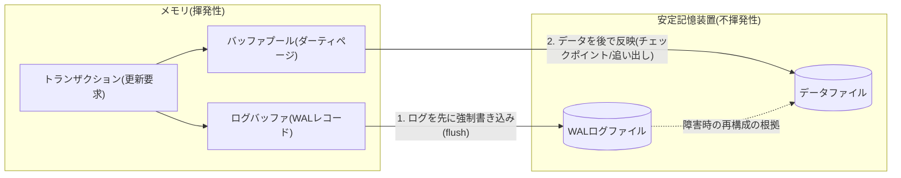
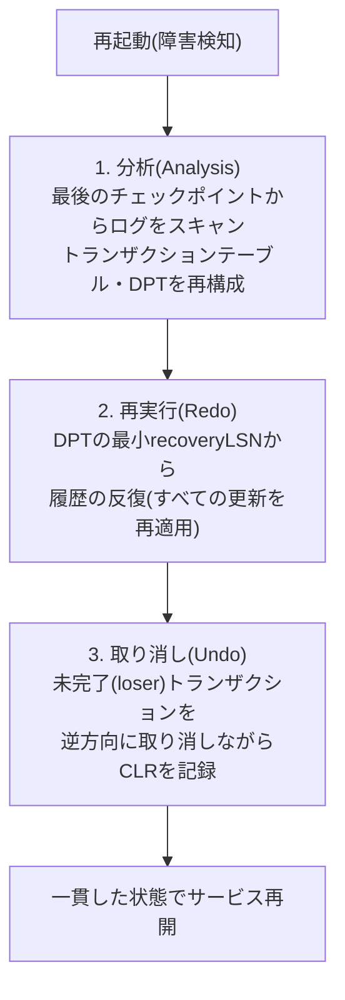

# ログ先行書き込み(WAL)とデータベース回復手法(ARIES)

## 1. 概要

> **ログ先行書き込み(WAL, Write-Ahead Logging)**とは、データページ(ブロック)をディスクに反映する前に、その変更事実を記録したログを先に安定記憶装置(stable storage)へ強制書き込み(force)するよう規定する、トランザクション回復の基本プロトコルである。すなわち「先にログ、後でデータ」という順序規則によって、障害が発生してもログさえあればデータの一貫した状態を再構成できることを保証する。

データベースは性能のために、更新されたページを即座にディスクに書き込まず、バッファプール(buffer pool)に一時的にキャッシュする。この遅延はスループットを大きく高めるが、停電・プロセスの強制終了・ディスクエラーのような障害が発生すると、バッファの更新内容が失われ、トランザクションの原子性(Atomicity)と永続性(Durability)が崩れるリスクを生む。WALはまさにこのリスクを解消するために登場した。まだ完了(commit)していないトランザクションの更新が先にディスクに反映されれば、障害時にそれを取り消す(undo)根拠が必要となり、逆に完了したトランザクションの更新がまだディスクに反映されていなければ、それを再実行する(redo)根拠が必要となる。両方の根拠をすべてログに残しつつ、そのログがデータよりも先に安定記憶装置に到達するよう強制することがWALの本質である。

WALが必要とされる根本的な理由は、バッファ管理ポリシーの自由度を確保しながらもACIDを守るためである。もし完了時点ごとにすべての更新ページをディスクへ強制的に書き出せば(forceポリシー)redoは不要になるが、ランダムI/Oが爆発的に増えて性能が崩壊する。反対に、未完了トランザクションのダーティページをバッファから追い出せないようにすれば(no-stealポリシー)、バッファがすぐに枯渇する。現代のDBMSは性能が最も優れた**steal/no-force**ポリシー(未完了ページの追い出しも許可し、完了時にデータを強制書き込みしない)を採用しているが、このポリシーはundoとredoの**両方**を要求し、その安全弁こそがWALである。WALは、OracleのREDOログ、PostgreSQLのWALセグメント、MySQL InnoDBのredoログとundoログ、SQLiteのWALモードなど、商用・オープンソースのエンジン全般に共通して実装されている。表現や詳細構造はエンジンごとに異なるが、「データよりもログを先に安定記憶装置に残す」という規則だけは例外なく共有されているという点で、WALはトランザクション処理の普遍的な原理といえる。

## 2. WALの基本原理とログ構造

WALは二つの下位規則で構成される。第一は**undo規則**であり、あるページの更新をディスクに反映する前に、その更新を取り消せるログ(変更前イメージ、before-image)が先に安定記憶装置に記録されていなければならない。第二は**redo規則**であり、トランザクションが完了(commit)とみなされる前に、そのトランザクションのすべての更新ログ(変更後イメージ、after-image)が安定記憶装置に記録されていなければならない。二つの規則が同時に守られれば、障害時点がいつであっても、ログだけで完了トランザクションは再実行し、未完了トランザクションは取り消して、一貫した状態に回復できる。

以下の図は、更新操作がバッファ・ログ・ディスクを経由する全体構造を表している。

ログに何を残すかによって、ロギング方式は三つに分かれる。**物理ロギング(physical logging)**は変更されたバイト/ページイメージをそのまま残すため再適用が単純であるが、ログ量が大きい。**論理ロギング(logical logging)**は「A口座から100を差し引く」のような操作そのものを残すためログ量は小さいが、再適用時の副作用・順序の問題から冪等な回復が難しい。ARIESが採用した**物理論理(physiological)ロギング**は、「ページは物理的に指定し、そのページ内での変更は論理的に記述する」という折衷案であり、スロット配列の再整列のようなページ内部の移動の影響を受けずに、ログ量を抑制する。実務のエンジンの大半はこの物理論理方式に従っている。

ログは順次追記(append-only)されるレコードの列であり、各レコードは固有の**LSN(Log Sequence Number、ログ順序番号)**で識別される。LSNは単調増加するため、ログの時間順序と因果関係をそのまま表現する。各データページのヘッダーには、そのページに最後に反映されたログのLSNである**pageLSN**が記録される。回復時、あるログレコードのLSNが該当ページのpageLSNより大きければ「まだ反映されていない更新」と判断してredoし、小さいか等しければ「すでに反映済み」と判断してスキップする。このLSN比較が、回復の冪等性(idempotency)を保証する中核的な仕組みである。例えば回復中に再び障害が発生して回復を最初から繰り返しても、すでに反映された更新はpageLSNの比較によって自動的に除外され、二重適用は発生しない。

ログ自体も性能のために、まずメモリの**ログバッファ(log buffer)**に集められ、一定の条件(コミット、バッファの満杯、周期的なflush)で安定記憶装置へ書き出される。このときWAL規則を守るには、「データページをディスクに書き込む直前に、そのページのpageLSNまでのログが必ずflushされていなければならない」という不変条件が成立しなければならない。多数のトランザクションのコミットログを一度のfsyncにまとめて書き出す**グループコミット(group commit)**は、この不変条件を維持しながらディスク同期の回数を減らしてスループットを引き上げる代表的な最適化である。逆に、ログをコミットごとに即座にfsyncすれば永続性は完璧になるが、秒あたりのコミット数がディスクのfsync性能に縛られてしまう。このように、ログを「いつ、どれだけ強く書き出すか」はWAL実装の中核的な性能変数である。

ログレコードの代表的な種類は次のとおりである。表は比較を助けるための補助であり、各種類がなぜ必要なのかは、上記のundo/redo規則の観点から理解すべきである。

| ログの種類 | 記録内容 | 回復時の役割 |
|-----------|-----------|--------------|
| Update | LSN, トランザクションID, ページID, before-image, after-image | undo・redo双方の根拠 |
| Commit | トランザクション完了の表示 | 完了判定(redo対象の確定) |
| Abort/Rollback | トランザクション取り消しの開始 | undo対象の判定 |
| CLR(補償ログ) | undo実施の事実と次のundo対象(UndoNextLSN) | undo中の再障害への備え・進捗の追跡 |
| Checkpoint | アクティブトランザクション・ダーティページ状態のスナップショット | 回復開始点の短縮 |

## 3. チェックポイントと回復の必要性

ログは蓄積し続けるため、障害が発生したときにログの先頭からすべてを再適用するのでは、回復時間が際限なく長くなる。これを防ぐ仕組みが**チェックポイント(checkpoint)**である。チェックポイントは、特定の時点のシステム状態(アクティブトランザクションの一覧とダーティページの一覧)をログにスナップショットとして残し、回復がその地点以降だけを見ればよいよう、開始点を前倒しする。

チェックポイントには二つの方式がある。**同期(sharp)チェックポイント**は、チェックポイントの瞬間にすべてのダーティページをディスクへ書き出し、その間トランザクション処理を停止する。回復ロジックは単純になるが、大量の強制書き込みによってサービスが瞬間的に停止(stall)する問題がある。一方、**非同期(fuzzy)チェックポイント**は処理を止めずに現在のダーティページテーブル・トランザクションテーブルだけを記録し、実際のページ反映はバックグラウンドで段階的に行う。ARIESを含む現代のエンジンは、可用性確保のために大半がfuzzyチェックポイントを使用している。例えばInnoDBは、sharp checkpoint(終了・flush時)とfuzzy checkpoint(運用中のバックグラウンドflush)を状況に応じて併用している。

チェックポイントの実効性は、それが「回復が必ず確認すべきログの下限」をどこまで引き上げるかで決まる。fuzzyチェックポイントが残したダーティページテーブルの最小recoveryLSNがそのまま再実行の開始点となるため、バックグラウンドflushが円滑に進んでダーティページが速やかに整理されるほど、回復のスキャン区間は短くなる。逆に大量の書き込みが集中してダーティページが長く残ると、チェックポイントを頻繁に行っても回復区間はなかなか縮まらない。したがって、チェックポイントの周期とバッファのflush速度(例: InnoDBのadaptive flushing)は、ともに調整すべき一対の変数である。

更新の反映時点に関するポリシーも回復の負担を左右する。**即時更新(immediate update)**はトランザクションの進行中でもダーティページをディスクに反映できるためundoが必ず必要となり、**遅延更新(deferred update)**は完了までディスク反映を遅らせるためundoは不要であるが、バッファへの圧迫とコミット遅延が大きくなる。性能を重視する大半の商用DBMSは、即時更新 + steal/no-force + WALの組み合わせを採用している。

## 4. ARIES回復アルゴリズム

**ARIES(Algorithm for Recovery and Isolation Exploiting Semantics)**は、IBMのC. Mohanらが提案した、WALベースの回復における事実上の標準アルゴリズムである。ARIESは三つの設計原理の上に立っている。第一に**WALの遵守**、第二に**履歴の反復(repeating history)** — 回復時に障害直前までのすべての更新を(未完了トランザクションのものまで含めて)いったんそのまま再現した後、未完了分を取り消すという原則、第三に**補償ログ(CLR)によるundoのロギング** — undo自体もログとして残し、回復途中で再障害が起きても、すでに取り消した作業を再び取り消さないようにするという原則である。

ARIESは二つの中核的なデータ構造を使用する。**トランザクションテーブル(Transaction Table)**はアクティブトランザクションとそれぞれの最後のLSN(lastLSN)を保持し、**ダーティページテーブル(DPT, Dirty Page Table)**は、バッファで更新されたがまだディスクに反映されていないページと、各ページのrecoveryLSN(そのページをダーティにした最初の更新のLSN)を保持する。DPTのrecoveryLSNのうち最小値が、redoを開始する地点を決定する。

回復は、以下のように**分析(Analysis) → 再実行(Redo) → 取り消し(Undo)**の3段階で進められる。

**分析段階**は、最後に完了したチェックポイントレコードから開始してログの末尾まで前進スキャンしながら、障害時点のアクティブトランザクションの集合(完了できなかったloserトランザクション)とダーティページの集合を復元する。この段階の目的は、続くredoの開始LSNとundo対象トランザクションの一覧を確定することである。例えば、コミットログのあるトランザクションはwinnerに、ないトランザクションはloserに分類される。

**再実行段階**は、DPTの最小recoveryLSNの地点からログを再び前進スキャンし、winner・loserを問わずすべての更新を再適用して「障害直前の状態」をそのまま再現する。ただし各更新について、該当ページのpageLSNとログのLSNを比較し、すでにディスクに反映された更新はスキップする。loserの更新までいったん再現することは直感に反するように見えるが、これは次のundo段階が「正常に更新された状態」を前提として取り消せるようにし、アルゴリズムを単純かつ堅牢にする(履歴の反復の原則)。

**取り消し段階**は、loserトランザクションの更新をlastLSNから逆方向に一つずつ取り消す。各undo操作は、取り消した事実と次に取り消す対象(UndoNextLSN)を含む**CLR(Compensation Log Record、補償ログ)**として記録される。CLRのおかげで、undo途中で再び障害が起きて回復を再実行しても、CLRのUndoNextLSNをたどればすでに取り消した地点以降だけを続けて処理するため、undoが二重に実行されることはなく、回復は常に有限時間で終了する。この性質を「undoは決して取り消されない(CLR is never undone)」と表現する。

ARIESが広く採用されたもう一つの理由は、回復だけでなく平常運用時の精緻な制御まで包含しているからである。各ログレコードがトランザクション単位でprevLSN(同一トランザクションの直前のログ)を連結リストのように指しているため、特定のセーブポイント(savepoint)までだけを取り消す**部分ロールバック(partial rollback)**が自然にサポートされる。また、ページ単位ではなくレコード・タプル単位のきめ細かなロック(fine-granularity locking)とも整合的に動作するため、一つのページに複数のトランザクションが同時にアクセスする高並行環境でも正確な回復が可能である。こうした汎用性により、ARIESの中核的なアイデア(LSN、履歴の反復、CLR)は、商用DBMSの回復サブシステムに共通する設計言語となった。

## 5. 回復シナリオの例(LSNに基づく追跡)

ARIESの3段階が実際にどのように噛み合うかは、具体的なログシーケンスで見るときに最も明確になる。以下は、二つのトランザクションT1・T2が進行中にシステムが崩壊した状況を単純化したログである。LSNは10単位で増加すると仮定する。

| LSN | トランザクション | 操作 | 備考 |
|-----|----------|------|------|
| 10 | T1 | begin | |
| 20 | T1 | update P5 (A: 100→150) | P5ダーティ, recoveryLSN=20 |
| 30 | — | checkpoint | アクティブ=T1, DPT={P5:20} |
| 40 | T2 | begin | |
| 50 | T2 | update P7 (B: 30→60) | P7ダーティ, recoveryLSN=50 |
| 60 | T1 | commit | T1はwinner |
| 70 | T2 | update P5 (A: 150→200) | |
| — | — | **CRASH** | T2は未完了(loser) |

**分析段階**は、LSN 30のチェックポイントから出発する。スキャンの結果、T1はLSN 60でcommitされているためwinner、T2はcommitログがないためloserに分類される。DPTにはP5(recoveryLSN=20)とP7(recoveryLSN=50)が載る。**再実行段階**は、DPTの最小recoveryLSNである20から前進スキャンし、LSN 20・50・70の更新をページのpageLSNと比較して、必要なものだけを再適用する。このとき、loserであるT2のLSN 50・70の更新までいったん反映し、障害直前の状態をそのまま再現する(履歴の反復)。**取り消し段階**は、loserのT2をlastLSN(70)から逆方向に取り消す。LSN 70の更新(A: 200→150)を取り消してCLRを残し、続いてLSN 50の更新(B: 60→30)を取り消してCLRを残したうえで終了する。最終的にT1の更新(A=150)は残り、T2の更新はすべて消えて、原子性と永続性が同時に保証された一貫状態となる。

この例において、チェックポイント(LSN 30)の存在が、分析・再実行の出発点をログの先頭ではなく中間へと引き上げた点に注目する必要がある。ログが数千万件蓄積された実際の運用環境であれば、チェックポイントの周期が回復時間を左右する決定的な変数となる。

## 6. 更新・回復ポリシーの比較

バッファ管理ポリシーの組み合わせによって、必要な回復操作は異なる。以下の比較は単なる羅列ではなく、各組み合わせが性能と回復負担の間でどのようなトレードオフを生むかを示している。stealは未完了ページの追い出しを許可してバッファ効率を高める代わりにundoを要求し、no-forceは完了時の強制書き込みを省略してコミット遅延を減らす代わりにredoを要求する。性能が最も優れたsteal/no-forceがundo・redoの両方を要求する理由がここにあり、それゆえにWALが必須となる。

| ポリシーの組み合わせ | Undoの要否 | Redoの要否 | 性能特性 | 代表的な採用 |
|-----------|-----------|-----------|-----------|-----------|
| no-steal / force | 不要 | 不要 | コミット時の大量強制I/O、バッファ圧迫 | 理論的・小規模 |
| steal / force | 必要 | 不要 | コミット遅延が大きい | まれ |
| no-steal / no-force | 不要 | 必要 | バッファ枯渇のリスク | まれ |
| **steal / no-force** | **必要** | **必要** | 最高性能 | 大半の商用DBMS |

一つの具体的な事例として、MySQL InnoDBはredoログ(循環ファイルグループ)とundoログ(undo tablespace)を分離して運用している。`innodb_flush_log_at_trx_commit=1`であれば、コミットごとにredoログをディスクにfsyncして完全な永続性を保証し(WALのredo規則の厳格な適用)、値を0や2に下げれば性能は向上するが、最大1秒程度のトランザクション喪失リスクが生じる。これは、WALの強制書き込みの強度を調整して永続性とスループットを交換する実務上のチューニングポイントである。

## 7. 深掘り: 最新動向と実務への適用

WALは単なる回復の仕組みを超えて、今日のデータプラットフォームの中核インフラとして再解釈されている。第一に、**物理レプリケーション(physical replication)の基盤**である。PostgreSQLのストリーミングレプリケーションとOracle Data Guardは、プライマリが生成したWAL/REDOストリームをスタンバイへリアルタイムに転送・再適用し、高可用性と読み取りのスケールアウトを実現する。すなわち、回復のために残すログがそのままレプリケーションのチャネルとなる。

第二に、**変更データキャプチャ(CDC)とイベントストリーミングの源泉**である。Debeziumのようなツールは、MySQLのbinlogやPostgreSQLの論理デコーディング(logical decoding)を通じてWALを読み取り、データの変更をKafkaのイベントとして流す。アプリケーションコードに手を加えることなく、ログだけで信頼性のある変更伝播が可能であるという点で、WALはマイクロサービス間のデータ同期における事実上の標準的な源泉となった。

第三に、**ストレージエンジン設計思想の拡散**である。LSM-Treeベースのエンジン(RocksDB、Cassandraなど)もmemtableの更新前にWAL(commit log)を先に記録して耐久性を確保しており、クラウドネイティブDBであるAmazon Auroraは、「ログこそがデータベースである(the log is the database)」という原理に基づき、redoログだけをストレージ層に送信し、データページはストレージノードがログから再構成するようにして、ネットワーク書き込み量を劇的に削減した。これは、WALの概念を分散ストレージアーキテクチャへと拡張した代表的な事例である。

第四に、**不揮発性メモリ(PMEM)との接点**である。永続メモリ環境ではログの強制書き込みのコスト構造が変わるため、ログを減らしたりなくしたりする研究(例: ログレス回復)が進められているが、原子性・永続性の保証というWALの目的そのものは依然として有効である。

第五に、**イベントソーシング・アウトボックスパターンとの概念的な収れん**である。アプリケーション層において「状態変化をまずイベントログとして残し、状態はそこから派生させる」というイベントソーシング(Event Sourcing)の発想は、DBMS内部のWALの原理をサービスアーキテクチャのレベルへ引き上げたものにほかならない。トランザクショナルアウトボックスパターンもまた、ビジネスデータの変更とイベントの発行を同じローカルトランザクションにまとめて原子性を確保するという点で、WALの「先に記録し、後で反映する」という思想を共有している。WALをストレージエンジンの局所的な手法ではなく、信頼性のある状態伝播の一般原理として理解すれば、データベースと分散システムの設計を一つの観点で貫いて捉えることができる。

## 8. 考慮事項と示唆

技術士の観点では、WALとARIESを実務に適用する際に、次の点を総合的に考慮しなければならない。

- **永続性と性能のトレードオフのチューニング**: コミット時のログfsyncの強度(例: InnoDBの`innodb_flush_log_at_trx_commit`、PostgreSQLの`synchronous_commit`)、グループコミット(group commit)によって多数のトランザクションのログflushをまとめる最適化などを、ワークロード特性(OLTP vs 大量バッチ)に合わせて設定しなければならない。無条件の完全同期はスループットを、無分別な緩和はデータの安全性を損なう。

- **目標復旧時間(RTO)とチェックポイント周期のバランス**: チェックポイントを頻繁に行えば回復時のスキャン範囲が縮まりRTOは短くなるが、運用中のflush I/Oが増える。逆にまれにしか行わなければ平常時の性能は向上するが、障害回復が長くなる。災害復旧(RPO・RTO)の要求と連携して周期を算定しなければならない。

- **ログストレージの安定性・容量管理**: WALは必ず安定記憶装置に保存されなければならないため、ログボリュームのI/O性能と冗長化がボトルネックであり単一障害点にもなり得る。ログのアーカイブ(PITR、ポイントインタイムリカバリ)と保管周期、循環再利用ポリシー、ディスクの飽和(ログがデータより先に満杯になる状況)に対するモニタリングが必要である。

- **分散・レプリケーション環境への拡張戦略**: WALをレプリケーション・CDC・イベントソーシングの源泉とする場合、同期/非同期レプリケーションの選択に伴う整合性と遅延のトレードオフ、スタンバイの再適用遅延(replication lag)の管理、論理レプリケーション時のスキーマ変更の伝播などをあわせて設計しなければならない。回復インフラがそのままデータ統合インフラとなる現代のアーキテクチャにおいて、WALの設計は単一DBを超えて、データプラットフォーム全体の信頼性を左右する。

- **運用の可観測性と障害対応**: 回復時間・チェックポイント頻度・レプリケーション遅延・ログflush遅延を常時モニタリングし、回復リハーサル(定期的な強制再起動テスト)で実際のRTOを検証しなければならない。WAL関連の指標は障害が起きるまで表面化しない潜在リスクであるため、可観測性(observability)の確保が、事後対応ではなく事前予防の核心となる。

- **関連技術との整合**: 2フェーズコミット(2PC)・Sagaパターンなどの分散トランザクション、CDC・アウトボックスパターン、LSM-Tree・B+Treeのストレージ構造とあわせて理解することで、WALの役割が明確になる。回復ポリシーは分離レベル・ロック・MVCCとも相互作用するため、トランザクション管理全般の文脈で統合的にアプローチしなければならない。

## 参考資料

- C. Mohan et al., "ARIES: A Transaction Recovery Method Supporting Fine-Granularity Locking and Partial Rollbacks Using Write-Ahead Logging," ACM TODS, 1992. https://dl.acm.org/doi/10.1145/128765.128770
- PostgreSQL Documentation, "Reliability and the Write-Ahead Log." https://www.postgresql.org/docs/current/wal-intro.html
- MySQL Reference Manual, "InnoDB Redo Log." https://dev.mysql.com/doc/refman/8.0/en/innodb-redo-log.html
- Amazon Aurora, "Amazon Aurora: Design Considerations for High Throughput Cloud-Native Relational Databases," SIGMOD, 2017. https://dl.acm.org/doi/10.1145/3035918.3056101

---

> **一言まとめ**: WALは「データよりもログを先に」という順序規則によって原子性・永続性を保証する回復の基盤であり、ARIESはこれを分析・再実行・取り消しの3段階とLSN・DPT・CLRで実装した事実上の標準アルゴリズムとして、今日ではレプリケーション・CDC・クラウドDBの中核インフラへと拡張されつつある。
