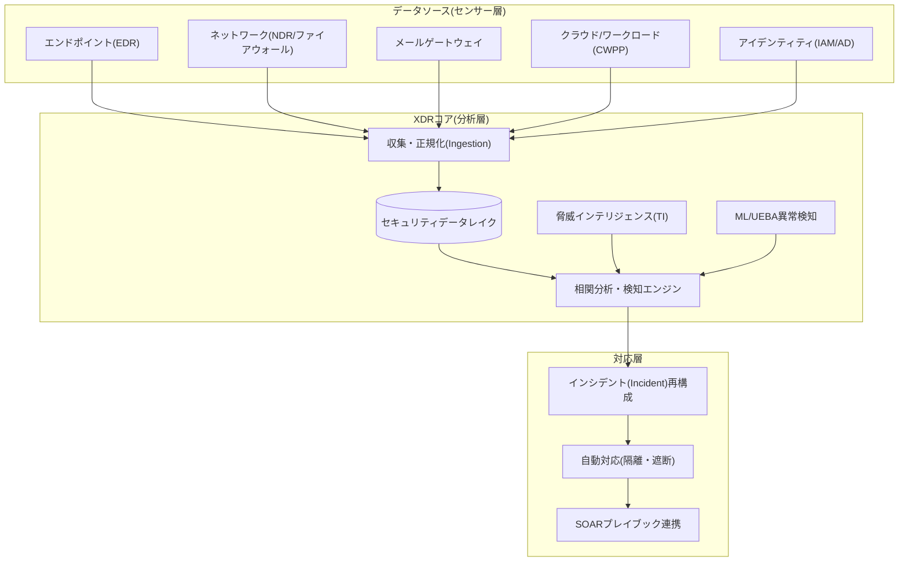
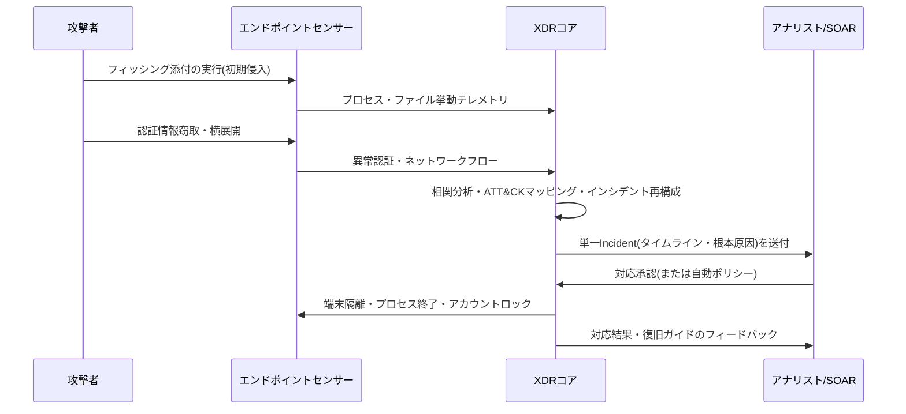

# 拡張検知・対応(XDR, eXtended Detection and Response)

## 1. 概要

> **定義**: XDR(eXtended Detection and Response)とは、エンドポイント(EDR)・ネットワーク(NDR)・メール・クラウド・サーバー・アイデンティティなど異種のセキュリティドメインで発生するテレメトリ(Telemetry)を単一プラットフォームで収集・正規化・相関分析し、個別のアラートを一つの攻撃ストーリー(Incident)へ自動的に再構成して対応まで連携させる、統合型の脅威検知・対応体系である。

XDRが登場した背景は、「アラートの洪水(Alert Fatigue)」と「サイロ(Silo)化された検知」という二つの実務上の苦痛に端を発する。従来のセキュリティ運用では、EDRは端末のみ、ファイアウォール・IPSはネットワークのみ、メールゲートウェイはメールのみをそれぞれ独立に検知し、それらのアラートをSIEMに集めて人が目で突き合わせる構造であった。しかし今日の攻撃は、フィッシングメールで侵入し(メール)、端末でマルウェアを実行し(エンドポイント)、アカウントを奪取して(アイデンティティ)内部ネットワークを横展開した後(ネットワーク)、クラウドストレージのデータを外部へ持ち出す(クラウド)というように、**複数のドメインを横断する。** 各ドメインのアラートを個別に見ればいずれも「中リスク」程度のノイズにすぎないが、時系列でつなぎ合わせると明白な侵害シナリオとなる。この「つなぎ合わせ」を人手で行うには1日数万件のアラートが押し寄せるため、相関分析と再構成をプラットフォームが自動で実行するようにしたのがXDRの本質である。

XDRの本質的な特徴は次の四つに要約される。第一に、**クロスドメイン統合(Cross-domain)** — エンドポイント・ネットワーク・クラウド・アイデンティティを一つの分析平面で扱う。第二に、**アラートのインシデント化(Correlation)** — 個々のアラートではなく、因果関係で束ねられたインシデント単位で結果を提示する。第三に、**検知‐対応のクローズドループ(Closed-loop)** — 検知から封じ込めまでが一つのプラットフォーム内でつながる。第四に、**自動化・知能化(AI-driven)** — ML・UEBA・生成AIによってアナリストの判断を増強する。これら四つの特徴は個別ツールの総和ではなく、「運用フローの統合」というXDRのアイデンティティを共に規定している。

もう一つの背景は、セキュリティ人材の不足と平均検知・対応時間(MTTD/MTTR)への圧力である。侵害が発生してからそれを認知し封じ込めるまでの時間が長いほど被害は指数関数的に拡大するため、組織はアラートの「数」ではなく「結論の出たインシデント(Incident)」の形でアナリストに届けられ、さらに封じ込めまで自動連携される運用モデルを求めるようになった。特に多くの組織で侵害が数週間から数カ月間検知されないまま潜伏(Dwell Time)している現実は、単一ドメイン視点の検知だけでは巧妙な攻撃を見逃すことの証左であった。

XDRは、SIEMの広範なログ収集・コンプライアンス機能と、EDRの深い端末可視性・対応能力という長所を組み合わせつつ、「検知‐調査‐対応」という運用フローそのものを一つの製品体験として統合する点で差別化される。すなわちXDRは新たな検知アルゴリズムを一つ追加したものではなく、分散していたセキュリティ運用のデータ・分析・対応を垂直統合し、SOCの運用モデルそのものを再設計しようとするアプローチとして理解すべきである。

## 2. XDRの全体構造と構成要素

XDRは、多様なセキュリティセンサーからデータを取り込み、一つの分析層で統合処理し、その結果を対応層へ流す階層型アーキテクチャを持つ。以下の概念図は、データソースから対応までの全体構造を示す。

この構造においてデータは下から上へ(センサー → コア → 対応)流れるが、脅威インテリジェンスと対応結果は再び下へフィードバックされ、検知ルールを継続的に精緻化する。各層を具体的に見ると次のとおりである。

**A. センサー(データソース)層。** XDRの検知品質は、根本的に「どれだけ広く深いテレメトリを確保できるか」にかかっている。エンドポイントセンサーはプロセス生成・ファイル変更・レジストリ・API呼び出しといった低レベルの挙動を、ネットワークセンサーはセッション・プロトコル・DNSクエリのフローを、アイデンティティソースはログイン・権限昇格・異常な認証を提供する。ここで重要な原理は、**各ドメインのデータが互いの文脈を補完する**という点である。例えば、端末で正体不明のプロセスが外部と通信する際、その宛先が脅威インテリジェンス上のC2(コマンド&コントロール)サーバーであるというネットワーク・TI情報が結合されると、単独では曖昧だったアラートが確定的な侵害へと格上げされる。

**B. 収集・正規化とセキュリティデータレイク。** 異種ソースのログはフィールド名・時刻形式・重大度の尺度がまちまちであるため、共通スキーマ(例: OCSF, Open Cybersecurity Schema Framework)に正規化して初めて相関分析が可能になる。例えば、あるソースは送信元アドレスを `src_ip`、別のソースは `source.address` と表記するが、正規化なしでは「同一IPが複数ドメインにまたがって活動した」という事実自体を機械が認識できない。正規化されたデータは大容量のセキュリティデータレイクに格納され、リアルタイムのストリーミング分析と事後の脅威ハンティング(過去データの遡及照会)の双方に活用される。データの保存期間・コスト・クエリ性能はトレードオフの関係にあるため、直近30~90日のデータは高速ストレージ(Hot)、それ以前のデータは低コストストレージ(Cold)に階層化し、侵害調査に必要な最低保存期間(通常6カ月~1年)をコンプライアンス要件と合わせて設計するのが一般的である。

また、収集は単なる転送ではなく「何を送るか」を選別する段階でもある。すべての生ログを無差別に転送すれば保存・クエリコストが急増するため、検知に寄与するセキュリティ関連イベントを優先的に収集し、低価値ログは要約・サンプリング(sampling)するデータパイプラインの最適化が実務上の中核課題となる。

**C. 相関分析・検知エンジン。** XDRの心臓部であり、ルールベース検知と振る舞い・統計ベース検知を組み合わせる。ルールベースはMITRE ATT&CKの戦術・技術マッピングを通じて「権限昇格 → 認証情報アクセス → 横展開」のような攻撃段階の因果連鎖を検知し、UEBA(ユーザー・エンティティ行動分析)とML異常検知は平常時のベースライン(Baseline)から逸脱した挙動を捉える。両方式は相互補完的であり、ルールは既知の技術に強いが新種・亜種に弱く、MLは未知の異常を捉えるが誤検知(False Positive)が多い。そのため実務では、MLスコアをルールのリスク重み付けに活用するハイブリッドスコアリングを用いる。

相関分析の差別化要素は「時間・エンティティ・技術の3軸結合」にある。単純なSIEMルールが「条件Aならアラート」という単発の条件マッチングにとどまるのに対し、XDRは同一エンティティ(端末・アカウント・IP)を軸に、時間窓(例: 30分)内で複数ドメインのイベントがATT&CKの連鎖を形成しているかを見る。例えば「同一アカウントが通常外の時間帯に新しい地域からログイン → 5分以内に管理者グループへ追加 → リモート実行」と続けば、個々は低リスクでも結合リスクが閾値を超えてインシデントへと格上げされる。この結合ロジックこそが、誤検知を減らすと同時に巧妙な多段階攻撃の検知率を引き上げる中核メカニズムである。

**D. インシデント再構成と対応層。** 相関分析の結果、関連するアラートは一つのインシデント(Incident)として束ねられ、タイムライン・影響資産・攻撃技術とともにアナリストに提示される。インシデント再構成の原理は、単純なグルーピングを超えた「因果グラフ(Causal Graph)」の構成にある。すなわち、どのプロセスがどのファイルを作成し、どのアカウントでどこへ接続したかをノード‐エッジでつなぎ、攻撃の展開図を作成する。このグラフの根が根本原因(最初の侵入点)となる。その後、端末隔離、アカウントロック、IP遮断といった対応はXDR自体の機能で即時実行するか、より複雑な多段階措置(ファイアウォールポリシー変更、チケット発行、関係部署への通知など)はSOARプレイブックに委任する。対応の自動化レベルは、組織の成熟度に応じて半自動(推奨提示)から完全自動(ポリシーベースの即時措置)へと段階的に拡大するのが安全である。

## 3. 検知・対応プロセス(運用フロー)

XDRの価値は、「アラートをどれだけうまく一つの結論に収束させ、どれだけ迅速に封じ込めるか」から生まれる。以下は侵入から対応・復旧までの処理フローである。

運用フローは通常、**検知(Detect) → 分類・優先順位付け(Triage) → 調査(Investigate) → 封じ込め・対応(Respond) → 復旧・改善(Recover)**の循環として整理される。検知段階で個別アラートが発生すると、XDRはそれを即座に人へ投げるのではなく、関連アラートをグルーピングしてリスク度を算定する。この過程で1日数万件の生アラートが数十件のインシデントに圧縮される。実際のベンダー事例では、アラート対インシデントの比率が数十~数百対1まで減少すると報告されており、これはアナリストの認知負荷を劇的に下げる。

調査段階でアナリストは、インシデントに添付されたタイムラインと根本原因(Root Cause)分析を通じて、「何が最初の侵入点で、どこまで拡散したか」を迅速に把握する。ここでのXDRの強みは**クロスドメインのピボット(pivot)**である。一つのインシデント画面で端末 → アカウント → ネットワーク宛先へと即座に移動しながら調査できるため、以前のように複数のコンソールを行き来するコンテキストスイッチのコストがなくなる。対応段階ではリスク度に応じて段階的に措置を講じ、明白な悪性は自動隔離し、曖昧な場合はアナリストの承認後に措置する「ヒューマン・イン・ザ・ループ(Human-in-the-loop)」ポリシーが推奨される。

**具体事例 — ランサムウェア展開の早期遮断。** ある製造企業のSOCを想定する。財務部門の従業員が偽装請求書メールを開いてマクロが実行されると(初期侵入)、エンドポイントセンサーはOfficeプロセスがPowerShellを生成するという異常な親子関係を捕捉する。単独ではよくある低リスクのアラートである。しかし数分後、同じ端末からドメイン管理者アカウントへの異例の認証(アイデンティティ)が発生し、続いて内部ファイルサーバーへの大量のSMB接続(ネットワーク)が起こる。三つのドメインのアラートがバラバラに上がれば、Tier 1アナリストは優先順位を下げていたであろう。XDRはこの三つのシグナルをATT&CKの「初期侵入 → 認証情報アクセス → 横展開」の連鎖として自動的に結び付けて一つの高リスクインシデントに格上げし、ファイルの大量暗号化が始まる前に当該端末を自動隔離し、奪取されたアカウントをロックする。このように、個別には埋もれていたはずの弱いシグナルの結合こそが早期遮断の鍵であり、これが単一ドメインのEDRや事後ログ分析型のSIEMに対してXDRが持つ実質的な差別化要素である。

対応ポリシーはリスク等級に応じて階層化することが望ましい。例えば、リスク度90点以上の確定的侵害は無人の自動隔離、60~90点の疑わしいインシデントはアナリスト承認後に隔離、60点未満は観察・モニタリングにとどめるという3段階のゲートを設ければ、自動化のスピードと誤作動時の業務停止リスクを同時に管理できる。

復旧・改善段階はしばしば見過ごされるが、運用成熟度の尺度である。インシデント終結後は、同種の攻撃が再現されないよう検知ルールを補強し、見逃し(見落としたシグナル)・誤検知(不要なアラート)の原因を事後分析(Post-mortem)して相関ルールとベースラインにフィードバックする。この際、主要指標として平均検知時間(MTTD)と平均対応時間(MTTR)を継続的に追跡するが、XDRを導入した組織は手作業のSIEM運用に比べてMTTD・MTTRを有意に短縮したと報告されている。ただし改善なき放置はルールの陳腐化につながり、時間が経つほど検知力が低下するため、脅威インテリジェンスの更新とルールの再点検を定例化しなければならない。

## 4. 類型比較 — Native XDR vs Open(Hybrid) XDR

XDRは、データソースをどのように確保するかによって大きく二つの類型に分かれる。この区分は単なる製品分類ではなく、組織の既存セキュリティ投資・ロックイン(Lock-in)・統合難易度に直結する戦略的選択である。

| 区分 | Native XDR | Open(Hybrid) XDR |
|------|-----------|------------------|
| データソース | 同一ベンダー製品群が中心 | 異種サードパーティを含む |
| 統合の深さ | 深く即時に動作(事前チューニング) | コネクタ開発・正規化が必要 |
| 長所 | 迅速な導入・高い相関精度 | 既存投資の保護・柔軟性 |
| 短所 | ベンダーロックイン(Lock-in) | 統合が複雑・品質のばらつき |
| 適合組織 | 新規・単一ベンダー志向 | 既に多様なツールを保有 |

Native XDRは一つのベンダーがEDR・NDR・メール・クラウドのセンサーをすべて提供するため、フィールドマッピングと相関ルールが事前に最適化されており、導入直後から高い検知精度を発揮する。一方、既に他ベンダーのファイアウォール・EDRに相当な投資をしている組織にとっては、既存資産を手放させるロックインが負担となる。Open XDRは異種ツールのデータをコネクタで受け入れて既存投資を保護するが、ソースごとにログ品質・フィールド整合性が異なるため正規化とチューニングの負担が大きく、相関精度がソース品質に左右される。したがって「完全新規構築の組織はNative、多ツール保有組織はOpen」というのが一般的な実務指針であり、最近では標準スキーマ(OCSF)を採用して両方式の境界を低くしようとする流れが強い。

両類型の選択は、組織の成熟度曲線とも連動する。セキュリティ組織の初期段階では即効性の高いNative XDRで迅速に基礎を固め、組織が成長して多様なツールを導入した後はOpen XDR・標準スキーマで柔軟性を確保するという進化経路が現実的である。いずれの場合も「検知カバレッジの広さ(ドメイン数)」と「各ドメインの検知の深さ」を共に確保することが鍵であり、広いだけで浅ければ真の脅威を見逃し、深いだけで狭ければクロスドメイン攻撃を見逃す。

また、XDRは隣接概念とよく混同されるため、境界を明確にする必要がある。SIEMは広範なログ収集とコンプライアンス報告に強いが、対応連携が弱くチューニング負担が大きい。SOARは対応自動化(プレイブック)に特化しているが、検知そのものは行わない。EDRは端末ドメインに限定された深い検知・対応である。XDRはこれらを置き換えるというより、**検知の範囲を複数ドメインへ広げ(EDRの拡張)、検知‐対応を一つのフローに束ねる(SIEM+SOARの運用統合)**点で位置付けが異なる。実際、成熟したSOCはSIEM(長期ログ・コンプライアンス)+XDR(リアルタイムのクロスドメイン検知・対応)+SOAR(広範なオーケストレーション)を相互補完的に運用する場合が多い。

## 5. 深化 — 最新動向と実務適用

**A. AI・生成AIとの結合。** 最近のXDRプラットフォームは、生成AIベースの「セキュリティコパイロット(Copilot)」を搭載し、複雑なインシデントの自然言語要約・調査クエリ・対応推奨を提供する方向へ進化している。アナリストが「このインシデントの最初の侵入経路と影響を受けたアカウントを教えて」と自然言語で尋ねると、タイムラインと次の措置を提案するといった形である。これは初級アナリスト(Tier 1)の参入障壁を下げ調査速度を高めるが、LLMのハルシネーション(Hallucination)と誤判断のリスクがあるため、最終的な封じ込めの決定には依然として人による検証が必要というのが実務上のコンセンサスである。

**B. SASE/SSE・クラウドへの拡張。** 在宅勤務・クラウドの普及により保護対象がデータセンターの外へ移るにつれ、XDRはSASE(Secure Access Service Edge)・SSEのテレメトリと結合し、ユーザーがどこにいても同一の検知・対応を適用する方向へ拡大している。クラウドワークロード保護(CWPP)・クラウドセキュリティ態勢管理(CSPM)のシグナルをXDRに取り込む統合も活発である。境界が消えた環境では「ネットワーク上の位置」ではなく「アイデンティティ・振る舞い」が新たな制御点となるため、XDRの検知においてアイデンティティドメインのテレメトリが占める比重はますます大きくなっている。

**C. MDRとしてのサービス型消費。** 自前のSOCを整備しにくい中堅・中小組織は、XDR技術をマネージド検知・対応(MDR, Managed Detection and Response)サービスとして委託消費する傾向にある。すなわちXDRを「製品」ではなく、24時間365日の専門運用が結合した「サービス」として購入するもので、人材不足の問題を回避する現実的な解決策として定着しつつある。ただしサービス委託時にも、データ主権・ログの保管場所・対応権限の範囲(委託先がどこまで自動隔離できるか)を契約とSLAで明確に規定してこそ、責任所在をめぐる紛争を予防できる。

一方、XDRは脅威ハンティング(Threat Hunting)の基盤プラットフォームとしても活用される。受動的にアラートを待つことを超え、アナリストが「このような技術が当社環境に既に潜伏していないか」という仮説を立て、データレイクを遡及照会して未検知の侵害を能動的に発見する活動であり、成熟したSOCほどこの能動的防御能力の比重が高まる。

**D. 標準化(OCSF)と相互運用性。** ベンダーロックインと統合負担を下げるため、オープンなセキュリティスキーマ(OCSF)の採用が広がっており、これはOpen XDRの統合品質を引き上げ、データレイクの再利用性を高める基盤となる。

**E. 導入手順(実務視点)。** XDRの導入は「製品のインストール」ではなく運用体系の転換であるため、段階的なアプローチが求められる。通常、① 資産・データソースのインベントリ作成とカバレッジギャップの特定 → ② 優先ドメイン(エンドポイント・アイデンティティから)のセンサー連携とスキーマ正規化 → ③ ベースライン学習と相関ルールのチューニング(3~6カ月) → ④ 対応プレイブックの定義と段階的な自動化拡大 → ⑤ 脅威ハンティング・指標(MTTD/MTTR)に基づく継続的改善、という順序を踏む。初期にすべてのドメインを一度に連携しようとして正規化負担と誤検知の急増で失敗する事例が多いため、価値の高いドメインから漸進的に拡大する戦略が安全である。

予想される出題方向としては、「XDRとSIEM/SOAR/EDRの比較」、「XDR導入時のデータ正規化・プライバシーの考慮事項」、「ゼロトラストとXDRの連携」が有力であり、答案構成時には概念図 → 類型・比較 → 導入手順 → 技術士視点の考慮事項という流れで展開すれば、論理的な完結性を確保できる。

## 6. 考慮事項と示唆(技術士の視点)

**第一に、データ品質と正規化が成否を左右する。** XDRの相関分析は入力データの整合性に全面的に依存するため、「ゴミを入れればゴミが出る(GIGO)」という原理がそのまま当てはまる。導入初期からログソースのカバレッジ(どのドメインが欠けているか)と時刻同期(NTP)、共通スキーマへのマッピングを確保しなければならず、カバレッジのギャップはそのまま検知の死角となる。標準スキーマ(OCSF)の採用によって、将来のソース交換・拡張時のコストを下げる戦略が望ましい。

**第二に、誤検知・見逃しのトレードオフを組織のリスクに合わせてチューニングすべきである。** 検知感度を上げれば見逃しは減るが誤検知が増えてアナリストの疲弊が大きくなり、下げればその逆となる。資産の重要度(クラウンジュエル, Crown Jewels)に応じて差別化したポリシーを適用し、初期3~6カ月の学習・ベースライン確立期間(Baselining)を設けて段階的に精度を引き上げる、運用成熟度の観点が必要である。

**第三に、ベンダーロックインと統合の柔軟性との戦略的バランスが求められる。** Native XDRの即効性とOpen XDRの柔軟性は相反するため、組織の既存投資・今後のクラウド戦略・人材能力を総合して選択しなければならない。単一ベンダーへのロックインのリスクを下げるには、標準インターフェース・データポータビリティ(export)を導入契約の段階で要件として明記することが実務上有効である。

**第四に、プライバシー・コンプライアンスとの調和が不可欠である。** XDRはユーザー行動・認証・ネットワークフローなどの機微情報を広範に収集するため、個人情報保護法上の最小収集・目的制限の原則、ログ保存期間、アクセス制御・監査証跡を設計段階で反映しなければならない。UEBAの行動プロファイリングは従業員監視をめぐる議論を招き得るため、事前告知・目的限定など手続的正当性を確保する必要がある。

**第五に、ゼロトラスト・自動化の拡張軸として連携させるべきである。** XDRは「継続的検証・最小権限」を志向するゼロトラストアーキテクチャの検知・対応の実行エンジンとして機能し得るものであり、SOAR・IAM・SASEと結合すればリアルタイムの信頼再評価(ログイン異常時の即時セッション遮断)が可能になる。ただし自動対応の範囲は誤作動時に業務停止リスクがあるため、影響度の大きい措置には段階的な承認ゲートを設けるのが安全である。

**第六に、組織・プロセスの成熟度が技術導入に先行しなければならない。** XDRは強力なツールであるが、これを運用する分析人材・プレイブック・エスカレーション体制が整っていなければ「高価なアラート発生器」に成り下がる。自前でのSOC運用が難しい場合はMDR(マネージド検知・対応)サービスで専門運用を組み合わせるソーシング戦略を併せて検討すべきであり、導入成果はツールの機能ではなく、MTTD・MTTRの短縮、インシデント処理量、誤検知率といった運用指標で測定・管理することが、技術士の視点からのバランスの取れたアプローチである。

## 参考資料
- MITRE ATT&CK, https://attack.mitre.org/
- Open Cybersecurity Schema Framework(OCSF), https://schema.ocsf.io/
- Gartner, "Market Guide for Extended Detection and Response", https://www.gartner.com/

---
> **一言まとめ**: XDRは、エンドポイント・ネットワーク・メール・クラウド・アイデンティティのテレメトリを単一プラットフォームで正規化・相関分析し、散在するアラートを一つの攻撃ストーリーに再構成して検知‐調査‐対応を一つのフローとして自動化する統合型脅威対応体系であり、データ品質・誤検知チューニング・ベンダーロックイン・プライバシー・ゼロトラスト連携が導入の主要な考慮事項である。
