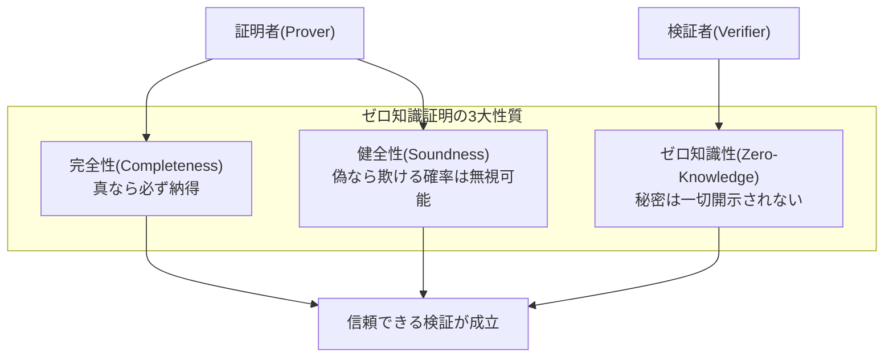
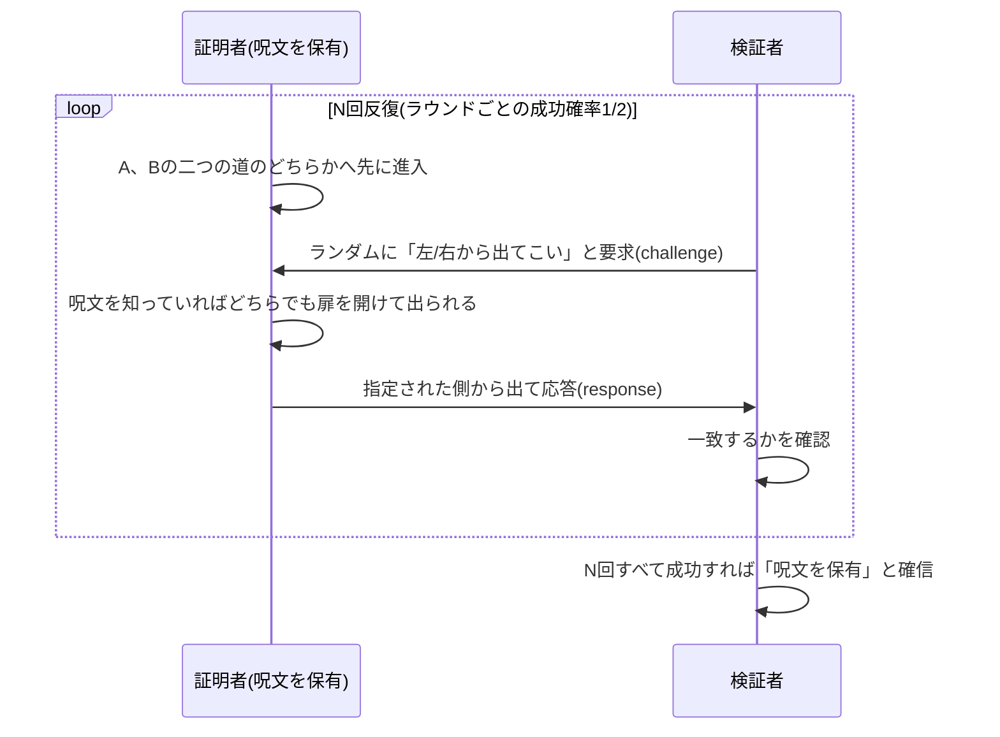

# ゼロ知識証明(Zero-Knowledge Proof, ZKP)

## 1. 概要

> **ゼロ知識証明(Zero-Knowledge Proof)**とは、証明者(Prover)が検証者(Verifier)に対し、ある命題(秘密の知識を保有している事実)が**真であることを確信させつつ、その秘密自体についてはいかなる情報も開示しない**暗号プロトコルである。1985年にゴールドワッサー(Goldwasser)・ミカリ(Micali)・ラコフ(Rackoff)が対話型証明システムを定義する中で初めて定式化した。

従来の認証・検証は、「秘密を見せることで秘密を知っていることを証明する」構造であった。パスワードをサーバーへ送信しなければログインできず、残高を公開しなければ支払能力を立証できなかった。しかしこの方式は、**証明の過程そのものが情報漏えいの経路**になるという根本的な限界を持つ。サーバーが侵害されれば送信・保存された秘密がそのまま窃取され、本人確認のために住民登録番号・生年月日といった過剰な個人情報を毎回渡さなければならない。データ最小収集の原則(Privacy by Design)と真っ向から衝突するのである。

ゼロ知識証明は「**知っているという事実**」と「**知っている内容**」を分離する。すなわち秘密(例: パスワード、年齢、残高、身元)を明かすことなく、「私はその秘密を知っている」あるいは「その命題は真である」という事実のみを数学的に確信させる。準同型暗号が「暗号文のままの演算」で、秘密計算(MPC)が「分散された秘密分散」でプライバシーを守るとすれば、ZKPは「**検証可能な無知**」という独特の位置からこれらと相互補完する。近年、ブロックチェーンのスケーラビリティ(zk-Rollup)と自己主権型アイデンティティ(SSI, DID)の中核インフラとして浮上し、実務上の重要性が急速に高まっている。

## 2. 成立条件と対話構造

ゼロ知識証明が成立するには、三つの性質が同時に満たされなければならない。これら三条件はそれぞれ異なる当事者(正直な検証者、正直な証明者、不正直な証明者、不正直な検証者)を防御するよう設計されており、一つでも欠ければプロトコルは無力化される。

第一に、**完全性(Completeness)**とは、命題が実際に真であり双方が正直にプロトコルに従えば、検証者が必ず納得するという性質である。第二に、**健全性(Soundness)**とは、命題が偽であれば、不正直な証明者がいくら欺こうとしても検証者を納得させる確率が無視できる水準(negligible)にとどまるという性質である。第三に、**ゼロ知識性(Zero-Knowledge)**とは、検証者が証明の過程で「命題が真である」という事実以外には秘密について何も学習できないという性質であり、これは検証者が見たすべてのメッセージを秘密なしで自ら再現(シミュレーション)できることを示すことで証明される。検証者はいかなる付加情報も得ていないのだから漏えいはない、という論理である。

古典的なZKPは、検証者がランダムな質問(challenge)を投げ、証明者が応答する**対話型(Interactive)**の構造を持つ。検証者が予測不能な質問を繰り返し投げ、証明者が毎回正しく答えれば、偶然正解する確率はラウンドごとに半分ずつ減少し、数十ラウンド後には事実上0に収束する。この「ランダムなチャレンジ‐レスポンスの反復」が健全性を統計的に保証する中核的な仕組みである。

## 3. 動作原理 — チャレンジ‐レスポンス・プロトコル

ゼロ知識証明の直観は、しばしば**「アリババの洞窟(Ali Baba Cave)」**のたとえで説明される。環状の洞窟の奥に秘密の呪文でしか開かない扉があり、証明者は呪文を知っていることを検証者に示したいが、呪文そのものは言いたくない。以下の手順は、このチャレンジ‐レスポンス構造を図式化したものである。

核心は、**秘密(呪文)を知らない詐欺師は運によってしか通過できない**という点である。詐欺師は最初に入った側からしか出られないため、検証者が反対側を指定すれば失敗する。各ラウンドの成功確率は1/2であるから、20ラウンドで詐欺師が通過する確率は約100万分の1まで低下し、健全性が確保される。逆に検証者は「証明者が指定された側から出てきた」という事実を観測するのみで、呪文の内容はまったく知り得ないため、ゼロ知識性が守られる。実際の暗号実装では、この「洞窟」を離散対数・楕円曲線・ハッシュなど**一方向関数の数学的難問**に置き換える。例えばシュノア(Schnorr)プロトコルは、離散対数問題の上で「秘密鍵を知っていること」を秘密鍵を開示せずに証明する。

対話型方式は証明者と検証者がリアルタイムに何度も通信しなければならないため、ブロックチェーンのような非同期・多者間の環境には不向きである。これを解決するのが**フィアット‐シャミア変換(Fiat-Shamir Heuristic)**であり、検証者のランダムなチャレンジを「ハッシュ関数の出力」に置き換えることで対話を除去する。その結果、証明者が一度生成しておけば誰でもいつでも検証できる**非対話型(Non-Interactive)証明**となり、オフライン検証とオンチェーン検証が可能になる。

## 4. 類型比較 — zk-SNARKとzk-STARK

非対話型ZKPを実用化した代表的技術が**zk-SNARK**と**zk-STARK**である。両技術はいずれも大規模な演算の正当性を短い証明に圧縮するという目標は同じであるが、信頼設定の要否・証明サイズ・耐量子性の面で明確なトレードオフが存在する。この違いは「何をより信頼し、何を諦めるか」という設計判断につながる。

zk-SNARK(Succinct Non-interactive ARgument of Knowledge)は証明サイズが数百バイトと非常に小さく検証も高速であるが、最初に共通パラメータを作成する**信頼設定(Trusted Setup)**の過程が必要である。このとき生成される秘密値(toxic waste)が破棄されずに漏えいすると偽の証明を偽造できるため、この設定を複数の参加者が分散実行する方式(MPCセレモニー)でリスクを緩和する。一方、zk-STARK(Scalable Transparent ARgument of Knowledge)はハッシュベースであるため信頼設定が不要(Transparent)であり、量子コンピュータによる攻撃にも耐える耐量子性を持つが、証明サイズが数十~数百KBと大きく、オンチェーンの保存コストが高い。

| 区分 | zk-SNARK | zk-STARK |
|------|----------|----------|
| 信頼設定 | 必要(Trusted Setup) | 不要(Transparent) |
| 証明サイズ | 非常に小さい(~数百B) | 大きい(~数十KB) |
| 検証速度 | 非常に速い | 相対的に遅い |
| 耐量子性 | 脆弱(楕円曲線ベース) | 強い(ハッシュベース) |
| 代表的活用 | Zcash, zkSync | StarkNet |

実務上の選択は状況に左右される。証明をブロックチェーンに頻繁に載せるためガス代(保存コスト)が重要なサービスでは証明の小さいSNARKが有利であり、信頼設定のリスクを根本から排除し、長期的な量子の脅威にまで備えたいサービスにはSTARKが適している。最近では、信頼設定をプログラムごとに繰り返さない汎用設定(PLONKなど)の手法が登場し、SNARKの運用負担を下げている。

## 5. 活用事例と産業適用

ゼロ知識証明の産業的な波及力が最も顕著な領域は**ブロックチェーンのスケーラビリティ**である。イーサリアムの**zk-Rollup**は、数千件の取引をオフチェーンで処理した後、「これらの取引はすべて規則どおりに実行された」という事実をただ一つのゼロ知識証明に圧縮してメインチェーンに提出する。メインチェーンは個々の取引を再実行せず証明を検証するだけでよいため、処理量(TPS)が数十倍に向上し、手数料が大幅に削減される。Optimistic Rollupが「紛争時の再検証」に依存するのとは異なり、zk-Rollupは**数学的証明によって即時に確定**するため、出金遅延がないという実務上の利点がある。

第二の軸は**プライバシー保護型の身元証明**である。自己主権型アイデンティティ(SSI)・分散型ID(DID)の体系において、ZKPは「選択的開示(Selective Disclosure)」を実現する。例えば酒類を購入する際、身分証全体(生年月日・住所・住民番号)を見せる代わりに、「私は満19歳以上である」という命題のみが真であることを証明(Range Proof)できる。実際の年齢・生年月日はまったく開示されないため、データ最小収集・目的制限の原則を技術的に強制する。金融業界のマネーロンダリング対策(AML)においても、「制裁対象リストに載っていない」ことを顧客の身元を開示せずに証明する方式で応用が広がっている。

第三は**匿名暗号資産**であり、Zcashはzk-SNARKを利用して送金者・受取人・金額をすべて秘匿したまま、「二重支払いがなく残高が十分である」という事実のみを証明して取引を成立させる。このほか、検証可能な計算(Verifiable Computation)によってクラウドに委託した計算が正直に実行されたことを検証するなど、信頼できない環境における完全性保証の手段として活用範囲が広がっている。

## 6. 考慮事項と示唆

技術士の視点から、ゼロ知識証明の導入にあたっては次の事項を総合的に考慮しなければならない。

第一に、**性能・コストのトレードオフの定量評価**が必要である。ZKPはプライバシーと検証可能性を得る代償として、証明生成に相当な計算資源と時間を消費する。特にSNARK/STARKの証明生成は検証より数百~数千倍重いため、リアルタイム性が重要なサービスでは、ハードウェアアクセラレーション(GPU・専用ASIC)や証明委任(proving service)アーキテクチャを併せて検討すべきである。「検証は安く証明は高い」という非対称構造を設計初期に反映することが核心である。

第二に、**信頼設定と暗号アジリティ(Crypto-Agility)の確保**が求められる。SNARK系は信頼設定のtoxic waste管理が単一障害点となり得るため多者間セレモニーでリスクを分散し、楕円曲線ベースの方式は量子コンピューティング時代に備えてSTARK・PQCへの移行可能性をアーキテクチャに残しておかなければならない。特定の曲線・ライブラリに依存しない抽象化レイヤーの設計が長期的な安定性を左右する。

第三に、**個人情報保護規制との整合性**を積極的に活用すべきである。ZKPの選択的開示は、個人情報保護法の最小収集・目的制限の原則とGDPRのデータ最小化(Data Minimization)を技術で実現する強力な手段である。ただし証明そのものが個人を再識別する手がかりとならないよう、匿名性・連結不可能性(unlinkability)まで併せて設計する必要があり、規制当局に対する監査追跡性とプライバシーのバランスを確保しなければならない。

第四に、**標準化動向と相互運用性の確保**が重要である。ZKProof標準化イニシアチブ、W3Cの検証可能な資格情報(VC)・DID標準との連携を通じて特定ベンダーに依存しない相互運用の基盤を整え、検証回路(circuit)の正確性監査・形式検証によって、実装上の欠陥による健全性の毀損を予防すべきである。

第五に、**適用優先順位の判断**が必要である。ZKPは万能ではなく、単純なアクセス制御には過剰設計となり得る。「検証者と証明者の間に信頼がなく、秘密を開示せずに事実のみを確認すべき」状況(オンチェーン拡張、プライバシー保護型の身元確認、匿名投票など)に選別的に適用し、それ以外は既存の認証・暗号技術と組み合わせるハイブリッド戦略が合理的である。

## 参考資料

- Goldwasser, Micali, Rackoff, "The Knowledge Complexity of Interactive Proof-Systems", 1985/1989
- Ethereum Foundation, "Zero-Knowledge Rollups", https://ethereum.org/en/developers/docs/scaling/zk-rollups/
- ZKProof Standards, https://zkproof.org/
- StarkWare, "STARK vs SNARK", https://starkware.co/stark/

---

> **一言まとめ**: ゼロ知識証明は、秘密を明かすことなく「その秘密を知っている/命題が真である」という事実のみを数学的に確信させる暗号プロトコルであり、完全性・健全性・ゼロ知識性を満たし、zk-SNARK・zk-STARKとして実用化され、ブロックチェーンの拡張(zk-Rollup)とプライバシー保護型の身元証明(選択的開示)の中核インフラとして定着しつつある。
