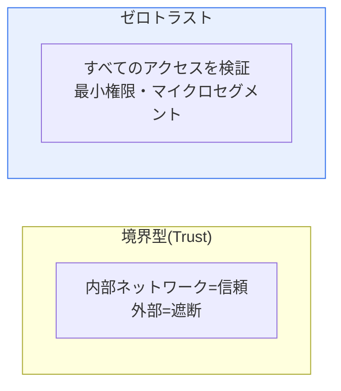
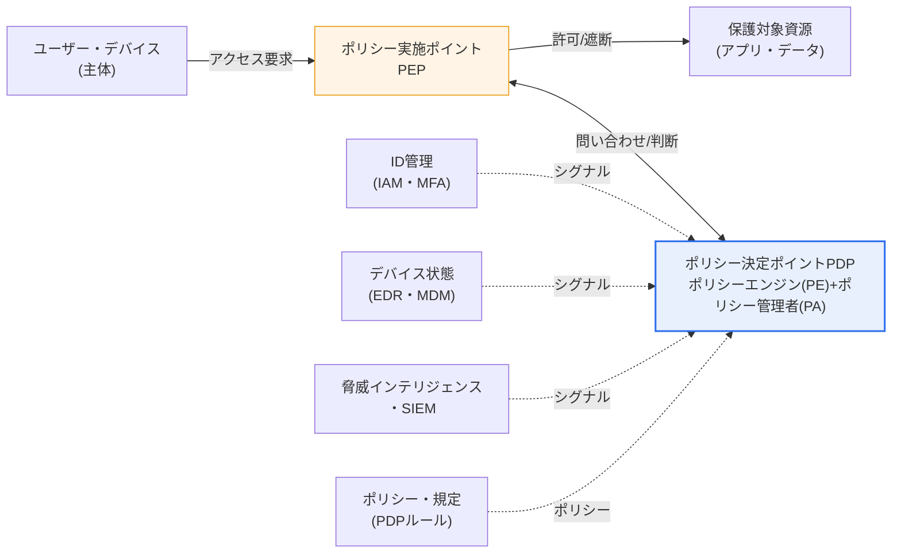

# ゼロトラストセキュリティ(Zero Trust Security)モデル

## 1. 概要

### A. 定義

> 「**決して信頼せず、常に検証せよ(Never Trust, Always Verify)**」という原則の下、内部・外部を問わずすべてのアクセス要求を毎回認証・認可するセキュリティモデル。デフォルトの信頼値を「0」に置くことが名称の由来であり、信頼は「位置」ではなく「検証されたアイデンティティとコンテキスト」からのみ導かれる。

ゼロトラストは特定の製品やソリューションの名称ではなく、アクセス制御を設計する**パラダイムでありセキュリティ哲学**である。2010年にフォレスター(Forrester)のジョン・キンダーバグ(John Kindervag)が「信頼は脆弱性である(Trust is a vulnerability)」という問題意識から概念を確立し、その後GoogleによるBeyondCorpプロジェクトという社内実装事例を通じて大規模企業環境で実証された。すなわちゼロトラストは学術的な理想論ではなく、既にグローバル企業が自社ネットワークからVPNによる境界防御を取り払い、検証可能な形で運用してきた実戦的モデルである。

### B. 登場背景 — 境界型セキュリティの崩壊

ゼロトラストが登場した背景は、従来の**境界型(Perimeter)セキュリティの崩壊**である。かつてのセキュリティは城壁のようにファイアウォールで境界を築き、「**内部ネットワークは安全である**」と仮定していた。城門(ファイアウォール)さえ通過すれば、内部は自由に移動できた。このモデルはしばしば「M&Mチョコレート」にたとえられる。外側(境界)は硬いが中身(内部ネットワーク)は柔らかく、一度殻が割れれば内部が丸ごと露出するという意味である。

しかし三つの構造的変化がこの前提を崩した。第一に、**クラウド・SaaSへの移行**によって、保護すべき資源がもはや社内データセンターの中だけに存在しなくなった。第二に、**リモートワーク・モバイル・BYOD**の普及によってユーザーと端末が境界の外のあらゆる場所に散在し、「内部/外部」を物理的に区分する線そのものが消えた。第三に、**協力会社・サプライチェーン・内部者の脅威**が増加し、「内部にいる存在は善である」という仮定が統計的にも崩れた。実際、大規模な侵害事故の相当数は、一度侵入した攻撃者が内部を自由に移動する**ラテラルムーブメント(Lateral Movement)**によって被害を拡大させている。

ゼロトラストは、この「内部は安全である」という前提を廃棄する。内部にいようと外部にいようと、すべてのアクセスをその都度検証する。城壁をなくす代わりに、すべての部屋の前に本人確認デスクを置くようなものである。

### C. 必要性

資源とユーザーがあらゆる場所に散在する環境では、「どこにいるか(位置)」はもはや信頼の根拠となり得ない。信頼の基準は**位置(Network Location)からアイデンティティ(Identity)とコンテキスト(Context)へ**移行しなければならず、ゼロトラストがこの転換を実現する。米国は2021年の大統領令(EO 14028)と2022年のOMB M-22-09指針によって連邦機関にゼロトラストへの移行を義務付け、韓国でも科学技術情報通信部・KISAが**「ゼロトラスト・ガイドライン1.0(2023)・2.0(2024)」**を発刊し、公共・民間への普及を牽引している。これは、ゼロトラストが選択肢ではなく規制・政策レベルの潮流になったことを示している。

## 2. 境界型(Trust)モデルとの比較

両モデルの決定的な違いは、侵害が発生した際の**被害範囲(Blast Radius)**である。境界型は最初の境界通過時に一度だけ検証するため、内部に侵入されると攻撃者が無防備にラテラルムーブメントを行い、被害は手の付けられないほど拡大する。ファイアウォール・VPNが「一度通過すれば終わり」という構造だからである。一方ゼロトラストは資源ごとに毎回検証し、きめ細かく隔離するため、一箇所が破られてもその地点に被害が限定される。

この違いが実務上重要な理由は、今日の攻撃の本質が「境界の突破」ではなく「窃取した認証情報による正規のログイン」へと変わったためである。フィッシングでアカウントを奪取した攻撃者はファイアウォールを破る必要もなくVPNに正規ログインし、境界モデルではその瞬間から内部者と区別がつかなくなる。ゼロトラストはログイン後も「この要求は本当に正常か」を継続的に検証するため、窃取した認証情報だけでは資源に到達できないようにする。

| 区分 | 境界型(Trust) | ゼロトラスト |
|---|---|---|
| **前提** | 内部は信頼 | 誰も信頼しない |
| **検証のタイミング** | 最初の1回(境界通過時) | 継続的・要求ごと |
| **信頼の根拠** | ネットワーク上の位置(IP) | アイデンティティ・デバイス・コンテキスト |
| **防御の中心** | 境界(ファイアウォール・VPN) | リソース・アイデンティティ |
| **アクセス方式** | ネットワーク接続後にリソースへアクセス | リソース単位のセッションごとに認可 |
| **侵害時** | ラテラルムーブメントで拡散 | 爆発半径を最小化 |

## 3. 中核原則

ゼロトラストは一般に四つの原則で実装される。各原則は独立して存在するのではなく、前表で見た「検証のタイミング」と「被害範囲」を実際に実現するための相互補完的な仕組みである。

**A. 明示的な検証(Verify Explicitly)。** ユーザー・デバイス・位置・時間・行動パターンなど、可能なあらゆるシグナル(Signal)を総合して要求ごとに認証・認可する。単にID/PWが一度合ったからといって通すのではなく、「このユーザーが普段と異なる地域・時間・デバイスからアクセスしていないか」というコンテキストを併せて評価する。これが適応型認証(Adaptive Authentication)の土台である。

**B. 最小権限(Least Privilege)。** 業務に必要不可欠な最小限のアクセスのみを、それも必要な時間だけ付与する。JIT(Just-In-Time)・JEA(Just-Enough-Access)の概念がこれに該当する。権限を常に開放しておかず要求時点で最小限に発行すれば、認証情報が窃取されても攻撃者が手にできる権限そのものが小さくなる。

**C. 侵害の想定(Assume Breach)。** 既に破られていると前提して防御を設計する。「いつか必ず侵害される」という観点から爆発半径を最小化し、エンドツーエンド暗号化・継続的モニタリング・ログ分析によって侵害を迅速に検知・隔離することに注力する。これは防御の失敗を「例外」ではなく「定数」として扱う姿勢の転換である。

**D. マイクロセグメンテーション(Micro-segmentation)。** ネットワーク・資源を細かく分割し、ある区画の侵害が他の区画へ波及しないよう隔離する。かつての広いVLAN単位の分割を超え、ワークロード・アプリケーション・プロセス単位でポリシーを細分化し、これによってラテラルムーブメントの経路そのものを遮断する。

| 原則 | 中核内容 | 実装技術(例) |
|---|---|---|
| **明示的な検証** | ユーザー・デバイス・コンテキストを毎回認証・認可 | MFA、適応型認証、デバイス信頼度評価 |
| **最小権限** | 必要最小限のアクセスのみ(JIT/JEA) | RBAC/ABAC、PAM、JIT権限発行 |
| **侵害の想定** | 既に破られたと想定し爆発半径を最小化 | エンドツーエンド暗号化、UEBA、SIEM/SOAR |
| **マイクロセグメンテーション** | 資源の細分化でラテラルムーブメントを遮断 | SDP、ワークロードファイアウォール、サービスメッシュ |

これら四つの原則は一本の鎖のように噛み合っている。明示的な検証で「入口の扉」を狭め、最小権限で「入った後に触れられる範囲」を狭め、マイクロセグメンテーションで「横へ広がる経路」を断ち、侵害の想定で「それでも破られたときの観測・対応」を常時化する。どれか一つだけを導入しても片手落ちとなる。例えば、MFA(明示的な検証)だけを適用して権限設計(最小権限)を放置すれば、窃取された正規アカウント一つが依然として広範な資源に到達し得る。ゼロトラストが「製品」ではなく「戦略」と呼ばれる理由はここにある。

## 4. アーキテクチャと構成要素(NIST SP 800-207準拠)

ゼロトラストは一つの製品ではなく複数技術の組み合わせであり、その論理構造は米国国立標準技術研究所の**NIST SP 800-207**が確立した参照アーキテクチャで説明するのが標準的である。このアーキテクチャの心臓部は、**ポリシーエンジン(PE)・ポリシー管理者(PA)で構成されるポリシー決定ポイント(PDP)**と、実際のトラフィックの通り道でアクセスを許可・遮断する**ポリシー実施ポイント(PEP)**の分離である。

動作フローは次のとおりである。主体(ユーザー・デバイス)が資源にアクセスしようとすると、要求は必ず**PEP**を経由する。PEPは自ら判断せず、**PDP**に「この主体がこの資源に今アクセスしてよいか」を問い合わせる。PDPのポリシーエンジンは、IAM・MFAからのアイデンティティシグナル、EDR・MDMからのデバイス状態(パッチ適用・感染の有無)、SIEM・脅威インテリジェンスからのリスクシグナル、そして管理者が定義したポリシールールを**総合的に評価(信頼スコアの算定)**し、許可・遮断・追加認証の要求を決定する。核心は、この判断がセッション全体を通じて継続するという点である。デバイスが途中でマルウェアに感染したり、ユーザーのリスクスコアが上昇したりすれば、進行中のセッションも再評価されて遮断され得る。

主要構成要素を整理すると、**アイデンティティ(IAM・MFA・SSO)**が検証の軸をなし、**PDP/PEP**がポリシーを判断・執行し、**マイクロセグメンテーション・SDP**がネットワークを隔離し、**UEBA・SIEM/SOAR**が異常行動を継続的に監視・自動対応する。ここにデータそのものを保護する**DLP・暗号化**、端末を守る**EDR・MDM**が結合し、全体の統制面を形成する。

## 5. 実装アプローチと適用分野

ゼロトラストを実際に実装するアプローチは、大きく三つの軸に分かれる。**アイデンティティ中心(SIMベース)**のアプローチは強力なIAM・MFA・条件付きアクセスを軸とし、クラウド・SaaS環境で最も広く用いられる。**ネットワーク中心(SDP・マイクロセグメンテーション)**のアプローチは、ソフトウェア定義境界によって資源をユーザーから「見えない(Dark)」状態に隠したうえで、認証された主体にのみ動的に接続を開放する方式である。**SASE(Secure Access Service Edge)**はこの二つをクラウドエッジで統合し、SD-WAN(ネットワーク)とSSE(セキュリティ: SWG・CASB・ZTNA・FWaaS)を一つのサービスとして結合した進化形態である。

適用分野は広い。**リモートワーク・在宅勤務**環境ではVPNをZTNA(Zero Trust Network Access)に置き換えてリソース単位のアクセスを提供し、**マルチクラウド**では散在するワークロード間の通信をセグメント単位で制御し、**協力会社・サプライチェーン**からのアクセスには最小権限の原則を適用してリスクを封じ込める。公共部門では、前述の国内外ガイドラインに従って段階的な移行が進められている。

代表的な実証事例がGoogleの**BeyondCorp**である。Googleは2011年頃から数年をかけて、社内アプリケーションへのアクセスを社内ネットワーク(VPN)にいるかどうかではなく、「検証されたユーザー+管理されたデバイス+アクセスポリシー」に基づいて許可するよう転換した。その結果、全社員が別途VPNなしにインターネット上のどこからでも同一の検証を経て社内資源にアクセスできるようになった。これは「社内ネットワークにいるという事実がすなわち信頼」という前提を、実際の大規模組織で取り払えることを示した転換点となった。その後、NetflixのLISA、Microsoft・Cloudflareなど多くの企業が類似のアイデンティティベースのアクセスアーキテクチャを公開し、ゼロトラストは実務標準として定着した。

VPNとZTNAを比較すると、違いは明確である。VPNは認証に成功するとユーザーを社内の「ネットワーク」に乗せるため、その瞬間ユーザーはネットワークに接続された多数の資源にアクセスできる広い通路を得る。一方ZTNAは、ネットワークではなく「特定のアプリケーション」単位でセッションを開き、認可されていない他の資源はユーザーからまったく見えない(存在すら露出しない)ようにする。この「接続対象の最小化」こそ、ゼロトラストがラテラルムーブメントを根本から遮断する実務上のメカニズムである。

| 区分 | 従来型VPN | ZTNA(ゼロトラスト) |
|---|---|---|
| **アクセス単位** | ネットワーク(サブネット) | アプリケーション・リソース |
| **検証** | 接続時に1回 | セッション中継続的・条件付き |
| **非認可資源** | ネットワーク上で探索可能 | 秘匿(非露出) |
| **ラテラルムーブメント** | 比較的容易 | 構造的に遮断 |

## 6. 深化 — 成熟度モデルと導入戦略

ゼロトラストで最もよくある失敗は、「ゼロトラスト・ソリューションを一つ購入して有効化すれば終わり」という誤解である。実際には**成熟度モデル(Maturity Model)**に沿って長期間にわたり段階的に実装していく旅路である。米国CISAは**ゼロトラスト成熟度モデル(ZTMM)**において五つの柱(Pillar) — **アイデンティティ・デバイス・ネットワーク・アプリケーション・データ** — を提示し、各柱を従来型(Traditional)→初期(Initial)→発展(Advanced)→最適(Optimal)の段階に分けて成熟度を診断するよう求めている。これに加え、可視性・分析、自動化・オーケストレーション、ガバナンスという横断的(Cross-cutting)能力が五つの柱を貫いている。

実務的な導入戦略の要諦は、**「保護対象面(Protect Surface)を先に定義する」**ことである。キンダーバグが強調したように、膨大な攻撃対象面(Attack Surface)全体を防御しようとするよりも、組織にとって最も重要なデータ・資産・アプリケーション・サービス(DAAS)を識別し、その周囲にマイクロ境界を狭めて優先的に適用する。その後トランザクションフローをマッピングし、ポリシーを「Who/What/When/Where/Why/How」のキップリング(Kipling)方式で細かく記述し、継続的モニタリングによってポリシーを反復改善する。このような段階的アプローチは、既存のレガシー(オンプレミスシステム・旧式プロトコル)との共存、ユーザー体験の低下への懸念、MFA疲労(Fatigue)攻撃といった現実的な制約を管理しながら移行するための現実的な解決策でもある。

また最近では、**アイデンティティ脅威検知・対応(ITDR)**、継続的アクセス評価(Continuous Access Evaluation)、そしてAIベースの異常行動分析が結合し、ゼロトラストの「継続的検証」がリアルタイム・自動化の方向へ高度化している。反対に、AIエージェント・マシンアイデンティティ(非人間アカウント)が急増するにつれ、人だけでなくワークロード・サービスアカウントにまで最小権限と検証を拡張することが新たな課題として浮上している。

技術士の答案では、ゼロトラストを「境界型セキュリティの代替」ではなく「境界型セキュリティの限界を補完する上位戦略」として位置付ける記述が有効である。ファイアウォール・IPSのような既存の統制を廃棄するのではなく、その上にアイデンティティ・コンテキストベースの動的な検証レイヤーを重ねて多層防御(Defense in Depth)を完成させるという観点である。予想される出題方向としては、① 境界型との対比による概念・原則の記述、② NIST SP 800-207アーキテクチャ(PDP/PEP)の図解、③ SASE・ZTNAとの関係、④ 成熟度モデルに基づく段階的導入戦略がよく組み合わされるため、この四つの軸を有機的に織り込んで答案を構成することが高得点の戦略である。

## 7. 考慮事項と示唆(技術士の視点)

1. **アイデンティティが新たな境界(Identity is the new perimeter)である。** 位置ではなく「誰が・どのデバイスで」が信頼の基準となるため、強力なIAM・MFA・SSOと権限管理(PAM)がゼロトラストの事実上の中核軸である。IAMが脆弱であれば、他の構成要素をいくら揃えてもゼロトラストは成立しない。

2. **段階的・成熟度ベースの導入が現実的である。** ビッグバン方式の移行はほぼ失敗する。中核資産(Protect Surface)から優先的に適用し、CISA ZTMM・NIST SP 800-207を準拠基準として成熟度を診断しながら漸進的に拡大するロードマップが必要である。これは予算・組織の抵抗・レガシーとの共存を管理する戦略でもある。

3. **ユーザー体験(UX)とセキュリティのトレードオフを設計しなければならない。** 要求ごとの検証が頻繁な再認証につながれば、生産性の低下とMFA疲労攻撃を招く。リスクベース(Risk-based)・適応型認証によって「普段はスムーズに、危険なときだけ強く」検証するバランスが成功の鍵である。

4. **SASE・SDP・ZTNAと結合して進化する。** ネットワークアクセスをソフトウェアで定義し、クラウドエッジでセキュリティを統合する方向で、ゼロトラストは個別の統制ではなく統合セキュリティアーキテクチャへと収束しつつある。VPNの置き換え(ZTNA)はその最も実用的な入口である。

5. **可視性・ガバナンスなしには成立しない。** 「継続的検証」は「継続的観測」を前提とする。ログ・テレメトリを収集・分析するSIEM/SOARと、ポリシーを一貫して管理・監査するガバナンス体制が支えとなって初めて、信頼判断の根拠が確保される。データがなければ検証もない。

## 参考資料

- NIST SP 800-207, *Zero Trust Architecture* — https://csrc.nist.gov/pubs/sp/800/207/final
- CISA, *Zero Trust Maturity Model v2.0* — https://www.cisa.gov/zero-trust-maturity-model
- KISA/科学技術情報通信部, *ゼロトラスト・ガイドライン* — https://www.kisa.or.kr

---

> **一言まとめ**: ゼロトラストは*境界ベースの信頼を廃棄し、すべてのアクセスをアイデンティティ・コンテキストに基づいて継続的に検証する*セキュリティパラダイムであり、明示的な検証・最小権限・侵害の想定・マイクロセグメンテーションの原則とPDP/PEPアーキテクチャ(NIST SP 800-207)を軸にラテラルムーブメントを遮断し、成熟度モデル(CISA ZTMM)に沿って中核資産から段階的に導入され、SASE・ZTNAへと進化する。
