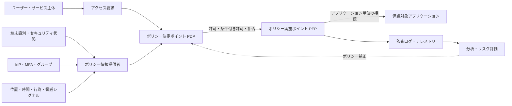
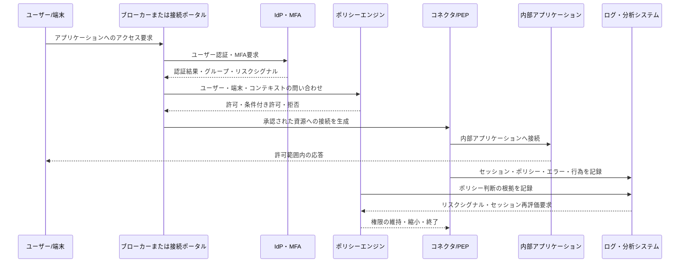

# ZTNA(Zero Trust Network Access, ゼロトラスト・ネットワーク・アクセス)

## 1. 概要

> **ZTNA(Zero Trust Network Access)**とは、ユーザーのネットワーク上の位置や社内ネットワークへの接続有無を信頼せず、ユーザー・端末・アプリケーション・要求のコンテキストを毎回検証したうえで、必要なアプリケーションにのみ最小権限で接続するアクセス制御アーキテクチャである。

従来のリモートアクセスは、VPNによってユーザーを企業ネットワークの特定区間に入れた後、その中で必要なサーバーを探させる方式であった。

このモデルは、データセンターと本社ネットワークが情報システムの中心であった時代には運用しやすかった。

しかしSaaS、マルチクラウド、在宅勤務、協力会社からの接続が広がるにつれ、保護対象がネットワークの内側だけに存在するわけではなくなった。

攻撃者が窃取したアカウントでVPNに入り込めば、認証済みの接続であるという理由だけで内部資源を探索したり、ラテラルムーブメントを試みたりできるという点も重要な限界である。

NIST SP 800-207は、ネットワーク上の位置だけでユーザーや資産に暗黙の信頼を与えてはならず、資源へのアクセス前に主体とデバイスを認証・認可すべきであるというゼロトラストの原則を示している([NIST SP 800-207](https://csrc.nist.gov/pubs/sp/800/207/final))。

ZTNAは、この原則をリモートアクセスとアプリケーションアクセスの経路に具体化した代表的な手段である。

ただし、ZTNAをVPN製品の新しい名称としてのみ理解してはならない。

VPNはネットワーク接続を先に確立し、その上でアクセスを制御する傾向があるが、ZTNAは保護対象のアプリケーションを先に定義し、要求単位で接続を生成する。

したがってZTNAの目標はネットワークを完全になくすことではなく、ネットワークを信頼の根拠から伝達手段へと格下げし、アプリケーション・データ・アイデンティティ中心へとセキュリティ判断を移すことにある。

## 2. ZTNAの原則と概念構造

ZTNAの核心は、「誰であるか」だけを確認する単一の認証ではなく、「どの主体が、どのような状態で、どの資源に対して、どのような行為をしようとしているか」を総合して判断することである。

ユーザー認証を通過していても、管理されていない端末、異常な位置、危険な行為、業務時間外の要求が組み合わされば、アクセスを制限したり追加認証を要求したりできる。

逆に、同じユーザーが承認された端末から承認されたアプリケーションを正常な業務コンテキストで要求すれば、必要な範囲でアクセスを許可できる。

次の概念図は、アクセス要求がポリシー判断と実施ポイントを経由する全体の流れを示す。

### A. アイデンティティと主体の検証

ZTNAにおける主体は、人であるユーザーのみを意味するわけではない。

人、サービスアカウント、バッチジョブ、IoT機器など、資源へのアクセスを要求するあらゆる行為者を主体とみなす。

ユーザーのアイデンティティは企業のIdP、ディレクトリ、SSO、MFAを通じて確認し、サービスのアイデンティティはワークロード証明書やサービスアカウントトークンで確認する。

認証と認可は分離されなければならない。

認証は「誰であるか」を確認する手続きであり、認可は「何ができるか」をポリシーで決定する手続きである。

例えば、人事部のユーザーが認証されたからといって、すべての人事データベースの管理者権限を持つわけではない。

職務、プロジェクト、データ等級、承認状態を組み合わせて、閲覧・修正・エクスポートの権限を個別に付与しなければならない。

MFAはアカウント乗っ取りのリスクを下げるが、単独でZTNAを完成させるものではない。

MFAを通過したセッションであっても、端末がマルウェアに感染していたり、ユーザーの行動が普段と異なったりすれば、追加の検証が必要である。

したがってZTNAは、IdPの認証結果をポリシーエンジンへの複数の入力の一つとして扱う。

### B. 端末状態とコンテキストの評価

端末の検証は、OS・ブラウザの種類を確認する水準を超え、当該デバイスが組織の管理下にあるか、セキュリティ基準を満たしているかを判断する過程である。

例えば、ディスク暗号化、セキュリティパッチの適用レベル、EDRの稼働有無、画面ロックポリシー、脱獄・ルート化の有無、証明書の保有有無をシグナルとして使用できる。

デバイスの状態は恒久的な属性ではなく、時間とともに変化する観測値である。

昨日は正常と判定されたノートPCでも、今日EDRが停止していたり危険なプロセスが検知されたりしたなら、同じ権限を維持してはならない。

このためポリシーは、「一度許可すればセッション終了まで無条件に維持する」静的なルールよりも、一定周期またはリスクシグナル発生時に再評価する方式で設計する。

コンテキストには、ユーザー・端末のほかにも、位置、接続時間、ネットワーク種別、要求アプリケーション、対象データの分類、過去の行動、脅威インテリジェンスが含まれ得る。

ただし、シグナルを多く収集すれば判断の品質が自動的に向上するわけではない。

精度の低い位置情報や過剰な行動分析は誤検知とプライバシー侵害を増やし得るため、業務目的と最小収集の原則を併せて適用しなければならない。

### C. 最小権限とアプリケーション単位の接続

ZTNAはユーザーを「社内ネットワーク全体」に接続するのではなく、承認されたアプリケーションの名称・アドレス・ポート・行為範囲に限定して接続する。

ユーザーはポータルで受注管理システムを選択するか、ブラウザベースのプロキシを通じて許可されたWebアプリケーションにアクセスする。

ネットワークの観点では、アプリケーションはユーザーに直接公開されず、コネクタやブローカーが双方の接続を中継する。

この構造は、ユーザーに内部IPアドレスや不要なサービス一覧を露出させないため、攻撃者の偵察範囲を縮小する。

最小権限は、単にアプリケーション一覧を絞るだけで終わるものではない。

同じアプリケーション内でも照会、登録、承認、ダウンロードを分離し、高リスクの行為には再認証や管理者承認を付けることができる。

例えば、顧客情報画面は照会を許可しつつ大量ダウンロードは遮断したり、承認担当者のみが決済承認APIを呼び出せるようにしたりできる。

最小権限をあまりに狭く設定すると業務の中断や迂回接続が発生するため、実際の業務フローを分析して権限を細分化しなければならない。

## 3. 構成要素と動作手順

ZTNAの実装は単一の装置ではなく、アイデンティティ・ポリシー・接続中継・資源保護・観測の体系が結合した論理構造である。

次の詳細フローは、ユーザーがアプリケーションにアクセスする瞬間からセッション終了と監査までを示す。

### A. ポリシー決定ポイントとポリシー実施ポイント

ポリシー決定ポイント(PDP, Policy Decision Point)は、アクセスの許否を算出する論理的な役割である。

ポリシー実施ポイント(PEP, Policy Enforcement Point)は、PDPの決定を実際の通信経路で強制する役割である。

NISTの抽象モデルでは、ポリシーエンジン(PE)とポリシー管理者(PA)がポリシー決定機能を構成し、PEPが要求主体と資源の間の接続を制御する([NIST Zero Trust Architecture](https://csrc.nist.gov/pubs/sp/800/207/final))。

製品によっては、PDP・PE・PAが一つのクラウドサービスとして見えたり、ブローカー・ゲートウェイ・エージェントに分散配置されたりする。

重要なのは名称ではなく、判断と実施が分離され、ポリシーが迂回されない構造である。

PDPが許可を返しても、実際のトラフィックが別経路で直接内部サーバーに到達できるなら、ZTNAの制御は無力化される。

PEPは、ユーザー端末のエージェント、リバースプロキシ、アプリケーションゲートウェイ、サービスメッシュのプロキシ、ファイアウォールポリシーなどで実装できる。

実施ポイントは保護対象資源の近くにあるべきであり、高可用性と、障害時のデフォルト拒否(default deny)または限定的許可(fail safe)のポリシーを明確に定めなければならない。

### B. IdP・MFA・端末管理との連携

IdPはユーザー認証とグループ・ロール情報を提供するが、ZTNAポリシーの唯一の信頼できる情報源(Single Source of Truth)となってはならない。

端末管理システムはデバイス識別子と準拠状態を提供し、EDRは脅威検知状態を提供し、SIEM・脅威インテリジェンスはリスクシグナルを提供する。

ポリシーエンジンはこれらの情報を収集し、要求のリスク度を評価する。

例えば、「財務部門のユーザーでMFAを通過し、会社が管理する暗号化ノートPCから業務時間中に接続した」という条件であれば、閲覧権限を許可できる。

一方、「同じユーザーだがEDRが停止しており、海外の異常な位置から大量ダウンロードを試みた」のであれば、セッションを遮断するか管理者承認に切り替えることができる。

連携システム間の時刻のずれと識別子の不一致は、実際の運用で頻繁に発生する。

ユーザーID、社員番号、メールアドレス、デバイスIDがシステムごとに異なると、ポリシーが誤った主体に適用され得るため、識別子の正規化と同期失敗のモニタリングが必要である。

### C. ブローカー・コネクタ・アプリケーション保護

ZTNAブローカーは、ユーザーと保護対象アプリケーションの間で認証・ポリシー・セッション中継を担う。

コネクタは内部ネットワークに配置され、外部にインバウンドポートを開けることなく、承認されたアプリケーションへのアウトバウンド接続を確立できる。

この方式は、内部アプリケーションをインターネットに直接露出するリスクを減らし、ファイアウォールポリシーを単純化する。

Webアプリケーションはリバースプロキシ方式で保護でき、SSH・RDP・データベースのような非Webプロトコルには専用コネクタやエージェント方式が必要となる場合がある。

エージェント方式はきめ細かな端末識別とネットワーク制御が可能であるが、管理されていない端末や協力会社の機器にはインストールしにくい。

エージェントレス方式はブラウザだけでアクセスしやすいが、ファイル転送・クリップボード・ローカルプリンターといった機能の制御が制限される場合がある。

したがって、アプリケーションのプロトコル、ユーザーの種別、データの機微度に応じて方式を組み合わせる。

コネクタがすべての内部ネットワークに過剰にアクセスできると、ZTNAが新たなラテラルムーブメントの通路になりかねない。

コネクタごとの対象資源、実行権限、ネットワークセグメント、アップデート経路を最小化し、コネクタ自体も資産としてモニタリングしなければならない。

## 4. 適用類型と比較

### A. 適用類型

第一に、リモートユーザーと社内Webアプリケーションの間にアプリケーションプロキシを置く類型である。

ブラウザの要求をプロキシが受けて認証とポリシーを検査し、バックエンドには承認された要求のみを転送する。

第二に、端末エージェントとクラウドブローカーを利用して非Webプロトコルまで接続する類型である。

ユーザーからは仮想ネットワークアドレスを通じてアプリケーションに接続しているように見えるが、エージェントは承認されたホスト・ポートのみを通過させる。

第三に、サーバー・サービス間のアクセスにワークロードアイデンティティを適用する類型である。

マイクロサービスが他のサービスのAPIを呼び出す際に、サービス証明書、名前空間、デプロイ情報、要求範囲をポリシーの入力として使用する。

第四に、協力会社・外部委託人員・非管理端末に一時的なアクセスを提供する類型である。

この場合、アカウントの有効期限、アクセス時間、画面録画、ファイル移動、承認者、契約終了時の自動回収をポリシーに含めなければならない。

### B. VPN・ZTNA・SASEの比較

| 区分 | 従来型VPN | ZTNA | SASE視点のZTNA |
|---|---|---|---|
| 基本対象 | ネットワークセグメント | アプリケーション・資源 | クラウドエッジのアプリケーション・サービス |
| 信頼の根拠 | 認証後のネットワーク上の位置 | アイデンティティ・端末・コンテキスト・資源ポリシー | アイデンティティ・コンテキストと統合セキュリティポリシー |
| 接続範囲 | 比較的広いネットワーク | 許可された資源・セッション | エッジでの最適経路とセキュリティ機能の結合 |
| ラテラルムーブメント | 露出の可能性が相対的に大きい | アプリケーション単位に縮小 | SSE・DLP・SWGと併せて制御 |
| 運用の焦点 | トンネル・アドレス・ファイアウォール | ポリシー・アイデンティティ・端末状態 | ネットワーク・セキュリティサービスの統合 |
| 主な限界 | 内部信頼と拡張性の問題 | ポリシー・連携の複雑さ、レガシー互換性 | クラウド依存・ベンダーロックイン・データ主権 |

VPNとZTNAの違いは、トンネル暗号化の有無だけで決まるものではない。

現代のVPNもMFAや細分化されたポリシーをサポートし得るため、「VPNは常に安全ではない」と断定するのは不正確である。

核心的な違いは、ユーザーをネットワークに入れるのか、それとも保護対象資源に対する特定のセッションのみを中継するのかにある。

ZTNAはネットワークアドレスを隠すだけでセキュリティが完成するわけではなく、認証・認可・端末の準拠・ログ・ポリシー運用が共に成熟して初めて効果を発揮する。

SASEは、ZTNAをSWG、CASB、FWaaS、DLP、SD-WANなどと結合するサービスアーキテクチャである。

したがってZTNAは、SASEの一機能として導入することも、社内データセンターの独立したアプリケーションアクセス体系として先行導入することもできる。

### C. RBACとABACの選択

ロールベースアクセス制御(RBAC)は、職務や組織上のロールを権限にマッピングする方式であるため、理解しやすく管理が単純である。

しかし、リモートワーク、プロジェクト型組織、協力会社、端末リスク度のように変化する属性を表現するには、ロールの数が過剰に増えるおそれがある。

属性ベースアクセス制御(ABAC)は、ユーザー・資源・環境の属性を組み合わせてきめ細かな条件を表現する。

例えば、`ユーザー部署=財務`、`端末準拠=正常`、`データ等級=社内`、`位置=許可国`、`行為=照会`を同時に評価できる。

ABACはきめ細かいが、属性の品質とポリシーの説明可能性に依存する。

組織は、基本的な業務ロールはRBACで管理し、端末状態・時間・リスク度・データ等級のような動的条件はABACで補完する混合方式を検討できる。

ポリシーをコードのようにバージョン管理しテストしなければ、条件が増えるほど競合と例外が蓄積する。

## 5. 導入手順と仮想事例

### A. 段階別の導入手順

第1段階は、保護対象と業務フローを識別する段階である。

アプリケーション一覧、所有部署、データ等級、接続ユーザー、プロトコル、依存サービスをリスト化する。

第2段階は、アイデンティティ・端末の基盤を整備する段階である。

共有アカウントを排除し、IdP・MFA・端末管理・EDRの識別子を紐付け、管理されていない資産を分類する。

第3段階は、低リスクのアプリケーションに観察モードでポリシーを適用する段階である。

観察モードでは、実際のアクセスパターンと予期しない依存関係を収集し、許可リストを補正する。

第4段階は、VPNの利用が多くアプリケーションの境界が明確な業務から移行する段階である。

例えば、イントラネット、開発ダッシュボード、協力会社ポータルのように、アプリケーション単位で検証しやすい対象が適している。

第5段階は、高リスクのデータと管理アクセスに強化ポリシーを適用する段階である。

管理者シェル、本番データベース、大量ダウンロードについては、個別承認、短いセッション、コマンド制御、セッション記録を検討する。

第6段階は、継続的な測定とポリシー改善の段階である。

アクセス成功率、認証失敗率、遮断されたリスクセッション、ポリシー例外の数、アプリケーション障害、平均権限回収時間などをベースラインと比較する。

### B. 仮想事例: 製造企業の協力会社リモートアクセス

仮想の製造企業A社は、協力会社の従業員にVPNアカウントを発行し、生産管理サーバーの複数のポートを開放していた。

契約が終了したアカウントが即座に回収されなかったり、協力会社端末のセキュリティ状態を確認しにくかったりする問題があった。

A社はまず生産管理Webポータルを保護対象として定義し、協力会社・作業場・業務期間をアカウント属性として登録した。

協力会社の従業員はIdPでMFAを実施し、承認されたブラウザからのみポータルにアクセスできるようポリシーを適用した。

作業期間が過ぎるとアカウントは自動的に無効化され、業務範囲外の管理者画面は個別承認なしには表示されない。

非Web方式の設備診断接続は、専用コネクタを通じて特定のホストとポートに限定した。

ポリシーは、`契約状態=有効`、`作業者ロール=診断`、`端末リスク度=許容`、`接続時間=承認された交代勤務時間`をすべて満たす場合にのみ許可する。

大量のファイルダウンロードと異常なコマンド実行は遮断し、すべてのセッションに作業者・端末・資源・承認者の情報を残す。

この事例の核心的な成果はVPN装置を交換したという事実ではなく、協力会社というネットワーク外部の主体に対しても、資源単位の最小権限・期間制限・監査証跡を適用した点にある。

## 6. 深化 — クラウドネイティブZTNAと成熟度

クラウドネイティブ環境では、ユーザーだけでなくサービスとワークロードも互いのAPIを呼び出す。

NIST SP 800-207Aは、マルチクラウド・複数拠点のクラウドネイティブアプリケーションにおいて、ネットワーク層のポリシーとアイデンティティ層のポリシーを併せて適用し、APIゲートウェイ・サイドカープロキシ・サービスアイデンティティ基盤を活用するモデルを説明している([NIST SP 800-207A](https://csrc.nist.gov/pubs/sp/800/207/a/final))。

この観点からZTNAは、リモートユーザー向けVPNの代替品を超えて、ユーザー‐アプリ、サービス‐サービス、運用者‐管理プレーンのアクセスを統合するポリシー体系へと拡張される。

サービスメッシュのmTLSはサービス間通信の暗号化とワークロード認証を提供できるが、業務権限やデータ行為のポリシーを自動的に解決するわけではない。

したがって、ネットワーク層の接続許可、アプリケーション層のAPI権限、データ層の照会・持ち出し制御を分離しつつ連携させなければならない。

CISA Zero Trust Maturity Model 2.0は、Identity、Devices、Networks、Applications and Workloads、Dataの五つの柱と、Visibility and Analytics、Automation and Orchestration、Governanceという横断的能力を提示している([CISA Zero Trust Maturity Model](https://www.cisa.gov/zero-trust-maturity-model))。

組織はすべての項目を一度に最適レベルにしようとするよりも、資産の識別と可視性の確保から始め、自動化・動的ポリシー・ガバナンスへと段階的に成熟させるべきである。

最新の実装では、エージェントレスアクセス、ブラウザ分離、継続的リスク評価、サービスアイデンティティ、セキュリティ分析の自動化が組み合わされることがある。

しかし、製品の機能が多いからといって成熟度が高いわけではない。

ポリシーが実際に資源の手前で実施されているか、例外が追跡されているか、シグナルの誤りが業務を麻痺させないか、障害時に安全に復旧できるかを検証しなければならない。

## 7. 考慮事項と示唆

- **保護対象面の優先順位**: すべての資源を同時にZTNAで包むよりも、個人情報・知的財産・管理プレーン・中核業務APIのように侵害時の影響が大きい保護対象面から識別する。

- **ポリシーの品質と説明可能性**: アクセスが拒否された理由と許可された根拠を運用者が説明できなければならない。ポリシーの競合、例外、有効期限、承認者をバージョンと監査ログで管理する。

- **可用性と障害対応**: IdP・ブローカー・コネクタ・DNS・証明書のすべてがアクセス経路の依存要素となり得る。冗長化、キャッシュの許容範囲、緊急用アカウント、障害時の限定的な復旧手順を事前に試験する。

- **レガシー互換性**: 古いクライアント、固定IPを要求する機器、非標準プロトコルは、アプリケーションプロキシだけでは保護しにくい。セグメントセキュリティと専用コネクタを過渡的に併用し、長期的にはモダナイゼーション計画を立てる。

- **端末と非人間主体**: ユーザーのMFAだけを強化し、サービスアカウント・APIキー・自動化トークンを放置すれば、迂回経路が残る。非人間アイデンティティの発行・ローテーション・廃棄と呼び出し範囲を併せて管理する。

- **個人情報とモニタリング**: 位置・行動・端末状態の収集はセキュリティに有用であるが、過剰な監視は法的・組織的な抵抗を生み得る。収集目的、保存期間、アクセス権限、マスキング、告知と同意の要件を検討する。

- **成果測定**: 導入台数よりも、保護対象アプリケーションの比率、非管理端末の遮断率、過剰権限の削減、セッションリスク再評価の時間、侵害事故におけるラテラルムーブメントの範囲、業務遅延を併せて評価する。

- **組織と運用**: ネットワークチームがトンネルだけを管理し、セキュリティチームがポリシーだけを管理すると、責任の空白が生じる。アプリケーションオーナー、IAM、エンドポイント、ネットワーク、SOCが参加するポリシー変更とインシデント対応のRACIを定める。

- **ベンダーロックインとデータ主権**: クラウドブローカーのリージョン、ログの保存場所、サービス停止時の代替経路、標準プロトコルのサポート、ポリシーのエクスポート可否を、契約と技術検証で確認する。

技術士の視点から見ると、ZTNAは製品導入の問題ではなく、「信頼をネットワーク上の位置から資源・アイデンティティ・コンテキスト・証拠へと移す運用モデル」である。

したがってアーキテクチャ設計時にはセキュリティ性だけを強調するのではなく、業務継続性、ユーザー体験、規制遵守、運用自動化、総所有コストを併せて最適化しなければならない。

## 参考資料

- [NIST SP 800-207, Zero Trust Architecture](https://csrc.nist.gov/pubs/sp/800/207/final)
- [NIST SP 800-207A, A Zero Trust Architecture Model for Access Control in Cloud-Native Applications](https://csrc.nist.gov/pubs/sp/800/207/a/final)
- [CISA Zero Trust Maturity Model](https://www.cisa.gov/zero-trust-maturity-model)
- [CISA Zero Trust Maturity Model Version 2.0 PDF](https://www.cisa.gov/sites/default/files/2023-04/CISA_Zero_Trust_Maturity_Model_Version_2_508c.pdf)

---

> **一言まとめ**: ZTNAは、ネットワーク上の位置を信頼して内部ネットワークを開放する代わりに、ユーザー・端末・コンテキスト・資源を要求ごとに検証してアプリケーション単位の最小権限を実施するアクセスアーキテクチャであり、成功のためにはアイデンティティ・ポリシー・コネクタ・可観測性・ガバナンスを共に成熟させなければならない。
