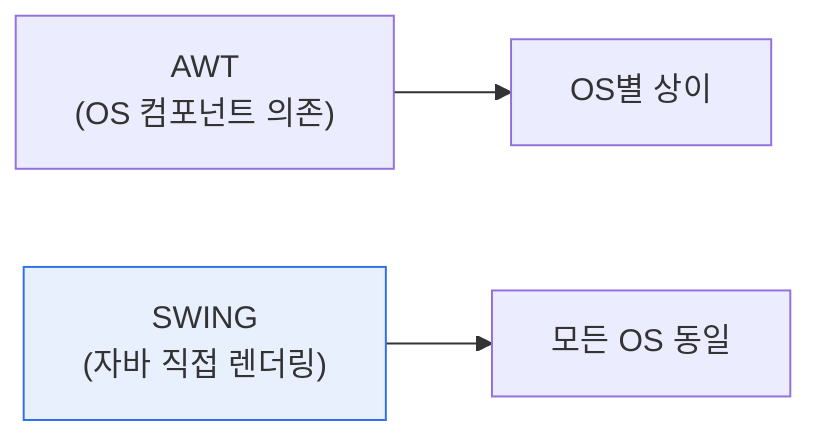

# 자바 AWT와 SWING

## 1. 개요

### 가. 개념
> **AWT**(Abstract Window Toolkit)와 **SWING**은 자바에서 **GUI(그래픽 사용자 인터페이스)를 구현하기 위한 라이브러리**다. AWT는 운영체제의 네이티브 컴포넌트에 의존하는 초기 방식이고, SWING은 자바가 직접 그려 플랫폼 독립성을 높인 후속 방식이다.

두 라이브러리를 비교하는 근본 이유는 '**자바의 이상인 플랫폼 독립성(Write Once, Run Anywhere)을 GUI에서 어떻게 실현하느냐**'의 차이에 있다. 초기의 **AWT**는 각 운영체제가 제공하는 네이티브 GUI 컴포넌트(버튼·창)를 그대로 가져다 썼다(heavyweight). 이 방식은 OS 고유의 모양을 그대로 쓰니 빠르지만, OS마다 컴포넌트가 달라 화면이 제각각으로 보이고, 모든 OS의 공통 기능만 쓸 수 있어 표현이 제한됐다. 자바의 '어디서나 똑같이'라는 이상과 어긋난 것이다. 이를 개선한 것이 **SWING**이다. SWING은 OS 컴포넌트에 의존하지 않고 자바가 직접 픽셀을 그린다(lightweight). 그래서 어떤 OS에서도 동일한 모양·동작을 보장하고, 풍부한 컴포넌트(테이블·트리)와 자유로운 룩앤필(Look&Feel) 변경을 제공한다. 다만 자바가 직접 그리는 만큼 초기엔 다소 무겁다는 평가도 있었다. 즉 AWT에서 SWING으로의 발전은, 네이티브 의존을 벗어나 진정한 플랫폼 독립 GUI를 추구한 과정이다.

### 나. 경량/중량 컴포넌트
| 구분 | 내용 |
|---|---|
| **중량(Heavyweight)** | OS 네이티브 자원에 매핑(AWT) |
| **경량(Lightweight)** | 자바가 직접 렌더링(SWING) |

## 2. AWT vs SWING 비교

| 구분 | AWT | SWING |
|---|---|---|
| **컴포넌트** | 중량(네이티브) | 경량(자바 렌더링) |
| **플랫폼 독립성** | 낮음(OS별 상이) | 높음(동일 표현) |
| **컴포넌트 수** | 기본적·제한적 | 풍부(테이블·트리 등) |
| **룩앤필** | OS 고정 | 변경 가능(Pluggable) |
| **패키지** | java.awt | javax.swing |
| **관계** | 기초 | AWT 기반 확장 |

SWING은 AWT를 완전히 대체한 것이 아니라, AWT의 이벤트 처리·기초 구조 위에 경량 컴포넌트를 얹어 확장했다. 그래서 SWING을 쓸 때도 AWT의 레이아웃·이벤트 모델을 함께 사용한다.

## 3. 활용과 후속 기술

AWT·SWING은 자바 데스크톱 애플리케이션 GUI의 오랜 표준이었다. 이후 더 현대적인 **JavaFX**가 등장해 CSS 스타일링·리치 미디어·애니메이션을 지원하며 SWING을 잇는 GUI 기술로 자리잡았다.

## 4. 고려사항 및 시사점

1. **플랫폼 독립성과 성능의 트레이드오프**를 보여준다. AWT는 네이티브라 빠르지만 일관성이 없고, SWING은 일관되지만 렌더링 부담이 있다. 이는 GUI 프레임워크 설계의 근본적 선택을 잘 보여준다.
2. **레거시 유지보수 관점**에서 여전히 중요하다. 많은 자바 기업 애플리케이션이 SWING으로 작성돼 있어, 유지보수·현대화(JavaFX·웹 전환) 시 이해가 필요하다.
3. **데스크톱에서 웹·크로스플랫폼으로 이동**하고 있다. 오늘날 GUI는 웹(브라우저)·모바일 중심으로 이동해, 데스크톱 자바 GUI의 비중은 줄었으나 산업용·내부 도구에서는 계속 쓰인다.

---

> **한 줄 요약**: AWT는 *OS 네이티브 컴포넌트에 의존하는 중량 GUI*, SWING은 *자바가 직접 그려 플랫폼 독립성과 풍부한 컴포넌트를 제공하는 경량 GUI* 로, AWT의 한계를 극복하며 발전했고 이후 JavaFX로 이어진다.
