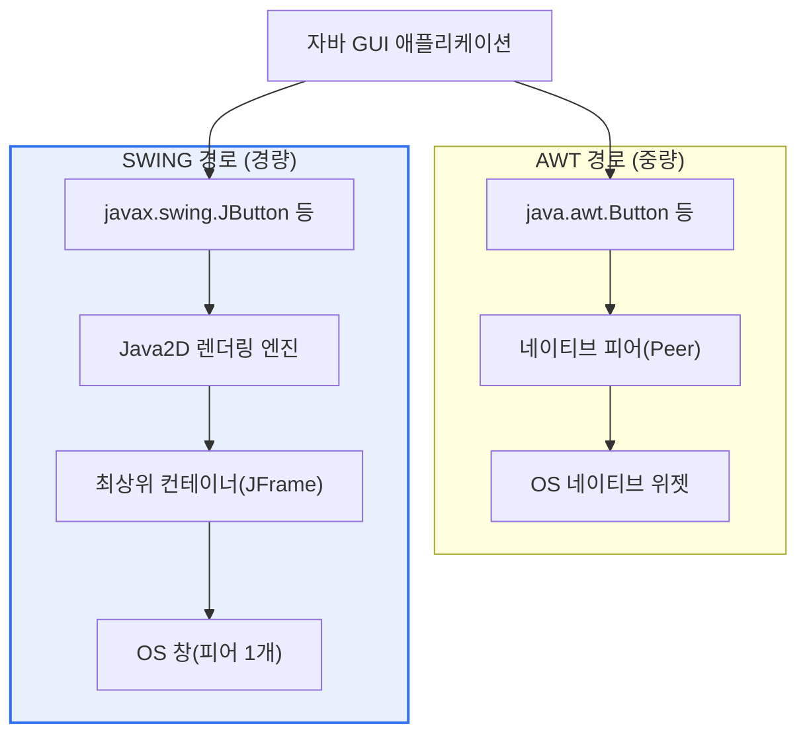
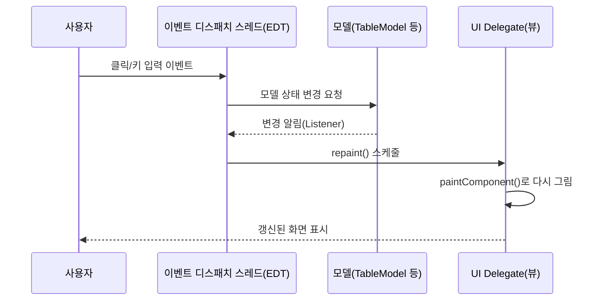
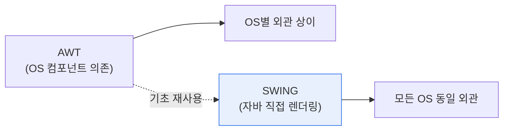

# 자바 AWT와 SWING

## 1. 개요

### 가. 개념

> **AWT**(Abstract Window Toolkit)와 **SWING**은 자바에서 **GUI(그래픽 사용자 인터페이스)를 구현하기 위한 표준 라이브러리**다. AWT는 운영체제의 네이티브 컴포넌트에 의존하는 초기 방식(중량, heavyweight)이고, SWING은 자바가 직접 화면을 그려 플랫폼 독립성을 높인 후속 방식(경량, lightweight)이다.

두 라이브러리를 나란히 비교하는 근본 이유는 '**자바의 이상인 플랫폼 독립성(Write Once, Run Anywhere, WORA)을 GUI라는 가장 OS 의존적인 영역에서 어떻게 실현하느냐**'라는 질문에 있다. 서버·연산 로직은 JVM 바이트코드로 어렵지 않게 이식되지만, 창(Window)·버튼·폰트·마우스 이벤트처럼 화면과 입력장치에 붙는 부분은 운영체제마다 구현이 크게 달라서 '한 번 작성해 어디서나 동일하게'가 가장 지키기 어려운 지점이었다. AWT와 SWING의 설계 차이는 바로 이 어려움을 서로 다른 방식으로 푼 두 세대의 해법이다.

초기의 **AWT**(JDK 1.0, 1996)는 각 운영체제가 이미 제공하는 네이티브 GUI 컴포넌트(윈도의 버튼, X윈도의 창 등)를 그대로 가져다 쓰는 방식을 택했다. 자바 코드의 `java.awt.Button` 하나가 실제로는 OS에 존재하는 진짜 버튼(피어, peer)에 1:1로 매핑된다. 이 방식은 OS가 최적화해 둔 위젯을 그대로 쓰니 렌더링이 빠르고 OS 고유의 친숙한 모양을 얻지만, 정작 OS마다 컴포넌트의 생김새·크기·동작이 제각각이라 화면이 플랫폼별로 달라지고, 모든 OS가 공통으로 가진 위젯의 '최소공배수'만 쓸 수 있어 표현력이 크게 제한됐다. 자바가 내세운 '어디서나 똑같이'라는 이상과 정면으로 어긋난 것이다.

이 한계를 개선한 것이 **SWING**(JDK 1.2, 1998, JFC의 일부)이다. SWING은 OS의 네이티브 위젯에 의존하지 않고 자바가 직접 픽셀을 그린다. 최상위 창(JFrame·JDialog) 하나만 OS 자원(피어)에 붙고, 그 안의 버튼·테이블·트리 같은 컴포넌트는 모두 자바가 그린 그림이다. 그 덕분에 어떤 OS에서도 동일한 모양·동작을 보장하고, 테이블(JTable)·트리(JTree)·탭(JTabbedPane) 같은 풍부한 컴포넌트와 자유로운 룩앤필(Look & Feel) 교체를 제공한다. 다만 자바가 직접 그리는 만큼 등장 초기(1990년대 말~2000년대 초)에는 하드웨어 성능이 낮아 '무겁고 느리다'는 평가를 받기도 했다. 요컨대 AWT에서 SWING으로의 발전은, 네이티브 의존을 벗어나 진정한 플랫폼 독립 GUI를 추구한 과정으로 요약된다.

### 나. 등장 배경과 필요성

GUI 프레임워크가 풀어야 할 본질적 긴장은 '**네이티브 친화성(빠름·OS 표준 외관) 대(對) 플랫폼 일관성(동일 외관·풍부한 표현)**'이다. AWT는 전자를 택했다가 후자를 잃었고, SWING은 후자를 위해 전자를 일부 포기했다. 이 트레이드오프는 오늘날의 크로스플랫폼 프레임워크(Electron, Flutter, React Native)까지도 반복되는 GUI 설계의 항구적 주제이며, 그래서 AWT/SWING의 대비는 단순한 자바 문법 지식이 아니라 'GUI 아키텍처 선택의 원형(archetype)'을 이해하는 소재로서 시험에 자주 등장한다.

## 2. 아키텍처 — 경량 vs 중량 컴포넌트

AWT와 SWING을 가르는 기술적 핵심은 컴포넌트가 OS 자원에 매핑되는지 여부, 즉 **중량(heavyweight)** 과 **경량(lightweight)** 의 구분이다. 아래 구조도는 두 방식이 애플리케이션·JVM·OS 사이에서 어디에 그리기 책임을 두는지를 대비한다.

```mermaid
flowchart TB
  APP["자바 GUI 애플리케이션"]
  subgraph AWTPATH["AWT 경로 (중량)"]
    AWTC["java.awt.Button 등"] --> PEER["네이티브 피어(Peer)"]
    PEER --> OSW["OS 네이티브 위젯"]
  end
  subgraph SWINGPATH["SWING 경로 (경량)"]
    JC["javax.swing.JButton 등"] --> J2D["Java2D 렌더링 엔진"]
    J2D --> TOP["최상위 컨테이너(JFrame)"]
    TOP --> OSTOP["OS 창(피어 1개)"]
  end
  APP --> AWTC
  APP --> JC
  style SWINGPATH fill:#e8f0fe,stroke:#2f6fed,stroke-width:2px
```

**중량 컴포넌트(AWT)** 는 각 컴포넌트가 OS의 네이티브 자원, 즉 피어(peer)를 하나씩 점유한다. 버튼 100개를 만들면 OS 위젯 100개가 생기는 셈이다. 이 방식은 OS가 그리기·이벤트를 대신 처리해 주므로 자바 쪽 부담이 작고 반응이 빠르지만, 피어라는 OS 자원을 많이 소모하고 OS별로 동작이 갈린다. 또 중량 컴포넌트는 항상 경량 컴포넌트보다 위에 그려지는 'Z-순서 겹침' 문제가 있어, AWT와 SWING을 섞어 쓰면 메뉴가 다른 컴포넌트에 가려지는 현상이 발생하기도 했다.

**경량 컴포넌트(SWING)** 는 자신만의 OS 자원을 갖지 않고, 자신을 담고 있는 최상위 중량 컨테이너(JFrame 등)의 화면 영역에 자바가 직접 그린다. 컴포넌트가 아무리 많아도 실제 OS 창은 최상위 몇 개뿐이라 자원 효율이 좋고, 모든 그리기를 자바가 통제하므로 OS와 무관하게 완전히 동일한 화면을 만든다. 투명 영역·둥근 모서리·커스텀 페인팅처럼 네이티브 위젯으로는 어려운 표현도 자유롭다. 이 '자바가 다 그린다'는 원칙이 SWING의 플랫폼 독립성과 풍부한 표현력의 근원이다.

| 구분 | 중량(Heavyweight) | 경량(Lightweight) |
|---|---|---|
| **대표** | AWT | SWING |
| **OS 자원(피어)** | 컴포넌트마다 점유 | 최상위 컨테이너만 점유 |
| **그리기 주체** | OS | 자바(Java2D) |
| **외관 일관성** | OS별 상이 | 모든 OS 동일 |
| **커스터마이징** | 제한적 | 자유로움 |

## 3. MVC 구조와 렌더링 파이프라인

SWING의 또 다른 설계적 강점은 각 컴포넌트가 **MVC(Model-View-Controller) 변형 구조**로 되어 있다는 점이다. 예컨대 JTable은 데이터를 담는 모델(TableModel), 화면 표현을 맡는 뷰(렌더러/UI Delegate), 편집·상호작용을 맡는 컨트롤러가 분리돼 있다. 아래 다이어그램은 사용자 입력이 이벤트 디스패치 스레드(EDT)를 거쳐 모델·뷰를 갱신하고 화면에 반영되는 과정을 보여준다.

```mermaid
sequenceDiagram
  participant U as 사용자
  participant EDT as 이벤트 디스패치 스레드(EDT)
  participant M as 모델(TableModel 등)
  participant V as UI Delegate(뷰)
  U->>EDT: 클릭/키 입력 이벤트
  EDT->>M: 모델 상태 변경 요청
  M-->>EDT: 변경 알림(Listener)
  EDT->>V: repaint() 스케줄
  V->>V: paintComponent()로 다시 그림
  V-->>U: 갱신된 화면 표시
```

**모델-뷰 분리의 실무적 의미**는 큰 데이터를 다루는 화면에서 두드러진다. 수만 행의 표를 그릴 때, 모델은 데이터만 갖고 뷰는 화면에 보이는 부분만 렌더링하므로 메모리·성능을 아낄 수 있다. 같은 모델을 여러 뷰가 공유하거나, 룩앤필만 바꿔 다른 외관을 입히는 것도 이 분리 덕분이다. 이는 오늘날 프런트엔드의 상태-뷰 분리(React 등)와 같은 원리로, SWING이 시대에 앞선 설계를 채택했음을 보여준다.

**이벤트 디스패치 스레드(EDT) 규칙**은 SWING 개발에서 가장 자주 실수하는 지점이다. SWING 컴포넌트는 스레드 안전(thread-safe)하지 않으므로, 모든 UI 갱신은 반드시 단일 스레드인 EDT에서 수행해야 한다. 오래 걸리는 작업(파일 I/O·네트워크)을 EDT에서 돌리면 화면이 멈추므로(freeze), `SwingWorker`로 백그라운드 스레드에서 처리하고 결과만 EDT로 넘겨 화면을 갱신하는 패턴이 정석이다. 이 규칙을 어기면 간헐적 렌더링 오류나 교착이 발생하는데, 이런 '단일 UI 스레드' 모델은 이후 대부분의 GUI 프레임워크가 공유하는 공통 원칙이 되었다.

**룩앤필(Pluggable Look & Feel)** 은 SWING의 상징적 기능이다. `UIManager.setLookAndFeel(...)` 한 줄로 Metal(자바 기본), Nimbus, 그리고 각 OS를 흉내 낸 System L&F 등으로 외관을 통째로 바꿀 수 있다. 자바가 직접 그리기 때문에 가능한 일로, "동일한 코드로 OS별 네이티브 느낌을 흉내 내되 필요하면 완전히 통일된 외관"이라는 유연성을 준다.

## 4. AWT vs SWING 비교와 실제 사례

두 라이브러리는 대체 관계가 아니라 **계승·확장 관계**다. SWING은 AWT를 버린 것이 아니라 AWT의 이벤트 처리 모델(위임 이벤트 모델, Delegation Event Model)·레이아웃 매니저(BorderLayout·GridLayout 등)·그래픽스(Graphics)·색상 등 기초 인프라를 그대로 재사용하면서 컴포넌트 계층만 경량으로 다시 만들었다. 그래서 SWING 애플리케이션을 작성할 때도 `java.awt.*`의 레이아웃과 이벤트 클래스를 함께 import해서 쓴다. 이 사실은 "SWING이 AWT를 완전히 대체했다"는 흔한 오해를 바로잡는 핵심 포인트다.

```mermaid
flowchart LR
  AWT["AWT<br/>(OS 컴포넌트 의존)"] --> OS["OS별 외관 상이"]
  SWING["SWING<br/>(자바 직접 렌더링)"] --> UNI["모든 OS 동일 외관"]
  AWT -.기초 재사용.-> SWING
  style SWING fill:#e8f0fe,stroke:#2f6fed
```

| 구분 | AWT | SWING |
|---|---|---|
| **컴포넌트** | 중량(네이티브 피어) | 경량(자바 렌더링) |
| **플랫폼 독립성** | 낮음(OS별 상이) | 높음(동일 표현) |
| **컴포넌트 수** | 기본적·제한적 | 풍부(테이블·트리·탭) |
| **룩앤필** | OS 고정 | 교체 가능(Pluggable) |
| **MVC 분리** | 약함 | 강함(모델-뷰 분리) |
| **패키지** | java.awt | javax.swing |
| **명명 규칙** | Button, Frame | JButton, JFrame(접두어 J) |
| **관계** | 기초 인프라 | AWT 기반 확장 |

구체 사례로 보면 차이가 분명하다. 첫째, **통합개발환경(IDE)** 인 IntelliJ IDEA와 과거의 Eclipse 계열을 비교하면, IntelliJ는 SWING 기반으로 모든 OS에서 거의 동일한 화면을 제공하는 반면 Eclipse는 네이티브 위젯을 쓰는 SWT/JFace 기반이라 OS별 외관이 다르다 — 같은 자바 진영에서도 '일관성 vs 네이티브'의 선택이 갈렸음을 보여주는 대표 사례다. 둘째, **금융권 사내 트레이딩·계정계 클라이언트**나 각종 **엔터프라이즈 관리 콘솔**은 2000년대에 SWING(JTable로 대량 데이터 표시)으로 대거 구축되어 지금도 유지보수되고 있다. 셋째, 오라클의 데이터베이스 관리 도구·설치 마법사 등도 SWING으로 작성되어 윈도·리눅스·맥에서 동일하게 동작한다. 이처럼 '여러 OS에 배포하되 화면은 통일'해야 하는 도구·내부 시스템에서 SWING의 가치가 컸다.

## 5. 심화 — JavaFX로의 진화와 현대적 위치

AWT·SWING을 잇는 세대가 **JavaFX**(2008 최초 공개, JavaFX 2.0부터 자바 API화)다. JavaFX는 SWING의 한계를 여러 면에서 개선했다. 첫째, **씬 그래프(Scene Graph)** 기반 아키텍처로 화면을 트리 구조 객체로 다루어 애니메이션·효과·변환을 자연스럽게 지원한다. 둘째, **CSS 스타일링**과 **FXML**(선언적 UI 마크업)을 도입해 디자인과 로직을 분리하고 웹 개발자에게 친숙한 방식을 제공한다. 셋째, GPU 가속 렌더링 파이프라인(Prism)으로 리치 미디어·차트·3D를 다룬다. 데이터 바인딩(Property/Binding) 기능도 내장해 모델-뷰 동기화를 언어 수준에서 지원한다.

주목할 변화는 **JDK 11(2018)부터 JavaFX가 JDK에서 분리**되어 별도 모듈(OpenJFX)로 배포된다는 점이다. 즉 오라클은 JavaFX를 코어 JDK에서 떼어 오픈소스 커뮤니티(Gluon 등) 주도로 넘겼고, JavaFX는 이제 Maven/Gradle 의존성으로 추가해 쓴다. 반면 **AWT와 SWING은 여전히 표준 JDK에 포함**되어 있으며, 오라클은 이를 '제거 계획이 없는' 안정적 레거시로 유지하고 있다. 역설적이게도, 후속인 JavaFX가 코어에서 빠지고 오래된 SWING이 남아 있는 셈이라, 실무에서는 여전히 SWING이 자바 데스크톱의 기본값 위치를 지키는 경우가 많다.

한편 더 넓은 흐름에서 GUI의 무게중심은 데스크톱에서 **웹·모바일**로 이동했다. 오늘날 신규 애플리케이션은 브라우저(SPA)·모바일 앱·Electron/Flutter 같은 크로스플랫폼 프레임워크로 만들어지고, 자바 데스크톱 GUI의 신규 채택 비중은 줄었다. 그럼에도 산업 제어·계측 장비 UI, 금융·공공의 내부 도구, 이미 구축된 대규모 SWING 자산의 유지보수 영역에서는 AWT·SWING이 계속 현역으로 쓰인다.

## 6. 고려사항 및 시사점

기술사 관점에서 AWT·SWING은 단일 라이브러리 지식을 넘어 GUI 아키텍처 의사결정의 렌즈로 읽어야 한다.

1. **플랫폼 독립성과 성능·네이티브 친화성의 트레이드오프.** AWT는 네이티브라 빠르고 OS 표준 외관을 얻지만 일관성과 표현력을 잃고, SWING은 일관성·풍부한 표현을 얻는 대신 렌더링 부담을 진다. 이 대립은 오늘날 Electron(웹 기술로 일관성, 무거운 메모리)·Flutter(자체 렌더링으로 일관성)·React Native(네이티브 위젯으로 친화성) 선택에도 그대로 반복되므로, 신규 프로젝트의 GUI 스택 결정 시 반드시 저울질해야 한다.

2. **레거시 유지보수와 현대화 전략.** 상당수 자바 엔터프라이즈 클라이언트가 SWING으로 작성돼 여전히 운영 중이다. 이를 다룰 때는 (a) 유지보수 지속, (b) JavaFX로 점진 이관, (c) 웹(SPA)·경량 클라이언트로 재구축 중 조직의 인력·수명·비용을 고려해 선택해야 한다. EDT 규칙·SwingWorker 같은 원칙을 모르면 현대화 과정에서 미묘한 버그를 만들기 쉽다.

3. **단일 UI 스레드 모델의 보편성.** SWING의 EDT 규칙(모든 UI 갱신은 하나의 스레드에서, 무거운 작업은 백그라운드로)은 이후 거의 모든 GUI 프레임워크가 공유하는 공통 원칙이 되었다. 이 개념을 정확히 이해하면 다른 프레임워크로 옮겨도 UI 응답성·동시성 설계를 일관되게 적용할 수 있다.

4. **아키텍처 분리(MVC)의 선구성.** SWING의 모델-뷰 분리는 오늘날 프런트엔드의 상태-뷰 분리 사상을 앞서 구현한 사례다. 데이터·표현·상호작용을 분리하는 설계 원칙은 프레임워크가 바뀌어도 유지되는 자산이므로, 레거시 학습을 통해 얻은 설계 감각은 신규 스택에도 전이 가능하다.

5. **표준 포함 여부라는 리스크 관리 관점.** JavaFX가 JDK에서 분리(JDK 11)되어 별도 의존성 관리가 필요해진 반면 SWING/AWT는 코어에 남아 있다는 점은, 기술 선택 시 '벤더의 장기 지원·표준 포함 여부'가 성능·기능만큼 중요한 판단 기준임을 보여준다.

## 참고자료

- Oracle, "The Swing Tutorial (The Java Tutorials)" — https://docs.oracle.com/javase/tutorial/uiswing/
- Oracle, "AWT (java.awt) API Documentation" — https://docs.oracle.com/en/java/javase/17/docs/api/java.desktop/java/awt/package-summary.html
- OpenJFX, "JavaFX — Getting Started / Modular distribution" — https://openjfx.io/

---

> **한 줄 요약**: AWT는 *OS 네이티브 컴포넌트에 의존하는 중량 GUI*, SWING은 *자바가 Java2D로 직접 그려 플랫폼 독립성·풍부한 컴포넌트·MVC 분리·룩앤필 교체를 제공하는 경량 GUI* 로, AWT의 기초 위에 확장돼 한계를 극복했으며, 이후 씬그래프·CSS·GPU 가속의 JavaFX로 이어지되 SWING/AWT는 표준 JDK에 남아 레거시·내부 도구에서 여전히 현역으로 쓰인다.
