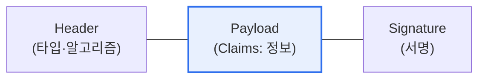

# JWT(JSON Web Token)

## 1. 개요

### 가. 개념
> **JWT**는 인증·인가에 필요한 **정보를 JSON 형태로 담아 디지털 서명한 토큰**으로, 서버가 세션을 저장하지 않고도(무상태) 사용자를 인증할 수 있게 하는 표준(RFC 7519) 토큰이다.

JWT가 널리 쓰이는 근본 이유는 '**서버가 로그인 상태를 기억하지 않아도 되게 한다**'는 데 있다. 전통적 세션 방식은 사용자가 로그인하면 서버가 세션 정보를 메모리·DB에 저장하고, 매 요청마다 이를 조회해 사용자를 확인했다. 이 방식은 서버가 상태를 유지해야 하므로, 서버가 여러 대인 분산·클라우드 환경에서 세션을 공유·동기화하기 번거롭고 확장에 부담이 된다. JWT는 발상을 뒤집는다. 인증에 필요한 정보(사용자 ID·권한·만료시각)를 토큰 자체에 담고 서명한 뒤, 이 토큰을 클라이언트가 보관하다가 요청마다 제출한다. 서버는 토큰의 서명만 검증하면 되고, 별도 저장소를 조회할 필요가 없다. 서명이 유효하면 토큰 내용을 신뢰한다. 이렇게 서버가 상태를 갖지 않으니(Stateless), 어느 서버로 요청이 가든 검증만 하면 돼 확장성이 뛰어나다. 그래서 MSA·API·모바일 등 분산 환경의 인증에 잘 맞는다. 다만 발급된 토큰은 만료 전까지 강제로 무효화하기 어렵다는 특성이 있다.

### 나. 특징
서버 무상태(Stateless), 자기 완결적(정보 내장), 서명 기반 무결성, 다양한 환경 간 이식성이 JWT의 특징이다.

## 2. 구성과 인증 메커니즘

JWT는 점(.)으로 구분된 세 부분으로 구성된다.

| 구성 | 내용 |
|---|---|
| **Header** | 토큰 타입(JWT), 서명 알고리즘(HS256·RS256) |
| **Payload** | 클레임(Claims): 사용자 정보·권한·만료시각(exp) 등 |
| **Signature** | Header+Payload를 비밀키로 서명 → 위변조 검증 |

**인증 메커니즘**: ① 사용자가 로그인하면 ② 서버가 정보를 담아 서명한 JWT를 발급하고 ③ 클라이언트가 이를 저장(로컬스토리지·쿠키)한 뒤 ④ 요청마다 헤더(Authorization: Bearer)에 실어 보내면 ⑤ 서버가 서명을 검증해 인증한다. Payload는 서명될 뿐 암호화되지는 않으므로(Base64 인코딩), 민감 정보를 담아선 안 된다.

## 3. 장단점과 활용

| 구분 | 내용 |
|---|---|
| **장점** | 무상태·확장성, 서버 부하↓, 크로스도메인·MSA 적합 |
| **단점** | 발급 후 강제 만료 어려움, 페이로드 노출(암호화 아님), 토큰 크기 |
| **활용** | API 인증, SSO, OAuth2/OIDC, MSA 서비스 간 인증 |

**단점 보완**: 토큰 탈취·무효화 문제를 줄이기 위해 만료시간이 짧은 **액세스 토큰**과 재발급용 **리프레시 토큰**을 조합하고, HTTPS 전송·안전한 저장을 병행한다.

## 4. 고려사항 및 시사점

1. **보안 설계가 필수**다. Payload가 암호화되지 않으므로 민감 정보를 넣지 않고, 반드시 HTTPS로 전송하며, 강한 서명 알고리즘·비밀키 관리, 짧은 만료·리프레시 토큰 전략을 적용해야 한다.
2. **무효화 한계를 보완**한다. 발급된 JWT는 만료 전 강제 폐기가 어려우므로, 로그아웃·탈취 대응을 위해 블랙리스트·토큰 버전 관리·짧은 수명 설계로 보완한다.
3. **MSA·제로 트러스트의 기반**이다. 무상태 인증은 분산 서비스 간 인증에 적합해, API 게이트웨이·OAuth2/OIDC와 결합해 마이크로서비스·제로 트러스트 아키텍처의 핵심 인증 수단으로 쓰인다. [[msa]]

---

> **한 줄 요약**: JWT는 *인증 정보를 담아 서명한 무상태 토큰* 으로 Header·Payload·Signature로 구성되며, 서버가 상태를 저장하지 않아 MSA·API 인증에 적합하되, 페이로드 노출·강제 무효화 한계를 HTTPS·짧은 만료·리프레시 토큰으로 보완한다.
