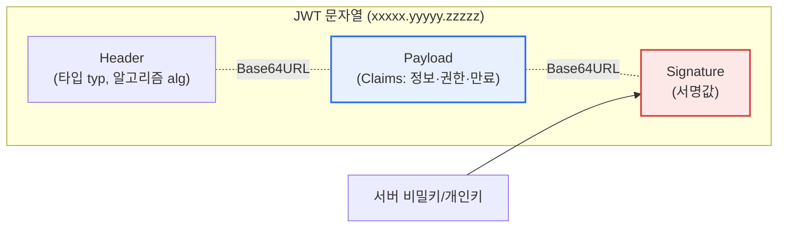
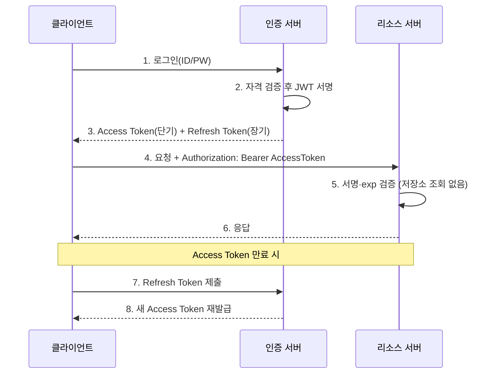

# JWT(JSON Web Token)

## 1. 개요

### 가. 개념
> **JWT**는 인증·인가에 필요한 **정보(Claims)를 JSON 형태로 담아 디지털 서명한 토큰**으로, 서버가 세션을 저장하지 않고도(무상태, Stateless) 사용자를 인증할 수 있게 하는 표준(RFC 7519) 토큰이다. 점(.)으로 구분된 세 부분을 Base64URL로 인코딩해 하나의 문자열(`xxxxx.yyyyy.zzzzz`)로 표현한다.

JWT가 널리 쓰이는 근본 이유는 '**서버가 로그인 상태를 기억하지 않아도 되게 한다**'는 데 있다. 이 발상의 배경을 이해하려면 먼저 전통적 세션 방식의 구조적 부담을 짚어야 한다. 세션 방식에서는 사용자가 로그인하면 서버가 세션 식별자(Session ID)를 발급하고, 그 세션의 실제 상태(사용자 ID·권한·로그인 시각 등)를 서버 메모리나 DB, 별도의 세션 저장소에 보관한다. 이후 매 요청마다 클라이언트가 보내온 세션 ID로 저장소를 조회해 사용자를 확인한다. 즉 '진실의 원천(Source of Truth)'이 서버 측 저장소에 있다.

이 구조는 단일 서버에서는 문제가 없지만, 서버가 여러 대인 분산·클라우드 환경에서는 곧바로 병목이 된다. 요청이 어느 서버로 라우팅될지 모르므로 모든 서버가 같은 세션을 볼 수 있어야 하고, 이를 위해 세션 스티키니스(Sticky Session)로 특정 서버에 고정하거나, Redis 같은 중앙 세션 저장소를 두어 공유해야 한다. 전자는 로드밸런싱과 무중단 배포를 방해하고, 후자는 저장소가 단일 장애점(SPOF)이자 성능 병목이 된다. 트래픽이 초당 수만 건에 이르면 매 요청마다 발생하는 세션 조회 자체가 부담이다.

JWT는 이 발상을 뒤집는다. 인증에 필요한 정보를 **토큰 자체에 담고 서명**한 뒤, 이 토큰을 클라이언트가 보관하다가 요청마다 제출한다. 서버는 토큰의 서명만 검증하면 되고 별도 저장소를 조회할 필요가 없다. 서명이 유효하면 토큰 내용을 신뢰한다. 이렇게 진실의 원천을 서버 저장소에서 토큰 자체로 옮기니, 서버는 상태를 갖지 않게 되고(Stateless) 어느 서버로 요청이 가든 검증만 하면 된다. 그래서 MSA·API 게이트웨이·모바일·SPA처럼 서버가 수평 확장되는 분산 환경의 인증에 잘 맞는다. 다만 이 자기완결성은 대가를 수반한다 — 발급된 토큰은 만료 전까지 서버가 강제로 무효화하기 어렵다는 특성이 그것이며, 이 트레이드오프가 이후 설계 전반을 좌우한다.

### 나. 특징
JWT의 특징은 네 가지로 요약된다. 첫째, **서버 무상태(Stateless)** — 서버가 세션을 보관하지 않아 수평 확장이 쉽다. 둘째, **자기 완결성(Self-contained)** — 검증에 필요한 정보가 토큰 안에 들어 있어 외부 조회 없이 처리된다. 셋째, **서명 기반 무결성(Integrity)** — 서명으로 위·변조를 탐지하지만, 서명은 '내용을 감추는 것(기밀성)'이 아니라 '내용이 바뀌지 않았음을 보증하는 것(무결성)'이라는 점이 핵심이다. 넷째, **이식성(Portability)** — JSON·Base64URL이라는 범용 포맷이라 언어·플랫폼·도메인을 넘어 통용된다. 이 특징들은 서로 맞물려 있어, 무상태성이 확장성을 낳고 자기완결성이 무상태성을 가능케 하며, 그 대가로 무효화의 어려움이라는 한계를 함께 낳는다.

## 2. JWT의 구조와 구성요소

JWT는 Header, Payload, Signature 세 부분이 점(.)으로 이어진 구조다. 아래는 전체 구조도다.

```mermaid
flowchart LR
  subgraph JWT["JWT 문자열 (xxxxx.yyyyy.zzzzz)"]
    H["Header<br/>(타입 typ, 알고리즘 alg)"]
    P["Payload<br/>(Claims: 정보·권한·만료)"]
    S["Signature<br/>(서명값)"]
  end
  H -.Base64URL.- P -.Base64URL.- S
  SK["서버 비밀키/개인키"] --> S
  style P fill:#e8f0fe,stroke:#2f6fed,stroke-width:2px
  style S fill:#fde8e8,stroke:#d64545,stroke-width:2px
```

**가. Header(헤더).** 헤더는 토큰의 메타데이터를 담는다. 토큰 타입을 나타내는 `typ`(보통 `JWT`)과 서명에 쓰인 알고리즘을 나타내는 `alg`(예: `HS256`, `RS256`)가 핵심 필드다. 헤더가 왜 중요한가 하면, 검증하는 쪽이 '어떤 알고리즘으로 검증해야 하는지'를 여기서 읽기 때문이다. 바로 이 지점이 유명한 보안 취약점의 출발점이기도 하다. 공격자가 `alg`를 `none`으로 바꾸거나(서명 검증 생략), 비대칭 방식(RS256)을 대칭 방식(HS256)으로 바꿔치기해 공개키를 비밀키처럼 오용하는 공격이 알려져 있다. 따라서 실무에서는 서버가 헤더의 `alg`를 그대로 믿지 말고, 허용 알고리즘을 서버 설정으로 고정(Allowlist)해 검증해야 한다.

**나. Payload(페이로드)와 Claims.** 페이로드는 실제 정보인 클레임(Claim)들의 집합이다. 클레임은 세 종류로 나뉜다. **등록 클레임(Registered)**은 표준이 정한 예약어로 `iss`(발급자), `sub`(주체), `aud`(대상), `exp`(만료시각), `iat`(발급시각), `nbf`(활성화 시각), `jti`(토큰 고유 ID)가 있다. **공개 클레임(Public)**은 충돌을 피하려 URI 등으로 이름을 정한 것이고, **비공개 클레임(Private)**은 발급자와 사용자가 합의한 사용자 정의 값(예: `role`, `dept`)이다. 여기서 반드시 기억할 원칙은 **페이로드는 서명될 뿐 암호화되지 않는다**는 점이다. Base64URL은 인코딩이지 암호화가 아니므로 누구나 디코딩해 내용을 읽을 수 있다. 따라서 비밀번호·주민등록번호·카드번호 같은 민감 정보를 절대 담아서는 안 되며, 담아야 한다면 JWE(JSON Web Encryption)로 별도 암호화해야 한다.

**다. Signature(서명).** 서명은 `Base64URL(Header) + "." + Base64URL(Payload)`를 입력으로, 서버가 보유한 키로 생성한다. 대칭키 방식(HS256)은 하나의 비밀키로 서명·검증을 모두 하고, 비대칭키 방식(RS256·ES256)은 개인키로 서명하고 공개키로 검증한다. 서명의 역할은 무결성 보증이다 — 페이로드를 한 글자라도 바꾸면 서명이 어긋나 검증이 실패한다. 그래서 서명 키의 관리가 JWT 보안의 급소다. HS256에서 비밀키가 유출되면 공격자가 임의 토큰을 위조할 수 있고, 키가 짧으면 무차별 대입에 뚫린다. 여러 서비스가 검증만 하는 MSA 환경에서는 검증 측에 공개키만 배포하면 되는 RS256이 키 노출 위험을 줄여 더 안전한 선택이 된다.

한 가지 더 유의할 점은 **토큰 크기**다. 페이로드에 권한·역할·부서 등 클레임을 많이 담을수록 토큰이 커지고, 이 토큰은 매 요청의 HTTP 헤더에 실려 오간다. 예컨대 클레임을 과도하게 넣어 토큰이 수 KB에 이르면, 초당 수천 요청 환경에서 누적 대역폭과 헤더 파싱 비용이 무시할 수 없게 된다. 일부 웹 서버·프록시는 헤더 크기 상한(예: 8KB)을 두므로, 토큰이 이를 넘으면 요청 자체가 거부될 수도 있다. 따라서 페이로드는 인증·인가에 꼭 필요한 최소한의 클레임만 담고, 상세 정보는 필요 시 서버가 조회하도록 설계하는 것이 바람직하다.

아래 표는 세 구성요소를 정리한 것이며, 각 요소의 '왜'는 위 문단에서 설명했다.

| 구성 | 내용 | 실무 유의점 |
|---|---|---|
| **Header** | 토큰 타입(`typ`), 서명 알고리즘(`alg`) | `alg` 위조 방지 위해 허용 알고리즘 서버 고정 |
| **Payload** | 클레임(등록/공개/비공개): 사용자·권한·`exp` 등 | 암호화 아님 → 민감정보 금지, `exp` 필수 |
| **Signature** | Header+Payload를 키로 서명 | 키 관리가 급소, MSA는 RS256 권장 |

## 3. 인증·인가 흐름과 토큰 전략

다음은 로그인부터 요청 검증, 그리고 만료 시 재발급까지의 프로세스 세부도다.

```mermaid
sequenceDiagram
  participant C as 클라이언트
  participant A as 인증 서버
  participant R as 리소스 서버
  C->>A: 1. 로그인(ID/PW)
  A->>A: 2. 자격 검증 후 JWT 서명
  A-->>C: 3. Access Token(단기) + Refresh Token(장기)
  C->>R: 4. 요청 + Authorization: Bearer AccessToken
  R->>R: 5. 서명·exp 검증 (저장소 조회 없음)
  R-->>C: 6. 응답
  Note over C,R: Access Token 만료 시
  C->>A: 7. Refresh Token 제출
  A-->>C: 8. 새 Access Token 재발급
```

**가. 발급과 제출.** 사용자가 아이디·비밀번호로 로그인하면 인증 서버가 자격을 검증한 뒤 정보를 담아 서명한 JWT를 발급한다. 클라이언트는 이를 보관했다가 이후 요청의 HTTP 헤더에 `Authorization: Bearer <token>` 형태로 실어 보낸다. 리소스 서버는 서명과 만료시각만 검증하면 되므로, 세션 저장소 조회라는 왕복 비용이 사라진다. 실제로 대규모 API에서 이 차이는 응답 지연과 저장소 부하를 눈에 띄게 줄인다.

**나. 저장 위치의 트레이드오프.** 클라이언트가 토큰을 어디에 두느냐는 보안 설계의 핵심 결정이다. **로컬스토리지**는 다루기 쉽지만 자바스크립트로 접근되므로 XSS(교차 사이트 스크립팅) 공격에 토큰이 통째로 탈취될 수 있다. 반대로 **`HttpOnly` 쿠키**는 스크립트 접근을 막아 XSS에 강하지만, 브라우저가 자동으로 쿠키를 실어 보내는 특성 때문에 CSRF(사이트 간 요청 위조)에 노출된다. 그래서 실무에서는 `HttpOnly`+`Secure`+`SameSite` 쿠키로 토큰을 두고 CSRF 토큰을 병행하는 방식이 자주 권장된다. 어느 쪽도 만능이 아니므로 위협 모델에 맞춰 선택해야 한다.

**다. 액세스·리프레시 토큰 전략.** JWT의 최대 약점인 '강제 무효화의 어려움'을 완화하는 표준 패턴이 이중 토큰 구조다. **액세스 토큰**은 수명을 짧게(예: 5~15분) 두어, 탈취되더라도 피해 시간을 최소화한다. 대신 사용자가 매번 로그인하는 불편을 없애기 위해, 수명이 긴 **리프레시 토큰**(예: 수일~수주)을 별도로 발급해 액세스 토큰이 만료되면 이를 제출해 새 액세스 토큰을 재발급받는다. 리프레시 토큰은 탈취 시 피해가 크므로 서버가 저장·관리(회전 Rotation, 재사용 탐지)하며, 이 지점에서 JWT는 완전한 무상태를 일부 양보하고 서버 상태를 다시 도입한다. 즉 실무의 JWT는 '순수 무상태'가 아니라 '무상태의 이점과 무효화 통제 사이의 균형점'을 택한다.

**라. 수명 설정의 정량적 트레이드오프.** 토큰 수명은 보안과 사용성 사이의 저울질이다. 예를 들어 액세스 토큰 수명을 60분으로 늘리면 재발급 호출이 줄어 서버 부하와 지연이 낮아지지만, 토큰이 탈취되면 최대 60분 동안 무단 접근이 가능해진다. 반대로 수명을 5분으로 줄이면 탈취 피해 창(Window)은 12분의 1로 줄지만, 인증 서버로의 재발급 트래픽은 대략 12배가 된다. 그래서 실무에서는 위험도가 높은 도메인일수록 액세스 토큰을 수 분 단위로 짧게 두고, 리프레시 토큰 회전으로 사용성을 보전한다. 이처럼 '몇 분'이라는 하나의 숫자가 보안·성능·사용성을 동시에 규정하므로, 수명 설정은 도메인 위험 평가에 근거해 결정해야 한다.

## 4. 세션 방식과의 비교

비교의 핵심은 '진실의 원천이 어디에 있는가'다. 세션은 서버 저장소에, JWT는 토큰 자체에 둔다. 이 한 가지 차이에서 확장성·무효화·데이터 노출의 모든 차이가 파생된다.

| 구분 | 세션(Session) | JWT |
|---|---|---|
| **상태 저장** | 서버(저장소) 보관 | 클라이언트가 토큰 보관, 서버 무상태 |
| **확장성** | 세션 공유·동기화 필요(부담) | 수평 확장 용이 |
| **무효화** | 저장소에서 즉시 삭제 가능 | 만료 전 강제 폐기 어려움 |
| **요청 비용** | 매 요청 저장소 조회 | 서명 검증만(조회 없음) |
| **데이터 노출** | 서버 보관(노출 적음) | 페이로드 디코딩 가능(민감정보 금지) |

세션이 무효화에 강한 이유는 진실이 서버에 있어 지우면 그만이기 때문이고, JWT가 무효화에 약한 이유는 진실이 이미 클라이언트 손의 토큰에 복제되어 서버가 회수할 수단이 없기 때문이다. 반대로 확장성에서 JWT가 앞서는 이유도 같은 뿌리다 — 서버가 붙들 상태가 없으니 서버를 자유롭게 늘릴 수 있다. 실무적 함의는 명확하다. 즉시 강제 로그아웃·세션 무효화가 빈번히 필요한 뱅킹·관리자 콘솔은 세션(또는 세션과의 혼합)이 유리하고, 대규모 무상태 API·MSA는 JWT가 유리하다. 그래서 정답은 '무엇이 더 좋은가'가 아니라 '무엇을 최적화할 것인가'다.

## 5. 심화: 최신 동향과 실무 적용 사례

**가. OAuth 2.0·OIDC와의 결합.** 오늘날 JWT는 단독으로 쓰이기보다 **OAuth 2.0**의 액세스 토큰 포맷과 **OpenID Connect(OIDC)**의 ID 토큰 포맷으로 표준화되어 쓰인다. OIDC의 ID 토큰은 사실상 JWT이며, `iss`·`aud`·`exp`·`sub` 같은 클레임으로 '누가 인증했는지'를 표준적으로 전달한다. 구글·애플·카카오 등의 소셜 로그인, 그리고 Auth0·Okta·Keycloak 같은 IdP(Identity Provider)가 모두 이 조합을 기반으로 한다. 대규모 서비스에서는 IdP가 공개키 목록을 **JWKS(JSON Web Key Set)** 엔드포인트로 게시하고, 각 리소스 서버가 이를 내려받아 토큰을 검증한다. 이 방식은 키 회전(Key Rotation)을 검증 측 코드 변경 없이 가능하게 해, 수십~수백 개 마이크로서비스로 구성된 환경의 키 관리를 단순화한다.

**나. MSA·제로 트러스트에서의 실무 사례.** 넷플릭스·우버 등으로 대표되는 대규모 MSA는 API 게이트웨이에서 JWT를 1차 검증하고, 내부 서비스 간 호출에서도 토큰을 전파(Token Propagation)해 각 서비스가 독립적으로 인가를 판단한다. 이는 '내부 네트워크는 신뢰한다'는 경계 기반 보안을 버리고 **모든 요청을 검증**하는 제로 트러스트 원칙과 맞닿아 있다. 다만 자기완결 토큰의 무효화 한계 때문에, 실무에서는 액세스 토큰 수명을 수 분 단위로 짧게 두고 리프레시 토큰 회전과 탈취 탐지를 결합하는 것이 정착된 패턴이다. 게이트웨이가 토큰을 검증한 뒤 내부에서는 더 가벼운 형태로 재서명하거나, 서비스 메시(Service Mesh)의 상호 TLS(mTLS)로 서비스 간 신뢰를 별도 계층에서 보장하는 조합도 널리 쓰인다.

**다. 예상 출제 방향과 답안 구성 전략.** 기술사 관점에서 JWT는 '개념 설명'만으로는 부족하며, ① 세션과의 트레이드오프(확장성 vs 무효화), ② 페이로드가 암호화가 아닌 서명임을 근거로 한 보안 설계(민감정보 금지·HTTPS·`exp`), ③ 액세스/리프레시 이중 토큰과 회전, ④ OAuth2/OIDC·MSA·제로 트러스트로의 확장까지 연결해 서술해야 고득점한다. `alg` 혼동 공격(none·RS↔HS)이나 저장 위치(XSS vs CSRF) 같은 구체 위협을 근거와 함께 제시하면 심화 깊이를 드러낼 수 있다.

## 6. 고려사항 및 시사점

기술사 관점에서 JWT는 단일 기술의 채택 여부가 아니라, 확장성·보안·운영 복잡도라는 상충 요인을 도메인 맥락에서 어떻게 균형 잡을 것인가의 문제다. 아래 시사점은 그 균형을 잡는 판단 기준을 정리한 것이다.

1. **보안 설계가 선택이 아닌 전제다.** 페이로드는 암호화되지 않으므로 민감 정보를 넣지 않고, 반드시 HTTPS(TLS)로 전송하며, 강한 서명 알고리즘과 충분히 긴 키를 쓰고, 헤더의 `alg`를 서버가 허용 목록으로 고정해 알고리즘 혼동 공격을 차단해야 한다. `exp`·`aud`·`iss` 검증을 빠뜨리지 않는 것도 기본이다.

2. **무효화 한계를 아키텍처로 보완한다.** 발급된 JWT는 만료 전 강제 폐기가 어려우므로, 로그아웃·탈취 대응을 위해 짧은 액세스 토큰 수명, 리프레시 토큰 회전·재사용 탐지, `jti` 기반 블랙리스트(또는 토큰 버전·발급시각 컷오프)를 조합한다. 이는 순수 무상태를 일부 포기하는 의사결정이므로, 무상태의 이점과 통제 필요성 사이에서 균형점을 명시적으로 선택해야 한다.

3. **저장 위치와 위협 모델을 함께 설계한다.** 로컬스토리지(XSS 취약)와 `HttpOnly` 쿠키(CSRF 취약)는 각기 다른 위협에 노출되므로, 서비스의 위협 모델에 맞춰 저장 위치를 정하고 XSS 방지(CSP·입력검증)·CSRF 방지(SameSite·CSRF 토큰)를 병행해야 한다.

4. **표준·생태계와의 정합을 추구한다.** 자체 인증을 만들기보다 OAuth 2.0·OIDC·JWKS 같은 검증된 표준과 IdP를 채택하면 키 회전·상호운용·감사 측면에서 유리하다. 특히 MSA에서는 검증 측에 공개키만 배포하는 RS256/ES256과 JWKS 조합이 키 노출 위험을 줄인다.

5. **적정 기술 선택의 관점을 유지한다.** JWT는 만능이 아니다. 즉시 무효화·강제 로그아웃이 빈번한 도메인은 세션 또는 혼합 방식이 더 적합할 수 있으므로, 확장성·무효화·운영 복잡도라는 축에서 세션과 비교해 도메인에 맞는 방식을 선택하는 것이 기술사의 판단이다. [[msa]]

## 참고자료
- RFC 7519, JSON Web Token (JWT) — https://datatracker.ietf.org/doc/html/rfc7519
- RFC 8725, JSON Web Token Best Current Practices — https://datatracker.ietf.org/doc/html/rfc8725
- OWASP JSON Web Token Cheat Sheet — https://cheatsheetseries.owasp.org/cheatsheets/JSON_Web_Token_for_Java_Cheat_Sheet.html

---

> **한 줄 요약**: JWT는 *인증 정보를 담아 서명한 무상태 토큰* 으로 Header·Payload·Signature로 구성되며, 진실의 원천을 토큰 자체에 두어 MSA·API 인증에 뛰어나지만, 페이로드가 암호화 아닌 서명이라는 점·강제 무효화의 한계를 HTTPS·짧은 만료·리프레시 토큰 회전·표준(OAuth2/OIDC) 결합으로 보완해야 한다.
