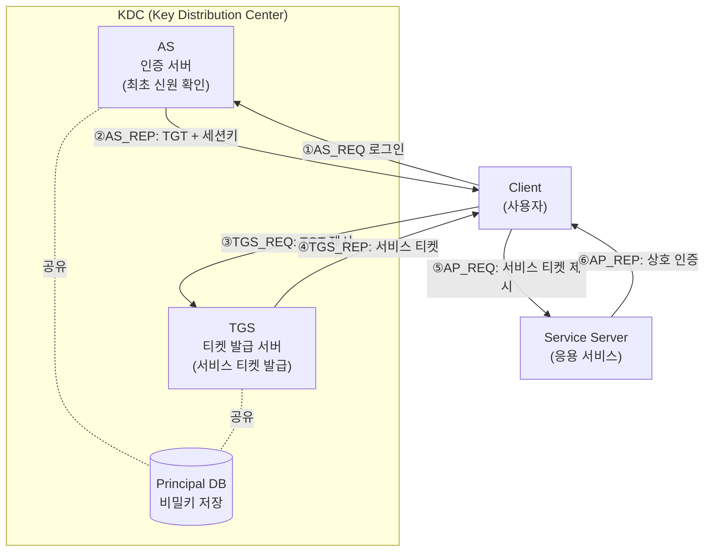
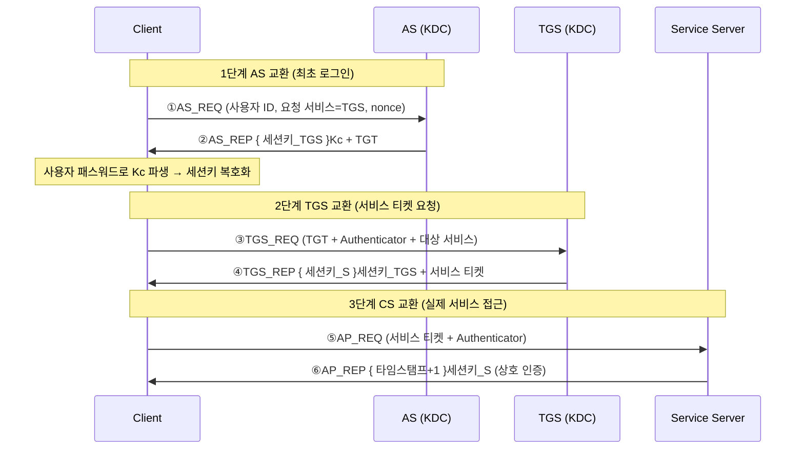

# Kerberos 인증 프로토콜

## 1. 개요

> **Kerberos**는 신뢰할 수 있는 제3자(TTP, Trusted Third Party)인 **KDC(Key Distribution Center)**를 중심으로, 대칭키 암호와 **티켓(Ticket)** 기반 자격증명을 이용해 개방형 네트워크에서 사용자·서비스를 상호 인증하는 **네트워크 인증 프로토콜**이다.

Kerberos는 1980년대 MIT의 Athena 프로젝트에서 시작되어, 신뢰할 수 없는(untrusted) 네트워크 위에서도 안전하게 인증을 수행하기 위해 설계되었다. 이름은 그리스 신화에서 저승의 문을 지키는 머리 셋 달린 개 '케르베로스'에서 따왔는데, 이는 Kerberos가 **클라이언트·서버·KDC**라는 세 주체의 상호작용으로 인증을 성립시킨다는 구조를 은유한다. 현재 널리 쓰이는 버전은 RFC 4120(2005)으로 표준화된 **Kerberos v5**이며, Microsoft **Active Directory** 도메인 인증의 기본 프로토콜이자 리눅스·유닉스 환경의 SSO 기반 기술로 자리 잡았다.

Kerberos가 등장한 근본 배경은 **평문 패스워드 전송의 위험**과 **반복 인증의 비효율**이다. 초기 Telnet·FTP·rlogin 등은 인증할 때마다 네트워크로 패스워드를 흘려보냈고, 스니핑(sniffing)에 무방비였다. 또한 사용자가 여러 서비스에 접근할 때마다 매번 자격을 입력·전송하는 것은 사용성과 보안 모두에 해로웠다. Kerberos는 **패스워드를 네트워크로 전송하지 않고**(패스워드에서 파생한 대칭키로 암호문을 풀 수 있는지로 신원을 증명), **한 번의 로그인으로 여러 서비스에 접근**(SSO)하는 두 가지 목표를 동시에 달성한다.

Kerberos의 설계 철학은 세 가지 원리로 요약된다. 첫째, **대칭키 암호만으로 상호 인증**을 구현해 공개키 기반구조(PKI)의 복잡한 인증서 관리 없이도 동작한다. 둘째, **KDC가 모든 주체의 비밀키를 보관**하는 중앙 신뢰점 역할을 하여, N개 주체가 각자 KDC와만 키를 공유하면 되므로 N×N 개별 키 교환 문제를 회피한다. 셋째, **타임스탬프(timestamp)와 짧은 수명의 티켓**으로 재전송 공격(replay)을 방지한다. 이 세 원리 덕분에 Kerberos는 대규모 조직 내부망에서 확장성 있는 인증 인프라로 기능한다.

Kerberos의 특징을 정리하면 다음과 같다.

- **패스워드 비전송(Passwordless on wire):** 패스워드에서 파생한 대칭키의 복호화 성공 여부로 신원을 확인하며, 패스워드 자체는 네트워크로 보내지 않는다.
- **SSO(Single Sign-On):** 최초 1회 로그인으로 획득한 TGT를 재사용해 여러 서비스 티켓을 받으므로 반복 인증이 불필요하다.
- **상호 인증(Mutual Authentication):** 클라이언트뿐 아니라 서버도 세션키 소유를 증명해 위조 서버(피싱형) 접속을 방지한다.
- **대칭키 기반 확장성:** 각 주체가 KDC와만 키를 공유하면 되어 조직 규모가 커져도 키 관리가 선형으로 유지된다.
- **시간 의존성:** replay 방어를 타임스탬프에 의존하므로 정밀한 시간 동기화가 동작의 전제 조건이 된다.

## 2. Kerberos 구성요소와 전체 구조

Kerberos는 인증을 담당하는 KDC와 이를 이용하는 클라이언트·서비스 서버로 구성된다. KDC는 논리적으로 **AS(Authentication Server, 인증 서버)**와 **TGS(Ticket Granting Server, 티켓 발급 서버)** 두 기능으로 나뉘며, 모든 주체(principal)의 장기 비밀키를 담은 **데이터베이스**를 공유한다. 이 분리 구조가 Kerberos의 핵심으로, AS는 '최초 1회 로그인'을, TGS는 '개별 서비스 접근'을 담당해 패스워드 노출을 최소화한다.

핵심 구성요소를 산문으로 설명하면 다음과 같다.

**가. KDC와 Realm.** KDC는 Kerberos의 심장으로, 조직의 모든 사용자·서비스의 마스터 키를 보관한다. 하나의 KDC가 관장하는 관리 도메인을 **Realm(영역)**이라 하며 관례상 대문자로 표기한다(예: `EXAMPLE.COM`). 한 Realm 안에서는 KDC가 모든 주체의 키를 알고 있으므로 중재자로서 두 낯선 주체 사이의 세션키를 안전하게 분배할 수 있다. 다만 이는 **KDC가 단일 장애점(SPOF)이자 최고가치 표적**임을 의미한다. KDC가 침해되면 Realm 전체 신원이 위조 가능해지므로, 실무에서는 마스터 KDC와 다수의 읽기전용 복제 KDC(slave)를 두어 가용성을 확보하고, KDC 서버를 물리·논리적으로 강하게 격리한다.

**나. Ticket과 TGT.** 티켓은 "이 클라이언트가 이 서비스에 접근해도 좋다"는 것을 KDC가 보증하는 암호화된 자격증명이다. 티켓 내부에는 클라이언트 신원, 세션키, 유효기간, 발급 시각 등이 담기며, **대상 서비스의 비밀키로 암호화**되어 클라이언트는 그 내용을 읽지 못하고 단지 전달만 한다. 특별히 AS가 최초 로그인 시 발급하는 티켓을 **TGT(Ticket Granting Ticket)**라 하는데, 이는 이후 TGS로부터 개별 서비스 티켓을 받기 위한 '만능 통행증'이다. TGT의 도입이 Kerberos의 결정적 아이디어로, 사용자는 로그인 시 단 한 번만 패스워드 파생키를 사용하고 그 뒤로는 TGT만 제시하므로 패스워드가 반복 노출되지 않는다.

**다. 세션키(Session Key)와 Authenticator.** 세션키는 특정 통신 세션 동안만 유효한 임시 대칭키로, KDC가 생성해 양측에 안전하게 전달한다. 클라이언트는 서비스에 접근할 때 티켓과 함께 **Authenticator**를 보내는데, 이는 클라이언트 신원과 **현재 타임스탬프**를 세션키로 암호화한 것이다. 서버는 티켓 안의 세션키로 Authenticator를 복호화해 타임스탬프의 신선도(freshness)를 검증함으로써, 티켓을 가로챈 공격자가 나중에 재전송하는 것을 막는다. 티켓은 재사용 가능하지만 Authenticator는 매 요청 1회용이라는 점이 replay 방어의 핵심이다. 이때 서버는 짧은 시간 창(replay cache) 안에서 이미 본 Authenticator를 기억해 동일 타임스탬프의 중복 제출을 걸러내므로, 시간 창 내 초고속 재전송까지 차단한다.

**라. 티켓 옵션(플래그)과 수명 관리.** 티켓에는 용도를 제어하는 플래그가 붙는다. **renewable(갱신가능)** 티켓은 최대 수명(max renew) 한도 내에서 만료 전 KDC에 재제출해 유효기간을 연장할 수 있어, 장시간 배치 작업 중 재인증을 피하면서도 각 티켓의 절대 수명은 짧게 유지한다. **forwardable(전달가능)** 티켓은 사용자가 접속한 원격 서버가 사용자를 대신해 또 다른 서비스에 접근(위임, delegation)하도록 허용하며, 다계층 애플리케이션(웹→WAS→DB)에서 최종 사용자 신원을 뒤로 전달하는 데 쓰인다. 다만 위임은 서버가 사용자 자격을 대행하는 만큼 오남용 위험이 있어, 실무에서는 **제약 위임(Constrained Delegation)**으로 특정 서비스로만 위임을 한정한다. 티켓 수명은 짧을수록 탈취 피해 창이 줄지만 재발급 부하가 늘어나는 전형적 트레이드오프이므로, 조직은 보안 등급에 따라 TGT 10시간·서비스 티켓 수시간 같은 정책값을 조정한다.

## 3. Kerberos 인증 절차 (상세)

Kerberos v5 인증은 논리적으로 **AS 교환 → TGS 교환 → CS(Client/Server) 교환**의 3단계 6개 메시지로 이뤄진다. 아래 시퀀스는 각 메시지에 어떤 키로 무엇이 암호화되는지를 보여준다.

**가. AS 교환 — 최초 인증과 TGT 획득.** 사용자가 로그인하면 클라이언트는 AS에 자신의 ID와 "TGS 서비스를 이용하겠다"는 요청, 그리고 재전송 방지용 난수(nonce)를 담아 `AS_REQ`를 보낸다. 주목할 점은 **패스워드를 보내지 않는다**는 것이다. AS는 DB에서 사용자 비밀키(패스워드 해시에서 파생, `Kc`)를 꺼내 응답 `AS_REP`를 구성하는데, 여기에는 (ㄱ) 클라이언트와 TGS가 쓸 세션키를 `Kc`로 암호화한 부분과 (ㄴ) TGS의 비밀키로 암호화된 **TGT**가 들어 있다. 클라이언트는 방금 사용자가 입력한 패스워드로 `Kc`를 만들어 (ㄱ)을 복호화하는 데 성공하면 곧 자신이 진짜 사용자임이 증명된다. 만약 패스워드가 틀리면 복호화가 실패하고 인증이 무산되므로, AS는 패스워드 자체를 검증할 필요 없이 '복호화 성공 여부'로 신원을 확인한다. 이 지점이 Kerberos가 패스워드를 네트워크로 흘리지 않으면서 인증하는 원리다.

여기서 실무적으로 유의할 점은, 사전 인증(pre-authentication)이 없던 초기 설계에서는 공격자가 임의 사용자 ID로 `AS_REQ`를 보내 `Kc`로 암호화된 응답을 받아 **오프라인 사전 대입 공격(AS-REP Roasting)**을 시도할 수 있었다는 것이다. 그래서 Kerberos v5는 클라이언트가 요청 시 타임스탬프를 `Kc`로 암호화해 첨부하는 **PA-ENC-TIMESTAMP 사전 인증**을 도입해, 올바른 패스워드를 아는 자만 유효한 요청을 만들도록 강화했다.

**나. TGS 교환 — 서비스 티켓 획득.** 이제 클라이언트는 특정 서비스(예: 파일 서버)에 접근하려 한다. 클라이언트는 앞서 받은 TGT와, 세션키로 암호화한 Authenticator, 그리고 접근 대상 서비스명을 담아 `TGS_REQ`를 보낸다. TGS는 자신의 키로 TGT를 복호화해 그 안의 세션키를 얻고, 그 세션키로 Authenticator를 복호화해 타임스탬프 신선도를 검증한다. 검증에 성공하면 TGS는 새로운 **서비스 세션키**를 생성하고, 이를 (ㄱ) TGT 세션키로 암호화한 부분과 (ㄴ) 대상 서비스의 비밀키로 암호화한 **서비스 티켓**으로 만들어 `TGS_REP`를 반환한다. 이 단계의 묘미는 **패스워드가 다시 필요 없다**는 점이다. 사용자는 로그인 때 한 번만 패스워드를 썼고, 이후 여러 서비스 티켓을 TGT만으로 받아내므로 이것이 곧 SSO의 실현이다.

**다. CS 교환 — 서비스 접근과 상호 인증.** 클라이언트는 서비스 티켓과 새 Authenticator를 담아 서비스 서버에 `AP_REQ`를 보낸다. 서버는 자신의 비밀키로 서비스 티켓을 열어 세션키를 얻고, 그 키로 Authenticator를 복호화해 타임스탬프를 검증한다. 이로써 서버는 클라이언트를 인증한다. 나아가 **상호 인증(mutual authentication)**이 필요하면 서버는 Authenticator의 타임스탬프에 1을 더해 세션키로 암호화한 `AP_REP`를 돌려주며, 클라이언트는 이를 복호화해 서버가 진짜 세션키를 아는(=위조 서버가 아닌) 정당한 서버임을 확인한다. 이후 양측은 확립된 세션키로 기밀·무결성이 보장된 통신을 이어간다.

## 4. 비교 — Kerberos vs. 다른 인증 방식

Kerberos의 위상은 다른 인증 방식과 대비할 때 분명해진다. 아래 표는 보조적 정리이며, 차이가 생기는 이유는 그 아래 문장으로 설명한다.

| 구분 | Kerberos | PKI/인증서(X.509) | SAML/OAuth·OIDC | 단순 패스워드 |
|------|----------|-------------------|------------------|----------------|
| 신뢰 모델 | 대칭키·중앙 KDC(TTP) | 공개키·CA 계층 | IdP 중심 토큰 | 없음(서버 저장) |
| 암호 방식 | 대칭키 | 비대칭키 | 서명 토큰(JWT 등) | 해시 저장 |
| 주 적용 | 조직 내부망 SSO | 인터넷·전자서명 | 웹·클라우드 SSO | 소규모 |
| replay 방어 | 타임스탬프·짧은 티켓 | nonce·서명 | 토큰 만료·nonce | 취약 |
| 확장성 한계 | Realm 경계·시간동기 | 인증서 관리 부담 | IdP 의존 | 매우 낮음 |

Kerberos와 PKI의 근본 차이는 **키 관리 방식**에서 온다. Kerberos는 대칭키라 KDC가 모든 키를 알아야 하므로 조직 경계 안(Realm)에서 강력하지만, 서로 모르는 인터넷상 임의 두 주체 간 인증에는 부적합하다. 반면 PKI는 공개키라 사전에 키를 공유하지 않은 낯선 주체 간에도 CA의 서명으로 신뢰를 전달할 수 있어 인터넷 전자상거래·전자서명에 쓰인다. 따라서 은행 내부 직원 시스템 SSO에는 Kerberos(AD)가, 대외 웹 결제·공인전자서명에는 PKI가 어울린다.

이 차이를 수치로 감각화하면, PKI는 주체 수 N에 대해 각자 인증서 한 장(공개키)이면 충분하지만, 대칭키를 임의 두 주체가 직접 공유하는 방식은 N(N-1)/2개의 키가 필요하다. Kerberos는 이 문제를 KDC라는 중앙점으로 우회해 **N개의 키만으로(각 주체-KDC 간 1개)** 임의 쌍의 인증을 중개하므로, 수천 명 규모 조직에서도 키 관리가 폭증하지 않는다. 이것이 Kerberos가 내부망 대규모 SSO의 사실상 표준이 된 확장성의 근거다.

Kerberos와 SAML/OIDC의 관계는 대체가 아니라 **계층 보완**에 가깝다. Kerberos는 내부망 OS·서비스 레벨 인증에 강하지만 방화벽을 넘는 웹·클라우드 환경에서는 시간 동기 요구와 방화벽 통과 문제로 다루기 어렵다. 그래서 대기업은 사내에서 Kerberos(AD)로 1차 인증한 뒤, **AD FS**나 Keycloak 같은 IdP가 이를 SAML·OIDC 토큰으로 변환해 클라우드 SaaS(예: Microsoft 365, Salesforce)에 연동하는 하이브리드 SSO를 구성한다. 실제로 국내 대다수 금융·공공기관이 이 방식으로 온프레미스 AD와 클라우드 서비스를 연결한다.

## 5. 심화 — 실무 적용, 공격 기법과 방어

Kerberos는 이론적으로 견고한 프로토콜이지만, 실제 보안 사고는 프로토콜의 수학적 결함보다 **운영·구현상의 허점**에서 발생한다. 이 절에서는 가장 널리 쓰이는 구현체인 Active Directory를 중심으로, 대표 공격 기법과 방어, 그리고 암호 알고리즘의 현대화 흐름을 살펴본다.

**가. Active Directory에서의 Kerberos.** Windows 도메인은 도메인 컨트롤러(DC)가 KDC 역할을 하고, 각 서비스는 **SPN(Service Principal Name)**으로 등록되며, 서비스 계정 접근권한은 티켓 내 **PAC(Privilege Attribute Certificate)**에 담긴 그룹 SID로 전달된다. 사용자가 도메인에 로그인하면 TGT를 받고, 공유 폴더·SQL Server·SharePoint 등에 접근할 때마다 배후에서 자동으로 서비스 티켓이 발급되어 사용자는 재로그인 없이 자원을 쓴다. 이것이 조직에서 체감하는 '한 번 로그인하면 다 되는' SSO 경험의 실체다.

**나. 대표 공격과 방어.** Kerberos는 견고하지만 운영 취약점이 공격 표면이 된다. ① **Pass-the-Ticket**은 메모리에서 탈취한 티켓을 재사용하는 공격으로, 티켓 수명 단축과 엔드포인트 보호(자격증명 격리)로 완화한다. ② **Golden Ticket**은 KDC의 마스터 계정 `krbtgt`의 해시를 탈취해 임의의 TGT를 위조하는 치명적 공격으로, `krbtgt` 패스워드를 주기적으로(2회) 재설정하는 것이 사실상 유일한 근본 대응이다. ③ **Silver Ticket**은 특정 서비스 계정 키로 서비스 티켓만 위조하는 국소 공격이며, ④ **Kerberoasting**은 SPN이 걸린 서비스 계정의 서비스 티켓을 요청해 오프라인으로 그 계정 패스워드를 크래킹하는 기법으로, 서비스 계정에 길고 복잡한 패스워드(또는 gMSA, 그룹 관리형 서비스 계정)를 쓰는 것이 방어책이다. 이들 공격은 대부분 **약한 서비스 계정 패스워드·과도한 티켓 수명·krbtgt 관리 소홀**에서 비롯되므로, 방어의 초점은 프로토콜 자체보다 운영 위생에 있다. 아래 표는 주요 공격과 방어를 정리한 것이다.

| 공격 | 원리 | 표적 키 | 핵심 방어 |
|------|------|---------|-----------|
| Pass-the-Ticket | 탈취한 유효 티켓 재사용 | 세션 티켓 | 티켓 수명 단축·자격증명 격리 |
| Golden Ticket | krbtgt 해시로 TGT 위조 | krbtgt | krbtgt 주기적 2회 재설정 |
| Silver Ticket | 서비스 키로 서비스 티켓 위조 | 서비스 계정 | 서비스 계정 키 보호·모니터링 |
| Kerberoasting | 서비스 티켓 오프라인 크래킹 | 서비스 계정 PW | 긴 패스워드·gMSA·AES 강제 |
| AS-REP Roasting | 사전인증 미설정 계정 크래킹 | 사용자 PW | PA-ENC-TIMESTAMP 사전인증 강제 |

**다. 교차 Realm 인증(Cross-Realm).** 대규모·다국적 조직은 여러 Realm으로 나뉘는데, 한 Realm 사용자가 다른 Realm 서비스에 접근하려면 두 KDC가 **Realm 간 신뢰키(inter-realm key)**를 공유해야 한다. 사용자는 자신의 KDC에서 상대 Realm의 TGS를 겨냥한 '교차 Realm TGT'를 받아 상대 Realm KDC에 제시하고, 상대 KDC가 이를 신뢰해 서비스 티켓을 발급한다. Realm이 많아지면 모든 쌍마다 신뢰키를 두는 것이 비현실적이므로, **계층적 신뢰(트리 구조)**나 AD의 트리·포리스트 신뢰 관계로 경로를 단축한다. 실무에서 국내 대기업 그룹사가 모회사·계열사 도메인을 포리스트 신뢰로 묶어 그룹 공통 시스템에 SSO로 접근하게 하는 것이 이 사례다. 다만 신뢰 경로가 길수록 한 Realm의 침해가 연쇄 전파될 위험이 커지므로 신뢰 관계 설계는 보안 경계 설계와 직결된다.

**라. 암호 알고리즘의 현대화.** 과거 Kerberos는 DES·RC4-HMAC 같은 취약 암호를 지원했는데, 이는 Kerberoasting 크래킹을 쉽게 만들었다. 현재 표준은 **AES128/256-CTS-HMAC-SHA1**을 기본으로 하며, RFC 8009는 SHA-2 기반 AES 암호군을 추가했다. 실무에서는 도메인 정책으로 RC4·DES를 비활성화하고 AES만 허용하도록 강제하는 것이 권고된다. 또한 최근 마이크로소프트는 대칭키의 한계를 보완하기 위해 공개키로 초기 인증을 수행하는 **PKINIT** 및 스마트카드·**FIDO2** 연동을 확대하고 있어, Kerberos가 순수 대칭키 모델에서 하이브리드로 진화하고 있음을 보여준다.

**마. 예상 출제 방향과 답안 구성 전략.** 정보관리기술사에서 Kerberos는 단독 25점 논술뿐 아니라 10점 약술(TGT의 역할, AS·TGS 분리 이유), 그리고 SSO·제로 트러스트·AD 보안과 엮인 통합 문제로 자주 변주된다. 답안을 쓸 때는 (ㄱ) 3단계 6메시지 흐름을 **어떤 키로 무엇을 암호화하는지**까지 명시한 시퀀스 다이어그램으로 제시하고, (ㄴ) '패스워드를 왜 안 보내도 인증이 되는가', 'TGT를 왜 도입했는가'라는 **설계 이유를 원리로 서술**하며, (ㄷ) Golden/Silver Ticket·Kerberoasting 같은 **공격-방어 대응**과 시간 동기·krbtgt 관리 같은 운영 이슈로 마무리하면 변별력이 높다. 최근에는 패스워드리스(FIDO2)·하이브리드 SSO·제로 트러스트와의 연계가 심화 논점으로 부상하고 있어, 프로토콜 지식에 더해 아키텍처 관점을 함께 제시하는 것이 고득점 전략이다.

## 6. 고려사항 및 시사점 (기술사 관점)

- **시간 동기화(Time Skew) 관리:** Kerberos는 타임스탬프로 replay를 막으므로 클라이언트·서버·KDC 간 시계 오차가 허용치(기본 5분)를 넘으면 인증이 실패한다. 따라서 **NTP를 이용한 정밀 시간 동기화가 필수 전제**이며, 대규모 분산·글로벌 환경에서는 시간 동기 인프라 자체가 가용성의 핵심 요소가 된다. 이는 Kerberos 도입의 숨은 운영 비용이다.

- **KDC 가용성·기밀성 설계:** KDC는 SPOF이자 최고가치 표적이라는 이중성을 갖는다. 가용성 측면에서는 마스터-복제 KDC 다중화와 지역 분산이, 기밀성 측면에서는 KDC 서버 격리·최소권한·`krbtgt` 주기적 갱신·특권 접근 모니터링이 병행되어야 한다. 트레이드오프로, 복제 KDC를 늘리면 가용성은 오르지만 키가 복제되는 노드가 많아져 공격 표면도 함께 커진다.

- **경계와 연계 전략(하이브리드 SSO):** Kerberos는 내부망에 최적화되어 있어 클라우드·모바일·B2B 환경에는 단독으로 부적합하다. 전망하건대 온프레미스 Kerberos(AD)와 SAML/OIDC IdP를 결합한 **하이브리드 아이덴티티**가 표준 아키텍처가 되며, 나아가 사용자 위치·기기 상태를 매 접근마다 평가하는 **제로 트러스트** 흐름 속에서 Kerberos는 '내부 1차 인증'이라는 역할로 재정의될 것이다.

- **암호 민첩성(Crypto-Agility)과 패스워드리스:** 취약 암호(DES·RC4)를 신속히 폐기하고 AES·SHA-2로 전환할 수 있는 암호 민첩성이 보안 수준을 좌우한다. 중장기적으로는 PKINIT·FIDO2·Windows Hello와 결합한 **패스워드리스** 인증이 확산되어, 패스워드 기반 오프라인 크래킹(Kerberoasting류)의 근본 원인을 제거하는 방향으로 나아갈 것이다. 기술사 관점에서는 프로토콜 선택 못지않게 **운영 위생(계정 관리·티켓 수명·모니터링)이 실제 보안 성패를 가른다**는 점을 답안에서 강조해야 한다.

- **위임(Delegation)의 통제와 최소권한:** forwardable 티켓 기반 위임은 다계층 애플리케이션에서 최종 사용자 신원을 뒤로 전달하는 편의를 주지만, 서버가 사용자 자격을 대행하는 만큼 침해 시 권한 확산의 통로가 된다. 따라서 무제약 위임을 지양하고 **제약 위임·리소스 기반 제약 위임(RBCD)**으로 위임 대상을 특정 서비스로 한정하며, 위임 계정을 상시 감사해 최소권한 원칙을 관철해야 한다. 편의성과 공격 표면 축소 사이의 균형이 위임 설계의 본질이다.

- **모니터링·탐지와 규정 연계:** Kerberos 공격은 정상 프로토콜 흐름을 악용하므로 방화벽만으로는 탐지가 어렵고, 비정상 티켓 요청 패턴(대량 SPN 티켓 요청, RC4 강제 사용, 만료된 계정의 TGT 사용 등)을 SIEM으로 상관분석하는 **행위 기반 탐지**가 필요하다. 또한 계정 관리·접근통제·로그 보존은 ISMS-P·ISO/IEC 27001 등 인증 요구사항과도 직결되므로, Kerberos 운영 정책은 보안 거버넌스 체계 안에서 통합 관리되어야 실질적 준거성을 확보할 수 있다.

## 참고자료

- RFC 4120, "The Kerberos Network Authentication Service (V5)" — https://datatracker.ietf.org/doc/html/rfc4120
- RFC 8009, "AES Encryption with HMAC-SHA2 for Kerberos 5" — https://datatracker.ietf.org/doc/html/rfc8009
- MIT Kerberos Documentation — https://web.mit.edu/kerberos/
- Microsoft, "Kerberos Authentication Overview" — https://learn.microsoft.com/en-us/windows-server/security/kerberos/kerberos-authentication-overview

---

> **한 줄 요약**: Kerberos는 중앙 KDC(AS·TGS)와 대칭키·티켓(TGT)·타임스탬프를 이용해 패스워드를 노출하지 않고 상호 인증과 SSO를 실현하는 내부망 인증 프로토콜로, 시간 동기·KDC 보호·krbtgt 관리 같은 운영 위생과 하이브리드 연계가 실제 보안 성패를 좌우한다.
