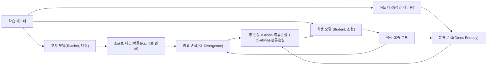
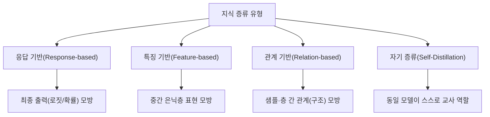

# 지식 증류(Knowledge Distillation)

## 1. 개요

> **지식 증류(Knowledge Distillation)**란 크고 성능이 높은 교사 모델(Teacher)이 학습한 지식을, 상대적으로 작고 가벼운 학생 모델(Student)이 모방하도록 학습시켜, 원본에 근접한 정확도를 유지하면서 파라미터 수·연산량·메모리를 크게 줄이는 **모델 경량화(Model Compression)** 기법이다.

딥러닝 모델의 성능은 대체로 파라미터 규모에 비례해 향상되어 왔다. 그러나 수십억~수천억 파라미터의 대형 모델은 추론 지연(latency)이 크고, GPU 메모리와 전력을 과도하게 소모하며, 스마트폰·IoT·자동차 ECU 같은 엣지 환경에는 그대로 탑재하기 어렵다. 실제로 동일 과제에서 파라미터를 10배 줄이면 추론 비용과 응답 시간이 수배 개선되지만, 단순히 작은 모델을 처음부터(scratch) 학습시키면 표현력 부족으로 정확도가 급락한다. 지식 증류는 이 딜레마를 해결하기 위해 등장했다. 즉 "작은 모델을 잘 학습시키는 것"이 아니라 "이미 잘 학습된 큰 모델의 판단 경향을 물려받게 하는 것"이 핵심 발상이다.

증류가 효과적인 근본 이유는 교사 모델의 출력이 정답 여부(0/1)보다 훨씬 풍부한 정보를 담고 있기 때문이다. 예컨대 손글씨 숫자 '7'을 분류할 때 교사 모델은 "7일 확률 0.92, 1일 확률 0.05, 9일 확률 0.02"처럼 클래스 간 유사도(dark knowledge, 암묵지)를 확률 분포로 표현한다. 정답 레이블 하나만 주는 것보다 이런 **소프트 타깃(Soft Target)**을 함께 학습하면, 학생 모델은 클래스 사이의 관계 구조까지 배워 일반화 성능이 좋아진다. 2015년 힌튼(Hinton) 등이 제안한 이래, 증류는 오늘날 sLLM(경량 언어모델), 온디바이스 AI, 실시간 추론 서비스의 표준 경량화 수단으로 자리 잡았다.

## 2. 지식 증류의 기본 구조와 원리

증류의 학습은 두 개의 손실을 결합해 진행한다. 첫째는 **증류 손실**로, 교사의 소프트 타깃과 학생의 출력 분포 간 차이를 KL 발산(Kullback-Leibler Divergence)으로 최소화한다. 둘째는 일반적인 **분류 손실**로, 실제 정답(하드 타깃)과 학생 출력 간 교차 엔트로피를 최소화한다. 최종 손실은 두 항을 가중치 alpha로 절충하며, 통상 증류 손실에 더 큰 비중을 두어 교사의 판단 경향을 우선 학습시키되 정답 신호로 편향을 교정한다.

이 과정에서 핵심 하이퍼파라미터가 **온도(Temperature, T)**이다. 소프트맥스 함수에 T를 나누어 확률 분포를 완만하게(soften) 만들면, 원래 0에 가깝게 눌려 있던 비정답 클래스들의 미세한 확률 차이가 드러난다. T=1이면 일반 소프트맥스와 같고, T를 2~5 정도로 키우면 클래스 간 상대적 유사도 정보가 증폭되어 학생이 더 풍부한 지식을 흡수한다. 다만 T가 지나치게 크면 분포가 균일해져 오히려 신호가 약해지므로, 검증셋으로 최적값을 탐색해야 한다. 학습 시에는 교사·학생 모두 동일한 T를 적용하고, 배포(추론) 시에는 T=1로 되돌린다.

예를 들어 이미지 분류 벤치마크에서 교사(ResNet-50, 약 2,560만 파라미터)의 지식을 학생(ResNet-18, 약 1,170만 파라미터)에 증류하면, 학생을 단독 학습할 때보다 정확도가 1~3%p가량 회복되면서도 추론 속도는 2배 이상 빨라지는 결과가 보고된다. 자연어 분야에서는 BERT-base(약 1.1억 파라미터)를 증류한 **DistilBERT**가 파라미터를 약 40% 줄이고 추론을 약 60% 가속하면서도 원본 성능의 약 97%를 유지한 사례가 대표적이다.

## 3. 증류 방식의 유형

증류는 학생이 교사의 '무엇을' 모방하느냐에 따라 유형이 나뉜다. **응답 기반 증류**는 교사의 최종 출력(로짓·확률)만을 모방하는 가장 고전적·단순한 방식으로, 교사 내부 구조를 몰라도 되므로 서로 다른 아키텍처 간에도 적용이 쉽다. 다만 최종 출력만 보므로 교사의 내부 추론 과정에 담긴 정보는 활용하지 못한다.

**특징 기반 증류**는 교사의 중간 은닉층(hidden layer) 표현(feature map)까지 학생이 닮도록 유도한다. 학생이 교사의 계층별 표현을 단계적으로 흡수하므로 더 정밀한 지식 전이가 가능하지만, 교사·학생의 층 구조와 차원이 달라 이를 맞추는 투영(projection) 계층이 추가로 필요하고 학습이 복잡해진다. **관계 기반 증류**는 개별 출력이 아니라 데이터 샘플들 사이의 관계나 층 사이의 상관 구조 같은 '관계적 지식'을 전달하여, 교사가 학습한 임베딩 공간의 기하학적 구조를 보존한다.

한편 **자기 증류(Self-Distillation)**는 별도의 큰 교사 없이 동일 모델(또는 깊은 층)이 얕은 층·이전 에폭의 자신을 교사로 삼아 학습하는 변형으로, 교사 학습 비용을 없애면서도 정규화(regularization) 효과로 성능을 끌어올린다. 최근 대형 언어모델에서는 강한 모델이 생성한 답변·추론 과정을 데이터로 만들어 작은 모델을 학습시키는 **시퀀스 수준 증류**나 근거 사슬(rationale)까지 전달하는 **Chain-of-Thought 증류**가 활발히 쓰인다.

| 구분 | 전이 대상 | 장점 | 단점·유의점 |
|------|-----------|------|-------------|
| 응답 기반 | 최종 출력(로짓·확률) | 구현 단순, 이종 구조 간 적용 용이 | 내부 지식 미활용 |
| 특징 기반 | 중간층 표현 | 정밀한 지식 전이 | 층 정합·투영 필요, 복잡 |
| 관계 기반 | 샘플·층 간 관계 | 구조적 지식 보존 | 관계 정의 설계 난이도 |
| 자기 증류 | 자기 자신 | 교사 불필요, 정규화 효과 | 성능 향상 폭 제한적 |

## 4. 유사 경량화 기법과의 비교

지식 증류는 모델 경량화의 여러 축 가운데 하나이며, 실무에서는 **가지치기(Pruning)·양자화(Quantization)**와 함께 상호보완적으로 쓰인다. 세 기법은 접근 방식이 근본적으로 다르다. 가지치기는 기여도가 낮은 가중치·뉴런을 제거해 모델을 '얇게' 만들고, 양자화는 32비트 부동소수를 8비트 정수 등으로 표현해 저장·연산 정밀도를 낮춘다. 반면 증류는 구조 자체를 바꾸기보다 작은 모델을 '더 잘 가르쳐' 성능을 끌어올린다는 점에서 결이 다르다.

세 기법이 성능-효율 트레이드오프에서 서로 다른 지점을 공략하기 때문에, 실제 배포 파이프라인에서는 순차 결합이 흔하다. 예컨대 대형 교사로부터 증류로 소형 학생을 얻고, 그 학생을 가지치기해 불필요한 연결을 제거한 뒤, 마지막으로 양자화해 정수 연산 가속기(NPU)에 올리는 식이다. 이렇게 하면 단일 기법으로는 도달하기 어려운 수준의 압축률과 추론 속도를 확보할 수 있다.

| 기법 | 핵심 원리 | 정확도 영향 | 대표 효과 |
|------|-----------|-------------|-----------|
| 지식 증류 | 큰 모델의 지식을 작은 모델이 모방 | 낮은 손실로 회복 | 원본 성능의 95~97% 유지 사례 |
| 가지치기 | 불필요한 가중치·뉴런 제거 | 과도 시 급락 | 희소화로 크기·연산 축소 |
| 양자화 | 표현 비트수 축소(FP32→INT8) | 소폭 손실 | 메모리 4배↓, NPU 가속 |

## 5. 고려사항 및 시사점

기술사 관점에서 지식 증류의 도입은 단순한 알고리즘 선택이 아니라 **서비스 비용·응답성·정확도·유지보수성의 종합적 트레이드오프 설계**로 접근해야 한다.

- **적용 전략(교사·학생 격차 관리):** 교사와 학생의 용량 격차가 지나치게 크면 학생이 교사를 따라가지 못하는 '용량 간극(capacity gap)' 문제가 발생한다. 이때는 중간 크기의 조교(Teacher Assistant) 모델을 단계적으로 두는 다단계 증류로 격차를 완화하는 전략이 유효하다.

- **품질 트레이드오프와 검증 체계:** 증류된 학생 모델은 평균 정확도는 보존해도 롱테일(희귀) 케이스나 편향·환각(hallucination) 특성이 교사와 달라질 수 있다. 따라서 배포 전 대표 지표뿐 아니라 취약 시나리오·공정성·안전성에 대한 별도 회귀 검증 체계를 갖추어야 한다.

- **데이터·라이선스·거버넌스:** 특히 LLM에서 상용 폐쇄형 모델의 출력을 증류 데이터로 사용하는 것은 서비스 약관상 제약이 있을 수 있어, 데이터 출처와 라이선스에 대한 사전 검토가 필수다. 교사 모델의 편향이 학생에 그대로 전이·증폭될 수 있으므로 데이터 거버넌스 관점의 관리가 요구된다.

- **전망(온디바이스·sLLM 확산):** 온디바이스 AI와 sLLM 수요가 커지면서 증류는 파운데이션 모델의 능력을 엣지로 내리는 핵심 통로가 되고 있다. 향후에는 가지치기·양자화·저순위 적응(LoRA)과 결합된 통합 경량화 파이프라인, 추론 능력(사고 과정)까지 전달하는 증류가 표준화될 것으로 전망된다.

---

> **한 줄 요약**: 지식 증류는 대형 교사 모델의 소프트 타깃(암묵지)을 온도 조절과 KL 손실로 작은 학생 모델에 전이해, 정확도를 최대한 보존하면서 크기·연산·지연을 줄이는 대표적 모델 경량화 기법으로, 가지치기·양자화와 결합해 온디바이스·sLLM 시대의 핵심 배포 전략이 된다.
