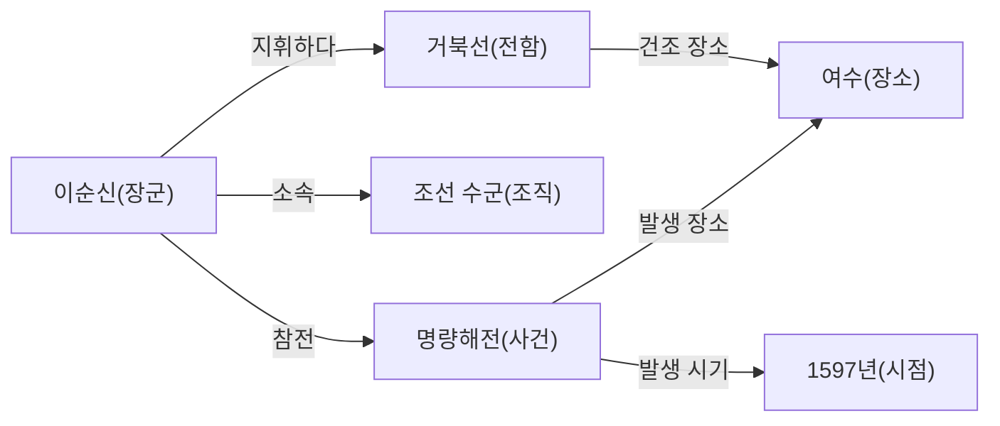
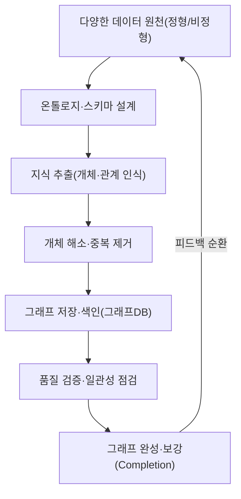
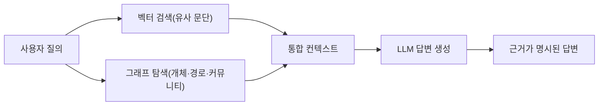

# 지식 그래프(Knowledge Graph)

## 1. 개요

> **지식 그래프**란 현실 세계의 개체(Entity)를 노드로, 개체 사이의 의미적 관계(Relationship)를 엣지로 표현하여 지식을 그래프 구조로 조직화한 지식 표현·저장 체계이다. 일반적으로 `주어(Subject)–술어(Predicate)–목적어(Object)`의 **트리플(Triple)** 단위로 사실을 기술하고, 이를 대규모로 연결해 기계가 추론·질의할 수 있는 형태로 만든 것을 말한다.

관계형 데이터베이스는 데이터를 정형화된 표에 담아 정확한 값 조회에는 강하지만, "A와 B는 어떤 관계로 몇 단계 떨어져 연결되어 있는가"와 같은 **연결 중심(Connection-centric)** 질의에는 다수의 조인이 필요해 비효율적이고, 스키마가 경직되어 새로운 관계 유형을 유연하게 담기 어렵다. 반면 현실의 지식은 사람–조직–장소–사건이 복잡하게 얽힌 그물망 형태이며, 검색·추천·질의응답·사기탐지처럼 "관계 그 자체가 곧 가치"인 문제가 늘어났다. 지식 그래프는 이러한 공백, 즉 **의미(Semantics)와 연결(Connectivity)을 일급 시민으로 다루는 지식 기반**의 필요성에서 등장하였다.

지식 그래프가 주목받게 된 직접적 계기는 2012년 구글이 검색에 도입한 "Knowledge Graph"로, 문자열 매칭을 넘어 "사물(Things)을 이해하는" 검색으로의 전환을 상징하였다. 최근에는 대규모 언어모델(LLM)의 환각(Hallucination)을 억제하고 사실 근거를 제공하는 **GraphRAG**의 기반 지식원으로 재조명되면서, 지식 그래프는 데이터 통합·시맨틱 검색·설명가능 AI를 잇는 핵심 인프라로 자리 잡고 있다.

## 2. 전체 구조와 구성 요소

지식 그래프는 크게 **개체(노드)**, **관계(엣지)**, **속성(Property)**, 그리고 이들이 따르는 **온톨로지/스키마(Ontology)** 로 구성된다. 개체는 '이순신', '거북선'처럼 세계에 존재하는 대상이고, 관계는 '건조하다', '지휘하다'처럼 개체를 잇는 의미적 연결이다. 속성은 개체나 관계에 부착된 부가 정보(생몰년, 위치 등)이며, 온톨로지는 "장군은 사람이다", "사람은 조직에 소속될 수 있다"와 같이 개념의 종류와 관계의 규칙을 정의하는 상위 스키마로서 추론의 근거가 된다.

위 그림처럼 하나의 사실은 트리플(예: `이순신–지휘하다–거북선`)로 표현되고, 트리플이 누적되면 개체 간에 **다단계 경로(Multi-hop Path)** 가 형성된다. 이 경로 탐색 능력이 지식 그래프의 본질적 강점으로, "이순신이 참전한 사건이 벌어진 장소는?"과 같은 질의를 조인 폭발 없이 그래프 순회로 답할 수 있게 한다.

### 가. 개체와 관계, 그리고 식별자

개체를 신뢰성 있게 다루려면 **전역 고유 식별자(URI/IRI)** 로 개체를 유일하게 지칭하는 것이 중요하다. 동명이인이나 표기 차이('IBM'과 'International Business Machines')를 하나의 개체로 묶는 **개체 해소(Entity Resolution)** 가 부실하면 같은 대상이 여러 노드로 쪼개져 그래프의 사실성이 무너진다. 따라서 지식 그래프 구축에서 개체 식별·정규화는 데이터 품질의 출발점이며, 위키데이터의 Q-식별자처럼 표준 식별자 체계를 연결(Linking)하면 외부 지식과의 상호운용성이 크게 높아진다.

### 나. 온톨로지와 추론

온톨로지는 지식 그래프에 "의미의 규칙"을 부여한다. 예를 들어 "부모의 부모는 조부모"라는 규칙(관계 합성)이나 "모든 장군은 사람"이라는 계층(subClassOf) 정의가 있으면, 명시적으로 저장되지 않은 사실도 **논리적 추론(Reasoning)** 으로 도출할 수 있다. 이는 저장 공간을 절약하고 데이터 일관성을 검증하는 수단이 되며, 단순 데이터 저장을 넘어 "지식"으로 격상시키는 핵심 장치다. 온톨로지 표현에는 표현력이 낮지만 가벼운 RDFS부터, 복잡한 제약과 추론을 지원하는 OWL(Web Ontology Language)까지 스펙트럼이 존재한다.

## 3. 표현 모델: RDF와 속성 그래프(LPG)

지식 그래프를 실제 구현하는 데이터 모델은 크게 두 계열로 나뉜다. 하나는 W3C 시맨틱 웹 표준을 따르는 **RDF(Resource Description Framework)** 계열이고, 다른 하나는 산업계에서 널리 쓰이는 **속성 그래프(LPG, Labeled Property Graph)** 계열이다. 두 모델은 같은 지식을 표현하지만 철학과 강점이 달라, 상황에 맞는 선택이 중요하다.

RDF는 모든 사실을 트리플로 환원하고 전역 URI로 개체를 식별하기에 **데이터 통합과 표준 기반 상호운용**에 강하다. 질의어로는 SPARQL을 쓰고, OWL을 통한 형식적 추론이 가능해 학술·공공·의료처럼 표준과 정합성이 중요한 영역에 적합하다. 반면 관계 자체에 속성을 붙이기 어려워(예: '근무하다' 관계에 '기간' 속성) 표현이 다소 번거롭다.

속성 그래프(LPG)는 노드와 엣지 모두에 자유롭게 키-값 속성을 부여할 수 있어 **모델링이 직관적이고 유연**하다. Neo4j의 Cypher 같은 질의어로 경로 탐색을 간결하게 표현할 수 있어, 추천·사기탐지·네트워크 분석 등 그래프 알고리즘을 활발히 적용하는 실무 시스템에서 선호된다. 다만 전역 식별자와 형식 온톨로지 표준이 약해 서로 다른 조직 간 통합에서는 RDF만큼의 상호운용성을 갖기 어렵다.

| 구분 | RDF(트리플) | 속성 그래프(LPG) |
|---|---|---|
| 기본 단위 | 주어–술어–목적어 트리플 | 속성을 가진 노드·엣지 |
| 식별 방식 | 전역 URI/IRI | 내부 노드/엣지 ID |
| 질의어 | SPARQL | Cypher, Gremlin, GQL |
| 추론/표준 | OWL·RDFS로 형식 추론 강함 | 표준 추론 약함, 알고리즘 강함 |
| 강점 | 데이터 통합·상호운용 | 유연한 모델링·경로 탐색 |
| 대표 사례 | 위키데이터, DBpedia | Neo4j, TigerGraph |

두 모델의 차이는 "표준 준수를 통한 개방형 통합이 우선인가, 응용 성능과 개발 생산성이 우선인가"라는 목적의 차이에서 비롯된다. 최근에는 ISO의 그래프 질의 표준인 **GQL(2024년 국제표준 제정)** 과 RDF에 관계 속성을 허용하는 RDF-star 등이 등장하며 두 진영의 간극이 좁혀지는 추세다.

## 4. 구축 절차와 핵심 기술

지식 그래프 구축은 일회성 작업이 아니라 지속적으로 지식을 수집·정제·확장하는 파이프라인으로 운영된다. 전형적 절차는 데이터 원천 식별 → 온톨로지 설계 → 지식 추출 → 개체 해소·정합 → 저장·색인 → 품질검증·확장의 순환이다.

이 파이프라인에서 기술적으로 가장 어려운 단계는 **지식 추출**과 **개체 해소**다. 비정형 텍스트에서 개체명 인식(NER)과 관계 추출(RE)을 통해 트리플을 뽑아내야 하는데, 문장의 중의성과 표현 다양성 때문에 오류가 발생하기 쉽다. 근래에는 LLM을 활용해 문서에서 개체·관계를 자동 추출하는 방식이 확산되어 구축 비용을 크게 낮추고 있으나, LLM이 만들어낸 트리플의 사실성 검증이라는 새로운 과제를 남긴다.

또한 실제 지식 그래프는 필연적으로 불완전(누락된 관계 존재)하므로, 기존 구조를 학습해 빠진 링크를 예측하는 **지식 그래프 임베딩(TransE, RotatE 등)** 과 그래프 신경망(GNN) 기반의 **링크 예측·그래프 완성(Completion)** 기술이 함께 쓰인다. 예컨대 전자상거래 그래프에서 '고객–구매–상품' 패턴을 학습하면 아직 연결되지 않은 고객–상품 간 선호를 추론해 추천에 활용할 수 있다.

## 5. 활용 사례와 GraphRAG (심화)

지식 그래프는 이미 산업 전반에서 활용된다. 검색 엔진은 지식 그래프로 검색 결과 옆의 정보 패널을 구성하고, 전자상거래는 상품·고객·행동 그래프로 개인화 추천을 수행하며, 금융권은 계좌·거래·소유 관계 그래프에서 다단계 자금 흐름을 추적해 이상거래·자금세탁을 탐지한다. 의료·제약에서는 유전자–질병–약물 관계 그래프로 신약 후보를 발굴한다. 이들의 공통점은 **"숨은 연결을 드러내는 것"이 곧 비즈니스 가치**라는 점이다.

가장 주목받는 심화 응용은 **GraphRAG**다. 전통적 RAG는 문서를 벡터로 임베딩해 유사 문단을 검색하지만, 여러 문서에 흩어진 사실을 종합해야 하는 다단계 추론에는 약하다. GraphRAG는 원천 문서로부터 지식 그래프를 구축하고, 질의와 관련된 개체의 이웃·경로·커뮤니티 요약을 함께 검색해 LLM에 제공한다. 이렇게 하면 근거의 출처가 그래프 상에 명시되어 **설명가능성(Explainability)** 과 **사실성**이 높아지고, "여러 사건에 공통으로 등장하는 인물은 누구인가"처럼 벡터 검색만으로는 어려운 전역적(Global) 질의에도 대응할 수 있다.

이처럼 벡터 데이터베이스가 "의미적 유사성"을 담당하고 지식 그래프가 "명시적 관계와 사실"을 담당하는 **하이브리드 지식 검색**이 최신 흐름이다. 다만 그래프 구축·유지의 비용과 그래프 품질이 답변 품질을 좌우하므로, 도입 시에는 대상 도메인이 관계 중심 질의를 실제로 요구하는지 선별하는 판단이 선행되어야 한다.

## 6. 고려사항 및 시사점

첫째, **품질 거버넌스**가 핵심이다. 지식 그래프의 가치는 사실성과 완전성에 비례하므로, 개체 해소·중복 제거·출처 관리·주기적 검증을 포함한 데이터 거버넌스 체계를 함께 설계해야 한다. LLM 자동 추출을 도입할 경우 사람 검수와 신뢰도 스코어링을 결합한 인간-기계 협업(Human-in-the-loop) 절차가 필요하다.

둘째, **모델·플랫폼 선택의 트레이드오프**를 명확히 해야 한다. 표준 기반 개방형 통합과 형식 추론이 중요하면 RDF/OWL을, 응용 성능과 개발 생산성·그래프 알고리즘이 중요하면 속성 그래프를 택하되, GQL·RDF-star 등 수렴 표준을 주시하며 종속(Lock-in)을 경계해야 한다. 초대규모에서는 그래프 파티셔닝과 분산 처리 성능도 선정 기준에 포함된다.

셋째, **LLM과의 상보적 결합** 전략이 유효하다. LLM은 유연한 자연어 이해와 생성을, 지식 그래프는 검증 가능한 사실과 관계를 제공하므로, 지식 그래프로 LLM의 환각을 억제하고 역으로 LLM으로 지식 그래프를 확장하는 선순환을 설계하면 신뢰성과 확장성을 동시에 얻을 수 있다.

넷째, **점진적 도입과 ROI 관점**이 필요하다. 전사 지식 그래프를 한 번에 구축하려는 시도는 비용·기간 측면에서 실패 위험이 크다. 관계 중심 질의가 뚜렷한 특정 도메인(사기탐지·추천 등)에서 좁게 시작해 가치를 검증한 뒤 확장하는 것이 바람직하며, 유지보수 조직과 온톨로지 관리 책임을 명확히 하는 운영 거버넌스가 성공의 관건이다.

## 참고자료

- Google, "Introducing the Knowledge Graph: things, not strings" — https://blog.google/products/search/introducing-knowledge-graph-things-not/
- W3C RDF 1.1 Primer — https://www.w3.org/TR/rdf11-primer/
- Microsoft Research, "GraphRAG" — https://microsoft.github.io/graphrag/
- ISO/IEC 39075:2024 GQL (Graph Query Language) — https://www.iso.org/standard/76120.html

---
> **한 줄 요약**: 지식 그래프는 개체와 관계를 트리플·그래프로 표현해 의미와 연결을 일급으로 다루는 지식 기반으로, RDF와 속성 그래프 모델·온톨로지 추론·그래프 임베딩을 축으로 검색·추천·사기탐지에 활용되며, 최근 GraphRAG로 LLM의 환각을 억제하는 설명가능한 지식원으로 재부상하고 있다.
