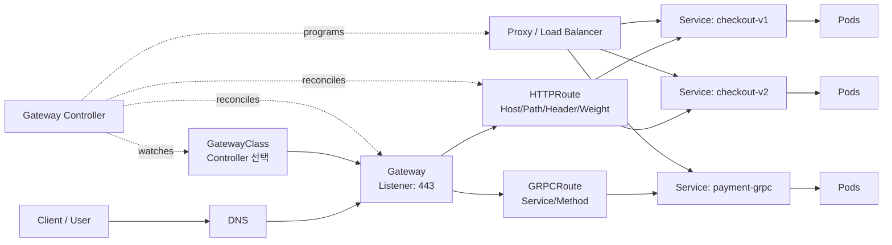
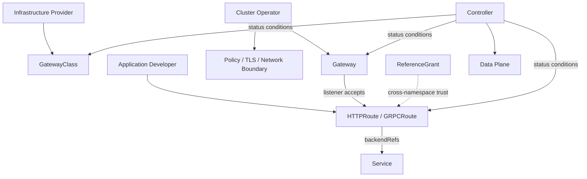

# Kubernetes Gateway API 기반 클라우드 네이티브 트래픽 관리

## 1. 개요

> **정의**: Kubernetes Gateway API는 클러스터 외부 또는 클러스터 내부의 트래픽을 Gateway와 Route라는 선언적 리소스로 연결하고, 인프라 담당자·클러스터 운영자·애플리케이션 개발자의 책임을 분리하는 확장형·프로토콜 인지형 서비스 네트워킹 API이다.

Kubernetes의 초기 외부 트래픽 표준은 Ingress였다. Ingress는 호스트와 경로를 Service에 매핑하는 단순한 HTTP 진입 모델을 제공했지만, 구현체별 어노테이션에 의존하는 순간 이식성과 운영 일관성이 낮아졌다. 트래픽 분할, 헤더 기반 라우팅, 다중 프로토콜, 조직별 권한 분리를 표현하려면 각 Ingress Controller의 독자 설정을 익혀야 했다.

Gateway API는 이 문제를 단순히 “더 많은 필드를 가진 Ingress”로 해결하지 않는다. 인프라를 생성하거나 선택하는 객체와 애플리케이션 트래픽 규칙을 작성하는 객체를 분리하여, 조직의 실제 운영 경계가 Kubernetes 리소스 모델에 반영되도록 한다. 따라서 플랫폼 팀은 GatewayClass와 Gateway를 관리하고, 서비스 팀은 HTTPRoute나 GRPCRoute를 관리하는 협업이 가능하다.

Gateway API 자체는 데이터 플레인 프록시가 아니다. Kubernetes에 내장된 단일 로드밸런서도 아니며, Gateway API를 구현하는 컨트롤러가 리소스를 읽고 Envoy, NGINX, 클라우드 로드밸런서, 하드웨어 장비 등의 실제 설정으로 번역한다. 이 구분을 놓치면 YAML이 적용되었다는 사실만으로 트래픽 처리가 보장된다고 오해하게 된다.

2026년 9월 25일 기준 공식 문서에서는 GatewayClass, Gateway, HTTPRoute, GRPCRoute를 안정 API 종류로 설명하고, 공식 프로젝트 릴리스 페이지에는 v1.6.2가 최신 릴리스로 표시된다. 실제 도입 시에는 컨트롤러가 지원하는 Gateway API 버전과 각 필드의 지원 수준을 별도로 확인해야 한다.

### 1.1 등장 배경과 필요성

첫째, 플랫폼과 애플리케이션의 변경 주기가 다르다. 플랫폼 담당자는 공용 외부 IP, TLS 인증서, 방화벽, L4/L7 프록시와 같은 기반을 안정적으로 운영해야 한다. 반면 애플리케이션 담당자는 `/checkout`을 새 버전으로 10%만 보내거나 특정 헤더를 가진 요청만 실험 서비스로 보내는 등 빈번한 변경을 수행한다. 하나의 Ingress 객체에 두 관심사가 섞이면 권한이 과도하게 부여되거나 변경 충돌이 발생한다.

둘째, 마이크로서비스가 늘면서 HTTP 외의 트래픽도 중요해졌다. gRPC는 HTTP/2를 기반으로 서비스 간 통신을 수행하고, TLS passthrough나 TCP 기반 장비 연동은 단순한 HTTP 경로 규칙만으로 표현하기 어렵다. Gateway API는 공통 리소스 관계를 유지하면서 프로토콜별 Route를 확장하는 방향을 취한다.

셋째, 선언형 운영은 “무엇을 원하는가”와 “어떻게 구현하는가”를 분리할 때 효과가 커진다. HTTPRoute는 `/v1` 요청을 어느 Service로 보낼지를 선언하지만, 컨트롤러는 동일한 의도를 데이터 플레인의 구현 방식에 맞게 변환한다. 이식성은 모든 구현 세부가 같다는 뜻이 아니라, 표준으로 표현 가능한 공통 의도가 구현체 사이에서 이동할 수 있다는 뜻이다.

### 1.2 답안의 핵심 관점

기술사 답안에서는 리소스 이름을 나열하는 것보다 “책임 분리 → 신뢰 경계 → 컨트롤러 조정 → 데이터 플레인 반영 → 상태 관측”의 흐름을 설명하는 것이 중요하다. 특히 Gateway API의 `spec`은 희망 상태이고, `status`의 조건과 컨트롤러 이벤트는 실제 수렴 상태를 나타낸다는 점을 구분해야 한다.

또한 Gateway API가 Ingress를 즉시 폐기한다는 식으로 서술하면 부정확하다. Kubernetes 공식 문서는 Ingress API가 안정 상태로 유지되고 제거 계획은 없지만, API가 동결되어 신규 기능 개발은 Gateway API를 권장한다고 설명한다. 따라서 현실적인 전략은 기존 Ingress를 보존하면서 신규 서비스부터 Gateway API를 적용하고, 기능·성능·운영 지표를 확인한 뒤 점진적으로 전환하는 것이다.

## 2. 개념도와 전체 아키텍처

위 구조에서 `GatewayClass`는 특정 구현 컨트롤러가 제공하는 Gateway의 종류를 나타낸다. 예를 들어 같은 클러스터에서 공용 인터넷용 클래스와 사설망용 클래스를 분리하면, 애플리케이션 팀이 임의로 공용 로드밸런서를 만들지 못하게 할 수 있다. `GatewayClass`가 곧 실행 인스턴스는 아니며, 공통 정책과 컨트롤러 선택의 기준이라는 점이 핵심이다.

`Gateway`는 실제 트래픽을 받을 논리적 진입점이다. 리스너별 주소, 포트, 프로토콜, 인증서 참조, Route 수용 범위를 선언한다. 클라우드 로드밸런서 하나일 수도 있고, 클러스터 안의 프록시 인스턴스일 수도 있으므로 “Gateway 객체 하나 = 특정 제품의 프록시 한 대”로 고정해서는 안 된다.

`HTTPRoute`는 Gateway 리스너에서 Service로 가는 HTTP 규칙을 표현한다. 호스트, 경로, 헤더 매칭과 백엔드 가중치 같은 조건을 리소스 필드로 나타내므로, 구현체별 어노테이션보다 검증과 리뷰가 쉽다. 다만 특정 컨트롤러가 모든 선택 필드를 같은 수준으로 지원하는 것은 아니므로, conformance와 구현체 문서를 함께 확인해야 한다.

`GRPCRoute`는 gRPC 서비스와 메서드 단위의 의도를 모델링한다. gRPC는 HTTP/2 스트림과 상태 코드, 장기 연결을 사용하므로 단순 HTTP 프록시 설정을 복사하는 것만으로는 충분하지 않다. Gateway 구현체가 HTTP/2 및 gRPC 관련 기능을 실제로 지원하는지, 타임아웃과 재시도 정책이 스트림 의미를 훼손하지 않는지를 검증해야 한다.

### 2.1 리소스 관계와 책임 경계

Gateway API의 역할 지향 모델은 RBAC와 함께 설계되어야 한다. 인프라 제공자는 여러 테넌트가 사용할 GatewayClass를 정의하고, 클러스터 운영자는 Gateway의 주소와 리스너·인증서·수용 정책을 관리한다. 애플리케이션 개발자는 자신이 담당하는 네임스페이스의 Route만 변경하도록 권한을 제한할 수 있다.

이 분리가 자동으로 안전한 것은 아니다. 개발자에게 Gateway 수정 권한까지 주면 역할 모델의 장점이 사라지고, 운영자에게 모든 Route 권한을 요구하면 배포 속도가 느려진다. 조직의 변경 승인 체계에 맞춰 리소스별 `get`, `list`, `watch`, `create`, `update` 권한을 세분화하고, GitOps 저장소의 디렉터리 소유권과 Kubernetes RBAC를 일치시켜야 한다.

Route가 다른 네임스페이스의 Service를 참조하거나 다른 네임스페이스의 Gateway에 붙는 경우에는 신뢰 경계를 명시해야 한다. 기본값을 같은 네임스페이스로 두고, 필요한 경우 `allowedRoutes`, `ReferenceGrant`와 같은 명시적 허용을 사용한다. 교차 네임스페이스를 편리한 기본값으로 열어 두면 하나의 팀이 다른 팀의 트래픽 경로를 가로채거나 민감한 백엔드로 연결할 위험이 커진다.

### 2.2 제어 플레인과 데이터 플레인

컨트롤러는 Gateway API 객체를 감시하고, 의존 관계를 계산한 다음 데이터 플레인 설정을 조정한다. 이 과정은 비동기적이므로 `kubectl apply`가 성공해도 DNS 전파, 인증서 준비, 로드밸런서 프로비저닝, 프록시 재구성이 끝났다는 뜻은 아니다. 운영자는 리소스의 `status.parents`, `Accepted`, `Programmed`, `ResolvedRefs` 조건과 컨트롤러 로그를 함께 확인해야 한다.

데이터 플레인은 실제 패킷을 처리한다. L4 로드밸런서, L7 리버스 프록시, 서비스 메시의 사이드카, 커널 기반 전달 계층 등 구현은 다양하다. 같은 HTTPRoute라도 데이터 플레인의 TLS 종료 위치, 연결 재사용, 버퍼링, 재시도 방식에 따라 지연과 장애 양상이 달라지므로 성능 시험은 반드시 실제 구현체 기준으로 수행한다.

컨트롤러는 선언 상태와 관측 상태의 차이를 줄이는 조정 루프를 가진다. Route가 삭제되면 프록시의 낡은 경로가 제거되어야 하고, 백엔드 Service의 EndpointSlice가 바뀌면 대상 엔드포인트도 갱신되어야 한다. 장애 시에는 마지막으로 정상 반영된 설정과 현재 희망 상태의 차이를 추적할 수 있도록 이벤트, 설정 버전, 변경자, Git 커밋을 연결해야 한다.

## 3. 주요 리소스와 트래픽 처리 절차

### 3.1 GatewayClass

`GatewayClass`는 Gateway를 관리할 컨트롤러를 선택하는 클래스다. StorageClass와 유사하게 플랫폼이 제공하는 구현 종류를 추상화하지만, 실제 지원 기능과 비용, 네트워크 위치, TLS 처리 방식은 컨트롤러마다 다르다. 이름만 보고 기능이 동일하다고 가정하지 말고, 구현체의 conformance 결과와 운영 제약을 서비스 카탈로그에 기록해야 한다.

GatewayClass의 `parametersRef`는 구현체별 추가 설정을 연결하는 확장 지점으로 사용될 수 있다. 이때 모든 팀이 임의의 파라미터를 지정하게 하면 플랫폼 정책이 우회될 수 있으므로, 허용된 파라미터 종류와 값의 범위를 정책으로 제한해야 한다. 플랫폼 팀은 표준 필드와 구현체 확장을 구분해 문서화하는 것이 바람직하다.

### 3.2 Gateway와 Listener

`Gateway`는 하나 이상의 리스너로 수신 조건을 선언한다. 리스너는 포트와 프로토콜, 호스트명, 인증서 참조, Route 수용 규칙을 조합한다. 같은 포트에서 여러 호스트를 운영하는 경우 호스트명과 인증서 선택이 일치하는지 확인하고, TLS 종료를 Gateway에서 할지 백엔드까지 전달할지 보안 요구와 성능 요구를 함께 비교해야 한다.

Gateway 주소는 컨트롤러가 프로비저닝한 외부 IP나 DNS 이름으로 `status.addresses`에 보고될 수 있다. DNS 레코드는 이 주소의 준비 상태를 확인한 뒤 연결해야 하며, 클라우드 로드밸런서 비용과 IP 고갈, 예약 주소 정책도 설계에 포함한다. 내부 전용 Gateway와 외부 공개 Gateway를 별도 클래스로 나누면 사고 범위를 줄일 수 있다.

### 3.3 HTTPRoute

`HTTPRoute`는 `parentRefs`로 상위 Gateway를 가리키고, `hostnames`와 `rules`로 라우팅 의도를 선언한다. 하나의 규칙은 경로·헤더·쿼리 등 매칭 조건과 백엔드 참조, 필터, 가중치를 조합한다. 매칭 우선순위가 복잡해질수록 규칙 간 겹침을 테스트해야 하며, “더 구체적인 경로가 먼저 적용된다”는 기대를 구현체의 공식 동작과 테스트 결과로 확인해야 한다.

트래픽 분할은 카나리 배포에 유용하다. 예를 들어 v1 Service에 90, v2 Service에 10의 가중치를 주면 신규 버전에 일부 트래픽을 보낼 수 있다. 하지만 가중치는 요청 수 기준의 논리적 비율이지 사용자별 세션 고정이나 금액별 분배를 자동 보장하지 않는다. 결제처럼 재시도와 상태 일관성이 중요한 요청은 사용자 식별자 기반 일관성, 애플리케이션 중복 처리, 관측 지표를 별도로 설계해야 한다.

필터는 요청·응답 헤더 수정, 리다이렉트, URL 재작성, 요청 미러링 등 구현체가 지원하는 동작을 제공한다. 필터의 순서와 상호작용이 프로토콜·프록시별로 다를 수 있으므로, 인증 헤더를 삭제한 뒤 백엔드로 보내는지, 원본 호스트와 전달 호스트를 어떤 순서로 변경하는지 테스트해야 한다.

### 3.4 GRPCRoute와 확장 Route

`GRPCRoute`는 서비스와 메서드 단위의 매칭을 제공해 gRPC API의 경계에 맞는 정책을 작성할 수 있다. 단, 스트리밍 RPC는 일반적인 짧은 HTTP 요청과 수명·재시도 의미가 다르다. 연결이 끊겼을 때 자동 재시도하면 서버 측 부작용이 중복될 수 있으므로, 멱등성·deadline·클라이언트 재연결 정책을 함께 검토해야 한다.

TCPRoute, TLSRoute, UDPRoute처럼 추가 프로토콜을 다루는 리소스는 채널과 버전별 성숙도가 다를 수 있다. 안정 채널에 포함되지 않은 리소스는 기능이 풍부하더라도 API 변경 가능성이 있으며, 프로덕션 적용 전에는 실험 채널 설치 여부와 업그레이드·롤백 경로를 점검해야 한다. 표준 채널과 실험 채널을 같은 클러스터에서 혼용할 때 CRD 버전 충돌도 주의한다.

### 3.5 Route 연결과 신뢰 모델

Route는 `parentRefs`로 Gateway 또는 리스너를 지정하고, Gateway 리스너는 자신이 수용할 Route의 종류와 네임스페이스 범위를 판단한다. 이 양방향 조건은 애플리케이션이 임의의 공용 Gateway에 Route를 붙이는 문제를 줄이는 안전장치다. Route가 존재한다는 것만으로 데이터 플레인에 반영되었다고 보지 말고 `Accepted`와 `Programmed` 상태를 확인해야 한다.

동일 네임스페이스 연결은 운영이 단순하지만, 공용 플랫폼 네임스페이스의 Gateway를 여러 서비스 네임스페이스가 공유하면 교차 네임스페이스 연결이 필요해진다. 이때 허용 네임스페이스 라벨, ReferenceGrant 승인, 서비스 계정 권한, 변경 리뷰를 함께 사용해야 한다. 네임스페이스 이름만 믿는 것보다 팀·환경·데이터 등급을 나타내는 라벨과 정책을 조합하는 편이 안전하다.

## 4. 운영 아키텍처와 보안 설계

### 4.1 TLS와 인증서

외부 TLS 종료를 Gateway에서 수행하면 중앙 인증서 관리와 공통 보안 정책을 적용하기 쉽다. 반대로 백엔드까지 종단 간 암호화가 필요하면 TLS passthrough 또는 Gateway에서 백엔드로의 재암호화를 선택할 수 있다. 두 방식은 가시성, 인증서 관리 지점, 암호화 오버헤드, 애플리케이션의 원본 클라이언트 정보 전달 방식이 다르다.

인증서 참조는 네임스페이스 경계를 넘을 수 있으므로 참조 허용을 명시해야 한다. 인증서 만료일을 모니터링하고, 갱신 중 리스너가 `Programmed` 상태를 잃지 않는지 검증한다. TLS 1.2 이상, 허용 암호군, SNI와 호스트명 일치, 폐기·유출 시 긴급 교체 절차를 운영 표준으로 정의해야 한다.

### 4.2 인증·인가와 정책 집행

Gateway API는 트래픽 경로와 리소스 관계를 모델링하지만, 사용자 인증·인가·세밀한 API 정책을 전부 표준화하지는 않는다. JWT 검증, OAuth2 연동, WAF, rate limit, mTLS, 요청 크기 제한은 컨트롤러·정책 확장·서비스 메시·외부 보안 장비 중 적합한 계층에 배치한다. 표준 Route와 구현체 확장을 한 문서 안에서 구분하지 않으면 다른 컨트롤러로 이동할 때 보안 통제가 사라질 수 있다.

정책의 기본값은 거부에 가깝게 잡는다. 공개할 호스트와 경로, 허용 메서드, 백엔드 포트, CORS 출처, 최대 요청 크기를 명시하고, 명시되지 않은 요청은 404·403·429 등 의도한 상태로 종료해야 한다. 특히 관리용 경로를 같은 Gateway에 올릴 때는 별도 리스너·별도 Gateway·네트워크 정책으로 관리면을 분리하는 방안을 우선 검토한다.

### 4.3 관측성과 장애 대응

최소 관측 항목은 요청량, 성공률, 4xx·5xx 비율, p50/p95/p99 지연, TLS 핸드셰이크 오류, 활성 연결, 백엔드 Endpoint 상태다. 가중치 기반 카나리에서는 버전별 요청 비율과 오류·지연을 함께 보아야 하며, 전체 평균만 보면 소량 트래픽의 장애를 놓칠 수 있다.

분산 추적에서는 Gateway에서 생성·전달하는 trace context와 원본 요청 ID를 서비스 로그에 연결한다. 로그에는 호스트, 경로 템플릿, Route 이름, Gateway 이름, 백엔드 Service, 응답 코드, 정책 결정 결과를 남기되, 토큰·개인정보·민감한 쿼리 값은 마스킹한다. 컨트롤러 로그와 데이터 플레인 로그의 시간 동기화도 장애 원인 분석에 필수다.

변경 전에는 `kubectl diff`, 정적 스키마 검증, conformance 테스트, 정책 테스트, 합성 트래픽을 순서대로 실행한다. 변경 후에는 Route의 `status`와 실제 프록시 설정, DNS·인증서·백엔드 연결을 확인한다. 롤백은 Git 커밋 되돌리기만으로 충분하지 않을 수 있으므로 이전 CRD·컨트롤러·데이터 플레인 버전의 호환성을 사전에 확인한다.

## 5. 비교 분석

### 5.1 Ingress와 Gateway API

Ingress는 단순한 HTTP/HTTPS 외부 노출에는 여전히 유효하다. 안정 API이고 기존 컨트롤러 생태계가 넓으며, 소규모 서비스는 적은 리소스로 운영할 수 있다. 그러나 고급 기능을 어노테이션으로 확장하면 어노테이션 이름과 의미가 컨트롤러마다 달라져 설정 이식성·정책 검증성이 떨어진다.

Gateway API는 역할 분리, 다중 프로토콜, 구조화된 Route, 상태 보고, 확장 지점을 표준 리소스로 제공하는 방향이다. 대신 리소스가 많고 컨트롤러 설치·CRD 수명주기·구현체별 기능 차이를 관리해야 한다. 따라서 모든 Ingress를 일괄 변환하기보다 복잡한 라우팅이나 조직 경계가 필요한 서비스부터 전환하는 것이 비용 대비 효과가 높다.

| 구분 | Ingress | Gateway API |
|---|---|---|
| 주 대상 | 단순 HTTP/HTTPS 외부 노출 | 역할 기반 서비스 네트워킹과 고급 트래픽 관리 |
| 설정 방식 | Ingress 규칙 + 구현체 어노테이션 | GatewayClass, Gateway, Route 계층 |
| 책임 분리 | 객체 하나에 혼재하기 쉬움 | 인프라·운영·애플리케이션 역할 분리 |
| 프로토콜 | 주로 HTTP/HTTPS | HTTP, gRPC 및 구현·채널별 확장 |
| 트래픽 분할·헤더 매칭 | 컨트롤러별 확장 의존 | 표준 필드로 표현 가능한 범위 제공 |
| 이행 난이도 | 기존 환경에서 낮음 | CRD·컨트롤러·권한·테스트 체계 필요 |
| 현재 전략 | 안정 상태 유지, API 동결 | 신규 고급 기능과 신규 설계에 권장 |

### 5.2 API Gateway와 Service Mesh

API Gateway는 외부 소비자와 클러스터 또는 서비스 경계 사이의 북-남 트래픽을 제어하는 데 강점이 있다. 공개 DNS, TLS, WAF, 소비자 인증, quota를 한 경계에서 관리하기 쉽다. Gateway API는 이 경계를 선언하는 표준화된 Kubernetes 리소스 모델이지, API 상품 관리·개발자 포털·과금 기능을 자동 제공하는 제품은 아니다.

Service Mesh는 서비스 간 동-서 트래픽, 서비스 아이덴티티, 내부 mTLS, 재시도, 회로 차단, 세밀한 관측에 초점을 둔다. Gateway API와 메시를 함께 사용하면 외부 진입은 Gateway가 담당하고 내부 서비스 호출은 메시가 담당하도록 경계를 정할 수 있다. 다만 양쪽에 재시도·timeout·rate limit을 중복 설정하면 요청 폭주와 지연이 증폭될 수 있으므로 정책의 단일 소유자를 정해야 한다.

| 비교 축 | Gateway API 기반 진입 계층 | Service Mesh |
|---|---|---|
| 주요 방향 | 외부→클러스터/서비스 북-남 | 서비스↔서비스 동-서 |
| 핵심 객체 | GatewayClass, Gateway, Route | 서비스 아이덴티티, 프록시, 정책 |
| 대표 관심사 | DNS, TLS, 호스트·경로·프로토콜 | mTLS, 서비스 발견, 재시도·회로 차단 |
| 운영 위험 | 공개 경로·인증서·외부 공격면 | 프록시 오버헤드·정책 폭발·루프 |
| 결합 방식 | 외부 진입과 공용 라우팅 | 내부 통신과 워크로드 신뢰 |

## 6. 적용 사례

### 6.1 전자상거래 카나리 배포

전자상거래 플랫폼이 `checkout-v1`과 `checkout-v2`를 동시에 운영한다고 가정한다. 플랫폼 팀은 443 포트와 공용 인증서를 가진 Gateway를 만들고, 애플리케이션 팀은 HTTPRoute의 가중치를 95:5로 설정한다. 5% 트래픽에서 오류율과 p99 지연이 기준을 넘으면 Route만 이전 가중치로 되돌려 데이터 플레인 전체를 재프로비저닝하지 않고 완화한다.

그러나 결제 요청을 단순한 무작위 비율로 나누면 동일 사용자의 조회·결제 요청이 서로 다른 버전으로 갈 수 있다. 장바구니와 결제 세션은 애플리케이션의 세션 저장소를 공유하고, 재시도 가능한 요청과 불가능한 요청을 구분해야 한다. 또한 카나리 버전별 결제 성공률, 중복 승인, 환불 비율을 별도 지표로 두어야 한다.

### 6.2 멀티테넌트 플랫폼

공용 Kubernetes 클러스터에서 팀 A와 팀 B가 각각 자신의 네임스페이스를 사용한다고 하자. 플랫폼 팀은 내부 전용 GatewayClass를 제공하고, 운영 팀은 특정 리스너에서 `team-a`와 `team-b` 네임스페이스의 Route만 허용한다. 각 팀은 자신이 소유한 HTTPRoute를 변경할 수 있지만, Gateway의 외부 주소·TLS 정책·허용 네임스페이스는 변경하지 못한다.

이 구조는 리소스 권한을 줄이지만, 데이터 경계까지 자동 보장하지 않는다. Route가 연결하는 Service의 민감도와 네트워크 정책, 백엔드 인증, 로그 접근권한을 별도로 설정해야 한다. 테넌트가 같은 호스트명을 경쟁적으로 요청하지 않도록 호스트명 소유권 검증과 승인 워크플로를 추가하는 것도 필요하다.

### 6.3 gRPC 내부·외부 연계

모바일 백엔드가 외부 Gateway에서 gRPC 요청을 받고 내부의 `payment-grpc` Service로 전달하는 경우, GRPCRoute에서 서비스·메서드별 경로를 나눌 수 있다. `Login`과 `Authorize`의 timeout, 최대 메시지 크기, 인증 요구가 다르면 메서드 단위 정책이 유용하다.

반면 장기 스트리밍 RPC는 일반 HTTP 요청보다 연결이 오래 유지되므로 로드밸런서 idle timeout과 배포 시 연결 drain을 함께 관리해야 한다. 새 버전으로 전환할 때 기존 스트림을 강제로 종료하면 사용자 경험이 나빠지므로 graceful shutdown, 클라이언트 재연결, 서버의 중복 이벤트 처리를 검증해야 한다.

## 7. 심화: 도입·전환 전략과 예상 출제 포인트

Gateway API 도입은 YAML 교체 프로젝트가 아니라 플랫폼 운영 모델 전환이다. 먼저 현재 Ingress 어노테이션을 표준 기능, 컨트롤러 확장, 애플리케이션 로직으로 분류한다. 표준화할 수 없는 기능은 Gateway API 정책 확장으로 둘지, 서비스나 별도 보안 계층으로 옮길지 결정한 뒤 이행 비용을 산정한다.

2단계에서는 개발·스테이징 클러스터에 동일한 GatewayClass와 컨트롤러를 설치하고, 대표 경로를 Ingress와 Gateway API에 병행 구성한다. 요청 비율, 응답 헤더, TLS 체인, 원본 IP, timeout, 리다이렉트, WebSocket·gRPC 동작을 비교한다. 단순히 HTTP 200이 반환되는지만 확인하면 프록시 의미 차이를 발견하지 못한다.

3단계에서는 신규 서비스와 변경 빈도가 높은 서비스에 Gateway API를 우선 적용한다. 공용 Gateway와 팀별 Route의 소유자를 명확히 하고, GitOps 승인·정책 검사·conformance 테스트를 배포 파이프라인에 넣는다. 기존 Ingress를 즉시 삭제하지 않고 DNS와 롤백 절차를 유지하면서 서비스 단위로 전환한다.

예상 답안에서는 “GatewayClass–Gateway–Route의 계층”, “역할 지향 설계와 교차 네임스페이스 신뢰”, “Ingress 대비 표준 필드와 이식성”, “컨트롤러·데이터 플레인 분리”, “상태 조건 기반 운영”을 하나의 인과관계로 연결하면 좋다. 마지막에는 구현체 종속성과 실험 채널의 변경 가능성, 성능·보안 검증, 점진적 전환을 트레이드오프로 제시해야 한다.

## 8. 고려사항 및 시사점

1. **표준과 구현체의 경계를 관리해야 한다.** Gateway API의 표준 리소스가 있어도 실제 TLS, WAF, rate limit, 리다이렉트, 관측 기능의 지원 범위는 컨트롤러마다 다르다. 표준 필드와 구현체 확장을 별도 목록으로 관리하고, 이식성이 중요한 서비스에는 conformance가 확인된 기능만 사용해야 한다.

2. **권한과 네트워크 경계를 동시에 설계해야 한다.** Route를 생성할 수 있는 권한은 트래픽을 바꿀 수 있는 권한과 같다. RBAC, `allowedRoutes`, `ReferenceGrant`, 호스트명 소유권, NetworkPolicy, 백엔드 인증을 함께 적용하여 “연결 가능”과 “데이터 접근 가능”을 분리해야 한다.

3. **변경 안전성을 상태와 지표로 검증해야 한다.** `Accepted`는 연결이 허용되었음을, `Programmed`는 구현체가 반영했음을 나타내는 운영 단서이지 애플리케이션 정상의 최종 증거가 아니다. 실제 성공률·지연·백엔드 오류·버전별 트래픽을 확인하고 자동 롤백 기준을 마련해야 한다.

4. **성능은 프록시 계층을 포함해 측정해야 한다.** TLS 종료·재암호화, HTTP/2와 gRPC 스트림, 헤더 조작, 관측성 수집, 다중 홉 프록시는 CPU·메모리·지연을 증가시킬 수 있다. 목표 RPS와 p99 지연, 연결 수, 장애 시 drain 시간을 실제 데이터 플레인으로 부하 시험해야 한다.

5. **CRD와 컨트롤러의 수명주기를 제품처럼 관리해야 한다.** 실험 채널 리소스는 향후 변경·삭제될 수 있으므로 프로덕션 적용 기준과 업그레이드 창을 별도로 둔다. CRD 백업, 컨트롤러 롤백, 기존 Ingress fallback, 클라우드 로드밸런서 비용·주소 회수 절차까지 운영 런북에 포함해야 한다.

6. **정책 중복을 피해야 한다.** Gateway, Service Mesh, WAF, 애플리케이션에 각각 재시도와 timeout을 넣으면 한 번의 실패가 여러 번 증폭될 수 있다. 요청의 소유 계층을 정하고, 외부 인증·공용 라우팅·내부 신뢰·업무 권한을 서로 다른 책임으로 문서화해야 한다.

7. **전략적으로 플랫폼 표준을 서비스 카탈로그화해야 한다.** 팀마다 Gateway를 직접 해석하게 두기보다 공용 클래스, 권장 Route 템플릿, 보안 기본값, 관측 대시보드, 예외 승인 절차를 제공하면 개발 자율성과 통제 가능성을 함께 확보할 수 있다. Gateway API는 그 표준을 코드로 표현하는 기반이지만, 조직의 운영 거버넌스까지 대신하지는 않는다.

## 참고자료

- Kubernetes 공식 Gateway 문서: https://kubernetes.io/docs/concepts/services-networking/gateway/
- Kubernetes 공식 Ingress 문서: https://kubernetes.io/docs/concepts/services-networking/ingress/
- Gateway API 공식 API 개요: https://gateway-api.sigs.k8s.io/concepts/api-overview/
- Gateway API 공식 보안 모델: https://gateway-api.sigs.k8s.io/concepts/security-model/
- Gateway API 공식 가이드 및 설치 채널: https://gateway-api.sigs.k8s.io/guides/
- Gateway API 공식 릴리스: https://github.com/kubernetes-sigs/gateway-api/releases

---

> **한 줄 요약**: Kubernetes Gateway API는 GatewayClass·Gateway·Route로 인프라와 애플리케이션의 책임을 분리하고, 표준화된 다중 프로토콜 트래픽 관리와 상태 기반 운영을 가능하게 하는 클라우드 네이티브 서비스 네트워킹 API이다.
