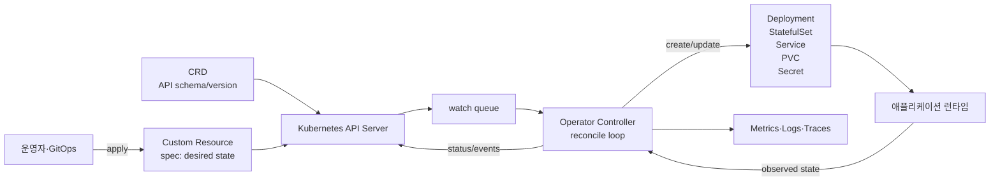
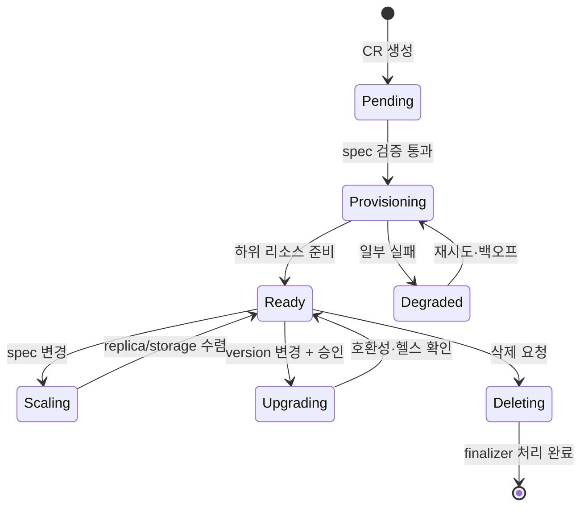

# 쿠버네티스 오퍼레이터 패턴(Kubernetes Operator Pattern)

## 1. 개요

> **정의**: 쿠버네티스 오퍼레이터(Operator)는 사람 운영자가 수행하던 애플리케이션 설치·구성·확장·복구·업그레이드·백업 지식을 Custom Resource와 컨트롤러의 조정(Reconciliation) 루프로 코드화하여, 쿠버네티스 API의 선언적 관리 모델로 제공하는 확장 소프트웨어다.

쿠버네티스의 기본 리소스만으로도 Pod, Service, Deployment 같은 무상태 애플리케이션은 선언적으로 배포할 수 있다.
그러나 데이터베이스, 메시지 브로커, 분산 캐시처럼 상태와 운영 절차가 복잡한 시스템은 단순히 Pod 수를 맞추는 것만으로 안전하게 운영되지 않는다.
초기화 순서, 리더 선출, 복제본 동기화, 장애 조치, 스키마 변경, 백업 검증, 버전 호환성까지 도메인 지식이 필요하기 때문이다.

전통적으로 이러한 지식은 운영자의 문서와 수작업 명령에 남았다.
문서 기반 운영은 숙련자에게 의존하고, 야간 장애나 반복 배포에서 실행 순서가 흔들리며, 동일한 절차를 여러 클러스터에 일관되게 적용하기 어렵다.
오퍼레이터는 이 지식을 API 객체의 원하는 상태와 컨트롤러의 자동 조치로 바꾸어 ‘무엇을 원하는가’와 ‘어떻게 달성하는가’를 분리한다.

오퍼레이터의 핵심은 특정 제품을 쿠버네티스에 포장하는 Helm 차트와 다르다는 점이다.
차트는 주로 매니페스트를 템플릿으로 생성하고 설치 시점의 값을 주입한다.
반면 오퍼레이터는 설치 이후에도 API 리소스를 감시하며, 현재 상태와 원하는 상태의 차이를 계산하고, 필요한 하위 리소스를 만들거나 변경하고, 결과를 status에 기록한다.
따라서 오퍼레이터는 배포 자동화이면서 동시에 지속적인 운영 자동화다.

기술사 답안에서는 CRD, Custom Resource, Controller를 나열하는 것보다 선언적 API, 이벤트 기반 감시, 멱등적인 조정, 상태 관찰성, 권한 최소화가 하나의 운영 체계로 연결된다는 점을 설명해야 한다.
또한 오퍼레이터가 만능 자동화가 아니라 복잡도와 장애면을 추가하는 확장이라는 점까지 함께 평가해야 균형 잡힌 답안이 된다.

### 가. 등장 배경과 필요성

첫째, 상태 저장 애플리케이션의 운영 난이도가 높아졌다.
컨테이너는 프로세스를 패키징하는 데 강하지만, 데이터의 내구성·복제·일관성·복구 시점을 자동으로 보장하지 않는다.
예를 들어 PostgreSQL 클러스터는 주 인스턴스와 대기 인스턴스의 역할, WAL 보관, 장애 조치, 접속 엔드포인트, 백업 정책을 함께 관리해야 한다.

둘째, 클러스터와 테넌트 수가 늘면서 수작업의 편차가 커졌다.
개발·검증·운영 클러스터가 각각 3개씩 존재하고 팀이 5개라면 같은 애플리케이션 운영 절차가 최대 15개 환경으로 복제된다.
오퍼레이터는 같은 CR을 적용하더라도 환경별 정책만 변수로 두고 공통 조정 로직을 재사용하게 해 구성 편차를 줄인다.

셋째, GitOps와 선언적 인프라 운영이 확산되었다.
Git에는 원하는 상태를 표현한 YAML이 저장되고, 동기화 도구는 이를 클러스터에 적용한다.
오퍼레이터가 애플리케이션 도메인 상태까지 API 객체로 모델링하면 GitOps의 관리 범위가 Deployment 수준에서 백업·복구·업그레이드 정책 수준으로 확장된다.

### 나. 핵심 목표

오퍼레이터의 목표는 사람을 완전히 배제하는 것이 아니다.
반복적이고 판단 규칙이 명확한 작업은 자동화하고, 데이터 손실 위험이나 업무 승인처럼 사람이 책임져야 하는 의사결정은 정책과 승인 절차로 남기는 것이다.
자동화 범위를 명확히 나누면 장애 시 오퍼레이터가 예상 밖의 파괴적 조치를 수행하는 위험을 줄일 수 있다.

오퍼레이터는 다음 다섯 가지 목표를 갖는다.
첫째, 사용자가 CR의 spec에 원하는 상태를 선언할 수 있어야 한다.
둘째, 컨트롤러가 현재 상태를 관찰하고 차이를 줄이는 조정 루프를 실행해야 한다.
셋째, 조정 결과와 실패 원인을 status와 이벤트로 설명해야 한다.
넷째, 같은 입력을 여러 번 처리해도 결과가 안정적인 멱등성을 가져야 한다.
다섯째, 업그레이드·삭제·복구 경계를 명시하고 권한과 자원을 제한해야 한다.

## 2. 오퍼레이터의 전체 구조

오퍼레이터는 쿠버네티스 API에 저장되는 Custom Resource와 이를 처리하는 Custom Controller의 결합이다.
CRD(CustomResourceDefinition)는 새로운 리소스 종류의 그룹·버전·Kind·스키마·범위를 정의하고, Custom Resource(CR)는 그 정의에 따라 실제 원하는 상태를 담는다.
컨트롤러는 API 서버의 watch 이벤트를 받거나 주기적으로 상태를 읽어 하위 리소스를 조정한다.

사용자는 `PostgresCluster`와 같은 고수준 리소스만 선언한다.
컨트롤러는 그 선언을 StatefulSet, Service, ConfigMap, Secret, PodDisruptionBudget, 백업 작업 같은 하위 리소스로 번역한다.
이때 하위 리소스를 직접 관리하는 주체가 오퍼레이터임을 표시하는 owner reference를 붙이면, 상위 CR 삭제 시 종속 관계와 가비지 컬렉션을 제어할 수 있다.

API 서버는 오퍼레이터의 단일 진실 공급원 역할을 한다.
컨트롤러는 로컬 메모리만 믿지 않고 API 서버에서 현재 상태를 다시 읽어야 한다.
컨트롤러가 재시작되어도 spec과 하위 리소스가 남아 있으면 조정이 이어져야 하기 때문이다.
이 특성은 수평 확장과 장애 복구의 전제이지만, API 서버 부하와 watch 재연결을 고려한 설계도 요구한다.

### 가. 선언적 모델과 명령형 스크립트의 차이

명령형 스크립트는 ‘지금 Deployment를 3개 replica로 바꾸고, 다음에 migration 명령을 실행하라’처럼 실행 순서를 지시한다.
반면 선언적 모델은 ‘이 데이터베이스 클러스터는 3개의 복제본과 특정 백업 보존 기간을 가져야 한다’고 목표를 표현한다.
조정자는 이미 어느 단계까지 실행되었는지와 관계없이 현재 상태에서 목표 상태로 가는 다음 안전한 조치를 선택한다.

이 차이 때문에 조정은 한 번의 성공적인 실행보다 반복 가능한 안정성이 중요하다.
네트워크 타임아웃으로 요청 결과를 받지 못한 뒤 같은 요청을 다시 보내더라도 중복 리소스나 중복 백업이 생기지 않아야 한다.
리소스 이름을 결정적으로 만들고, 생성 전에 존재 여부를 확인하고, 업데이트는 원하는 필드만 패치하는 방식이 일반적이다.

| 구분 | 명령형 운영 스크립트 | 오퍼레이터의 선언적 운영 |
|---|---|---|
| 표현 | 실행 명령과 순서 | 원하는 상태와 정책 |
| 실행 시점 | 배포·작업 시 1회 중심 | 이벤트와 주기적 재조정 |
| 장애 복구 | 중단 지점과 수동 재실행 필요 | 현재 상태 재관찰 후 재개 |
| 지식 위치 | 문서·운영자 경험 | 컨트롤러 코드·CR 스키마 |
| 변경 통제 | 스크립트 실행 권한 | API·RBAC·GitOps 정책 |
| 위험 | 중간 상태 불명확 | 잘못된 조정 로직의 자동 반복 |

오퍼레이터가 선언적이라고 해서 모든 단계가 순서와 무관한 것은 아니다.
데이터베이스 버전 업그레이드는 백업 확인, 읽기 전용 전환, 복제본 업그레이드, 주 인스턴스 전환처럼 순차 절차를 가진다.
이 경우 spec에 `upgradePolicy`와 승인 조건을 두고, status에 단계와 관찰 결과를 기록하면서 조정 루프 내부에서 명시적인 상태 머신으로 구현해야 한다.

### 나. Custom Resource 설계

CR의 `spec`은 사용자가 요구하는 목표와 선택 가능한 정책을 담는다.
`status`는 컨트롤러가 관찰한 실제 상태, 조건(conditions), 하위 리소스의 준비 상태, 마지막 오류를 담는다.
사용자가 관리하는 입력과 컨트롤러가 계산하는 출력이 섞이면 GitOps가 status를 되돌리거나 사용자가 관찰 결과를 임의로 덮어쓰는 문제가 생기므로 두 영역을 분리한다.

좋은 CR 스키마는 도메인 용어를 사용하되 내부 구현 세부를 과도하게 노출하지 않는다.
예를 들어 사용자가 `replicas`, `storage`, `backup.retentionDays`, `version`을 선언하게 하고, 내부의 StatefulSet 이름이나 sidecar 컨테이너 목록은 컨트롤러가 결정하도록 한다.
이렇게 해야 구현을 바꾸더라도 CR의 계약을 유지할 수 있다.

스키마에는 타입·필수성·기본값·허용 범위·설명·버전 변환 규칙을 명시한다.
replica 수에 0을 허용할지, 보존 기간을 0일로 둘 수 있는지, 스토리지 축소를 금지할지 같은 정책이 문서와 코드에 동시에 존재해야 한다.
구조적 스키마와 서버 측 검증은 잘못된 입력을 조기에 거부하지만, 데이터베이스의 실제 용량이나 외부 백업 저장소의 상태처럼 런타임에만 판단할 수 있는 조건은 컨트롤러 검증으로 남는다.

조건은 단순한 문자열 메시지보다 기계가 읽을 수 있는 `type`, `status`, `reason`, `message`, `lastTransitionTime` 구조로 관리한다.
`Ready=False`와 `Degraded=True`를 구분하면 대시보드와 알림이 의미 있는 상태를 표현할 수 있다.
일시적 오류와 영구적 설정 오류를 구분해 재시도할지 사용자 수정이 필요한지도 status에 드러내야 한다.

### 다. Controller와 Reconciliation

컨트롤러는 특정 리소스 이벤트를 큐에 넣고, 큐에서 키를 꺼내 해당 객체의 최신 상태를 읽은 뒤 조정한다.
오래된 이벤트 payload를 그대로 실행하지 않고 최신 객체를 다시 읽는 이유는 짧은 시간에 여러 변경이 합쳐질 수 있기 때문이다.
조정 함수는 원하는 상태와 관찰된 상태를 비교해 필요한 최소 변경을 수행하고, 재조정 시점을 반환한다.

조정 로직은 보통 다음 순서를 따른다.
첫째, 대상 CR이 삭제 중인지 확인한다.
둘째, 삭제 중이면 finalizer에 필요한 백업·외부 자원 정리 절차를 수행한다.
셋째, 정상 객체라면 입력을 검증하고 기본값을 계산한다.
넷째, owner reference와 결정적 이름으로 하위 리소스의 존재·차이를 확인한다.
다섯째, 생성·패치·삭제를 수행하고 애플리케이션의 readiness를 관찰한다.
여섯째, status conditions와 이벤트를 갱신하고 다음 조정 시점을 결정한다.

멱등성은 ‘아무 것도 하지 않는 것’이 아니라 같은 목표에 이미 도달했다면 추가 부작용 없이 성공을 반환하는 성질이다.
하위 Deployment가 존재하지만 image만 다르면 전체 삭제 후 재생성하지 말고 해당 필드만 조정해야 가용성을 지킬 수 있다.
외부 API에 백업을 요청하는 경우에는 요청 idempotency key, 작업 식별자, 완료 상태 조회를 사용해 네트워크 재시도가 중복 작업을 만들지 않게 한다.

재시도는 지수 백오프와 최대 지연을 사용해야 한다.
API 서버가 일시적으로 실패할 때 모든 오퍼레이터가 즉시 무한 재시도하면 장애가 증폭된다.
반대로 인증서 만료나 잘못된 버전처럼 사용자가 수정해야 하는 오류를 계속 재시도하면 로그와 API 부하만 늘어난다.
오류 분류, 재시도 상한, rate limit, queue depth를 운영 기준으로 정한다.

## 3. 오퍼레이터 구현 요소와 개발 절차

오퍼레이터는 Go 기반 controller-runtime·Kubebuilder, Python 기반 Kopf 등으로 구현할 수 있다.
언어보다 중요한 것은 Kubernetes API의 캐시 일관성, 이벤트 중복, 리더 선출, RBAC, 버전 호환성, 테스트 전략을 명시하는 것이다.
프레임워크는 watch·재시도·스킴 등록을 보조하지만 도메인 상태 전이의 안전성까지 자동 보장하지 않는다.

### 가. 개발 절차

1. 운영자가 반복하는 작업과 판단 규칙을 인터뷰하여 자동화할 범위를 정의한다.
2. 사용자가 선언할 도메인 API와 소비자, 지원하는 수명주기를 문서화한다.
3. API group/version/kind와 namespaced·cluster-scoped 범위를 결정한다.
4. CRD 스키마와 validation, defaulting, conversion 정책을 설계한다.
5. 정상·비정상·부분 성공 상태를 나타내는 status conditions를 정의한다.
6. 조정 대상 하위 리소스와 owner reference, finalizer 관계를 설계한다.
7. 정상 수렴, 삭제, 장애 조치, 업그레이드, 외부 의존성 실패를 코드로 구현한다.
8. 단위 테스트, fake API 테스트, envtest, 실제 클러스터의 통합 테스트를 단계별로 수행한다.
9. 최소 RBAC와 리소스 요청·제한을 설정하고 이미지와 의존성을 공급망 검증한다.
10. 대시보드·알림·runbook을 준비한 뒤 점진적으로 운영 클러스터에 배포한다.

개발 초기에는 한 가지 리소스와 한 가지 운영 흐름으로 시작하는 것이 좋다.
예를 들어 데이터베이스 생성·확장·백업·복구·업그레이드를 한 번에 넣으면 상태 머신과 실패 조합이 폭발한다.
먼저 생성과 readiness 관찰을 안정화하고, 이후 백업과 업그레이드를 별도 기능 플래그 또는 명시적 정책으로 추가한다.

### 나. 하위 리소스와 소유권

오퍼레이터가 만든 Deployment, Service, Secret, PVC를 사용자가 직접 수정하면 두 조정 주체가 충돌한다.
컨트롤러가 관리하는 필드를 명확히 표시하고, 사용자 확장 지점은 `podTemplate`의 허용 필드나 patch 정책처럼 제한된 계약으로 제공한다.
관리 경계를 문서화하면 자동 복구와 운영자 수동 조치의 충돌을 줄일 수 있다.

owner reference는 Kubernetes 객체 관계를 알려 주지만 외부 클라우드 리소스나 SaaS 계정은 클러스터 밖에 있다.
이런 자원은 외부 식별자를 status에 저장하고 finalizer에서 삭제 정책을 수행한다.
삭제 시 외부 자원을 바로 지울지, 보존할지, 승인 후 지울지 명시하지 않으면 CR 삭제가 데이터 손실로 이어질 수 있다.

finalizer는 삭제 이벤트 전에 정리할 기회를 제공한다.
컨트롤러가 finalizer를 제거하지 못하면 CR이 Terminating 상태에 오래 남는다.
따라서 외부 시스템이 장기간 장애여도 운영자가 수동으로 복구할 수 있도록 재시도 상태, 타임아웃, 강제 보존 절차를 제공해야 한다.

### 다. 보안과 운영 통제

오퍼레이터는 API 서버에 광범위한 권한을 가진 경우가 많으므로 침해 시 클러스터 전체가 위험해질 수 있다.
RBAC는 필요한 API group·resource·verb만 허용하고, namespace 범위를 가능한 한 좁힌다.
Secret을 읽어 외부 백업에 전송하는 기능은 별도 ServiceAccount와 네트워크 정책으로 격리하고, 로그에 자격증명이나 원문 데이터를 남기지 않는다.

오퍼레이터의 이미지와 Helm chart는 서명·해시·SBOM을 검증하고, 취약점 패치와 권한 변경을 릴리스 노트에 남긴다.
오퍼레이터가 생성하는 Pod에도 보안 컨텍스트, seccomp, 읽기 전용 파일시스템, 비특권 실행을 적용한다.
컨트롤러 자체의 공급망뿐 아니라 생성하는 workload의 보안 기본값도 함께 관리해야 한다.

관측성은 조정 성공 여부만 보는 것으로 부족하다.
reconcile 횟수와 지연, 큐 적체, API 호출 오류, 조건별 Degraded 비율, 외부 작업 지연, finalizer 잔류 시간을 측정한다.
예를 들어 5분 동안 `Ready=False`가 지속되거나 동일 오류가 10회 반복되면 서비스 운영자에게 알림을 보낼 수 있다.

| 운영 영역 | 핵심 지표 | 경보·점검 예시 |
|---|---|---|
| 조정 | reconcile latency, error count | p95 지연과 5분 오류율 |
| 수렴 | Ready 조건, generation 관찰 | spec 변경 후 10분 내 수렴 |
| 안정성 | queue depth, API throttling | 큐 적체와 429 증가 |
| 데이터 | 백업 성공, 복구 검증 | 최근 복구 테스트 시각 |
| 보안 | RBAC 변경, 이미지 취약점 | 권한 확대와 서명 검증 |
| 삭제 | finalizer 잔류 시간 | Terminating 30분 초과 |

## 4. 유형과 적용 시나리오

오퍼레이터는 관리 대상과 상태의 복잡도에 따라 여러 유형으로 나눌 수 있다.
애드온 오퍼레이터는 모니터링·인증서·스토리지 같은 클러스터 기능을 관리하고, 애플리케이션 오퍼레이터는 특정 제품의 설치와 운영을 관리한다.
클라우드 리소스 오퍼레이터는 CR을 AWS·Azure·GCP 같은 외부 API의 리소스와 연결한다.

상태 저장 오퍼레이터는 복제·백업·복구·업그레이드의 순서를 알고 있어 가장 큰 가치를 제공하지만 가장 큰 위험도 가진다.
무상태 오퍼레이터는 구성 번들, 정책, 라우팅 같은 비교적 단순한 리소스를 관리할 수 있다.
운영자는 대상 상태의 파괴 가능성과 외부 부작용을 기준으로 자동화 수준을 선택해야 한다.

### 가. 데이터베이스 운영 사례

가상의 주문 서비스가 3개 가용영역에 PostgreSQL 복제본을 운영한다고 하자.
`PostgresCluster` CR에 `replicas: 3`, `storage: 500Gi`, `backup.retentionDays: 14`를 선언하면 오퍼레이터는 StatefulSet과 PVC를 만들고, 복제 상태와 백업 작업을 관찰한다.
주 인스턴스 장애가 발생하면 동기화된 대기 인스턴스 중 하나를 승격하고 Service endpoint를 갱신하되, 데이터 손실 가능성과 복구 시점을 status에 기록해야 한다.

스토리지를 500Gi에서 800Gi로 늘리는 것은 일반적으로 확장 방향이므로 자동화할 수 있지만, 500Gi에서 200Gi로 줄이는 작업은 데이터 손실 위험 때문에 거부하는 것이 안전하다.
버전을 14에서 15로 바꾸는 경우에는 사전 호환성 검사와 백업 성공 확인을 요구하고, 승인 필드를 별도로 두어 Git 변경만으로 즉시 업그레이드되지 않게 할 수 있다.
이 사례는 오퍼레이터가 단순 리소스 생성기가 아니라 도메인 안전 규칙의 집행자임을 보여 준다.

### 나. 메시징·캐시 사례

메시지 브로커 오퍼레이터는 브로커 수, 토픽·큐 정의, 복제 인수, 보존 기간, 파티션 재배치를 관리할 수 있다.
예를 들어 6개 파티션을 가진 주문 이벤트 토픽을 12개로 확장할 때, 컨트롤러는 기존 소비자 호환성과 처리량 지표를 확인하고 점진적으로 파티션을 추가한다.
토픽을 삭제하는 요청은 소비자 offset과 보존 정책을 확인한 뒤 승인 없이는 실행하지 않도록 설계할 수 있다.

캐시 오퍼레이터는 데이터가 재생성 가능한지와 영속성이 필요한지를 구분해야 한다.
캐시 Pod를 자동 재생성하는 것은 가용성에 도움이 되지만, 캐시를 원본 데이터처럼 취급하는 시스템에서는 장애 조치 중 오래된 값과 쓰기 손실을 별도로 통제해야 한다.
오퍼레이터의 기본값이 모든 제품에 동일하게 적용되지 않도록 업무 특성을 CR 정책으로 표현한다.

### 다. 클라우드 리소스 사례

클라우드 오퍼레이터를 사용하면 `DatabaseInstance` CR의 지역, 엔진, 크기, 네트워크 정책을 클라우드 API의 RDS·Cloud SQL·Azure Database로 연결할 수 있다.
개발 환경에서 인스턴스 5개를 자동 생성하고 Git에서 CR을 삭제하면 외부 자원이 함께 삭제될 수 있으므로, `deletionPolicy: Retain`과 `Delete`를 구분해야 한다.
외부 API 장애가 쿠버네티스 조정 큐를 막지 않도록 요청 제한, 비동기 작업 ID, 상태 조회 주기를 설계한다.

이 구조는 멀티클라우드 추상화에도 도움을 주지만, 모든 클라우드의 기능을 공통 CR 하나로 평준화하면 중요한 차이를 잃는다.
공통 필드와 공급자별 확장 필드를 분리하고, 실제 제공되지 않는 기능은 조용히 무시하지 말고 명시적으로 `Unsupported` 상태를 반환해야 한다.

## 5. 비교 및 연계 기술

### 가. 오퍼레이터와 Helm·GitOps 비교

Helm은 템플릿과 패키지 관리에 강하고 초기 설치가 빠르다.
그러나 설치 후 데이터베이스의 복제 상태를 해석하거나 장애 조치 절차를 수행하는 것은 Helm의 역할이 아니다.
GitOps는 Git의 선언 상태를 클러스터와 동기화하고 변경 이력을 남긴다.
오퍼레이터는 GitOps가 적용한 CR을 받아 애플리케이션의 도메인 상태까지 수렴시킨다.

세 기술은 대체 관계보다 계층 관계로 보는 것이 정확하다.
Helm으로 오퍼레이터 자체를 설치하고, GitOps로 CR과 정책을 배포하며, 오퍼레이터가 하위 리소스와 외부 자원을 운영할 수 있다.
이때 GitOps가 status나 오퍼레이터가 소유하는 하위 매니페스트를 덮어쓰지 않도록 소유 필드를 분리한다.

| 구분 | Helm | GitOps | Operator |
|---|---|---|---|
| 주 관심사 | 패키징·템플릿 | desired state 동기화 | 도메인 운영 자동화 |
| 지속성 | 설치·업데이트 시점 | 계속 비교·동기화 | 계속 관찰·조정 |
| 복잡한 장애 판단 | 제한적 | 제한적 | 도메인 로직으로 가능 |
| 입력 | values와 매니페스트 | Git 저장소 | CR과 정책 |
| 대표 위험 | 템플릿 복잡도 | drift·권한 오남용 | 잘못된 자동 조치 |

### 나. 오퍼레이터와 일반 컨트롤러 비교

모든 오퍼레이터는 컨트롤러의 확장 패턴이지만 모든 컨트롤러가 오퍼레이터인 것은 아니다.
Deployment controller처럼 쿠버네티스 기본 리소스의 일반 상태를 맞추는 컨트롤러도 있다.
오퍼레이터는 특히 사람이 수행하던 특정 애플리케이션 운영 지식과 Custom Resource API를 결합한 경우를 가리킨다.
따라서 답안에서는 상위 개념인 controller pattern과 응용 개념인 operator pattern을 구분해야 한다.

### 다. 이벤트 기반 조정과 배치 작업 비교

배치 스크립트는 일정한 순서로 전체 환경을 점검하기 쉽지만, 변화가 없는 환경에서도 반복 실행 비용이 든다.
이벤트 기반 조정은 해당 CR이나 관련 하위 리소스의 변화에 반응해 빠르게 처리하지만, 이벤트 유실·중복·순서 뒤바뀜을 전제로 해야 한다.
주기적 재조정을 함께 두면 이벤트가 누락되어도 eventual consistency를 회복할 수 있다.

## 6. 심화: 설계 트레이드오프와 최신 운영 방향

오퍼레이터 도입의 첫 번째 트레이드오프는 자동화 이득과 제어면 복잡도의 교환이다.
오퍼레이터 하나가 CRD 10개와 하위 리소스 수백 개를 관리하면 운영자는 단순한 YAML 한 장으로 많은 기능을 얻지만, 장애 원인을 추적할 경로도 길어진다.
초기에는 CR의 상태와 이벤트, 생성된 하위 리소스의 owner reference, controller 로그를 연결해 설명 가능한 운영 경험을 제공해야 한다.

두 번째 트레이드오프는 추상화와 공급자 기능 보존의 교환이다.
공통 CR은 팀의 학습 비용과 플랫폼 표준화를 낮추지만, 클라우드 또는 데이터베이스 제품의 고유 기능을 감추면 성능과 복구 요구를 충족하지 못할 수 있다.
공통 모델은 안정적인 핵심 수명주기에 한정하고, 확장은 명시적인 provider profile로 격리하는 방식이 현실적이다.

세 번째 트레이드오프는 자동 복구와 데이터 안전의 교환이다.
무상태 서비스는 즉시 재생성하는 편이 대부분 안전하지만, 저장 데이터와 외부 과금 리소스는 같은 규칙으로 삭제하거나 교체해서는 안 된다.
복구 지점, 승인, 보존, dry-run, 변경 창을 CR 정책에 포함하고 위험한 명령은 오퍼레이터가 거부하도록 설계한다.

최근의 플랫폼 엔지니어링에서는 오퍼레이터를 내부 개발자 플랫폼의 제품으로 다루는 접근이 중요하다.
플랫폼팀은 CRD만 배포하는 것이 아니라 예제, 검증 규칙, 버전 정책, SLO, 알림, 비용 가시성, 지원 채널을 함께 제공해야 한다.
개발자는 `DatabaseCluster` 같은 업무 언어로 요청하되, 플랫폼팀은 그 뒤의 보안·네트워크·백업 가드레일을 일관되게 집행할 수 있다.

오퍼레이터 SDK와 프레임워크의 버전은 쿠버네티스 API 호환성, 웹훅 인증, 리더 선출, 캐시 동작에 영향을 준다.
특정 버전 번호를 고정해 암기하기보다 지원하는 Kubernetes 버전 범위, CRD conversion, API deprecation, 롤백 방법을 릴리스 정책으로 관리하는 것이 기술사 답안과 실무 모두에 유효하다.

## 7. 고려사항 및 시사점

### 가. API와 수명주기

CRD는 사용자에게 공개하는 API이므로 필드 이름과 의미를 쉽게 바꾸지 않는다.
`v1alpha1`에서 `v1beta1`, `v1`으로 승격할 때 호환성·변환·기본값·폐기 시점을 정의하고, 기존 CR의 백업과 복구 경로를 테스트한다.
삭제 정책과 업그레이드 정책을 별도 필드로 두어 파괴적 동작의 의도를 명시한다.

### 나. 멱등성·수렴·장애 격리

조정 함수는 중복 이벤트와 재시작을 정상 경로로 취급해야 한다.
외부 API는 timeout, circuit breaker, rate limit, 작업 상태 조회를 사용하고, 한 테넌트의 대규모 변경이 다른 네임스페이스의 조정을 굶기지 않도록 큐와 worker를 격리한다.
재시도할 오류와 사람의 수정이 필요한 오류를 status의 reason으로 구분한다.

### 다. 보안·권한·공급망

오퍼레이터 ServiceAccount에는 최소 RBAC를 적용하고 Secret 접근과 외부 네트워크 호출을 별도로 감사한다.
컨테이너 이미지의 서명·SBOM·취약점 점검, 런타임 보안 컨텍스트, 네트워크 정책을 오퍼레이터와 생성 workload 모두에 적용한다.
웹훅이나 외부 API 토큰이 있는 경우 회전·폐기·노출 대응을 운영 절차에 포함한다.

### 라. 데이터 보호와 복구

상태 저장 애플리케이션 오퍼레이터는 ‘Pod가 Running’인 것과 ‘데이터가 복구 가능’한 것을 구분해야 한다.
백업 성공률뿐 아니라 복구 리허설 시간, 복구 지점, 복제 지연, 데이터 무결성 검증 결과를 관찰한다.
자동 failover가 RPO를 위반할 수 있는 상황에서는 보수적 중지와 운영자 승인을 선택할 수 있어야 한다.

### 마. 관측성과 운영자 경험

Ready·Progressing·Degraded 조건, Kubernetes Event, 구조화 로그, 메트릭의 리소스 이름을 일관되게 연결한다.
운영자는 `kubectl describe`만으로도 왜 수렴하지 않는지 알 수 있어야 하며, 대시보드에는 원하는 세대와 관찰 세대, 마지막 조정 시각을 표시한다.
오퍼레이터가 자동으로 처리하지 못한 예외의 runbook과 수동 복구 명령도 함께 제공한다.

### 바. 도입 전략과 성과 측정

도입 전후의 배포 시간, 수동 작업 횟수, 장애 복구 시간, 설정 편차, 변경 실패율을 측정한다.
예를 들어 15개 클러스터의 데이터베이스 배포에서 평균 40분이 걸리던 수동 절차를 10분 이내 CR 적용으로 줄이더라도, 복구 테스트 성공률이 낮아지면 성공으로 평가해서는 안 된다.
자동화율과 운영 안전성을 함께 지표로 삼아야 한다.

## 8. 예상 출제 방향 및 답안 구성 전략

출제 문제는 ‘오퍼레이터 패턴을 설명하고 CRD·컨트롤러·조정 루프의 역할, 장단점, 도입 방안을 논하라’는 형태로 구성할 수 있다.
답안 첫머리에서 사람 운영 지식의 코드화와 선언적 API라는 정의를 제시하고, 전체 구조도에서 CRD·CR·API 서버·컨트롤러·하위 리소스의 관계를 보여 준다.

본론에서는 spec/status 분리, watch와 reconciliation, 멱등성, finalizer, owner reference, RBAC, 관측성을 원리와 함께 설명한다.
Helm·GitOps와의 차이는 설치 시점, 지속 동기화, 도메인 운영 자동화라는 기준으로 비교하고, 데이터베이스·클라우드 리소스 사례를 들어 자동화의 이점과 삭제 위험을 함께 제시한다.

결론에서는 CRD를 공개 API로 관리하고, 단계적 도입과 최소 권한, 백업·복구 검증, SLO 및 비용 측정을 제안한다.
‘자동화하면 운영자가 필요 없다’가 아니라 ‘반복 작업은 코드화하고 고위험 의사결정은 승인·가드레일로 통제한다’는 시사점으로 마무리하면 기술사 관점의 균형을 갖출 수 있다.

## 참고자료

- [Kubernetes 공식 문서: Operator pattern](https://kubernetes.io/docs/concepts/extend-kubernetes/operator/)
- [Kubernetes 공식 문서: Custom resources](https://kubernetes.io/docs/concepts/extend-kubernetes/api-extension/custom-resources/)
- [Kubernetes 공식 문서: Controllers](https://kubernetes.io/docs/concepts/architecture/controller/)
- [Kubernetes 공식 문서: CustomResourceDefinitions 확장](https://kubernetes.io/docs/tasks/extend-kubernetes/custom-resources/custom-resource-definitions/)
- [Kubernetes 공식 문서: API 확장 개념](https://kubernetes.io/docs/concepts/extend-kubernetes/)

---

> **한 줄 요약**: 오퍼레이터는 CRD로 선언한 애플리케이션 목표 상태를 도메인 지식이 담긴 멱등적 컨트롤러의 조정 루프로 계속 수렴시키는 쿠버네티스 네이티브 운영 자동화 패턴이다.
