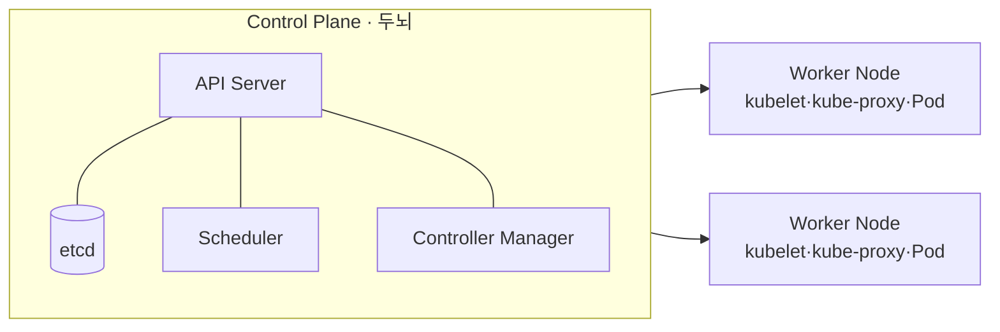

# 쿠버네티스(Kubernetes, K8s)

## 1. 개요

### 가. 정의
> 컨테이너화된 애플리케이션의 **배포·확장·운영을 선언적으로 자동화**하는 오픈소스 **컨테이너 오케스트레이션** 플랫폼으로, 구글의 내부 시스템(Borg)에서 출발해 현재 CNCF의 졸업 프로젝트다.

### 나. 등장 배경 및 필요성
Docker로 컨테이너를 표준화했지만, 운영 현장에서는 컨테이너 하나가 아니라 **수백~수천 개**를 다뤄야 한다. 어느 서버에 어떤 컨테이너를 띄울지, 죽으면 누가 재기동할지, 트래픽이 몰리면 어떻게 늘릴지를 사람이 수동으로 관리하는 것은 불가능하다. MSA와 클라우드 네이티브가 확산되며 이 복잡도는 폭증했다. 쿠버네티스는 이 "**대규모 컨테이너 운영의 자동화**"라는 문제를 풀기 위해 등장했으며, 관리자가 "원하는 상태(Desired State)"만 선언하면 시스템이 알아서 그 상태를 유지하도록 한다.

### 다. 특징
핵심 철학은 **선언적 구성(Declarative)** 이다. "이렇게 하라(명령형)"가 아니라 "이런 상태여야 한다(선언형)"를 YAML로 기술하면, 쿠버네티스가 현재 상태와 비교해 스스로 맞춘다. 이 덕에 **자동 복구·오토스케일링·무중단 배포**가 가능하고, 인프라에 독립적이라 온프레미스·멀티 클라우드 간 **이식성**이 높다.

## 2. 아키텍처

쿠버네티스는 명령·의사결정을 담당하는 **Control Plane(마스터)** 과 실제 컨테이너를 실행하는 **Worker Node**로 나뉜다. 이 분리는 "**결정(제어)과 실행(작업)을 분리**"해, 노드가 죽어도 제어부는 살아 있고, 제어부가 재시작돼도 노드의 워크로드는 계속 도는 견고함을 준다.

- **API Server**: 모든 요청이 거치는 유일한 관문(REST). 인증·검증 후 상태를 etcd에 기록하며, 모든 구성요소는 이 API Server를 통해서만 소통한다.
- **etcd**: 클러스터의 모든 상태(원하는 상태·현재 상태)를 저장하는 분산 Key-Value 저장소. 사실상 클러스터의 "**단일 진실 원천(SSOT)**"이라 손상되면 클러스터 전체가 위험하므로 백업이 필수다.
- **Scheduler**: 새 Pod를 자원·제약(CPU·메모리·affinity)을 고려해 어느 노드에 배치할지 결정한다.
- **Controller Manager**: 아래에서 설명할 조정 루프(Reconcile)를 돌리는 각종 컨트롤러의 집합이다.
- **kubelet**: 각 노드에서 API Server의 지시를 받아 Pod를 실제로 실행·감시한다.
- **kube-proxy**: 노드의 네트워크 규칙을 관리해 Service로 향하는 트래픽을 적절한 Pod로 라우팅·부하분산한다.

| 구성 | 역할 |
|---|---|
| API Server | 모든 요청의 관문(REST) |
| etcd | 클러스터 상태 저장(분산 KV, SSOT) |
| Scheduler | Pod를 적합 노드에 배치 |
| Controller Manager | 상태 조정(Reconcile Loop) |
| kubelet | 노드에서 Pod 실행·관리 |
| kube-proxy | 네트워크 라우팅·로드밸런싱 |

## 3. 핵심 오브젝트

쿠버네티스에서 다루는 모든 것은 "오브젝트"로 선언된다. 최소 단위는 컨테이너가 아니라 **Pod**인데, 밀접히 결합된 컨테이너(예: 앱 + 로그 수집 사이드카)를 하나로 묶어 같은 네트워크·스토리지를 공유시키기 위함이다. Pod는 일시적(언제든 죽고 재생성)이라 IP가 바뀌므로, 안정적 접근점을 주는 **Service**가 필요하다.

| 오브젝트 | 설명 |
|---|---|
| **Pod** | 최소 배포 단위(컨테이너 묶음, 일시적) |
| **ReplicaSet/Deployment** | 복제본 수 유지·롤아웃·롤백 |
| **Service** | Pod 집합에 안정적 접근점·로드밸런싱 |
| **Ingress** | 외부 HTTP(S) 라우팅·경로 기반 분배 |
| **ConfigMap/Secret** | 설정·비밀정보를 코드와 분리 |
| **Namespace** | 논리적 격리(멀티테넌시·환경 분리) |

예를 들어 웹 앱을 배포하면, **Deployment**가 "복제본 3개"를 선언적으로 관리하고, 그 앞에 **Service**가 3개 Pod로 트래픽을 분산하며, **Ingress**가 외부 도메인을 이 Service로 연결한다.

## 4. 핵심 메커니즘 — 조정 루프(Reconciliation)

쿠버네티스의 자동화가 작동하는 근본 원리는 **조정 루프**다. 각 컨트롤러는 "선언된 상태(예: 복제본 3개)"와 "현재 상태(실제 2개)"를 **끊임없이 비교하고, 차이가 있으면 현재를 원하는 상태로 수렴**시킨다. 노드가 죽어 Pod가 사라지면, 컨트롤러가 이를 감지해 다른 노드에 새 Pod를 띄운다. 이 루프가 있기에 "자동 복구"가 마법이 아니라 필연이 된다.

- **오토스케일링**: HPA(부하에 따라 Pod 수평 증감)·VPA(자원 요청 수직 조정)·Cluster Autoscaler(노드 자체 증감)로 수요에 탄력 대응.
- **롤링 업데이트/롤백**: 새 버전 Pod를 조금씩 교체해 **무중단 배포**하고, 문제가 생기면 이전 리비전으로 즉시 롤백한다.

## 5. 고려사항 및 시사점
- **운영 복잡도**: 강력한 만큼 러닝커브가 가파르다. 그래서 직접 구축보다 **관리형 서비스(EKS·GKE·AKS)** 로 Control Plane 운영 부담을 덜어내는 경우가 많다.
- **보안**: 기본 설정은 관대하므로 **RBAC(권한 최소화)·네트워크 정책·이미지 취약점 스캔**을 반드시 적용해야 한다.
- **관측성**: Pod가 수시로 생멸하므로 Prometheus·Grafana·로그 수집 등 모니터링이 운영 필수다.
- **표준 인프라·전망**: 쿠버네티스는 MSA·DevOps·CI/CD의 사실상 표준 기반이며, Git 저장소를 원하는 상태의 원천으로 삼는 **GitOps(ArgoCD 등)** 로 배포 자동화가 확장되고 있다.

---

> **한 줄 요약**: 쿠버네티스는 *컨테이너 배포·확장·운영을 선언적으로 자동화* 하는 오케스트레이션 플랫폼으로, Control Plane과 Node가 조정 루프(Reconcile)로 Pod를 원하는 상태에 지속 수렴시키며, 관리형 서비스·GitOps와 함께 클라우드 네이티브의 표준 인프라가 되었다.
