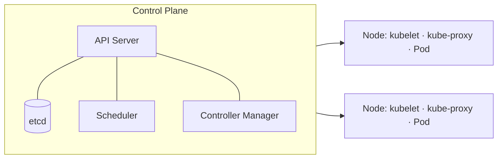

# 쿠버네티스(Kubernetes, K8s)

## 1. 개요

### 가. 정의
> 컨테이너화된 애플리케이션의 **배포·확장·운영을 자동화**하는 오픈소스 **컨테이너 오케스트레이션** 플랫폼(CNCF).

### 나. 특징
- **선언적 구성**(Desired State), **자동 복구·스케일링**, **이식성**(멀티 클라우드)

## 2. 아키텍처

| 구성 | 역할 |
|---|---|
| **API Server** | 모든 요청의 관문(REST) |
| **etcd** | 클러스터 상태 저장(KV) |
| **Scheduler** | Pod를 노드에 배치 |
| **Controller Manager** | 상태 조정(Reconcile) |
| **kubelet** | 노드에서 Pod 실행·관리 |

## 3. 핵심 오브젝트

| 오브젝트 | 설명 |
|---|---|
| **Pod** | 최소 배포 단위(컨테이너 묶음) |
| **Deployment** | 롤아웃·롤백·복제 관리 |
| **Service** | Pod 집합에 안정적 접근(로드밸런싱) |
| **ConfigMap/Secret** | 설정·비밀 분리 |

## 4. 시사점
- **MSA·DevOps·CI/CD** 표준 인프라, 자동 확장·무중단 배포로 운영 효율화

---

> **한 줄 요약**: 쿠버네티스는 *컨테이너 배포·확장·운영을 선언적으로 자동화* 하는 오케스트레이션 플랫폼으로, Control Plane과 Node가 Pod를 원하는 상태로 유지한다.
