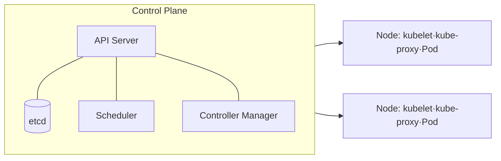

# 쿠버네티스(Kubernetes, K8s)

## 1. 개요

### 가. 정의
> 컨테이너화된 애플리케이션의 **배포·확장·운영을 자동화**하는 오픈소스 **컨테이너 오케스트레이션** 플랫폼(CNCF 졸업 프로젝트).

### 나. 등장 배경
- 컨테이너(Docker) 대량 운영의 **수동 관리 한계**
- MSA·클라우드 네이티브 확산에 따른 **자동 확장·복구·배포** 요구

### 다. 특징
- **선언적 구성**(Desired State), **자동 복구·오토스케일링**, **이식성**(멀티 클라우드)

## 2. 아키텍처

| 구성 | 역할 |
|---|---|
| **API Server** | 모든 요청의 관문(REST) |
| **etcd** | 클러스터 상태 저장(분산 KV) |
| **Scheduler** | Pod를 적합 노드에 배치 |
| **Controller Manager** | 상태 조정(Reconcile Loop) |
| **kubelet** | 노드에서 Pod 실행·관리 |
| **kube-proxy** | 네트워크 라우팅·로드밸런싱 |

## 3. 핵심 오브젝트

| 오브젝트 | 설명 |
|---|---|
| **Pod** | 최소 배포 단위(컨테이너 묶음) |
| **ReplicaSet/Deployment** | 복제·롤아웃·롤백 관리 |
| **Service** | Pod 집합에 안정적 접근(로드밸런싱) |
| **Ingress** | 외부 HTTP 라우팅 |
| **ConfigMap/Secret** | 설정·비밀 분리 |
| **Namespace** | 논리적 격리 |

## 4. 핵심 메커니즘
- **Reconciliation**: 선언된 상태와 현재 상태를 지속 비교·수렴
- **오토스케일링**: HPA(수평)·VPA(수직)·Cluster Autoscaler
- **롤링 업데이트/롤백**: 무중단 배포

## 5. 고려사항 및 시사점
- **운영 복잡도**(러닝커브) → 관리형(EKS·GKE·AKS) 활용
- 보안(RBAC·네트워크 정책·이미지 스캔), 관측성(모니터링·로깅)
- MSA·DevOps·CI/CD의 **표준 인프라**, GitOps로 배포 자동화

---

> **한 줄 요약**: 쿠버네티스는 *컨테이너 배포·확장·운영을 선언적으로 자동화* 하는 오케스트레이션 플랫폼으로, Control Plane과 Node가 Pod를 원하는 상태로 지속 유지(Reconcile)하며 클라우드 네이티브의 표준 인프라다.
