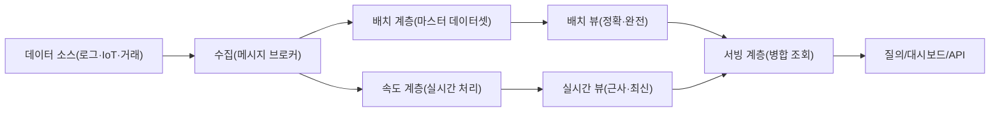
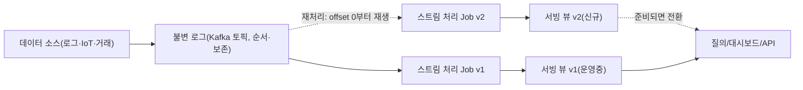

# 람다(Lambda) 아키텍처와 카파(Kappa) 아키텍처

## 1. 개요

### 가. 정의

> **람다 아키텍처(Lambda Architecture)**는 대용량 데이터를 정확·완전하게 처리하는 배치 계층(Batch Layer)과 저지연으로 처리하는 속도 계층(Speed Layer)을 병행 운영하고, 두 결과를 서빙 계층(Serving Layer)에서 병합해 조회 지연과 결과 정확성을 동시에 확보하는 빅데이터 처리 아키텍처이다.

> **카파 아키텍처(Kappa Architecture)**는 배치 계층을 제거하고 모든 데이터를 순서가 보장되는 불변 로그(Immutable Log)의 이벤트 스트림으로 통일해, 단일 스트림 처리 파이프라인만으로 실시간 처리와 과거 재처리(Reprocessing)를 모두 수행하는 아키텍처이다.

두 아키텍처는 모두 "대량의 데이터를 어떻게 지연(latency)과 정확성(accuracy)의 트레이드오프 안에서 처리할 것인가"라는 동일한 문제에 대한 서로 다른 응답이다. 람다는 배치와 스트림이라는 **두 개의 진실 경로**를 두어 각각의 장점(배치의 완전성, 스트림의 즉시성)을 취하고, 카파는 경로를 **하나의 로그로 단일화**하여 두 코드베이스를 유지하는 복잡성을 없앤다. 정보관리기술사 관점에서 이 주제는 단순한 도구 선택이 아니라, 데이터의 정합성 보장 모델·재처리 전략·운영 복잡도·비용을 함께 설계하는 데이터 파이프라인 거버넌스 문제로 이해해야 한다.

### 나. 등장 배경과 필요성

첫째, 대용량 데이터의 처리 요구가 "정확한 집계"와 "즉시성"으로 분화되었다. 전통적 배치(예: 야간 ETL) 처리는 하루 단위로 정확한 통계를 산출하지만, 그 사이에 발생한 이벤트는 다음 날에야 반영된다. 반대로 순수 실시간 처리는 즉시성은 좋으나 늦게 도착한 데이터(late-arriving data)나 장애 시 누락·중복을 완전히 보정하기 어렵다. 초기 하둡(Hadoop) 기반 배치와 스톰(Storm) 기반 스트림을 결합한 경험에서 람다 아키텍처(Nathan Marz, 2011년경)가 정립되었다.

둘째, CAP·재현성의 제약이 있다. 분산 환경에서 처리 노드가 죽거나 네트워크가 지연되면 스트림 처리 결과는 근사치가 되기 쉽다. 람다는 "속도 계층의 결과는 임시값이며, 배치 계층이 언젠가 정확한 값으로 덮어쓴다"는 **재계산(recompute) 기반 최종 정합성**을 핵심 원리로 삼는다. 즉 스트림의 오차를 배치가 주기적으로 치유하는 자가 교정 구조이다.

셋째, 스트림 처리 엔진의 성숙으로 배치를 없앨 수 있게 되었다. 아파치 카프카(Kafka)의 로그 보존(retention)·재생(replay) 기능과 아파치 플링크(Flink)의 정확히 한 번(exactly-once) 상태 처리, 이벤트 시간(event-time)·워터마크(watermark) 기반 윈도우가 성숙하면서, "배치는 사실 유한한 스트림"이라는 관점(Jay Kreps, 2014년 카파 제안)이 실현 가능해졌다. 이로써 두 코드베이스를 유지하던 람다의 부담을 줄이려는 흐름이 생겼다.

### 다. 공통 목표와 특징

두 아키텍처가 공통으로 추구하는 것은 **원천 데이터의 불변 보존과 재처리 가능성**이다. 원본 이벤트를 변경 없이 append-only로 저장하면, 로직 오류가 발견되어도 코드를 고쳐 과거 데이터를 다시 흘려보내 결과를 재생성할 수 있다. 이는 "저장은 원본, 뷰는 파생"이라는 원칙으로, 데이터 계보(lineage)와 감사(audit)에도 유리하다. 차이는 그 재처리를 **별도 배치 잡**으로 하느냐(람다), **같은 스트림 엔진의 재생**으로 하느냐(카파)에 있다.

또한 두 아키텍처 모두 **파생 뷰의 재생성 가능성**을 전제로 서빙 저장소를 설계한다. 서빙 뷰는 원본이 아니라 언제든 다시 만들 수 있는 캐시에 가깝기 때문에, 스키마·인덱스·집계 축을 바꾸더라도 원본을 건드리지 않고 뷰만 재구축하면 된다. 이 사고방식은 "쓰기 시점에 미리 계산해 저장(precompute)하고 읽기 시점에는 조회만"이라는 CQRS·이벤트 소싱과도 자연스럽게 연결되며, 대시보드·검색·추천 등 다양한 소비 형태를 하나의 원천 위에 얹는 유연성을 제공한다.

## 2. 람다 아키텍처의 구조와 동작

### 가. 3계층 구성

람다는 배치·속도·서빙의 세 계층으로 구성된다. 마스터 데이터셋(불변 원본)이 배치 계층과 속도 계층에 동시에 유입되고, 각 계층이 만든 뷰를 서빙 계층이 병합하여 질의에 응답한다.

**배치 계층**은 마스터 데이터셋 전체를 주기적으로(예: 매 시간·매일) 재계산해 정확한 배치 뷰를 만든다. 데이터 전체를 다시 읽으므로 일부 로직 오류나 늦게 도착한 데이터도 다음 배치에서 자연히 교정된다. 하둡 맵리듀스·스파크(Spark)가 대표 엔진이다. 단점은 완료까지의 지연으로, 방금 들어온 이벤트는 다음 배치 전까지 반영되지 않는다.

**속도 계층**은 배치가 아직 처리하지 못한 최근 구간만 실시간으로 처리해 실시간 뷰를 생성한다. 스톰·플링크·스파크 스트리밍이 쓰인다. 증분(incremental) 처리라 빠르지만, 상태를 근사적으로 유지하기에 오차가 누적될 수 있다. 핵심은 이 뷰가 **임시**라는 점이다.

**서빙 계층**은 배치 뷰와 실시간 뷰를 병합해 질의에 응답한다. 배치가 커버하는 시점까지는 배치 뷰를, 그 이후 최신 구간은 실시간 뷰를 사용해 합산한다. 배치 뷰가 갱신되면 그만큼 실시간 뷰의 오래된 부분은 폐기(만료)한다. 서빙 저장소로는 랜덤 읽기와 빠른 조회에 강한 키-값·컬럼 스토어(예: HBase·Cassandra·Redis)나 검색 엔진이 흔히 쓰이며, 배치 뷰를 원자적으로 교체(스왑)해 조회 중 불일치를 막는다.

### 나. 데이터 정합성 원리(재계산 vs 증분)

람다의 정확성은 "언젠가 배치가 전체를 다시 계산해 진실을 확정한다"는 재계산 원칙에서 나온다. 예컨대 실시간 방문자 수 집계가 노드 장애로 5분간 이벤트 일부를 놓쳐도, 다음 배치가 원본 로그 전체를 다시 세어 정확한 값으로 서빙 뷰를 덮어쓴다. 이를 수식으로 표현하면 `질의결과 = merge(batch_view(모든 데이터 - 최근), realtime_view(최근))` 이며, 시간이 지나 "최근" 구간이 배치로 흡수되면 실시간 오차는 소멸한다.

구체 사례로, 일 20억 건(약 23,000 TPS 평균, 피크 5만 TPS)의 광고 클릭 로그를 처리하는 경우를 보자. 광고주 대시보드는 "지금까지의 총 클릭"을 보여줘야 하는데, 정산은 정확해야 하고 대시보드는 실시간이어야 한다. 배치 계층이 매시간 누적 클릭을 정밀 집계하고, 속도 계층이 지난 1시간분만 증분 집계하면, 광고주는 즉시성과 정확성을 함께 얻는다. 정산은 배치 뷰만 신뢰하므로 스트림의 근사 오차가 과금에 영향을 주지 않는다.

### 다. 장점과 한계

람다의 가장 큰 장점은 **결함 격리와 자가 교정**이다. 속도 계층이 잘못 동작해도 그 영향은 "최근 구간의 임시 오차"에 국한되며, 다음 배치가 이를 정본으로 덮어쓰기 때문에 오차가 영구화되지 않는다. 또한 배치 뷰는 언제든 원본에서 재생성되므로, 새로운 지표를 소급 적용하거나 과거 분석 축을 바꾸는 데도 유연하다. 이 특성은 데이터 신뢰가 핵심인 금융·통신·공공 통계에서 특히 가치가 크다.

반대로 한계는 **로직 이중화에서 오는 운영 부담**이다. 동일한 집계 규칙을 배치용(예: Spark)과 스트림용(예: Flink) 두 벌로 작성·유지해야 하며, 규칙이 바뀔 때 두 코드가 어긋나면 배치 뷰와 실시간 뷰가 불일치하여 서빙 병합 시 값이 튀는 문제가 생긴다. 이를 줄이기 위해 집계 로직을 공통 라이브러리로 추출하거나, 두 엔진이 같은 UDF·스키마를 공유하도록 강제하는 등의 규율이 필요하다. 서빙 계층의 병합·만료 로직 자체도 경계 조건(배치 커버 시점 경계에서의 중복·누락)을 정밀하게 다뤄야 한다.

## 3. 카파 아키텍처의 구조와 동작

### 가. 단일 스트림 파이프라인

카파는 배치 계층을 없애고, 모든 것을 로그(Kafka 토픽 등)에 append하여 하나의 스트림 처리 잡으로 뷰를 만든다. 재처리가 필요하면 새로운 잡을 띄워 로그의 처음(또는 특정 offset)부터 다시 소비해 새 뷰를 만들고, 준비되면 트래픽을 전환한다.

핵심은 **"배치는 유한한 스트림의 특수한 경우"**라는 관점이다. 과거 전체를 다시 계산하는 것(=배치의 역할)을, 로그를 offset 0부터 재생(replay)하는 스트림 잡으로 대체한다. 따라서 처리 로직이 한 벌만 존재하며, 배치용·스트림용 두 코드베이스를 동기화하는 부담이 사라진다.

### 나. 재처리(Reprocessing) 전략과 상태 관리

카파에서 로직을 바꾸거나 버그를 고칠 때는 "블루-그린 재처리"를 쓴다. 기존 잡(v1)이 서비스하는 동안, 수정된 잡(v2)을 로그 처음부터 돌려 새 출력 테이블을 채운다. v2가 현재 시점(head)을 따라잡으면(catch-up) 소비자를 v2로 전환하고 v1과 구 테이블을 폐기한다. 이 방식의 전제는 **로그 보존 기간이 재처리에 필요한 이력 전체를 담을 만큼 충분**해야 한다는 것이다. 무한 보존이 비싸면, 오래된 이벤트를 객체 스토리지에 계층화(tiered storage)하거나 주기적 스냅샷과 결합한다.

정확성은 스트림 엔진의 상태·시간 처리 기능에 의존한다. 플링크의 체크포인트(checkpoint) 기반 exactly-once, 이벤트 시간 기반 윈도우와 워터마크, 늦게 도착한 데이터를 위한 허용 지연(allowed lateness)이 배치의 완전성을 상당 부분 대체한다. 예를 들어 결제 이상탐지에서, 네트워크 지연으로 3분 늦게 도착한 거래도 워터마크가 30분 지연을 허용하면 올바른 윈도우에 집계된다. 다만 매우 늦은 데이터나 대규모 백필(backfill)은 여전히 재처리 잡으로 처리해야 하며, 이 지점이 카파 운영의 난도를 결정한다.

카파 재처리의 성패는 아래 요소들의 사전 설계에 달려 있다. 각 항목은 독립적 옵션이 아니라 보존기간·비용·복구시간(RTO)을 함께 결정하는 연동 변수이므로, SLA를 기준으로 균형점을 잡아야 한다.

| 요소 | 역할 | 설계 시 고려점 |
|---|---|---|
| 로그 보존기간 | 재처리 가능한 과거 범위 결정 | 길수록 재현성↑, 저장비용·개인정보 부담↑ |
| 파티션·병렬도 | 재처리 처리량 결정 | catch-up 속도와 자원비용의 균형 |
| 상태 백엔드 | 윈도우·집계 상태 보관 | RocksDB 등 크기·체크포인트 주기 튜닝 |
| 스냅샷/시간여행 | 특정 시점부터 재생 | 레이크하우스 결합으로 무한 보존 비용 완화 |
| 멱등 싱크 | 중복 출력 방지 | 멱등 키·트랜잭션으로 exactly-once 완성 |

### 다. 장점과 한계

카파의 장점은 **단일 코드·단일 시스템에서 오는 단순성과 일관성**이다. 로직이 한 벌이므로 배치·스트림 간 규칙 불일치가 원천적으로 발생하지 않고, 실시간과 과거 재처리가 동일한 코드 경로를 지나므로 "실시간 값과 과거 값의 산출 방식이 다르다"는 미묘한 버그가 사라진다. 개발·배포 속도가 빠르고, 이벤트 기반 마이크로서비스·스트리밍 플랫폼과 자연스럽게 결합한다.

한계는 **정확성·재처리 부담이 스트림 엔진과 로그 설계로 집중**된다는 점이다. 정확히 한 번 보장, 이벤트 시간·워터마크, 상태 백엔드 운영은 배치보다 이해·운영 난도가 높고, 대규모 백필은 운영 클러스터에 순간 부하를 준다. 무한에 가까운 이력 보존이 비싸거나 규제상 불가능한 경우, 순수 카파만으로는 "아주 오래된 데이터의 전량 재계산"을 감당하기 어려워 결국 레이크하우스·스냅샷 같은 배치적 보완이 필요해진다.

## 4. 비교와 사례 (차이의 원인과 실무적 함의)

두 아키텍처의 차이는 단순한 계층 수가 아니라, "정확성을 어디서 보장하는가"와 "코드·운영을 얼마나 단순화하는가"의 트레이드오프에서 비롯된다. 람다는 배치라는 **독립적 진실 경로**를 두어 스트림 오차를 근본적으로 치유하지만, 두 벌의 로직을 유지해야 한다. 카파는 로직을 하나로 만들어 유지보수를 단순화하지만, 정확성과 대규모 재처리 부담을 스트림 엔진과 로그 보존 설계로 감당해야 한다.

| 구분 | 람다 아키텍처 | 카파 아키텍처 |
|---|---|---|
| 처리 경로 | 배치 + 속도(2 경로) | 단일 스트림(1 경로) |
| 코드베이스 | 배치·스트림 2벌(로직 이중화) | 1벌 |
| 재처리 방식 | 배치 잡 전체 재계산 | 로그 offset부터 스트림 재생 |
| 정확성 보장 | 배치의 주기적 전량 재계산 | 스트림의 exactly-once·이벤트시간·워터마크 |
| 지연(latency) | 배치는 분~시간, 속도는 초 | 초 단위(재처리 중은 부하) |
| 운영 복잡도 | 두 시스템 동기화·병합 로직 복잡 | 로그 보존·스트림 상태 관리 부담 |
| 적합 상황 | 정산 등 정확성 임계 + 실시간 병행 | 이벤트 중심·로직 변화 잦은 스트리밍 |

실무 함의는 다음과 같다. 첫째, **정산·규제 보고처럼 오차가 금전·법적 책임으로 이어지는 영역**에서는 람다의 배치 경로가 "감사 가능한 정본"을 제공해 안전하다. 예를 들어 통신사 요금 정산은 배치 뷰를 정본으로 삼고 실시간 뷰는 참고용으로만 노출한다. 둘째, **로직이 자주 바뀌고 이벤트가 사실상 무한 스트림인 영역**(추천, 이상탐지, IoT 텔레메트리)에서는 카파가 개발·배포 속도에서 유리하다. 넷플릭스·링크드인 등은 카프카 로그 중심의 카파형 파이프라인으로 수십만 TPS를 처리한 사례를 공개했다.

셋째, 현실의 다수 시스템은 **혼합형**이다. 스트림 엔진으로 실시간 뷰를 만들되, 로그를 데이터 레이크하우스(예: Delta·Iceberg·Hudi)에 적재해 필요 시 대규모 백필·정합성 검증을 배치로 수행한다. 즉 "이론적 카파 + 안전망 배치"로, 순수 형태보다 운영 리스크가 낮다.

구체 비교 사례로, 스마트팩토리의 설비 센서 텔레메트리(초당 수십만 포인트)를 생각해 보자. 순수 람다로 가면 실시간 이상 알림은 속도 계층이, 일일 설비 종합효율(OEE) 리포트는 배치 계층이 담당하되 OEE 산식이 개정될 때마다 두 계층의 코드를 함께 고쳐야 한다. 카파로 가면 산식 개정 시 수정된 스트림 잡을 로그 처음부터 재생해 과거 OEE까지 일관되게 재산출할 수 있어 유지보수가 단순해지지만, 수개월치 원천 로그 보존 비용과 재처리 시 클러스터 부하 급증을 감내해야 한다. 어느 쪽이 옳은지는 "산식 변경 빈도 × 이력 재현 요구 × 보존 비용 한도"라는 업무 변수의 곱으로 결정되며, 이 판단 논리를 제시하는 것이 기술사 답안의 핵심 차별점이다.

## 5. 심화: 스트리밍 표준화 흐름과 최신 동향

최근 동향은 "배치와 스트림의 통합(Unified Batch/Stream)"으로 수렴하고 있다. 아파치 플링크는 동일 API로 유계(bounded)·무계(unbounded) 데이터를 처리하는 통합 실행을 제공하고, 아파치 빔(Beam)은 배치·스트림을 하나의 프로그래밍 모델로 추상화해 러너(runner)만 교체하도록 한다. 이는 카파의 이념(하나의 로직)을 언어·엔진 수준에서 뒷받침한다.

두 번째 흐름은 **레이크하우스 테이블 포맷과의 결합**이다. Iceberg·Delta Lake·Hudi가 ACID·시간여행(time travel)·증분 읽기를 제공하면서, 로그(카프카)–스트림 처리(플링크/스파크)–테이블(레이크하우스)이 하나의 파이프라인으로 이어진다. 시간여행 기능은 카파의 재처리를 "특정 스냅샷부터 재생"으로 단순화하고, 무한 로그 보존 비용 문제를 완화한다. 이로 인해 순수 람다/카파의 경계는 흐려지고, "스트리밍 레이크하우스"라는 형태가 부상하고 있다.

세 번째는 **정확히 한 번(exactly-once) 시맨틱과 이벤트 시간 처리의 표준화**이다. 카프카 트랜잭션, 플링크 2단계 커밋 싱크, 워터마크 기반 지연 데이터 처리가 성숙하면서, 과거 "배치만이 정확하다"는 전제가 약해졌다. 다만 "정확히 한 번"은 상태 저장·싱크의 멱등성(idempotency) 전제 위에서만 성립하므로, 외부 시스템 연동 시 멱등 키 설계가 여전히 필수이다.

예상 출제 방향으로는 ▲람다·카파의 구조도와 차이 서술 ▲배치/속도/서빙 계층의 역할과 정합성 원리 ▲카파의 재처리 전략과 로그 보존 이슈 ▲레이크하우스·플링크와의 연계 ▲특정 업무(정산 vs 이상탐지)에 맞는 아키텍처 선택 근거 제시가 유력하다. 답안 구성 전략은 "개념도 → 계층별 역할 → 정합성 원리 → 비교표 → 업무 특성 기반 선택 논리 → 최신 통합 동향" 순으로 전개하면 심화·논술 요건을 충족한다.

## 6. 고려사항 및 시사점 (기술사 관점)

- **정확성 요구와 아키텍처 선택의 정렬**: 오차가 금전·규제 책임으로 이어지는 정산·공시 영역은 배치 정본을 갖는 람다(또는 안전망 배치를 둔 혼합형)가 적합하고, 즉시성·로직 민첩성이 우선인 추천·이상탐지는 카파가 유리하다. "실시간이 곧 정확"이 아니라는 점을 명확히 구분해 설계해야 한다.
- **재처리·백필 전략의 사전 설계**: 로직 변경·버그 수정은 필연이므로, 원천 로그의 불변 보존·보존기간·재생(replay) 절차·블루그린 전환을 아키텍처 초기부터 정의해야 한다. 로그 보존 비용은 계층화 스토리지·스냅샷·레이크하우스 시간여행으로 최적화한다.
- **운영 복잡도와 조직 역량의 트레이드오프**: 람다는 두 코드베이스 동기화·병합 로직·중복 검증이 비용이고, 카파는 스트림 상태·워터마크·정확히 한 번 보장 운영이 난도이다. 팀의 스트리밍 성숙도·SRE 역량·모니터링 체계를 고려해 현실적 형태(순수형 vs 혼합형)를 선택한다.
- **데이터 거버넌스·계보와의 연계**: 불변 원본·파생 뷰 구조는 계보·감사·개인정보 삭제 요청(GDPR·개인정보보호법) 대응과 직결된다. 로그에 개인정보가 무한 보존되면 삭제 의무와 충돌하므로, 가명화·토큰화·보존기간·crypto-shredding(키 폐기) 전략을 함께 설계해야 한다.
- **비용·성능의 정량 관리**: 배치 재계산 주기, 스트림 병렬도, 로그 파티션·보존, 상태 백엔드(RocksDB 등) 크기를 SLA(지연·정확도)와 예산에 맞춰 정량 튜닝해야 한다. 무분별한 무한 보존과 과도한 배치 주기는 비용을 급증시킨다.
- **전망**: 플링크·빔의 통합 처리와 레이크하우스 테이블 포맷의 결합으로, 순수 람다/카파 구분은 점차 "스트리밍 레이크하우스"라는 통합 형태로 흡수될 것이다. 다만 정확성 임계 업무에서는 배치 검증이라는 안전망이 오래 남을 것이므로, 기술사는 이념형 아키텍처를 그대로 이식하기보다 업무 특성에 맞춘 실용적 절충을 설계하는 역량이 요구된다.

## 참고자료

- Nathan Marz, "How to beat the CAP theorem" / Big Data (Lambda Architecture), http://nathanmarz.com/blog/how-to-beat-the-cap-theorem.html
- Jay Kreps, "Questioning the Lambda Architecture" (Kappa), https://www.oreilly.com/radar/questioning-the-lambda-architecture/
- Apache Flink, Unified Batch and Stream Processing, https://flink.apache.org/
- Apache Beam Programming Model, https://beam.apache.org/documentation/basics/
- Apache Iceberg / Delta Lake table format, https://iceberg.apache.org/ , https://delta.io/

---

> **한 줄 요약**: 람다는 배치(정확)와 속도(즉시)의 두 경로를 서빙 계층에서 병합해 정확성과 실시간성을 동시에 얻는 아키텍처이고, 카파는 불변 로그의 단일 스트림 파이프라인으로 실시간 처리와 재처리를 통합해 코드·운영을 단순화한 아키텍처로, 최근에는 플링크·레이크하우스와 결합한 '스트리밍 레이크하우스'로 수렴하고 있다.
