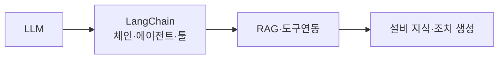

# LangChain을 활용한 설비 예지정비(Predictive Maintenance)

## 1. 개요

### 가. 예지정비 정의·필요성
> 설비의 센서 데이터·상태를 분석해 **고장을 사전 예측하고 최적 시점에 정비**하는 방식.

| 구분 | 내용 |
|---|---|
| **정의** | 상태 기반(CBM)·예측 기반 정비 |
| **필요성** | 예방정비(과잉)·사후정비(고장손실) 한계 극복, 가동률·안전↑ |
| **비교** | 사후정비 → 예방정비(주기) → **예지정비(예측)** |

## 2. LangChain과 LLM

| 개념 | 내용 |
|---|---|
| **LLM** | 대규모 언어모델(자연어 이해·생성) |
| **LangChain** | LLM 앱 개발 프레임워크 — **체인·에이전트·툴·메모리·RAG** 구성 |
| **역할** | LLM을 외부 데이터·도구(센서 DB·API)와 연결·오케스트레이션 |

## 3. LangChain 이용 예지정비 활용

| 활용 | 내용 |
|---|---|
| **RAG 기반 지식 조회** | 설비 매뉴얼·정비 이력을 벡터DB로 검색·근거 제공 |
| **에이전트·툴 연동** | 센서 데이터·이상탐지 모델 호출, 진단 결과 해석 |
| **자연어 진단·조치** | 이상 원인 분석·정비 지침을 자연어로 생성 |
| **대화형 인터페이스** | 현장 작업자 질의응답(챗봇) |

- 예: 이상탐지 모델이 경보 → LangChain 에이전트가 매뉴얼 RAG + 이력 조회 → **원인·조치안 생성**

## 4. 고려사항

| 고려 | 내용 |
|---|---|
| **환각·정확성** | RAG·근거 제시로 신뢰성 확보 |
| **데이터 보안** | OT 데이터 유출 방지(온프레·프라이빗 LLM) |
| **실시간성** | 이상탐지(ML)와 LLM 해석의 역할 분리 |

## 5. 고려사항 및 시사점
- **이상탐지(ML) + LLM(해석·조치)** 결합이 효과적
- OT/IT 융합 보안·데이터 품질이 전제
- 산업 현장 AI 에이전트·디지털 트윈과 연계

---

> **한 줄 요약**: 예지정비는 *센서 데이터로 고장을 사전 예측·정비* 하는 방식이며, LangChain은 LLM을 센서·매뉴얼(RAG)·도구와 연결해 이상 원인 분석·정비 지침 생성·대화형 진단을 지원한다.
