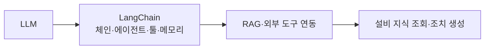

# LangChain을 활용한 설비 예지정비(Predictive Maintenance)

## 1. 개요

### 가. 예지정비의 정의 및 필요성
> **예지정비(PdM)** 는 설비에 부착된 센서 데이터와 상태 정보를 분석해 **고장을 사전에 예측하고, 실제로 필요한 시점에만 정비**하는 방식이다. 상태 기반 정비(CBM)에 예측 모델을 결합한 개념이다.

정비 방식은 역사적으로 세 단계로 발전해 왔다. 초기의 **사후정비(BM)** 는 고장이 난 뒤 고치는 방식으로 예상치 못한 생산 중단과 큰 손실을 유발했다. 이를 개선한 **예방정비(PM)** 는 일정 주기마다 부품을 교체하지만, 아직 쓸 수 있는 부품까지 버리는 **과잉정비**와 주기 사이에 발생하는 돌발 고장을 막지 못했다. **예지정비**는 설비의 실제 상태(진동·온도·전류 등)를 실시간 분석해 "고장이 임박한 그 시점"에 정비하므로, 과잉정비 낭비와 돌발 고장을 동시에 줄여 가동률과 안전성을 높인다.

### 나. 배경
설비 IoT 센서와 머신러닝 이상탐지 기술이 성숙하면서 예지정비의 예측 정확도가 크게 올랐다. 다만 이상탐지 모델은 "언제·어디서 이상이 있다"는 신호는 잘 잡지만, **그 원인이 무엇이고 무엇을 조치해야 하는지**를 사람 언어로 설명하지 못한다. 방대한 설비 매뉴얼과 과거 정비 이력을 현장 작업자가 즉시 해석하기도 어렵다. 여기서 LLM과 LangChain이 "탐지된 이상을 이해 가능한 진단·조치로 번역"하는 역할로 결합된다.

## 2. LangChain과 LLM

**LLM(대규모 언어모델)** 은 방대한 텍스트로 학습해 자연어를 이해·생성하지만, 그 자체로는 사내 설비 데이터나 실시간 센서에 접근하지 못한다. **LangChain** 은 이 LLM을 외부 데이터·도구와 연결해 하나의 애플리케이션으로 오케스트레이션하는 프레임워크다. 여러 단계를 이어 붙이는 **체인**, 스스로 도구 사용을 판단하는 **에이전트**, 외부 기능을 호출하는 **툴**, 대화 맥락을 유지하는 **메모리**, 문서 검색으로 근거를 주입하는 **RAG** 를 구성 요소로 제공한다. 즉 LangChain은 LLM을 "센서 DB·이상탐지 모델·매뉴얼 저장소"와 연결하는 접착제 역할을 한다.

| 개념 | 내용 |
|---|---|
| **LLM** | 대규모 언어모델 — 자연어 이해·생성 |
| **LangChain** | LLM 앱 개발 프레임워크 — 체인·에이전트·툴·메모리·RAG |
| **역할** | LLM을 센서 DB·API·매뉴얼 등 외부 자원과 연결·오케스트레이션 |

## 3. LangChain을 이용한 예지정비 활용

핵심은 **수치 예측은 ML이, 언어적 해석과 조치 안내는 LLM이** 맡는 역할 분담이다. 예지정비 워크플로에서 이상탐지 모델이 "베어링 진동 이상"을 감지하면, LangChain 에이전트가 이 신호를 받아 RAG로 해당 설비 매뉴얼과 과거 유사 사례를 검색하고, 그 근거를 바탕으로 원인과 조치안을 자연어로 생성한다. 현장 작업자는 챗봇에 "3호기 진동 왜 높지?"라고 물어 즉시 진단을 받을 수 있다.

| 활용 | 내용 |
|---|---|
| **RAG 기반 지식 조회** | 설비 매뉴얼·정비 이력을 벡터DB로 검색해 근거 있는 답변 제공 |
| **에이전트·툴 연동** | 센서 DB·이상탐지 모델을 호출해 진단 결과를 해석 |
| **자연어 진단·조치** | 이상 원인 분석과 정비 지침을 자연어로 생성 |
| **대화형 인터페이스** | 현장 작업자의 질의응답을 챗봇으로 지원 |

구체적 흐름 예시는 다음과 같다. **① 이상탐지 모델이 경보** 발생 → **② LangChain 에이전트가 설비 ID로 매뉴얼 RAG + 정비 이력 조회** → **③ 검색된 근거를 프롬프트에 결합해 원인 추정·조치안 생성** → **④ 작업자에게 출처와 함께 제시**. 이렇게 하면 탐지에서 조치까지의 시간이 단축되고, 숙련자에게 의존하던 진단 지식이 표준화된다.

## 4. 고려사항 및 시사점

가장 큰 위험은 LLM의 **환각**이다. 잘못된 정비 지침은 설비 손상·안전사고로 직결되므로, 반드시 **RAG로 실제 매뉴얼 근거를 제시**하고 최종 판단은 사람이 검증하는 Human-in-the-loop 구조를 둔다. 또 설비 운영 데이터(OT 데이터)는 기밀성이 높아 외부 상용 LLM에 그대로 보내면 유출 위험이 있으므로, **온프레미스·프라이빗 LLM** 이나 폐쇄망 배치가 전제된다. 실시간성 측면에서는 밀리초 단위 이상탐지는 경량 ML이 담당하고, 상대적으로 느린 LLM은 해석·보고 단계에 배치하는 역할 분리가 필요하다.

| 고려 | 내용 |
|---|---|
| **환각·정확성** | RAG 근거 제시 + 사람 검증(Human-in-the-loop) |
| **데이터 보안** | OT 데이터 유출 방지 — 온프레미스·프라이빗 LLM |
| **실시간성** | 이상탐지(ML)와 LLM 해석의 역할·계층 분리 |

종합하면, 예지정비의 성패는 **정확한 이상탐지(ML)와 신뢰할 수 있는 해석(LLM)의 결합**에 달려 있다. 전제 조건인 OT/IT 융합 보안과 데이터 품질을 확보한 위에서, 산업 현장의 AI 에이전트·디지털 트윈과 연계하면 자율적 설비 관리로 확장될 수 있다.

---

> **한 줄 요약**: 예지정비는 *센서 데이터로 고장을 사전 예측·정비* 하는 방식이며, LangChain은 LLM을 센서·매뉴얼(RAG)·도구와 연결해 이상 원인 분석·정비 지침 생성·대화형 진단을 지원하되, 환각 방지(RAG·사람 검증)와 OT 데이터 보안이 전제가 된다.
