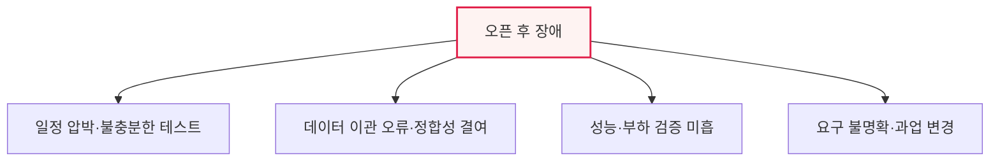

# 대규모 공공 차세대 시스템의 오픈 후 문제와 대책

## 1. 개요

### 가. 배경
> 대규모 공공 차세대 시스템(교육·복지·행정 등)이 오픈 직후 접속 장애·오류·데이터 불일치로 사회적 혼란을 초래하는 사례가 반복되면서, **개발·품질·오픈 판단 체계의 근본적 재점검** 필요성이 대두되었다.

이 문제가 반복되는 근본 원인은 '**대규모·복잡성과 촉박한 일정이 품질을 압박**'하는 구조에 있다. 차세대 시스템은 수년간 축적된 노후 시스템을 한꺼번에 교체하는 초대형 사업으로, 방대한 데이터를 이관하고 복잡한 기능을 통합해야 한다. 그런데 예산·정치적 일정에 쫓겨 충분한 테스트와 안정화 없이 오픈을 강행하면, 부하가 몰리는 실제 환경에서 잠재된 결함이 한꺼번에 터진다. 사용자 수백만 명이 동시에 겪는 장애는 곧바로 사회적 불편과 신뢰 훼손으로 직결된다. 따라서 이 문제는 단순한 기술 결함이 아니라, 발주·관리·품질·오픈 판단이라는 사업 관리 전반의 문제로 접근해야 한다.

## 2. 발생된 문제점의 원인

문제의 원인은 여러 층위에 걸쳐 있다. 정치적·예산 일정에 쫓겨 안정화·테스트가 부족했고, 방대한 데이터 이관 과정에서 오류·정합성 결여가 발생했으며, 실제 사용자 규모의 부하를 견디는지 성능 검증이 미흡했다. 근본적으로는 요구사항이 불명확한 채 사업이 진행되어 과업 변경이 잦았고, 관리·감리가 이를 조기에 걸러내지 못했다.

| 원인 | 내용 |
|---|---|
| **일정 압박** | 안정화·테스트 기간 부족, 오픈 강행 |
| **데이터 이관** | 대용량 이관 오류·정합성 결여 |
| **성능 검증 미흡** | 실사용 부하 테스트 부족 |
| **요구 불명확** | 과업 변경 빈발, 범위 통제 실패 |

## 3. 재발 방지 대책 및 법·제도 보완

| 구분 | 대책 |
|---|---|
| **품질 관리** | 충분한 통합·부하·안정화 테스트, 병행 운영(구·신 시스템) |
| **데이터** | 이관 무결성·정합성 검증 강화, 리허설 |
| **관리·감리** | 요구 상세화(ISMP), 단계별 감리·품질 게이트 |
| **법·제도** | 오픈 판단 기준 법제화, 적정 사업기간·대가 보장, 하자·책임 명확화 |

근본 대책은 '**서둘러 오픈하지 않도록 제도로 강제하는 것**'이다. 충분한 테스트와 병행 운영을 의무화하고, 정치적 일정이 아니라 객관적 준비도에 따라 오픈을 판단하도록 법·제도를 보완한다.

## 4. 시스템 오픈 가능 여부 판단을 위한 지표 관리

오픈 여부는 감이 아니라 정량 지표로 판단해야 한다. 결함 밀도·잔존 결함(중대 결함 0 여부), 테스트 커버리지·통과율, 성능 목표 달성률(응답시간·동시접속), 데이터 이관 정합성률 등을 사전 정의한 기준(품질 게이트)과 비교해, 기준을 충족할 때만 오픈한다.

| 지표 | 판단 기준(예) |
|---|---|
| **결함** | 중대(Critical) 결함 0, 결함 밀도 목표 이하 |
| **테스트** | 커버리지·통과율 목표 달성 |
| **성능** | 목표 응답시간·동시접속 부하 통과 |
| **데이터** | 이관 정합성률 100% 근접 |

## 5. 고려사항 및 시사점

1. **오픈 판단의 객관화·제도화**가 핵심이다. 정치·행정 일정의 압박에서 벗어나, 정량 지표(품질 게이트)를 충족해야만 오픈하는 원칙을 제도로 못 박아야 한다.
2. **병행 운영과 단계적 전환**으로 위험을 줄인다. 구·신 시스템을 일정 기간 병행하거나 기능을 단계적으로 전환해, 빅뱅 오픈의 폭발 위험을 분산한다.
3. **발주·관리 체계의 개선**이 근본이다. 요구사항 상세화(ISMP), 적정 사업기간·대가 보장, 단계별 감리로 애초에 품질을 확보하는 것이 사후 대응보다 효과적이다.

---

> **한 줄 요약**: 대규모 공공 차세대 시스템의 오픈 후 장애는 *일정 압박·데이터 이관 오류·성능 검증 미흡·요구 불명확* 에서 비롯되며, 충분한 테스트·병행 운영·정량 지표 기반 오픈 판단(품질 게이트)과 법·제도 보완으로 재발을 방지해야 한다.
