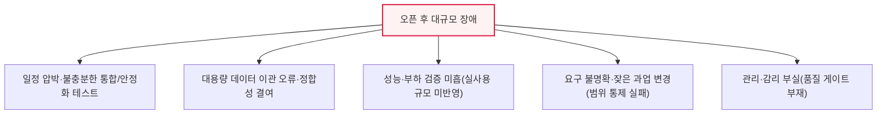
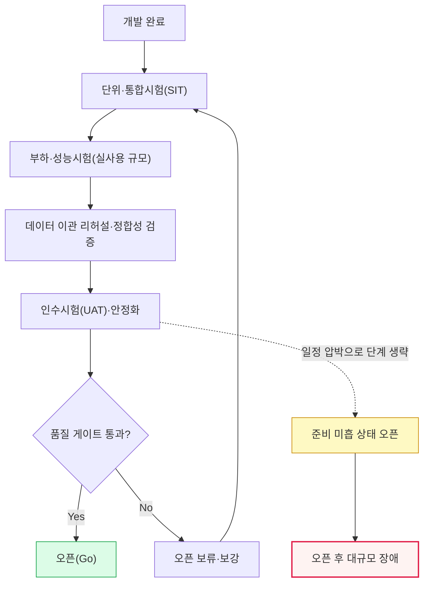

# 대규모 공공 차세대 시스템의 오픈 후 문제와 대책

## 1. 개요

### 가. 배경 및 문제 제기

> 대규모 공공 차세대 시스템(교육·복지·행정·세무 등)이 오픈 직후 접속 장애·처리 오류·데이터 불일치로 사회적 혼란을 초래하는 사례가 반복되면서, **개발·품질·오픈 판단 체계 전반의 근본적 재점검** 필요성이 대두되었다.

이 문제가 반복되는 근본 원인은 "**초대형·고복잡도 시스템의 특성과 촉박한 정치·행정 일정이 품질을 상시 압박**"하는 구조에 있다. 차세대 시스템은 수년~수십 년간 누적·분산된 노후(Legacy) 시스템을 한꺼번에 교체하는 초대형 사업으로, 방대한 데이터를 이관하고 부처·기관 간 복잡한 기능을 통합해야 한다. 여기에 수백만~수천만 명이 동시에 사용하는 국민 서비스라는 특성이 더해져, 작은 결함도 곧바로 대규모 장애로 증폭된다.

그런데 예산 회계연도·정책 발표·개통 행사 같은 **일정에 쫓겨** 충분한 통합시험과 안정화 없이 오픈을 강행하면, 부하가 몰리는 실제 운영 환경에서 잠재된 결함이 한꺼번에 터진다. 사용자 수백만 명이 동시에 겪는 장애는 즉시 사회적 불편, 민원 폭증, 행정 신뢰 훼손, 그리고 발주기관·수행사 간 책임 공방으로 이어진다. 실제로 교육행정정보시스템(4세대 나이스, 2023년) 오픈 직후의 성적 처리·접속 장애, 복지·행정 시스템(차세대 사회보장정보시스템, 2022년) 개통 후의 급여 지급 지연 등은 이 구조적 문제를 상징적으로 보여준 사례로 보도된 바 있다(구체 수치·경과는 감사·조사 결과에 따라 다를 수 있어 일반화한다).

따라서 이 문제는 단순한 "코딩 결함"이 아니라, **발주·과업 관리·품질 보증·오픈 의사결정** 이라는 사업 관리 전반의 문제로 접근해야 한다. 기술적 대응만으로는 재발을 막을 수 없고, 오픈 판단의 객관화와 법·제도적 강제가 병행되어야 한다는 것이 핵심 인식이다.

### 나. 대규모 차세대 사업의 구조적 특성

차세대 사업이 일반 SI보다 위험한 이유는 세 가지 특성 때문이다. 첫째, **빅뱅(Big-bang) 전환** 이 잦다. 노후 시스템을 특정 시점에 일괄 폐기하고 신규로 넘어가므로, 실패 시 되돌릴 여지(Rollback)가 작다. 둘째, **데이터 이관의 규모·복잡도** 가 크다. 수십 년간 서로 다른 규칙으로 쌓인 데이터를 새 스키마로 옮기는 과정에서 정합성 오류가 필연적으로 발생한다. 셋째, **이해관계자와 요구의 복잡성** 이다. 다수 부처·기관·현업이 얽혀 요구가 자주 바뀌고, 정치적 일정이 기술적 준비도보다 우선되는 압력이 상존한다. 이 세 특성이 결합해 "준비가 덜 된 채 되돌릴 수 없는 방식으로 오픈"하는 최악의 조합을 만든다.

## 2. 오픈 후 발생 문제점과 원인

```mermaid
flowchart TB
  F["오픈 후 대규모 장애"] --> R1["일정 압박·불충분한 통합/안정화 테스트"]
  F --> R2["대용량 데이터 이관 오류·정합성 결여"]
  F --> R3["성능·부하 검증 미흡(실사용 규모 미반영)"]
  F --> R4["요구 불명확·잦은 과업 변경(범위 통제 실패)"]
  F --> R5["관리·감리 부실(품질 게이트 부재)"]
  style F fill:#fef3f2,stroke:#e11d48,stroke-width:2px
```

오픈 후 장애의 원인은 어느 한 지점이 아니라 여러 층위에 걸쳐 누적된다. 위 구조도의 다섯 원인을 산문으로 풀면 다음과 같다.

첫째, **일정 압박에 따른 테스트·안정화 부족** 이다. 예산 회계연도 말이나 정책 발표 시점에 개통을 맞추려다 보니, 통합시험·부하시험·안정화에 필요한 기간이 가장 먼저 삭감된다. 시험은 일정이 밀리면 압축되는 "완충 구간"으로 취급되기 쉽고, 그 결과 잠재 결함을 오픈 전에 걸러낼 마지막 방어선이 무너진다. 특히 여러 기관·모듈을 통합하는 **통합시험(SIT)** 과 실제 업무 흐름을 검증하는 **인수시험(UAT)** 이 부실하면, 단위 기능은 정상인데 연결부에서 터지는 유형의 장애가 오픈 후에 집중된다.

둘째, **대용량 데이터 이관의 오류·정합성 결여** 다. 노후 시스템의 데이터는 수십 년간 서로 다른 규칙·예외로 쌓여 있어, 새 스키마로 옮기는 ETL 과정에서 누락·중복·형변환 오류·참조 무결성 위반이 발생한다. 이관 리허설(Dry-run)과 정합성 검증(원천-대상 건수·합계·표본 대조)을 충분히 하지 않으면, 오픈 후 "내 기록이 사라졌다/틀렸다"는 유형의 민원이 폭증한다. 데이터 문제는 화면 오류와 달리 사후 복구가 어렵고 신뢰 훼손이 크다는 점에서 특히 치명적이다.

셋째, **성능·부하 검증 미흡** 이다. 개발·시험 환경은 실사용 규모의 동시접속·트랜잭션을 재현하지 못하는 경우가 많다. 실제 오픈일에 전국 사용자가 동시에 몰리면, 시험에서 드러나지 않던 커넥션 풀 고갈·락 경합·캐시 미스·배치 지연이 한꺼번에 표면화된다. 목표 응답시간·동시접속·초당 처리량(TPS)을 실환경에 준하는 규모로 검증하지 않은 것이 원인이다.

넷째, **요구 불명확과 잦은 과업 변경** 이다. 사업 초기에 요구가 상세화되지 않은 채 착수되면, 개발 중 과업이 계속 바뀌어 설계·시험이 흔들린다. 범위(Scope)가 통제되지 않으면 일정·품질이 함께 무너진다. 다섯째, 이를 조기에 걸러내야 할 **관리·감리가 부실** 해 단계별 품질 게이트가 작동하지 않은 것이 근본 배경이다.

| 원인 | 구체 내용 | 대표 증상 |
|---|---|---|
| **일정 압박** | 안정화·통합/부하 시험 기간 삭감, 오픈 강행 | 연결부 통합 오류 집중 |
| **데이터 이관** | 대용량 ETL 오류·정합성 검증 부족 | 기록 누락·금액 오류 민원 |
| **성능 검증 미흡** | 실사용 규모 부하시험 부족 | 접속 지연·서비스 다운 |
| **요구 불명확** | 범위 통제 실패, 과업 변경 빈발 | 설계·시험 재작업 |
| **관리·감리 부실** | 품질 게이트·단계 검증 미작동 | 위험의 후반 폭발 |

이 원인들은 서로 독립적이지 않고 **연쇄적으로 증폭** 된다. 일정 압박이 시험을 줄이고, 줄어든 시험이 데이터·성능 문제를 오픈 후로 미루며, 요구 불명확이 재작업을 낳아 다시 일정을 압박하는 악순환이다. 따라서 어느 한 원인만 손보는 대증요법이 아니라, "일정보다 준비도가 오픈을 결정한다"는 원칙으로 고리 전체를 끊어야 한다. 아래 프로세스 세부도는 이상적인 오픈 판단 흐름과 실패 지점(붉은 분기)을 함께 보여준다.

```mermaid
flowchart TB
  A["개발 완료"] --> B["단위·통합시험(SIT)"]
  B --> C["부하·성능시험(실사용 규모)"]
  C --> D["데이터 이관 리허설·정합성 검증"]
  D --> E["인수시험(UAT)·안정화"]
  E --> G{"품질 게이트 통과?"}
  G -->|"Yes"| H["오픈(Go)"]
  G -->|"No"| I["오픈 보류·보강"]
  I --> B
  E -.->|"일정 압박으로 단계 생략"| J["준비 미흡 상태 오픈"]
  J --> K["오픈 후 대규모 장애"]
  style H fill:#dcfce7,stroke:#16a34a
  style K fill:#fef3f2,stroke:#e11d48,stroke-width:2px
  style J fill:#fef9c3,stroke:#ca8a04
```

프로세스 세부도에서 정상 경로(A→…→G→H)는 각 시험 단계를 순차로 통과하고 품질 게이트에서 최종 확인하는 흐름이다. 반면 점선 경로(E-.->J→K)는 일정 압박으로 부하시험·정합성 검증·안정화를 건너뛰고 오픈을 강행한 실패 경로다. 두 경로의 분기점은 결국 "게이트를 강제할 것인가, 우회할 것인가"라는 의사결정에 있으며, 이 결정을 사람의 재량이 아니라 제도로 고정하는 것이 대책의 핵심이다.

## 3. 재발 방지 대책 및 법·제도 보완

근본 대책은 "**준비가 덜 된 채 서둘러 오픈하지 않도록 제도로 강제하는 것**"이다. 개별 기술 조치만으로는 다음 사업에서 같은 압박이 재현되므로, 품질·데이터·관리·제도의 네 축에서 함께 접근해야 한다.

첫째, **품질 관리** 측면에서는 통합·부하·안정화 시험을 계약상 의무 기간으로 명시하고, 구·신 시스템을 일정 기간 함께 돌리는 **병행 운영(Parallel Run)** 으로 결과를 상호 대조한다. 병행 운영은 신규 시스템의 산출을 기존 시스템과 비교해 이상을 조기에 잡아내는 안전장치다.

둘째, **데이터** 측면에서는 이관을 여러 차례 **리허설** 하고, 원천-대상 간 건수·합계·핵심 항목 표본을 대조하는 정합성 검증을 통과 기준으로 삼는다. 이관 실패 시 복귀 절차(Rollback plan)도 사전에 정의한다.

셋째, **관리·감리** 측면에서는 사업 착수 전에 요구를 상세화하는 **ISMP(정보시스템 마스터플랜)** 를 수행하고, 단계마다 감리와 **품질 게이트(Quality Gate)** 를 두어 기준 미달 시 다음 단계로 넘어가지 못하게 한다.

넷째, **법·제도** 측면에서는 객관적 준비도에 따라 오픈을 판단하도록 **오픈 판단 기준을 제도화** 하고, 무리한 일정·저가 발주를 막기 위해 적정 사업기간·대가를 보장하며, 하자·책임 소재를 계약으로 명확히 한다.

| 구분 | 대책 | 기대 효과 |
|---|---|---|
| **품질 관리** | 통합·부하·안정화 시험 의무화, 병행 운영 | 오픈 전 결함 제거, 안전한 전환 |
| **데이터** | 이관 리허설, 정합성 검증, 복귀 절차 | 데이터 무결성·신뢰 확보 |
| **관리·감리** | ISMP 요구 상세화, 단계별 감리·품질 게이트 | 위험 조기 차단 |
| **법·제도** | 오픈 판단 기준 법제화, 적정 기간·대가, 책임 명확화 | 일정 압박 구조 개선 |

이 대책들의 공통 논리는 "위험을 **후반에서 전반으로, 사람 판단에서 제도·지표로** 옮긴다"는 것이다. 즉 오픈 직전의 임기응변이 아니라, 사업 설계 단계부터 품질을 확보하고 오픈 판단을 정량화하는 예방적 접근이다.

특히 **병행 운영과 단계적 전환** 은 빅뱅 방식의 되돌릴 수 없음(Irreversibility)을 완화하는 가장 실효적인 장치다. 구 시스템을 즉시 폐기하지 않고 일정 기간 함께 운영하면, 신규 시스템 산출을 기존과 대조해 이상을 조기에 잡아낼 수 있고, 중대한 장애 시 즉시 되돌릴 안전판이 확보된다. 기능·지역·기관을 나눠 순차 개통하는 단계적 전환은 초기 개통 규모를 줄여 장애의 파급 범위를 제한하고, 앞 단계에서 얻은 교훈을 다음 단계에 반영하게 해준다. 한 번에 전국·전 기능을 여는 빅뱅은 화려하지만, 실패 비용이 사업 전체 규모로 커진다는 점에서 신중해야 한다.

또한 제도적 보완은 **발주 관행 자체** 를 겨냥해야 한다. 저가 낙찰과 촉박한 사업기간이 구조적으로 품질 압박을 만들기 때문에, 적정 대가 산정과 현실적 공기(工期) 보장, 과업 변경에 대한 정당한 대가 지급이 병행되지 않으면 수행사는 다시 시험·안정화를 희생하게 된다. 즉 "품질을 지키는 것이 손해가 되지 않는" 계약 구조를 만드는 것이 기술적 대책 못지않게 중요하다.

## 4. 오픈 가능 여부 판단을 위한 지표 관리(품질 게이트)

오픈 여부는 담당자의 감(感)이나 정치적 일정이 아니라 **사전 정의된 정량 지표** 로 판단해야 한다. 핵심은 오픈 판단 기준(Go/No-go Criteria)을 사업 초기에 합의하고, 오픈 직전 이를 충족했는지 객관적으로 확인하는 **품질 게이트** 를 운영하는 것이다.

판단 지표는 크게 네 가지 축으로 구성한다. **결함(Defect)** 축에서는 중대(Critical)·긴급(Blocker) 결함이 0인지, 결함 밀도가 목표 이하인지를 본다. **테스트** 축에서는 요구 대비 시험 커버리지와 통과율이 목표를 달성했는지 확인한다. **성능** 축에서는 목표 응답시간·동시접속·TPS를 실사용 규모 부하시험에서 통과했는지 검증한다. **데이터** 축에서는 이관 정합성률이 기준(예: 100%에 근접)을 만족하는지 확인한다. 이 네 축을 모두 통과해야만 "오픈 가능(Go)"으로 판정한다.

| 지표 축 | 판단 기준(예시) | 미달 시 조치 |
|---|---|---|
| **결함** | 중대·긴급 결함 0, 결함 밀도 목표 이하 | 오픈 보류·핫픽스 |
| **테스트** | 요구 대비 커버리지·통과율 목표 달성 | 시험 보강 |
| **성능** | 목표 응답시간·동시접속·TPS 부하 통과 | 튜닝·증설 |
| **데이터** | 이관 정합성률 기준 충족 | 재이관·보정 |

중요한 것은 지표를 **오픈 후가 아니라 오픈 전에** 강제력 있게 적용하는 것이다. 게이트를 통과하지 못하면 일정을 미루더라도 오픈하지 않는다는 원칙이 서지 않으면, 지표는 요식 행위로 전락한다. 또한 오픈 후에도 접속 성공률·오류율·응답시간을 실시간 대시보드로 모니터링하고, 사전에 정한 임계치를 넘으면 병행 운영 중인 구 시스템으로 되돌리는 **롤백·비상 대응 체계** 를 갖춰야 한다.

## 5. 심화: 유사 기출 연계와 예상 출제 방향

이 주제는 프로젝트·품질·감리·리스크 관리가 교차하는 종합 논제로, 여러 기출과 연결된다. ① **품질 관리** 측면에서는 결함 밀도·테스트 커버리지 같은 품질 지표와 SQA(소프트웨어 품질보증), ② **리스크 관리** 측면에서는 빅뱅 전환의 위험 분산(단계적 전환·병행 운영), ③ **발주·감리** 측면에서는 ISMP·정보화 사업 감리·EVM(획득가치관리), ④ **데이터 관리** 측면에서는 데이터 이관·품질(Data Quality)·마이그레이션 전략과 이어진다. 최근에는 클라우드 네이티브 전환과 맞물려, 빅뱅 대신 기능을 점진적으로 옮기는 **스트랭글러 패턴(Strangler Fig)** 이나 카나리·블루-그린 배포로 전환 위험을 분산하는 방안이 대안으로 논의된다.

기술사 답안에서는 "왜 반복되는가(구조적 원인) → 무엇을 고칠 것인가(품질·데이터·관리·제도) → 오픈을 어떻게 판단할 것인가(정량 게이트)"의 흐름으로 전개하고, 결론에서 **오픈 판단의 객관화·제도화와 빅뱅 위험 분산** 을 강조하면 설득력이 높다. 특정 사업의 원인을 단정하기보다, 공통 구조와 대책을 일반화해 서술하는 것이 안전하다.

## 6. 고려사항 및 시사점

1. **오픈 판단의 객관화·제도화가 핵심이다.** 정치·행정 일정의 압박에서 벗어나, 정량 지표(품질 게이트)를 충족해야만 오픈하는 원칙을 계약·제도로 못 박아야 한다. 게이트 미통과 시 오픈 연기 권한을 명확히 부여해야 실효성이 생긴다.
2. **빅뱅 대신 단계적 전환·병행 운영으로 위험을 분산한다.** 구·신 시스템 병행, 기능·지역 단위 순차 개통, 스트랭글러·카나리 배포로 "한 번에 전부 바꾸는" 폭발 위험을 줄인다.
3. **발주·과업 관리 체계의 개선이 근본이다.** ISMP를 통한 요구 상세화, 적정 사업기간·대가 보장, 저가·촉박 발주 관행 개선, 단계별 감리로 애초에 품질을 확보하는 것이 사후 대응보다 훨씬 효과적이다.
4. **데이터 이관을 독립 리스크로 관리한다.** 이관은 기능 개발과 별도의 전담·검증 체계(리허설·정합성 검증·복귀 절차)를 두어야 하며, 데이터 신뢰 훼손은 복구가 어렵다는 점에서 최우선 관리 대상이다.
5. **오픈 후 안정화·비상 대응까지 사업 범위에 포함한다.** 오픈은 끝이 아니라 시작이므로, 실시간 모니터링·핫픽스 체계·롤백 계획·안정화 인력을 계약 범위와 예산에 명시해 "오픈 후 방치"를 막아야 한다.

## 참고자료

- 소프트웨어 진흥법·정보시스템 감리 기준(과학기술정보통신부), https://www.msit.go.kr/
- 한국지능정보사회진흥원(NIA) 정보화사업 관리·감리 안내, https://www.nia.or.kr/
- Martin Fowler, StranglerFigApplication, https://martinfowler.com/bliki/StranglerFigApplication.html

---

> **한 줄 요약**: 대규모 공공 차세대 시스템의 오픈 후 장애는 *일정 압박·데이터 이관 오류·성능 검증 미흡·요구 불명확·감리 부실* 이라는 구조적 원인에서 비롯되며, 충분한 통합/부하 시험·병행 운영·정량 지표 기반 오픈 판단(품질 게이트)·빅뱅 위험 분산·법제도 보완으로 재발을 방지해야 한다.
