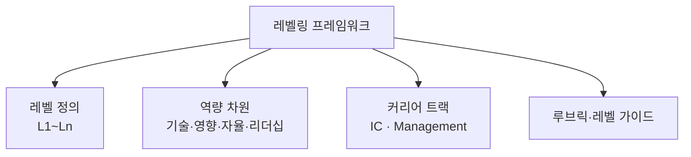

# 레벨링 프레임워크(Leveling Framework, 직무 레벨 체계)

## 1. 개요

### 가. 정의
> 조직 내 직무의 **책임·역량·영향력(impact) 수준을 체계적으로 정의하고 등급(레벨)으로 구조화**하여, 채용·평가·보상·성장경로에 일관된 기준을 제공하는 인사·조직 관리 체계. 특히 IT·엔지니어링 조직에서 "무엇이 시니어를 시니어로 만드는가"를 연차가 아닌 **영향력의 범위(scope of impact)** 로 규정한다.

레벨링 프레임워크의 본질은 **성장과 보상의 '공통 언어'를 만드는 것**이다. 레벨이 없으면 "저 사람은 왜 시니어인가", "나는 왜 승진하지 못했나"라는 물음에 관리자의 주관 외에는 답할 근거가 없다. 레벨링 프레임워크는 각 레벨이 요구하는 행동·역량·영향력을 명문화한 **루브릭(rubric)** 을 제시함으로써, 평가·보상·승진을 개인의 인상이 아니라 **관찰 가능한 기준**에 정렬시킨다.

### 나. 등장 배경 및 필요성
조직이 소규모일 때는 구성원의 기여를 리더가 직접 관찰할 수 있어 별도 체계가 필요 없다. 그러나 인원이 수십·수백 명으로 늘면 **형평성 문제(같은 직급인데 왜 보상이 다른가)**, **성장경로의 불투명(무엇을 해야 다음 단계로 가는가)**, **주관적 평가**가 조직 신뢰를 갉아먹기 시작한다. 특히 IT 인력은 전문성이 깊어질수록 반드시 관리자가 되어야만 성장·보상이 오르는 구조에 갇히는데, 뛰어난 엔지니어를 관리자로 승진시켰다가 둘 다 잃는 **피터의 법칙(Peter Principle)** 이 이를 잘 보여준다. 레벨링 프레임워크는 이런 문제에 대응해 **객관적 기준과 전문가 성장경로**를 동시에 제공하기 위해 등장했다.

## 2. 구성요소

레벨링 프레임워크는 네 요소가 맞물려 작동한다. 레벨만 있고 역량 차원이 없으면 무엇으로 레벨을 판정할지 모호하고, 루브릭이 없으면 같은 레벨도 평가자마다 다르게 해석하기 때문이다.

| 구성요소 | 내용 | 역할 |
|---|---|---|
| **레벨 정의** | L1(주니어)~Ln(펠로우/임원급)의 단계 | 성장 계단의 뼈대 |
| **역량 차원** | 기술 전문성, 영향 범위, 자율성, 협업·리더십, 비즈니스 임팩트 | 무엇으로 레벨을 판정하는가 |
| **커리어 트랙** | IC(개인기여자)·Management(관리자) 이원 경로 | 성장 방향의 선택지 |
| **루브릭/레벨 가이드** | 각 레벨×차원의 기대 행동을 서술한 매트릭스 | 판정의 객관적 근거 |

가장 핵심이 되는 축은 **영향력의 범위**다. 낮은 레벨은 주어진 과제(task)를 완수하는 데 초점이 있고, 레벨이 오를수록 그 영향이 **프로젝트→팀→조직→회사 전체**로 넓어진다. 예컨대 미들 엔지니어는 잘 정의된 기능을 스스로 구현하지만, 스태프급은 여러 팀에 걸친 아키텍처 문제를 정의하고 방향을 제시한다. 이처럼 **자율성(얼마나 지시 없이 스스로 문제를 정의·해결하는가)과 모호성 처리 능력**이 레벨과 함께 커지는 것이 핵심 원리다.

## 3. 듀얼 래더(Dual Ladder)

레벨링 프레임워크의 가장 중요한 설계 사상은 **개인기여자(IC) 트랙과 관리자(M) 트랙을 동등한 레벨로 병렬 배치**하는 듀얼 래더다. 두 트랙을 같은 높이로 두는 이유는 명확하다. 전문성이 깊은 엔지니어를 성장시키려고 관리자로 올리면, 조직은 훌륭한 엔지니어를 잃고 대신 준비 안 된 관리자를 얻는 이중 손실을 겪기 때문이다.

| 트랙 | 성장 방향 | 상위 레벨 예시 |
|---|---|---|
| **IC(개인기여자)** | 기술 깊이·영향력 확대 | 스태프 → 프린시펄 → 펠로우 엔지니어 |
| **Management** | 조직·사람 관리 범위 확대 | 팀장 → 그룹장 → 디렉터 → VP |

핵심은 특정 레벨 이상에서 두 트랙이 **동일한 보상·위상**을 갖는다는 점이다. 예컨대 프린시펄 엔지니어와 디렉터가 같은 레벨로 대우받으면, 엔지니어는 "관리자가 되지 않고도" 최고 수준까지 성장할 수 있다. 이는 기술 리더십을 조직에 붙잡아 두는 강력한 유인이 된다. 다만 두 트랙은 **상호 전환이 가능**해야 하며, 관리 트랙도 기술 이해를 잃지 않도록 설계해야 한다.

## 4. 운영: 캘리브레이션과 스킬 프레임워크 연계

루브릭이 있어도 평가자마다 잣대가 다르면 형평성은 무너진다. 그래서 여러 관리자가 모여 서로의 평가 근거를 대조하고 기준 편차를 조정하는 **캘리브레이션(calibration)** 회의가 필수다. A팀의 '시니어'와 B팀의 '시니어'가 실제로 같은 수준인지 교차 검증함으로써, 레벨이 조직 전체에서 일관된 의미를 갖도록 보정하는 것이다.

또한 레벨링 프레임워크는 표준 **스킬 프레임워크와 연계**할 때 객관성이 커진다. 대표적으로 국제 IT 역량 표준인 **SFIA(Skills Framework for the Information Age)** 는 IT 직무 역량을 7단계 책임 수준(자율성·영향·복잡성 등)으로 정의하는데, 이를 사내 레벨과 매핑하면 외부 벤치마크에 기반한 근거를 얻는다. 국내에서는 **NCS(국가직무능력표준)** 의 능력단위·수준 체계가 유사한 역할을 한다.

| 운영요소 | 목적 |
|---|---|
| **캘리브레이션** | 평가자 간 기준 편차 조정 → 조직 전체 형평성 |
| **스킬 프레임워크(SFIA·NCS) 연계** | 외부 표준 기반 객관성 확보 |
| **정기 리뷰·레벨 인플레이션 관리** | 레벨 남발로 기준이 무너지는 것 방지 |

## 5. 전통적 연공서열과의 비교

레벨링 프레임워크가 왜 필요한지는 **연공서열(호봉제)** 과 대조하면 분명해진다. 연공서열은 근속연수에 비례해 등급·보상이 오르므로 운영이 단순하고 예측 가능하지만, **기여와 보상이 어긋나는** 문제가 있다. 오래 근무했지만 영향력이 정체된 사람과, 짧지만 조직에 큰 임팩트를 낸 사람이 뒤바뀐 대우를 받으면 우수 인재가 이탈한다. 레벨링 프레임워크는 보상의 기준을 **연차에서 영향력·역량으로 옮김**으로써 이 불일치를 해소한다. 차이가 생기는 근본 이유는 두 체계가 측정하는 대상 자체가 다르기 때문이다—하나는 '얼마나 오래', 다른 하나는 '얼마나 넓게'.

| 구분 | 연공서열(호봉제) | 레벨링 프레임워크 |
|---|---|---|
| **기준** | 근속연수 | 역량·영향력 범위 |
| **장점** | 단순·예측 가능·안정 | 기여-보상 정합, 성장경로 명확 |
| **단점** | 기여-보상 불일치, 인재 이탈 | 설계·운영 비용, 레벨 인플레이션 위험 |

## 6. 고려사항 및 시사점(기술사 관점)
- **객관성과 유연성의 균형**: 루브릭이 지나치게 세밀하면 체크리스트를 채우는 형식주의로 흐르고, 지나치게 추상적이면 주관이 개입한다. 관찰 가능한 행동 중심으로 서술하되 맥락 판단의 여지를 남기는 균형이 필요하다.
- **레벨 인플레이션 경계**: 이직·리텐션 압박으로 레벨을 남발하면 기준 자체가 무너져 프레임워크가 무의미해진다. 캘리브레이션과 상위 레벨 승진의 높은 기준선(bar)으로 통제해야 한다.
- **조직 성숙도에 맞춘 도입**: 소규모 스타트업에 대기업식 다단계 레벨을 이식하면 관료화만 부른다. 인원 규모·성장 단계에 맞춰 단순한 골격에서 점진적으로 정교화하는 것이 바람직하다.
- **문화·보상체계와의 정합**: 레벨은 평가·보상·승진과 연결될 때만 실효를 갖는다. 레벨 정의만 만들고 보상 밴드와 연동하지 않으면 문서로만 남는다.
- **AI 시대의 역량 재정의**: 생성형 AI가 코딩·문서 작업을 보조하면서, 낮은 레벨에서 요구되던 '실행 속도'보다 **문제 정의·검증·판단** 같은 상위 역량의 비중이 커지고 있다. 레벨 루브릭의 역량 차원도 이에 맞춰 주기적으로 갱신해야 한다.

---

> **한 줄 요약**: 레벨링 프레임워크는 직무를 *영향력의 범위·역량*으로 등급화해 채용·평가·보상·성장의 공통 언어를 제공하는 체계로, *IC·관리 듀얼 래더*로 전문가 성장경로를 열고 *캘리브레이션·SFIA/NCS 연계*로 형평성과 객관성을 확보하되 레벨 인플레이션을 경계해야 한다.
