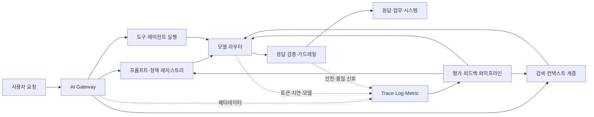
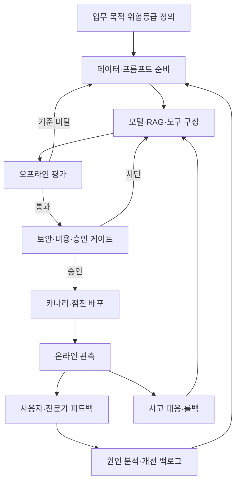

# LLMOps(대규모 언어모델 운영)와 생성형 AI 서비스 수명주기 관리

## 1. 개요

> **정의**: LLMOps(Large Language Model Operations)는 대규모 언어모델과 이를 활용한 애플리케이션을 개발·배포·운영·감사·개선하기 위해 프롬프트, 모델, 데이터, 검색, 도구 호출, 평가, 관측성, 보안 및 비용을 하나의 반복 가능한 운영체계로 관리하는 실천 방법론이다.

대규모 언어모델 서비스는 전통적인 소프트웨어처럼 동일한 입력에 대해 항상 동일한 출력을 내놓지 않는다.
모델 자체의 확률적 생성, 제공자 모델의 변경, 프롬프트의 작은 수정, 검색 문서의 변화, 도구 호출 결과가 함께 출력 품질을 바꾼다.
따라서 애플리케이션 코드를 배포하는 것만으로는 서비스 품질을 보장할 수 없다.

초기 생성형 AI 프로젝트는 프롬프트를 노트나 코드 안에 임시로 저장하고, 몇 개의 예시 질문으로 품질을 확인한 뒤 바로 운영에 투입하는 경우가 많았다.
이 방식은 데모를 빠르게 만들 수 있지만, 어떤 프롬프트와 모델이 어떤 근거를 사용했는지 재현하기 어렵다.
오답·환각·프롬프트 인젝션·개인정보 노출이 발생했을 때 원인을 추적하기도 어렵다.

LLMOps는 이러한 불확실성을 없애는 것이 아니라 통제 가능한 변화로 바꾸는 접근이다.
변경 가능한 요소를 버전과 승인 단위로 만들고, 출시 전 평가와 운영 중 관측을 연결한다.
품질·안전·지연시간·비용을 동시에 측정하여 하나의 지표만 최적화하는 부작용을 줄인다.

이 답안에서는 LLMOps의 구성 원리와 참조 아키텍처, MLOps와의 차이, 개발부터 폐기까지의 절차, 평가·관측성·보안 통제, 사례와 기술사 관점의 도입 전략을 논술한다.

## 2. LLMOps의 목표와 구성 원리

LLMOps의 첫 번째 목표는 재현성이다.
사용자 요청, 시스템 프롬프트, 검색 질의, 검색 문서 식별자, 모델 식별자, 파라미터, 도구 호출, 출력 및 평가 결과가 연결되어야 동일한 사건을 다시 분석할 수 있다.
완전한 결정론을 강제하기보다, 동일한 조건을 재구성할 수 있는 증적을 남기는 것이 현실적인 목표다.

두 번째 목표는 품질의 지속성이다.
LLM 응답은 정확성 하나만으로 평가하기 어렵고, 업무 목적에 맞는 근거성·관련성·일관성·안전성·형식 준수 여부를 함께 봐야 한다.
따라서 대표 질문으로 구성한 평가 데이터셋과 자동·전문가·사용자 평가를 결합해 변경 전후의 차이를 비교한다.

세 번째 목표는 운영 효율성이다.
모델 호출 비용과 토큰 수, 캐시 적중률, 검색 깊이, 도구 호출 횟수, GPU 또는 외부 API 사용량을 관리해야 한다.
성능을 높이기 위해 큰 모델만 선택하면 비용과 지연시간이 증가하므로 라우팅·캐시·프롬프트 압축·소형 모델 대체를 함께 검토한다.

네 번째 목표는 책임성과 통제 가능성이다.
누가 어떤 목적과 데이터로 시스템을 승인했는지, 어떤 정책을 위반했는지, 사고 후 어떤 조치를 했는지 확인할 수 있어야 한다.
이는 기술적 로그뿐 아니라 소유자, 위험등급, 이용 목적, 보존기간, 변경 승인과 같은 거버넌스 정보까지 포함한다.

다음은 사용자 요청이 여러 운영 자산을 거쳐 응답과 증적으로 변환되는 전체 구조이다.

AI Gateway는 여러 모델 제공자를 추상화하고 인증·속도제한·라우팅·비용정책을 적용하는 경계 계층이다.
단순한 프록시와 달리 모델 버전, 입력·출력 정책, 실패 시 대체 경로, 테넌트별 사용량을 함께 관리할 수 있어야 한다.

프롬프트·정책 레지스트리는 시스템 프롬프트와 템플릿을 소스코드 또는 전용 저장소에서 버전 관리한다.
프롬프트만 바꾸어도 결과가 달라지므로 코드와 동등한 검토·승인·롤백 절차가 필요하다.

검색·컨텍스트 계층은 RAG에서 사용할 문서를 수집·정제·분할·임베딩·색인하고, 요청에 맞는 근거를 검색한다.
문서가 바뀌었을 때 색인 버전과 문서 권한을 함께 관리하지 않으면 오래된 정보나 권한 없는 정보가 응답에 섞일 수 있다.

모델 라우터는 작업 유형과 위험도에 따라 모델을 선택한다.
간단한 분류는 소형 모델로 처리하고 복잡한 추론이나 고위험 업무는 상위 모델과 사람 검토를 거치는 방식이 대표적이다.
라우팅 규칙은 품질뿐 아니라 비용, 지연시간, 지역·데이터 주권, 장애 시 대체 가능성을 포함해야 한다.

응답 검증·가드레일은 입력과 출력 양쪽을 검사한다.
입력에서는 프롬프트 인젝션, 과도한 개인정보, 정책 외 질문을 확인하고, 출력에서는 금칙어·민감정보·구조화 형식·근거 링크·업무 규칙을 점검한다.
가드레일이 실패하면 무조건 차단하는 것보다 위험도에 따라 재질의·마스킹·안내문·사람 승인으로 분기하는 것이 서비스 목적에 부합한다.

## 3. 운영 수명주기와 참조 프로세스

LLMOps 수명주기는 아이디어, 데이터·목적 정의, 프롬프트와 체인 설계, 오프라인 평가, 배포, 온라인 운영, 피드백과 개선, 폐기의 순환으로 구성된다.
각 단계의 산출물이 다음 단계로 전달되어야 운영 품질이 개인의 경험에 의존하지 않는다.

### 3.1 목적 정의와 위험 분류

첫 단계에서는 모델을 도입하는 것이 목적이 아니라 해결할 업무 결과를 정의한다.
예를 들어 고객센터의 목표는 “답변을 생성한다”가 아니라 “내부 정책에 근거한 초안 답변으로 상담사의 처리시간을 줄이고 최종 책임은 상담사가 보유한다”가 될 수 있다.
목표가 구체적이어야 정확성, 처리시간, 상담사 수정률, 개인정보 사고율 같은 측정값을 정할 수 있다.

업무 영향도와 오류 허용도를 기준으로 위험등급을 분류한다.
단순 문서 요약은 자동 게시가 가능할 수 있지만, 대출 승인·의료 판단·인사 조치와 같이 권리나 재산에 영향을 주는 업무는 보조도구로 제한하고 사람 승인을 요구한다.
위험등급은 모델 성능이 좋아졌다고 자동으로 낮추지 않고, 법적 책임·피해 규모·복구 가능성을 함께 반영한다.

### 3.2 프롬프트·모델·데이터 자산 관리

프롬프트는 문자열이 아니라 실행 가능한 정책 자산이다.
템플릿 ID, 버전, 작성자, 변경 이유, 입력 변수, 허용 모델, 예상 출력 스키마, 금지 사례, 승인 상태를 함께 기록한다.
운영 환경에서는 부동 모델 별칭 대신 제공자가 보장하는 모델 식별자와 변경일을 기록하여 예기치 않은 모델 교체를 줄인다.

모델 레지스트리에는 기반 모델, 파인튜닝 어댑터, 양자화 방식, 라이선스, 학습·검증 데이터 출처, 평가 결과, 배포 상태를 연결한다.
모델 파일만 보관하고 데이터와 평가 조건을 남기지 않으면 성능 저하나 라이선스 문제를 설명하기 어렵다.

RAG 데이터는 문서의 내용만큼 권한과 최신성이 중요하다.
수집 시 원천 시스템, 소유 부서, 유효기간, 삭제·정정 이력, 접근등급을 저장하고, 청크와 임베딩의 관계를 추적한다.
문서 삭제 요청이 들어오면 원문 저장소뿐 아니라 캐시, 벡터 인덱스, 검색 결과 로그의 보존정책까지 확인해야 한다.

### 3.3 평가 설계와 품질 게이트

LLM 평가는 정답 문자열과 일치하는지를 보는 평가와 업무 목적에 맞는지를 보는 평가를 분리한다.
요약은 사실 보존과 누락을, 질의응답은 근거성과 답변 가능 여부를, 에이전트는 도구 선택과 실행 결과를 중심으로 평가한다.
하나의 종합점수는 편리하지만, 안전성 저하를 높은 유창성이 가리는 문제가 있으므로 원시 지표를 함께 보관한다.

오프라인 평가셋은 정상 질문만으로 만들지 않는다.
오탈자·다국어·긴 문서·모순된 자료·권한 없는 요청·적대적 입력·경계 사례를 포함해야 실제 장애를 예측할 수 있다.
운영 로그를 평가셋으로 재사용할 때는 개인정보를 비식별화하고, 평가 데이터가 다시 모델 학습에 사용되는지 별도로 통제한다.

자동 평가는 빠른 회귀 검출에 유리하고, 사람 평가는 업무 맥락과 미묘한 유해성을 발견하는 데 유리하다.
LLM-as-a-Judge는 비용과 속도의 장점이 있지만 평가자 모델의 편향과 자기 선호가 존재하므로 표본에 대한 전문가 교차검증이 필요하다.

대표적인 지표는 다음과 같이 목적별로 묶는다.

| 품질 영역 | 측정 예시 | 해석 시 주의점 |
|---|---|---|
| 정확성·근거성 | 정답률, 인용 근거 적합률, 답변 불가 판정 | 업무별 정답 기준과 문서 최신성을 명시한다 |
| 생성 품질 | 관련성, 일관성, 지시 준수율, 형식 오류율 | 유창성이 사실성을 보장하지 않는다 |
| RAG 품질 | 검색 재현율, 검색 정밀도, 컨텍스트 충실도 | 검색 실패와 생성 실패를 분리한다 |
| 안전성 | 정책 위반률, 개인정보 노출률, 인젝션 성공률 | 평균이 아니라 최악 사례와 고위험군을 본다 |
| 운영성 | p50·p95 지연시간, 오류율, 가용성 | 모델·검색·도구 구간별로 분해한다 |
| 경제성 | 요청당 토큰, 요청당 비용, 캐시 적중률 | 품질 저하 없는 비용 절감인지 확인한다 |

품질 게이트는 합격·불합격 기준을 사전에 선언해야 한다.
예를 들어 “근거 없는 답변은 답변 불가로 전환하고, 고위험 정책 위반은 0건을 목표로 하며, p95 지연시간은 서비스 목표 이내”와 같이 지표와 조치를 연결한다.
실제 임계값은 업무 위험과 사용자 기대를 기준으로 정하고, 문서에 적힌 예시 수치를 조직의 보편 기준으로 오해하지 않도록 한다.

### 3.4 배포·롤백·온라인 운영

LLM 애플리케이션은 모델뿐 아니라 프롬프트, 검색 인덱스, 도구 스키마, 가드레일 규칙이 함께 배포된다.
따라서 하나의 릴리스 매니페스트에 모든 구성요소의 버전을 기록하고 호환성 검사를 통과한 조합만 승격한다.

카나리 배포는 일부 트래픽에 새 조합을 적용해 품질과 운영지표를 비교하는 방식이다.
트래픽 비율보다 중요한 것은 관찰 창, 비교군, 중단 조건, 자동 또는 수동 롤백 책임자다.
모델 응답 품질은 요청 유형별 편차가 크므로 전체 평균뿐 아니라 핵심 업무군과 위험 입력군을 별도로 모니터링한다.

롤백은 이전 모델로만 돌아가는 동작이 아니다.
이전 프롬프트, 검색 인덱스, 도구 버전, 정책 설정을 호환되는 묶음으로 복원해야 한다.
오래된 인덱스를 복원할 수 없다면 읽기 전용 모드나 검색 없는 안전 응답을 준비하는 것이 더 현실적인 복구 전략이다.

## 4. 핵심 운영 통제

### 4.1 관측성과 추적성

인프라 로그만으로는 “왜 이 답변이 나왔는가”를 설명할 수 없다.
요청 하나의 trace 안에 원문 또는 보호된 참조값, 프롬프트 버전, 모델 식별자, 검색 질의와 문서 ID, 도구 호출, 토큰 수, 지연시간, 응답 검증 결과와 사용자 피드백을 연결해야 한다.
민감한 원문은 최소수집·마스킹·접근통제를 적용하고, 분석용 로그와 감사용 원본의 보존 목적을 구분한다.

관측성은 신호를 많이 저장하는 것이 아니라 의사결정에 필요한 맥락을 제공하는 것이다.
예를 들어 지연시간이 증가했을 때 모델 추론, 검색, 외부 도구, 재시도 중 어느 구간이 원인인지 분해할 수 있어야 한다.
품질 저하가 발생했을 때 특정 프롬프트 버전·문서 컬렉션·모델 라우팅과 상관관계를 확인해야 한다.

### 4.2 보안과 개인정보 보호

프롬프트 인젝션은 사용자의 입력만이 아니라 검색된 문서와 도구 결과에도 포함될 수 있다.
따라서 외부 콘텐츠를 지시문과 데이터로 분리하고, 도구 호출은 허용 목록·최소 권한·인자 검증·재승인으로 제한한다.
모델에게 시스템 권한을 직접 주지 않고 중간 서비스가 사용자 권한을 재확인하는 구조가 필요하다.

개인정보는 입력 전에 목적과 보존기간을 점검하고, 필요하면 마스킹·토큰화·민감정보 탐지 후 모델로 전달한다.
출력에서도 원문 복원이나 간접 식별 가능성을 검사해야 하며, 로그·평가셋·캐시·벤더 전송 영역을 동일한 데이터 흐름으로 관리한다.

모델 제공자와 외부 API의 데이터 학습 이용 조건, 처리 지역, 보존·삭제 정책, 사고 통지, 하위 처리자를 계약과 기술 설정으로 확인한다.
특히 무료 또는 개발용 엔드포인트와 운영용 엔드포인트의 데이터 처리 조건을 혼동하지 않는다.

### 4.3 비용·성능 최적화

요청당 비용은 입력 토큰·출력 토큰·모델 단가·호출 횟수·검색과 도구 비용의 함수로 생각할 수 있다.
대략적으로 `요청 비용 = 입력 토큰 비용 + 출력 토큰 비용 + 부가 호출 비용`으로 분해하면 비용 상승 원인을 찾기 쉽다.

비용 절감은 무조건 프롬프트를 줄이는 것이 아니다.
반복 컨텍스트는 캐시하고, 검색 결과의 중복을 제거하며, 요청 난이도에 맞춰 모델을 라우팅하고, 도구 호출 실패로 인한 재시도를 제한한다.
그러나 문맥을 과도하게 축약하면 근거성이 낮아질 수 있으므로 품질 지표와 함께 최적화한다.

성능은 평균 지연시간보다 꼬리 지연시간이 중요하다.
p95 또는 p99가 높으면 사용자는 간헐적인 멈춤을 경험하므로 검색·모델·도구 구간별로 타임아웃과 예비 경로를 둔다.
스트리밍 응답은 첫 토큰 시간을 줄일 수 있지만, 전체 완료시간과 중단 시 부분 응답의 안전성도 같이 평가한다.

### 4.4 거버넌스와 감사

LLMOps의 승인 단위는 모델 하나가 아니라 업무 목적과 실행 구성의 조합이다.
모델 위험평가, 데이터 권리, 프롬프트 변경, 평가 결과, 보안 점검, 운영 책임자, 비상 중단 절차를 하나의 결정 기록으로 연결한다.

변경 관리에는 “무엇이 바뀌었는가”와 함께 “왜 바꾸었고 어떤 위험을 수용했는가”를 남긴다.
프롬프트 수정이 품질을 높였더라도 특정 집단에 불리한 출력이 증가할 수 있으므로 대표성 있는 평가와 승인 기록이 필요하다.

## 5. MLOps·LLMOps·GenAIOps 비교

MLOps는 데이터·특성·학습 모델의 실험과 배포를 체계화하는 데 강점을 둔다.
LLMOps는 모델 재학습보다 프롬프트, 검색 컨텍스트, 토큰, 생성 품질, 도구 호출처럼 애플리케이션 실행 시점의 변동성을 추가로 다룬다.
GenAIOps는 텍스트뿐 아니라 이미지·음성·영상 등 생성형 AI 전반의 운영으로 범위를 넓힌 표현이며, 조직에 따라 LLMOps를 포함하는 상위 개념으로 사용된다.

| 구분 | MLOps | LLMOps | 실무적 함의 |
|---|---|---|---|
| 주요 대상 | 학습 모델·특성 파이프라인 | LLM 앱·프롬프트·RAG·도구 | 애플리케이션 실행 trace가 필수다 |
| 품질 평가 | 정확도·F1·AUC·드리프트 | 근거성·유창성·안전성·도구 성공률 | 정량·정성 평가를 결합한다 |
| 변경 단위 | 데이터·코드·모델 | 프롬프트·모델·인덱스·도구·정책 | 릴리스 매니페스트가 필요하다 |
| 비용 변수 | 학습·추론 자원 | 토큰·호출 횟수·모델 단가 | 요청당 비용을 관측한다 |
| 실패 양상 | 예측 성능 저하 | 환각·인젝션·형식 위반·비결정성 | 입력·출력 가드레일을 둔다 |
| 운영 책임 | 모델·데이터 엔지니어 | 앱·플랫폼·보안·업무 소유자 | 공동 책임과 승인 체계가 필요하다 |

이 차이는 LLMOps가 MLOps를 대체한다는 뜻이 아니다.
기반 모델을 직접 학습하거나 파인튜닝한다면 MLOps의 데이터·실험·모델 레지스트리가 필요하고, 그 위에 프롬프트·검색·에이전트 운영을 추가해야 한다.
반대로 외부 모델 API를 이용하는 기업도 모델 내부를 통제할 수 없기 때문에 공급자 변경·품질 회귀·데이터 처리 조건을 감시하는 LLMOps가 필요하다.

## 6. 적용 사례

### 6.1 내부 규정 검색형 고객센터

금융기관이 상담사의 내부 규정 검색을 돕는 RAG 서비스를 도입한다고 가정한다.
기존 검색은 키워드 일치 문서를 나열했지만, LLMOps 방식은 질문 의도와 고객 유형을 분류하고 권한 있는 규정만 검색한 뒤 근거 문단을 포함한 답변 초안을 생성한다.

운영 전에는 대표 문의, 예외 규정, 폐지된 규정, 악의적 지시문을 평가셋으로 구성한다.
답변이 근거 문서를 정확히 인용하는지, 근거가 없을 때 답변을 보류하는지, 상담사가 수정한 비율이 어떤지 측정한다.

운영 중에는 규정 문서의 유효기간과 개정 이력을 색인 메타데이터에 반영한다.
새 규정 배포 시 인덱스 버전과 프롬프트 버전을 함께 승격하고, 핵심 상품군에 대해 카나리 검증을 실시한다.

고객에게 직접 자동 발송하지 않고 상담사 승인 단계를 유지하면 생성 오류의 피해를 줄일 수 있다.
다만 상담사가 모델 출력을 무비판적으로 복사할 수 있으므로 근거 표시, 불확실성 문구, 수정 이력과 교육을 함께 제공해야 한다.

### 6.2 사내 개발 보조 에이전트

개발 보조 에이전트는 코드 검색, 이슈 요약, 테스트 실행, 배포 요청까지 수행할 수 있다.
이 경우 단순 챗봇보다 도구 호출 권한과 변경 영향이 크므로 읽기 작업과 쓰기 작업을 분리하고, 운영 브랜치 반영에는 사람 승인을 요구한다.

프롬프트와 저장소 문서가 신뢰 경계를 넘나들 수 있기 때문에 검색된 README나 이슈 댓글을 실행 지시로 취급하지 않는다.
도구 호출의 인자와 대상 저장소를 검증하고, 실행 명령은 샌드박스와 시간·네트워크 제한 안에서 수행한다.

평가에서는 코드 정답률뿐 아니라 위험한 명령 거부, 테스트 실패 감지, 비밀정보 노출 방지, 변경 설명의 정확성을 검증한다.
운영 지표는 작업 완료율, 사람 반려율, 테스트 통과율, 도구 실패율, 요청당 비용과 함께 본다.

이 사례의 핵심은 에이전트가 더 많은 일을 하는 것이 아니라, 허용된 자동화 범위와 중단 가능한 경계를 명확히 하는 데 있다.

## 7. 심화: LLMOps의 최신 운영 방향과 출제 연계

최근 LLMOps는 모델 서버 관리에서 애플리케이션 전체의 품질·안전·경제성을 관리하는 방향으로 확장되고 있다.
공식 LLMOps 안내에서는 프롬프트 관리, 평가, 추적, 배포, 모니터링과 지속 개선을 하나의 운영 흐름으로 설명한다([MLflow LLMOps Guide](https://mlflow.org/llmops)).

이 방향은 모델을 호출하는 API만 만들면 운영이 끝난다는 생각을 바꾼다.
프롬프트·검색·도구·가드레일·평가 데이터가 독립적으로 변경되므로, 변경의 조합을 추적하고 품질 회귀를 자동으로 감지해야 한다.

AI 위험관리 관점에서는 신뢰성·안전·보안·투명성·설명가능성·개인정보 보호를 운영 통제에 녹여야 한다.
NIST AI RMF는 AI 시스템의 위험을 관리하기 위한 자발적 프레임워크를 제공하므로, LLMOps의 평가와 감사 항목을 조직의 위험관리 체계와 연결할 수 있다([NIST AI Risk Management Framework](https://www.nist.gov/itl/ai-risk-management-framework)).

보안 측면에서는 프롬프트 인젝션, 민감정보 공개, 공급망 취약점, 과도한 에이전트 권한을 사전·운영·사후 단계에서 반복 점검한다.
OWASP의 LLM 애플리케이션 위험 목록은 개발·운영팀이 위협 시나리오와 통제를 정리하는 출발점으로 활용할 수 있다([OWASP Top 10 for Large Language Model Applications](https://owasp.org/www-project-top-10-for-large-language-model-applications/)).

기술사 답안에서는 LLMOps를 “도구 목록”으로 나열하지 말고, 업무 목표→자산 버전관리→평가 게이트→점진 배포→관측·사고대응→피드백 개선이라는 관리 순환으로 제시하는 것이 효과적이다.
또한 정확도만 강조하지 말고 품질·안전·지연·비용의 트레이드오프와 사람의 최종 책임을 함께 서술해야 한다.

## 8. 고려사항 및 시사점

### 8.1 업무 목적과 자동화 한계

LLM을 도입하기 전에 오류가 발생해도 복구 가능한 업무인지, 사람 검토가 가능한지, 정답 근거를 확보할 수 있는지 판단한다.
고위험 업무는 완전 자동화보다 의사결정 보조와 승인 증적을 우선한다.

### 8.2 평가 데이터의 대표성과 누수

평가셋이 실제 사용자의 언어·업무 유형·예외 상황을 대표해야 한다.
운영 질문을 그대로 학습·평가에 재사용하면 데이터 누수로 성능을 과대평가할 수 있으므로 분할과 접근권한을 관리한다.

### 8.3 공급자 종속과 전환 가능성

특정 모델의 전용 기능에 깊게 의존하면 비용·정책·품질 변화 시 전환이 어렵다.
모델 추상화 계층, 프롬프트 계약, 공통 평가셋, 대체 모델의 성능 기준을 준비하되, 추상화가 모델 고유 기능을 지나치게 제한하지 않는 균형이 필요하다.

### 8.4 개인정보와 데이터 주권

입력·검색·캐시·로그·평가셋·외부 모델 전송을 하나의 데이터 흐름으로 그려야 누락된 처리 지점을 찾을 수 있다.
목적 외 이용과 장기 보존을 막고, 삭제·정정 요청이 임베딩과 백업에 어떻게 반영되는지 절차화한다.

### 8.5 관측 데이터의 역설

상세 trace는 장애 원인을 설명하는 데 유용하지만, 그 자체가 민감정보 저장소가 될 수 있다.
원문 대신 토큰화한 참조값을 사용하고, 운영자 역할별 조회 범위·보존기간·감사 로그를 분리한다.

### 8.6 비용과 품질의 공동 최적화

비용 절감만을 KPI로 두면 근거 문서 축소나 작은 모델 전환으로 품질이 떨어질 수 있다.
요청당 비용, 업무 성공률, 안전성, 지연시간을 한 대시보드에서 보고 Pareto 관점으로 의사결정한다.

### 8.7 조직과 책임

플랫폼팀은 공통 런타임과 관측을 제공하고, 업무 소유자는 정답 기준과 위험 허용도를 정의하며, 보안·법무·개인정보 담당자는 통제와 승인 기준을 검토한다.
모델 공급자가 답변의 업무 책임을 대신하지 않으므로 최종 책임자와 사고 시 중단 권한을 명확히 해야 한다.

### 8.8 지속 개선과 폐기

모델·프롬프트·데이터는 영구 자산이 아니라 성과와 위험을 재평가하는 대상이다.
사용량이 낮거나 위험 대비 가치가 없는 기능은 안전하게 폐기하고, 관련 키·캐시·인덱스·로그·접근권한까지 정리해야 진정한 수명주기 관리가 된다.

## 참고자료

- MLflow, “What is LLMOps?”: https://mlflow.org/llmops
- MLflow Documentation, “LLMs & Agents”: https://mlflow.org/docs/latest/
- NIST, “AI Risk Management Framework”: https://www.nist.gov/itl/ai-risk-management-framework
- OWASP, “Top 10 for Large Language Model Applications”: https://owasp.org/www-project-top-10-for-large-language-model-applications/
- NVIDIA Developer Blog, “Mastering LLM Techniques: LLMOps”: https://developer.nvidia.com/blog/mastering-llm-techniques-llmops/
- OpenTelemetry, “Generative AI semantic conventions”: https://opentelemetry.io/docs/specs/semconv/gen-ai/

---

> **한 줄 요약**: LLMOps는 프롬프트·모델·검색·도구·평가·보안·비용·관측성을 버전과 증적으로 묶어 생성형 AI를 재현 가능하고 책임 있는 운영 서비스로 전환하는 체계다.
