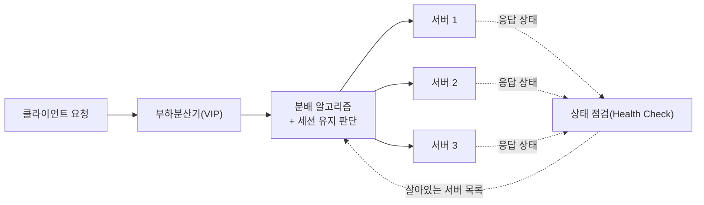
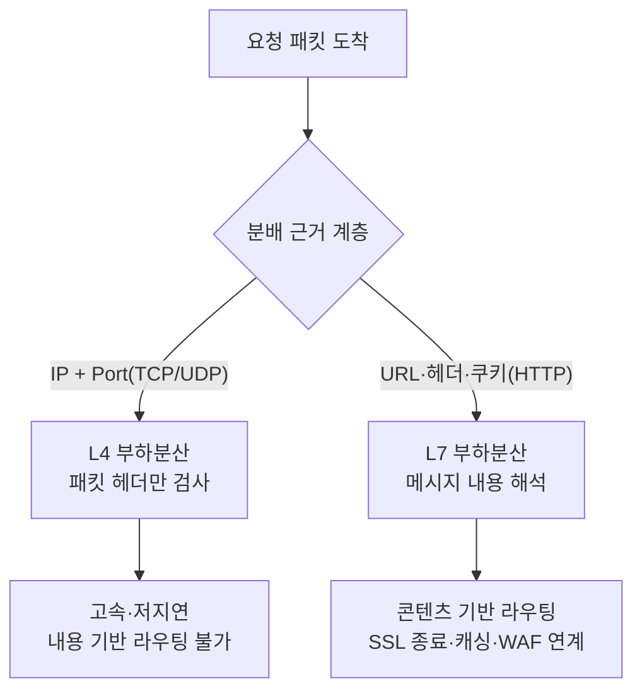

# 부하분산(Load Balancing)과 L4/L7 트래픽 분배

## 1. 개요

> **부하분산(Load Balancing)**이란 다수의 클라이언트 요청을 여러 대의 서버(또는 처리 자원)에 규칙적으로 배분하여, 특정 자원에 부하가 집중되는 것을 방지하고 가용성·확장성·응답성능을 확보하는 기술이자 아키텍처 원칙이다.

단일 서버로 모든 요청을 처리하던 구조는 세 가지 한계에 부딪힌다. 첫째, 처리 용량의 상한이 명확하여 트래픽이 증가하면 응답 지연과 타임아웃이 발생한다. 둘째, 그 서버가 장애를 일으키면 서비스 전체가 중단되는 단일 장애점(SPOF, Single Point of Failure)이 된다. 셋째, 무중단 배포·패치가 어려워 유지보수 시 서비스를 멈춰야 한다. 부하분산은 동일한 역할을 하는 서버들을 하나의 논리적 서비스로 묶고, 그 앞단에 트래픽을 나누는 계층을 두어 이 세 문제를 동시에 완화한다.

부하분산이 필요해진 배경은 트래픽 패턴의 변화에 있다. 전자상거래의 할인 이벤트, 공공 예약 시스템의 접수 개시 시각, 스트리밍 서비스의 신규 콘텐츠 공개처럼 순간적으로 요청이 수십 배 폭증(Spike)하는 상황이 일상화되었다. 예를 들어 국내 대형 예매 사이트는 티켓 오픈 직후 수 분간 평상시의 30~50배 트래픽을 받는데, 단일 서버로는 물리적으로 감당할 수 없다. 또한 클라우드와 오토스케일링이 보편화되면서 서버 대수가 실시간으로 변하는 환경에서 "지금 살아 있는 서버에만" 트래픽을 보내는 지능형 분배가 필수 요소가 되었다.

부하분산은 단순히 "요청을 골고루 나누는 것"이 아니다. 살아 있는 서버를 식별하는 상태 점검(Health Check), 같은 사용자의 요청을 같은 서버로 보내는 세션 유지(Session Persistence), 트래픽 특성에 맞는 분배 알고리즘 선택, 그리고 지리적으로 분산된 데이터센터 간 분배(GSLB)까지 포함하는 종합적인 트래픽 관리 체계로 이해해야 한다.

### 가. 부하분산이 제공하는 핵심 가치

부하분산의 효용은 세 가지 품질 특성으로 요약된다. 첫째는 **가용성(Availability)**이다. 여러 서버가 동일 서비스를 제공하므로 일부가 죽어도 나머지가 트래픽을 흡수하며, 상태 점검이 장애 서버를 자동으로 격리한다. 이로써 단일 장애점이 제거되고, 무중단 배포·롤링 업데이트가 가능해진다.

둘째는 **확장성(Scalability)**이다. 요청이 늘면 서버를 수평 확장(scale-out)하여 풀에 추가하기만 하면 되고, 부하분산기가 새 서버로 트래픽을 흘려준다. 수직 확장(더 큰 서버로 교체)과 달리 물리적 상한이 없고, 오토스케일링과 결합하면 트래픽에 비례해 자동으로 용량이 조절된다.

셋째는 **성능(Performance)**이다. 부하를 분산하면 서버당 처리량이 낮아져 응답 지연과 큐 대기가 줄고, 지역 기반 분배(GSLB)로 사용자에게 가까운 서버를 배정해 네트워크 왕복 지연까지 단축한다. 이 세 가치는 상호 보완적이어서, 부하분산은 오늘날 대규모 서비스 아키텍처의 사실상 필수 구성요소가 되었다.

## 2. 부하분산의 전체 구조와 처리 흐름

부하분산 시스템은 클라이언트, 부하분산기(Load Balancer), 서버 풀(Server Pool), 상태 점검 모듈, 그리고 세션·정책 저장소로 구성된다. 부하분산기는 클라이언트에게는 하나의 가상 IP(VIP, Virtual IP)와 서비스 포트를 노출하고, 내부적으로는 여러 실 서버(Real Server)로 요청을 중계한다.

위 그림에서 핵심은 두 개의 제어 루프가 동시에 도는 점이다. 하나는 요청 → 알고리즘 → 서버로 이어지는 **분배 경로**이고, 다른 하나는 상태 점검이 주기적으로 각 서버의 생존 여부를 확인해 알고리즘에 반영하는 **감시 경로**다. 감시 경로가 없으면 이미 죽은 서버로도 요청이 계속 흘러가 오류가 커진다. 실무에서는 상태 점검 주기(예: 5초)와 실패 임계치(예: 연속 3회 실패 시 격리)를 조정해, 장애 서버를 빠르게 빼되 순간적 지연으로 정상 서버를 오탐(false positive)하지 않도록 균형을 맞춘다.

### 가. 상태 점검(Health Check)의 원리와 계층

상태 점검은 "이 서버에 트래픽을 보내도 되는가"를 판단하는 근거다. 가장 단순한 방식은 L3 계층의 ICMP Ping으로 서버의 네트워크 연결만 확인하는 것인데, 이는 OS는 살아 있으나 애플리케이션이 멈춘 경우(예: 웹서버 프로세스는 떠 있으나 DB 커넥션 풀 고갈)를 걸러내지 못한다.

따라서 실무에서는 계층을 올려 점검한다. L4 점검은 TCP 3-way handshake가 정상적으로 이루어지는지 확인하여 포트가 열려 있음을 검증한다. L7 점검은 실제 HTTP 요청(예: `GET /healthz`)을 보내 200 응답과 특정 본문 문자열까지 확인하므로, 애플리케이션의 논리적 정상 여부까지 판별할 수 있다. 성숙한 서비스는 `/healthz` 엔드포인트에서 DB·캐시·외부 API 연결까지 점검한 뒤 종합 결과를 반환하는 심층 점검(Deep Health Check)을 구현한다.

다만 심층 점검은 양날의 검이다. 헬스체크가 DB까지 확인하면, DB가 일시적으로 느려질 때 모든 서버가 동시에 "비정상"으로 판정되어 서버 풀 전체가 빠지는 연쇄 장애(cascading failure)가 발생할 수 있다. 이를 막기 위해 얕은 점검(프로세스 생존)과 깊은 점검(의존성 상태)을 분리하고, 의존성 장애 시에는 트래픽을 계속 받되 성능 저하 모드로 동작시키는 설계가 권장된다.

### 나. 세션 유지(Session Persistence, Sticky Session)

HTTP는 본래 무상태(stateless)지만, 로그인 상태나 장바구니처럼 서버 메모리에 사용자 상태를 보관하는 경우 같은 사용자의 후속 요청이 다른 서버로 가면 상태가 사라진다. 이를 방지하는 것이 세션 유지다.

세션 유지 방식에는 출발지 IP 기반(Source IP Hash), 쿠키 기반(부하분산기가 서버 식별 쿠키를 삽입) 등이 있다. IP 기반은 구현이 단순하나, 다수 사용자가 동일 NAT/프록시 뒤에 있으면 한 서버로 쏠리는 문제가 있다. 쿠키 기반은 사용자 단위로 정확히 고정할 수 있어 웹 서비스에서 널리 쓰인다.

그러나 기술사 관점에서 더 중요한 통찰은 "세션 유지는 확장성과 상충한다"는 점이다. 특정 서버에 사용자가 고정되면 그 서버만 과부하가 걸리고, 오토스케일로 서버를 늘려도 기존 사용자는 이전받지 못한다. 따라서 현대적 아키텍처는 세션 자체를 서버 메모리에서 분리해 Redis 같은 외부 세션 저장소나 JWT 같은 무상태 토큰으로 옮기고(외부화, Session Externalization), 부하분산기는 세션 유지 없이 순수 분배에 집중하도록 설계하는 것이 정석이다.

### 다. 부하분산 구현 형태

부하분산은 구현 방식에 따라 하드웨어형, 소프트웨어형, DNS형으로 나뉜다. 하드웨어형은 전용 어플라이언스(ASIC 기반)로 초고속 처리와 안정성을 제공하나 도입 비용이 크고 확장이 물리 장비에 묶인다. 소프트웨어형은 NGINX·HAProxy·Envoy처럼 범용 서버에서 동작하며, 유연하고 저렴하며 코드로 형상관리(IaC)가 가능해 클라우드 시대의 주류가 되었다.

DNS형은 도메인 질의에 대해 여러 IP를 번갈아 응답하는 가장 단순한 방식이다. 별도 장비 없이 광역 분산이 가능하지만, 클라이언트·리졸버의 DNS 캐시 때문에 서버 상태 변화가 즉시 반영되지 않고 세밀한 부하 인지가 어렵다. 그래서 DNS형은 GSLB의 1차 관문으로 쓰되, 실제 정교한 분배는 뒤단의 L4/L7 부하분산기가 담당하는 계층적 구성이 일반적이다.

## 3. L4 부하분산과 L7 부하분산의 비교

부하분산은 OSI 계층 중 어느 정보를 근거로 트래픽을 나누는지에 따라 크게 L4(전송 계층) 방식과 L7(응용 계층) 방식으로 구분된다. 이 구분은 시험에서 가장 자주 출제되는 핵심이다.

**L4 부하분산**은 IP 주소와 TCP/UDP 포트 번호만 보고 서버를 결정한다. 패킷의 페이로드(내용)를 해석하지 않으므로 처리 부담이 작고 지연이 낮으며, 초당 수백만 연결을 처리할 수 있다. 반면 요청 내용을 모르므로 "이미지 요청은 이미지 서버로, API 요청은 API 서버로" 같은 콘텐츠 기반 분배는 불가능하다.

**L7 부하분산**은 HTTP 메시지의 URL 경로, 호스트 헤더, 쿠키, 메서드까지 해석한다. 예컨대 `/api/*`는 백엔드 서버군으로, `/static/*`는 정적 콘텐츠 서버로 보내는 경로 기반 라우팅이 가능하고, SSL/TLS 복호화(SSL Termination), 응답 캐싱, WAF(웹 방화벽) 연계, 요청 재작성 같은 부가 기능을 제공한다. 대신 메시지를 파싱·복호화하므로 L4보다 자원 소모가 크고 지연이 다소 늘어난다.

이 차이는 마이크로서비스 환경에서 특히 도드라진다. 하나의 도메인(`shop.example.com`) 아래에서 상품 조회는 카탈로그 서비스로, 결제는 결제 서비스로, 검색은 검색 서비스로 나뉘어 있을 때, L7 부하분산기는 URL 경로만 보고 각 요청을 담당 서비스 풀로 정확히 라우팅한다. L4만으로는 이런 서비스 단위 분배가 불가능하므로, 마이크로서비스·API 게이트웨이 아키텍처에서 L7 부하분산은 사실상 필수 요소가 된다.

| 구분 | L4 부하분산 | L7 부하분산 |
|------|------------|------------|
| 분배 근거 | IP, TCP/UDP 포트 | URL, HTTP 헤더, 쿠키 |
| 처리 성능 | 매우 높음(저지연) | 상대적으로 낮음(파싱 부담) |
| 콘텐츠 기반 라우팅 | 불가 | 가능(경로·도메인별) |
| SSL 처리 | 통과(패스스루) | 종료·재암호화 가능 |
| 부가 기능 | 제한적 | 캐싱·압축·WAF·인증 연계 |
| 대표 활용 | 게임·DB·대용량 스트림 | 웹·API·마이크로서비스 |

차이가 생기는 근본 이유는 "얼마나 깊이 들여다보는가"에 있다. L4는 봉투(헤더)만 보고 배달하므로 빠르지만 내용에 따른 판단을 못 하고, L7은 봉투를 열어 편지(메시지)를 읽으므로 정교하지만 느리다. 실무적 함의는 계층을 조합하는 것이다. 대규모 서비스는 최전방에 L4로 대량 트래픽을 여러 L7 부하분산기로 흩뿌리고, L7 계층에서 세밀한 라우팅과 보안 처리를 수행하는 2단 구조를 흔히 채택한다. 쿠버네티스의 Ingress(L7) 앞에 클라우드 L4 LB를 두는 구성이 대표적 사례다.

또 하나 유의할 점은 SSL/TLS 처리 위치다. L7 부하분산기가 TLS를 종료(SSL Termination)하면 서버는 평문 HTTP만 처리하면 되어 서버의 암복호화 부담이 사라지고, 부하분산기가 인증서를 일괄 관리하므로 갱신·회전이 단순해진다. 반면 부하분산기~서버 구간이 평문이 되어 내부 도청 위험이 생기므로, 규제 산업(금융·의료)에서는 부하분산기에서 복호화 후 서버로 재암호화하는 SSL Bridging을 적용해 종단 간 기밀성을 유지한다. 계층 선택이 단순 성능 문제가 아니라 보안·규제 요건과 직결되는 사례다.

## 4. 부하분산 알고리즘

어느 서버로 보낼지 결정하는 규칙이 분배 알고리즘이며, 서버의 성능 차이와 요청 특성을 고려해 선택한다. 알고리즘은 크게 상태를 고려하지 않는 정적(static) 방식과 서버의 현재 부하·응답을 반영하는 동적(dynamic) 방식으로 나뉜다. 정적 방식은 예측 가능하고 계산 비용이 낮은 반면, 동적 방식은 실제 부하를 반영해 더 고른 분배를 이루지만 상태 수집·계산 오버헤드가 따른다.

- **라운드 로빈(Round Robin)**: 서버에 순서대로 돌아가며 배분한다. 구현이 단순하고 서버 성능이 균등할 때 효과적이나, 요청마다 처리 시간이 크게 다르면(예: 어떤 요청은 1ms, 어떤 요청은 5초) 부하가 불균형해진다.
- **가중 라운드 로빈(Weighted Round Robin)**: 서버 사양에 비례해 가중치를 주어, 성능이 2배인 서버에 2배의 요청을 보낸다. 이기종 서버 환경에서 유용하다.
- **최소 연결(Least Connection)**: 현재 활성 연결 수가 가장 적은 서버로 보낸다. 요청 처리 시간의 편차가 큰 환경(예: 파일 업로드가 섞인 웹)에서 라운드 로빈보다 실제 부하를 잘 반영한다.
- **최소 응답시간(Least Response Time)**: 활성 연결 수와 최근 응답 지연을 함께 고려해, 실제로 가장 빠르게 응답하는 서버를 선택한다.
- **IP 해시(Source IP Hash)**: 출발지 IP를 해시하여 항상 같은 서버로 매핑한다. 세션 유지 목적에 쓰이며, 서버 증감 시 매핑이 대량 재배치되는 문제는 **일관된 해싱(Consistent Hashing)**으로 완화한다.
- **가중 최소 연결(Weighted Least Connection)**: 활성 연결 수를 서버 가중치로 나눠 비교하여, 성능이 다른 서버 간에도 부하를 상대적으로 균등하게 맞춘다. 이기종 서버와 편차 큰 요청이 공존하는 실제 환경에서 널리 쓰인다.
- **무작위(Random) 및 P2C**: 무작위 선택은 대규모 분산에서 통계적으로 균등에 수렴하며, 두 서버를 무작위로 뽑아 덜 바쁜 쪽을 고르는 P2C(Power of Two Choices)는 적은 상태 정보로도 최소 연결에 가까운 효과를 내어 서비스 메시에서 선호된다.

알고리즘 선택은 트래픽 성격에 좌우된다. 처리 시간이 균일한 정적 API에는 라운드 로빈으로 충분하지만, 요청별 부하 편차가 크면 최소 연결 계열이 유리하다. 예를 들어 영상 트랜스코딩처럼 요청당 수 초가 걸리는 작업에서 라운드 로빈을 쓰면 무거운 요청이 우연히 몰린 서버가 과부하되므로, 최소 연결이나 실시간 부하 지표 기반 분배가 필요하다.

알고리즘의 실제 효과는 수치로 확인된다. 응답 시간이 100ms인 요청과 3초인 요청이 9:1 비율로 섞여 서버 4대에 유입되는 상황을 가정하면, 라운드 로빈은 3초 요청을 균등하게 배분하지 못해 특정 서버의 큐가 길어지고 p99 지연이 급증한다. 반면 최소 연결은 무거운 요청을 처리 중인 서버를 자연스럽게 회피하므로 동일 조건에서 꼬리 지연(tail latency)이 크게 완화된다. 즉 "평균"이 아니라 "최악 지연"을 관리해야 하는 서비스일수록 실시간 상태를 반영하는 알고리즘의 가치가 커진다.

한편 알고리즘과 별개로 **응답 경로를 최적화하는 기법**도 중요하다. 대표적으로 직접 서버 반환(DSR, Direct Server Return)은 요청은 부하분산기를 거치지만 응답은 서버가 클라이언트에게 직접 보내는 방식이다. 대용량 다운로드·스트리밍처럼 응답 트래픽이 요청의 수십 배인 서비스에서, 응답까지 부하분산기를 거치면 그 대역폭이 병목이 된다. DSR은 응답을 우회시켜 부하분산기의 부담을 요청 처리에만 한정하므로, 동일 장비로 훨씬 큰 트래픽을 감당할 수 있다. 다만 네트워크 구성이 복잡하고 L7 기능(내용 재작성 등)을 쓰기 어렵다는 제약이 있어, 대역폭이 관건인 L4 시나리오에 선별적으로 적용한다.

### 가. GSLB(Global Server Load Balancing)와 광역 분산

단일 데이터센터 내 분배를 넘어, 지리적으로 떨어진 여러 데이터센터·리전으로 트래픽을 나누는 것이 GSLB다. 주로 DNS 응답을 조작하거나 Anycast를 활용하여, 사용자를 가장 가깝거나 가장 여유 있는 데이터센터로 유도한다.

GSLB의 가치는 세 가지다. 첫째, 지연 최소화 — 미국 사용자는 미국 리전, 한국 사용자는 서울 리전으로 연결해 왕복 지연(RTT)을 줄인다. 둘째, 재해 복구 — 한 리전이 통째로 마비되어도 DNS 응답을 다른 리전으로 전환(failover)해 서비스를 지속한다. 셋째, 규제 준수 — 데이터 주권(Data Sovereignty) 요구에 따라 특정 국가 사용자를 해당 국가 리전으로 고정할 수 있다. 다만 DNS 기반 GSLB는 DNS 캐시의 TTL 때문에 장애 전환이 즉각적이지 않다는 한계가 있어, 짧은 TTL 설정이나 Anycast 병행으로 보완한다.

글로벌 스트리밍·SaaS 사업자가 여러 대륙에 리전을 두고 사용자를 가장 가까운 리전으로 유도하는 것이 대표적 GSLB 활용이다. 이 경우 단순 근접성뿐 아니라 리전별 실시간 부하와 상태 점검 결과를 함께 반영해, 특정 리전이 포화되면 인접 리전으로 넘기는 지능형 정책을 적용한다. GSLB는 재해복구(DR) 전략의 RPO·RTO 목표와도 직결되므로, 부하분산은 성능 기술인 동시에 사업연속성(BCP) 관점의 인프라 설계 요소로 다뤄야 한다.

## 5. 심화: 클라우드·컨테이너 환경의 부하분산 진화

전통적 부하분산은 별도의 전용 하드웨어 어플라이언스(예: F5 BIG-IP)를 네트워크 경로에 배치하는 방식이었다. 그러나 클라우드와 마이크로서비스가 확산되면서 부하분산의 형태가 크게 바뀌었다.

첫째, **소프트웨어·클라우드 관리형 부하분산**이 표준이 되었다. AWS의 ELB(ALB는 L7, NLB는 L4), GCP·Azure의 관리형 LB는 하드웨어 구매·운영 없이 API 호출만으로 확장·축소되며, 오토스케일링 그룹과 자동 연동되어 새로 뜬 서버를 즉시 풀에 편입한다. 이로써 서버 대수가 분 단위로 변하는 탄력적 환경이 자연스럽게 지원된다.

둘째, **부하분산 지점이 서비스 가까이로 이동**했다. 쿠버네티스에서는 Service(ClusterIP·kube-proxy 기반 L4 분배)와 Ingress(L7 라우팅)가 클러스터 내부 분배를 담당하고, 외부 진입점에는 클라우드 LB가 붙는다. 나아가 **서비스 메시(Service Mesh)**는 각 서비스 옆에 사이드카 프록시(예: Envoy)를 두어, 부하분산·재시도·회로차단(Circuit Breaker)을 애플리케이션 코드 밖에서 처리한다. 즉 중앙 집중식 부하분산에서 분산형·클라이언트 측 부하분산으로 무게중심이 이동하고 있다.

셋째, 부하분산기가 **보안·관측성의 관문**으로 확장되었다. L7 부하분산기는 TLS 종료 지점이므로 인증서 관리, WAF, DDoS 완화, 그리고 요청 로그·지연 지표 수집(Observability)의 자연스러운 위치가 된다. 최근에는 eBPF 기반 커널 레벨 부하분산(예: Cilium)으로 iptables 방식의 성능 한계를 넘어서는 시도도 활발하다.

넷째, 배포 전략과의 결합이 깊어졌다. 부하분산 계층이 트래픽 비율을 제어할 수 있게 되면서, 신규 버전에 트래픽의 5%만 흘려 문제를 관찰한 뒤 점진적으로 100%로 올리는 카나리 배포(Canary), 두 환경을 준비해 순간 전환하는 블루-그린 배포가 부하분산기 설정만으로 가능해졌다. 이는 배포 위험을 낮추고 문제 발생 시 즉시 롤백할 수 있게 하여, 무중단 배포와 안정적 릴리스의 핵심 수단으로 자리 잡았다. 실제로 대형 SaaS 기업들은 신규 기능을 특정 지역·사용자군에만 먼저 노출하는 방식으로 부하분산 계층을 실험 플랫폼처럼 활용한다.

## 6. 고려사항 및 시사점

**첫째(적용 전략), 계층을 조합하고 세션을 외부화하라.** 최전방 L4로 대량 트래픽을 수용하고 L7에서 콘텐츠 라우팅·보안을 처리하는 2단 구조가 확장성과 유연성을 함께 얻는 정석이다. 이때 세션 유지에 의존하지 말고 세션 저장소를 분리해, 어떤 서버로 요청이 가도 동일하게 처리되는 무상태 설계를 지향해야 오토스케일의 효과를 온전히 누린다.

**둘째(트레이드오프), 상태 점검의 민감도를 신중히 조율하라.** 점검 주기를 짧게 하면 장애 서버를 빨리 빼지만 오탐과 점검 부하가 커지고, 심층 점검은 정확하지만 의존성 장애 시 전체 서버 풀이 동시에 빠지는 연쇄 장애 위험을 낳는다. 얕은 점검과 깊은 점검을 분리하고, 의존성 저하 시 성능 저하 모드(graceful degradation)로 전환하는 설계가 필요하다.

**셋째(가용성 관점), 부하분산기 자체의 단일 장애점을 제거하라.** 부하분산기가 죽으면 서비스 전체가 멈추므로, Active-Standby 또는 Active-Active 이중화, VRRP/Floating IP를 통한 자동 절체, 그리고 광역으로는 GSLB·Anycast를 결합해 부하분산 계층 자체의 고가용성을 확보해야 한다.

**넷째(전망 및 연계기술), 부하분산은 트래픽 관리 플랫폼으로 수렴한다.** 단순 분배를 넘어 카나리·블루그린 배포의 트래픽 비율 조정, 회로차단·재시도, 관측성 수집, 보안 정책(WAF·Zero Trust) 집행이 부하분산 계층으로 통합되고 있다. 서비스 메시, API 게이트웨이, 오토스케일링, CDN과 함께 설계할 때 비로소 탄력적이고 견고한 서비스 아키텍처가 완성된다.

**다섯째(비용·운영 관점), 계층 수와 기능을 서비스 요건에 맞춰 절제하라.** L7 기능과 다단 구조는 강력하지만 파싱·복호화 비용, 관리 복잡도, 추가 지연을 수반한다. 모든 서비스에 최고 사양의 부하분산 스택을 적용하는 것이 아니라, 대역폭이 관건인 경로에는 경량 L4를, 정교한 라우팅·보안이 필요한 경로에는 L7을 선택적으로 배치해 비용 대비 효과를 최적화해야 한다. 관리형 클라우드 부하분산은 처리량·규칙 수에 따라 과금되므로, 트래픽 예측과 함께 FinOps 관점의 비용 모니터링을 병행하는 것이 바람직하다.

## 참고자료

- AWS, "Elastic Load Balancing Features" — https://aws.amazon.com/elasticloadbalancing/features/
- NGINX, "What Is Load Balancing?" — https://www.nginx.com/resources/glossary/load-balancing/
- Cloudflare, "What is load balancing?" — https://www.cloudflare.com/learning/performance/what-is-load-balancing/
- Kubernetes Documentation, "Service" — https://kubernetes.io/docs/concepts/services-networking/service/

---

> **한 줄 요약**: 부하분산은 다수 서버로 요청을 배분해 가용성·확장성·성능을 확보하는 기술로, IP/포트 기반의 고속 L4와 콘텐츠 기반의 정교한 L7을 조합하고 상태 점검·세션 외부화·GSLB·이중화를 함께 설계할 때 탄력적이고 견고한 서비스 아키텍처가 완성된다.
