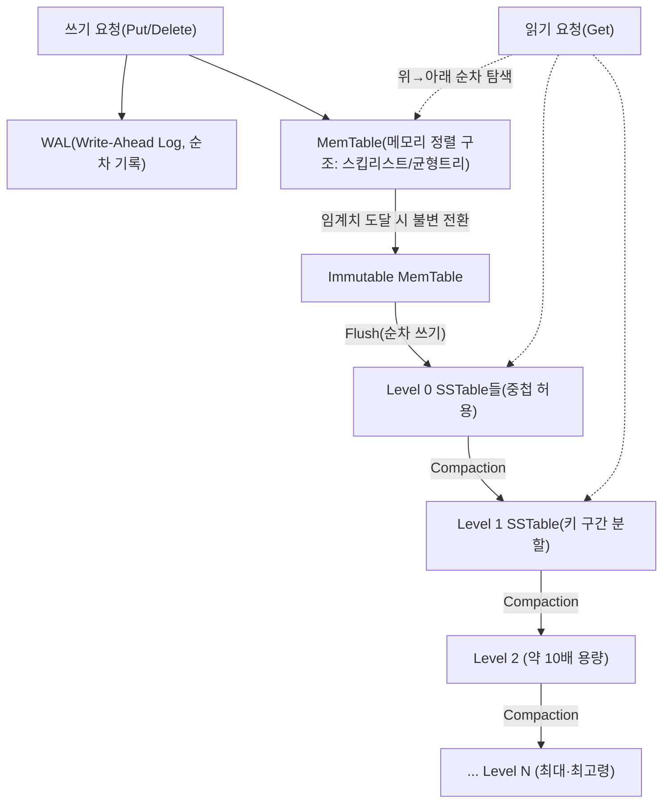
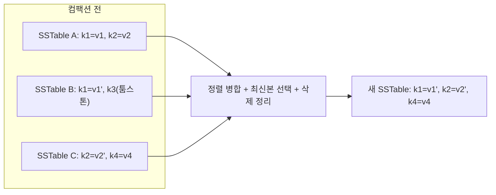

# LSM 트리(Log-Structured Merge-Tree)

## 1. 개요

> **정의**: LSM 트리(Log-Structured Merge-Tree)는 무작위 쓰기를 메모리 상의 정렬 구조에 먼저 모았다가 이를 디스크에 **순차적으로(append-only) 일괄 기록**하고, 다수의 불변(immutable) 정렬 파일을 백그라운드에서 병합·정리(Compaction)하여 읽기 효율을 회복하는 **쓰기 최적화(write-optimized) 저장 구조**이다.

전통적인 관계형 데이터베이스의 인덱스는 대부분 B-트리/B+트리를 기반으로 하며, 이는 읽기와 쓰기 모두에 대해 균형 잡힌 대수 시간 성능을 제공한다. 그러나 B+트리는 갱신이 발생할 때마다 디스크의 특정 페이지를 **제자리에서 갱신(in-place update)** 하기 때문에, 갱신 대상 페이지가 여기저기 흩어져 있으면 디스크에 무작위 쓰기(random write)가 폭증한다. HDD의 탐색 지연(seek)이나 SSD의 페이지 단위 쓰기·가비지 컬렉션을 고려하면, 무작위 쓰기는 순차 쓰기 대비 수십 배 이상 느리고 저장매체 수명도 갉아먹는다. 대량의 쓰기가 끊임없이 유입되는 로그 수집, 시계열, 메시징, 소셜 피드 같은 워크로드에서는 이 무작위 쓰기 비용이 시스템 전체의 병목이 된다.

LSM 트리는 바로 이 지점을 정면으로 겨냥해 등장했다. 발상의 핵심은 "**갱신을 제자리에서 하지 말고, 새로운 값을 계속 덧붙이자**"는 것이다. 값을 덮어쓰는 대신 새 버전을 순차적으로 추가하고, 오래된 값은 나중에 병합 과정에서 정리한다. 이렇게 하면 디스크 쓰기가 항상 순차적이 되어 처리량이 극대화되고, 저장매체 친화적인 접근이 가능해진다. 1996년 Patrick O'Neil 등이 제안한 이 구조는 이후 Google의 Bigtable과 그 오픈소스 구현인 Apache HBase, Cassandra, 그리고 LevelDB·RocksDB 같은 임베디드 키-값 엔진의 핵심 저장 엔진으로 자리 잡았다. 오늘날 대부분의 대규모 NoSQL·시계열·검색 시스템이 LSM 계열 엔진 위에서 동작한다.

실제로 LSM의 위력은 매체 특성의 비대칭에서 나온다. 대표적인 NVMe SSD에서 순차 쓰기 대역폭은 초당 수 GB에 달하지만, 4KB 무작위 쓰기는 그 수분의 일에 불과하고 내부 가비지 컬렉션으로 지연 변동(tail latency)도 커진다. B+트리가 갱신마다 흩어진 페이지를 무작위로 두드리는 동안, LSM은 같은 쓰기를 메모리에 모아 한 번의 대용량 순차 스트림으로 바꿔 흘려보낸다. 이 "무작위를 순차로 변환"하는 발상이 LSM의 모든 이득의 출발점이며, 저장매체가 HDD에서 SSD로, 다시 ZNS·오브젝트 스토리지로 진화해도 그 유효성이 유지되는 근본 이유다.

기술사 관점에서 LSM 트리가 중요한 이유는, 이것이 단순한 자료구조가 아니라 **"어떤 접근 특성을 희생하고 어떤 특성을 얻을 것인가"라는 저장 엔진 설계 철학의 전형**이기 때문이다. B+트리가 읽기·공간 효율을 위해 쓰기 증폭을 감수한다면, LSM 트리는 쓰기 처리량을 위해 읽기 증폭과 공간 증폭을 감수한다. 이 세 가지 증폭(RUM 가설: Read·Update·Memory) 사이의 트레이드오프를 이해하는 것이 LSM 학습의 본질이며, 뒤에서 이를 정량적으로 다룬다.

- **순차 쓰기 지향**: 모든 디스크 쓰기를 append-only로 전환하여 무작위 I/O를 제거한다.
- **불변 파일**: 한 번 기록된 정렬 파일(SSTable)은 수정되지 않으며, 삭제·갱신도 새 레코드 추가로 표현한다.
- **다단계 병합**: 백그라운드 컴팩션이 중복·삭제 레코드를 정리해 읽기 성능과 공간 효율을 회복한다.

## 2. 전체 구조

LSM 트리는 **메모리 계층과 디스크 계층의 이원적 구조**로 이루어진다. 최신 쓰기는 메모리 상의 정렬 구조(MemTable)에 반영되고, 이것이 일정 크기에 도달하면 통째로 디스크에 정렬 파일(SSTable)로 플러시된다. 디스크의 SSTable들은 여러 레벨(Level)로 계층화되며, 하위 레벨로 갈수록 크고 오래된 데이터를 담는다. 아래 구조도는 하나의 쓰기가 유입되어 메모리를 거쳐 디스크 계층으로 내려가는 전체 골격을 나타낸다.

이 구조에서 각 구성요소는 뚜렷한 역할을 가진다. **WAL(Write-Ahead Log)** 은 내구성(Durability)을 담당한다. MemTable은 휘발성 메모리에 있으므로 장애가 나면 사라지는데, 쓰기를 MemTable에 반영하기 직전에 동일 내용을 WAL에 순차 append함으로써 장애 후 재기동 시 WAL을 재생(replay)하여 손실 없이 복구한다. WAL 역시 순차 쓰기이므로 LSM의 쓰기 성능을 훼손하지 않는다.

**MemTable**은 최신 데이터를 키 순서로 보관하는 메모리 상의 정렬 구조로, 통상 스킵리스트(skip list)나 균형 이진트리로 구현한다. 스킵리스트가 자주 쓰이는 이유는 락 경합을 줄이면서 동시 삽입·조회를 지원하고 삽입/조회가 평균 O(log n)으로 준수하기 때문이다. MemTable이 설정된 크기(예: 64MB)에 도달하면 **불변(Immutable) MemTable**로 전환되어 더 이상 수정되지 않고, 새 쓰기는 새로운 MemTable이 받는다. 이 분리 덕분에 플러시가 진행되는 동안에도 쓰기가 멈추지 않는다.

**SSTable(Sorted String Table)** 은 디스크에 저장되는 불변 정렬 파일이다. 키-값 쌍이 키 순서로 정렬되어 저장되고, 파일 내부에는 특정 키를 빠르게 찾기 위한 희소 인덱스(sparse index)와 블록 단위 구획이 포함된다. 정렬되어 있으므로 범위 스캔에 유리하고, 불변이므로 동시 읽기에 락이 필요 없으며 캐싱·복제·백업이 단순해진다. 여러 SSTable은 레벨로 조직되는데, 뒤에서 다룰 컴팩션 전략에 따라 레벨 간 중첩 허용 여부와 병합 방식이 달라진다. SSTable 하나의 물리적 구성요소를 정리하면 다음과 같다.

- **데이터 블록(Data Block)**: 정렬된 키-값 쌍을 담는 실제 저장 단위(통상 4~64KB 단위로 압축).
- **인덱스 블록(Index Block)**: 각 데이터 블록의 첫 키와 오프셋을 담아 목표 블록을 이진 탐색으로 찾게 한다.
- **블룸 필터 블록**: 이 파일에 특정 키가 없음을 빠르게 판정해 불필요한 디스크 접근을 차단한다.
- **메타/푸터(Footer)**: 파일 버전·통계·인덱스 위치 등 파일 해석에 필요한 메타데이터.

이 파일 포맷이 불변이라는 점은 운영상 큰 이점을 준다. 이미 쓴 파일은 변하지 않으므로 페이지 캐시·블록 캐시 무효화가 필요 없고, 원격 복제·스냅샷·체크섬 검증이 파일 단위로 단순해지며, 오브젝트 스토리지(S3 등) 같은 불변 친화적 매체에 그대로 올릴 수 있어 스토리지-컴퓨트 분리 아키텍처와도 잘 맞는다.

## 3. 핵심 동작: 쓰기·읽기·삭제 경로

### 가. 쓰기 경로(Write Path)

LSM의 쓰기는 놀라울 만큼 단순하고 빠르다. 값을 덮어쓸 위치를 디스크에서 찾을 필요가 전혀 없기 때문이다. 쓰기 요청이 오면 ① WAL에 순차 append하여 내구성을 확보하고, ② MemTable에 키-값을 삽입한다. 두 연산 모두 디스크 무작위 탐색이 없으므로 쓰기 지연이 매우 짧고 처리량이 높다. 갱신(update)조차도 기존 값을 찾아 고치지 않고 **새 버전을 그냥 추가**하며, 어느 값이 최신인지는 시퀀스 번호(sequence number)나 타임스탬프로 판별한다.

MemTable이 가득 차면 불변으로 전환되고 백그라운드 스레드가 이를 **하나의 SSTable로 순차 기록**한 뒤 대응하는 WAL 구간을 폐기한다. 이 플러시는 이미 메모리에서 정렬된 데이터를 통째로 순차 기록하는 것이므로 디스크 대역폭을 최대로 활용한다. 예를 들어 초당 수십만 건의 쓰기가 유입되는 시계열 수집기에서 B+트리 인덱스는 페이지 분할과 무작위 갱신으로 급격히 느려지지만, LSM은 이를 메모리 누적 후 대용량 순차 플러시로 흡수하여 안정적인 처리량을 유지한다.

### 나. 읽기 경로(Read Path)

읽기는 쓰기의 단순함에 대한 대가를 치른다. 특정 키의 최신 값은 MemTable에 있을 수도, 여러 SSTable 어딘가에 있을 수도 있으므로, **최신 계층부터 오래된 계층 순으로 차례로 탐색**해야 한다. 즉 MemTable → Immutable MemTable → Level 0 → Level 1 → … 순으로 내려가며, 원하는 키를 처음 만나는 순간(가장 최신 버전)의 값을 반환한다. 최악의 경우 여러 파일을 열어봐야 하므로 이를 **읽기 증폭(read amplification)** 이라 부른다.

이 비용을 줄이기 위해 두 가지 보조 구조가 필수적으로 동원된다. 첫째는 **블룸 필터(Bloom Filter)** 로, 각 SSTable마다 "이 키가 여기에 있을 가능성이 있는가"를 확률적으로 판단해 없는 것이 확실한 파일은 디스크 접근 없이 건너뛴다. 통상 키당 약 10비트를 쓰면 오탐률을 1% 수준으로 낮출 수 있어, 존재하지 않는 키 조회(예: 캐시 미스 확인)에서 디스크 I/O를 극적으로 줄인다. 둘째는 각 SSTable의 **희소 인덱스와 블록 캐시**로, 필터를 통과한 파일 안에서 목표 블록을 빠르게 찾고 자주 읽는 블록을 메모리에 유지한다.

### 다. 삭제와 갱신: 툼스톤(Tombstone)

불변 파일 구조에서는 데이터를 물리적으로 즉시 지울 수 없다. 대신 삭제는 **툼스톤(tombstone)이라는 삭제 표식 레코드를 추가**하는 방식으로 이루어진다. 읽기 시 어떤 키의 최신 레코드가 툼스톤이면 그 키는 삭제된 것으로 간주되고, 실제 물리적 제거는 훗날 컴팩션이 해당 키의 모든 이전 버전과 툼스톤을 함께 폐기할 때 일어난다. 이 지연 삭제 특성 때문에, 대량 삭제 직후에는 오히려 데이터가 늘어나고, 툼스톤이 쌓이면 범위 스캔 시 삭제된 구간까지 훑어야 해 조회가 느려지는 현상이 나타난다. Cassandra 운영에서 흔히 겪는 "좀비 데이터"나 툼스톤 폭증 문제가 여기에서 비롯된다.

특히 분산 환경에서 툼스톤을 성급히 지우면 위험하다. 어떤 노드는 삭제를 이미 반영했지만 다른 노드는 장애로 삭제를 놓친 상태에서 툼스톤이 사라지면, 복제 동기화 과정에서 이미 죽은 값이 되살아나는 "데이터 부활(resurrection)"이 일어난다. Cassandra가 `gc_grace_seconds`(기본 10일)라는 유예 기간이 지나야 툼스톤을 물리 삭제하는 이유가 여기에 있다. 즉 삭제 표식은 단순한 최적화 장치가 아니라 **최종 일관성(eventual consistency)을 지키기 위한 정합성 장치**이기도 하며, 이 값을 잘못 낮추면 성능은 좋아지지만 데이터 정합성이 깨질 수 있다.

### 라. 동시성 제어와 스냅샷 읽기

LSM 구조는 동시성 제어에도 유리하다. SSTable이 불변이고 갱신이 새 버전 추가로 표현되므로, 각 레코드에 시퀀스 번호를 부여하면 특정 시점의 일관된 스냅샷을 자연스럽게 얻을 수 있다. 읽기 트랜잭션은 "자신이 시작한 시점 이하의 시퀀스 번호를 가진 최신 버전"만 보도록 하면 되고, 이는 곧 **MVCC(다중 버전 동시성 제어)** 와 궤를 같이한다. 쓰기와 읽기가 서로를 막지 않으므로(readers never block writers), 읽기 잠금 없이 높은 동시성을 달성한다. RocksDB의 스냅샷 기능이나 분산 SQL의 스냅샷 격리 수준이 이 특성 위에 구축된다. 다만 오래된 스냅샷을 오래 유지하면 해당 버전을 참조하는 SSTable을 컴팩션이 회수하지 못해 공간 증폭이 커질 수 있으므로, 장기 실행 스냅샷 관리가 운영 포인트가 된다.

## 4. 컴팩션(Compaction) 전략과 증폭의 트레이드오프

컴팩션은 LSM 트리의 심장이다. 시간이 지나면 SSTable이 누적되어 같은 키의 여러 버전과 툼스톤이 흩어지고, 읽기가 검사해야 할 파일 수가 늘며(읽기 증폭), 중복 데이터가 공간을 낭비한다(공간 증폭). 컴팩션은 여러 SSTable을 읽어 정렬 병합하면서 오래된 버전과 삭제된 키를 제거하고 새로운 SSTable을 만들어 이 문제를 회복한다. 아래 다이어그램은 컴팩션이 중복·삭제를 정리하며 데이터를 하위 레벨로 이동시키는 과정을 나타낸다.

컴팩션 방식은 크게 두 계열로 나뉘며, 이 선택이 곧 워크로드별 성능 특성을 좌우한다. 첫째, **레벨드 컴팩션(Leveled Compaction)** 은 RocksDB·LevelDB의 기본으로, 각 레벨(L1 이상) 내부에서는 SSTable들의 키 구간이 서로 겹치지 않도록 유지하고, 상위 레벨이 차면 하위 레벨의 겹치는 파일들과 병합한다. 각 레벨은 대략 이전 레벨의 10배 크기를 가진다. 이 방식은 특정 키를 담을 수 있는 파일이 레벨당 하나뿐이므로 **읽기 증폭과 공간 증폭이 작지만**, 병합이 잦아 **쓰기 증폭이 크다**. 읽기가 많고 공간이 빠듯한 워크로드에 적합하다.

둘째, **크기 계층 컴팩션(Size-Tiered Compaction)** 은 Cassandra의 기본 전략으로, 비슷한 크기의 SSTable이 일정 개수 모이면 하나의 더 큰 파일로 병합한다. 병합 빈도가 낮아 **쓰기 증폭이 작지만**, 같은 키가 여러 큰 파일에 중복 존재할 수 있어 **읽기 증폭과 공간 증폭이 크다**(병합 직전 순간 원본과 결과가 공존하므로 일시적으로 최대 2배 공간이 필요). 쓰기가 폭주하는 로그·시계열 적재에 적합하다. 이 밖에 시계열 전용의 TWCS(Time-Window Compaction)처럼 시간 창 단위로 묶어 만료 데이터를 통째로 폐기하는 특화 전략도 있다.

이 두 계열의 차이는 결국 **RUM 트레이드오프**로 요약된다. 세 가지 증폭을 동시에 최소화하는 것은 불가능하며, 무엇을 얻으려면 무엇을 내주어야 한다.

| 구분 | 읽기 증폭(RA) | 쓰기 증폭(WA) | 공간 증폭(SA) | 대표 시스템/적합 워크로드 |
|------|------------|------------|------------|----------------------|
| 레벨드 컴팩션 | 낮음 | 높음 | 낮음 | RocksDB·LevelDB / 읽기 많은 OLTP·인덱스 |
| 크기 계층 컴팩션 | 높음 | 낮음 | 높음 | Cassandra / 쓰기 폭주·로그 적재 |
| B+트리(비교군) | 낮음 | 중간(무작위) | 낮음 | RDBMS / 균형 워크로드 |

여기서 각 증폭의 실무적 함의를 짚어야 한다. 쓰기 증폭이 크다는 것은 사용자가 1을 쓰면 컴팩션이 같은 데이터를 여러 번 다시 쓴다는 뜻으로, 레벨드 방식에서 흔히 10~30배에 이른다. 이는 SSD 마모와 백그라운드 대역폭 소모로 직결되므로, NVMe SSD의 쓰기 내구성(TBW) 산정과 컴팩션 스케줄링이 운영의 관건이 된다. 반대로 크기 계층 방식의 공간 증폭은 스토리지 비용을 키우고, 컴팩션 순간의 2배 공간 여유를 항상 확보해야 하는 운영 제약을 만든다.

컴팩션이 언제 촉발되는지도 운영상 중요하다. 대표적인 트리거는 다음과 같으며, 이들을 조율하는 것이 곧 증폭 예산을 관리하는 일이다.

- **레벨 용량 초과**: 특정 레벨의 총 크기가 목표치를 넘으면 상·하위 레벨 병합을 개시한다(레벨드).
- **SSTable 개수 임계**: 비슷한 크기 파일이 지정 개수(예: 4개) 모이면 병합한다(크기 계층).
- **툼스톤/만료 비율**: 삭제 표식이나 TTL 만료 데이터가 일정 비율을 넘으면 공간 회수를 위해 강제 병합한다.
- **수동/전면 컴팩션(major compaction)**: 운영자가 모든 파일을 하나로 병합해 중복을 완전히 제거하되, 대량 I/O를 유발하므로 저부하 시간대에 수행한다.

## 5. 비교: LSM 트리 vs B+트리

LSM 트리와 B+트리는 저장 엔진 설계의 양대 축으로, 우열이 아니라 **워크로드 적합성**의 문제다. 차이가 생기는 근본 원인은 갱신 방식에 있다. B+트리는 in-place 갱신으로 데이터를 항상 한 곳에 정돈해 두므로 읽기가 예측 가능하고 빠르지만, 그 정돈을 유지하기 위해 무작위 쓰기와 페이지 분할을 감수한다. LSM은 append-only로 쓰기를 몰아주어 순차 처리량을 극대화하지만, 흩어진 데이터를 나중에 병합·조회해야 하므로 읽기와 백그라운드 비용을 감수한다.

구체적 사례로, 초당 50만 건의 IoT 센서 데이터를 적재하는 시계열 파이프라인을 보자. B+트리 기반 인덱스는 시간이 지날수록 인덱스 트리 곳곳이 갱신되어 무작위 I/O가 지배적이 되고 처리량이 급락한다. 반면 LSM 기반 엔진(예: RocksDB, Cassandra)은 이를 메모리 누적 후 순차 플러시로 흡수해 쓰기 처리량을 수 배~수십 배 높게 유지한다. 그러나 "특정 센서의 최근 값 한 건"을 무작위로 조회하는 포인트 룩업이 압도적으로 많은 워크로드라면, 블룸 필터가 잘 동작해도 다중 SSTable 탐색과 컴팩션 부담 때문에 B+트리가 더 안정적인 저지연을 줄 수 있다.

정량적으로 짚어보면 트레이드오프가 더 분명해진다. 레벨이 L개이고 각 레벨의 크기 배수가 T(예: 10)일 때, 레벨드 컴팩션의 쓰기 증폭은 대략 `T × L`에 비례해 흔히 10~30배에 이르는 반면, 읽기 시 검사할 파일 수는 레벨당 최대 1개 수준으로 억제된다. 크기 계층 방식은 반대로 쓰기 증폭이 `L` 정도로 낮지만 한 키가 여러 파일에 흩어져 읽기 시 최악 `O(파일 수)`의 탐색이 필요하다. 블룸 필터가 이 읽기 증폭을 실질적으로 낮춰 주지만, 존재하는 키를 찾는 경우(true positive)에는 필터가 걸러주지 못하므로 근본적 차이는 남는다. 이처럼 같은 데이터라도 어떤 컴팩션을 쓰느냐에 따라 SSD 마모량과 조회 지연이 몇 배씩 달라지므로, 저장 엔진 튜닝은 곧 이 계수들을 워크로드에 맞추는 작업이다.

또 다른 실무 함의는 **범위 스캔과 정렬**이다. 두 구조 모두 데이터를 정렬 보관하므로 범위 질의를 지원하지만, LSM에서는 스캔이 여러 SSTable과 MemTable을 동시에 병합 순회(merge iterator)해야 하고 툼스톤 구간까지 훑을 수 있어, 삭제가 잦은 테이블에서는 스캔 지연이 예측 불가능해진다. 이런 이유로 강한 트랜잭션 정합성과 예측 가능한 지연이 중요한 전통적 OLTP RDBMS는 여전히 B+트리를, 쓰기 처리량과 수평 확장이 최우선인 대규모 분산 저장소는 LSM을 택하는 것이 일반적 경향이다.

## 6. 심화: 최신 동향과 실무 적용

LSM 트리는 여전히 활발히 진화하는 분야다. 첫째, **쓰기 증폭 완화**를 위한 새로운 설계가 계속 제안된다. WiscKey로 대표되는 **키-값 분리(Key-Value Separation)** 기법은 큰 값(value)을 별도의 로그에 저장하고 LSM에는 키와 포인터만 두어, 컴팩션 시 큰 값을 반복해서 다시 쓰지 않도록 함으로써 쓰기 증폭을 크게 줄인다. RocksDB의 BlobDB, TerarkDB 등이 이 계열을 상용화했으며, 값이 큰 워크로드에서 효과가 크다.

둘째, **저장매체와의 공동 설계**가 핵심 화두다. 초기 LSM은 HDD의 무작위 쓰기 회피를 겨냥했지만, 오늘날은 NVMe SSD와 ZNS(Zoned Namespace) SSD, 나아가 CXL 기반 메모리 확장을 전제로 재설계된다. 특히 SSD의 내부 GC와 LSM의 컴팩션은 둘 다 "가비지 정리"를 수행하므로, 이를 중복 없이 협조시키는 ZNS 기반 LSM은 쓰기 증폭과 마모를 동시에 낮춘다. 이는 대규모 데이터센터의 TCO(총소유비용)를 좌우하는 실질적 최적화다.

구체적 산업 사례로, 대규모 소셜 서비스의 인박스·타임라인 저장소가 대표적이다. 사용자마다 초당 수만~수십만 건의 이벤트가 append되고 읽기는 대부분 최근 구간에 집중되는데, 이런 쓰기 헤비 워크로드에서 크기 계층 컴팩션을 쓰는 Cassandra가 널리 채택되었다. 반대로 Facebook은 MySQL의 InnoDB(B+트리)를 LSM 기반 MyRocks로 교체해 동일 데이터셋의 저장 공간을 약 절반 수준으로 줄이고 쓰기 부하를 크게 낮춘 사례를 공개한 바 있다. 이는 "압축률과 공간 효율"이라는 또 다른 축에서 LSM이 유리할 수 있음을 보여준다 — 불변 SSTable은 블록 단위로 강하게 압축하기 쉽고, in-place 갱신에 필요한 페이지 여유 공간(fill factor 여백)을 남길 필요가 없기 때문이다.

셋째, 실무 적용 관점에서 RocksDB는 사실상 **분산 시스템의 로컬 저장 엔진 표준**이 되었다. Kafka Streams·Flink의 상태 저장소, TiKV·CockroachDB 같은 분산 SQL의 스토리지 계층, MySQL의 MyRocks 엔진, 심지어 블록체인 노드의 상태 DB까지 RocksDB(LSM)를 채택한다. 즉 LSM은 단독 제품이라기보다 상위 시스템에 내장되는 **저장 엔진 부품(embedded engine)** 으로서 생태계 전반에 스며들어 있다. 따라서 기술사 관점에서는 특정 제품보다 "왜 이 시스템이 LSM을 골랐는가", 그리고 컴팩션 튜닝·블룸 필터 비트 수·MemTable 크기 같은 **운영 파라미터가 성능에 미치는 영향**을 설명할 수 있어야 한다.

## 7. 고려사항 및 시사점

- **워크로드 프로파일 기반 선택**: 쓰기:읽기 비율, 포인트 룩업 대 범위 스캔 비중, 삭제 빈도를 정량적으로 측정한 뒤 저장 엔진과 컴팩션 전략을 정해야 한다. "쓰기가 많으니 무조건 LSM"이 아니라, 포인트 읽기가 지배적이면 B+트리가 유리할 수 있음을 함께 검토해야 한다.
- **증폭 예산 관리(RUM)**: 읽기·쓰기·공간 증폭은 동시에 최소화할 수 없으므로, SLA(지연·처리량)와 스토리지 예산·SSD 내구성(TBW)을 정량 목표로 삼아 셋 중 무엇을 우선할지 명시적으로 결정하고, 컴팩션 전략·블룸 필터 비트·레벨 배수로 조율한다.
- **컴팩션 운영 리스크**: 컴팩션은 백그라운드 I/O·CPU를 소모해 전면 트래픽과 자원을 다투므로, 스케줄링·속도 제한(rate limiting)·유지 시간대 분리로 지연 스파이크를 통제하고, 크기 계층 방식에서는 병합 순간의 여유 공간(최대 2배)을 항상 확보해야 한다.
- **삭제·만료 데이터 전략**: 툼스톤 누적은 조회 지연과 좀비 데이터를 유발하므로, TTL·시간창 컴팩션(TWCS)·gc_grace_seconds 같은 만료 정책과 컴팩션 주기를 정합적으로 설계하고, 대량 삭제 후에는 툼스톤 정리 시점을 모니터링해야 한다.
- **연계 기술과 확장**: LSM은 분산 합의(Raft), 복제·샤딩, 캐시 계층과 결합해 대규모 스토리지를 구성하므로, 로컬 엔진의 특성이 상위 분산 시스템의 일관성·복구·핫스팟 대응 설계와 어떻게 맞물리는지 함께 고려해야 한다.
- **관측 가능성 확보**: 쓰기/읽기/공간 증폭, 컴팩션 대기열, 블룸 필터 오탐률, MemTable 플러시 지연 등 핵심 지표를 상시 계측해 튜닝 근거로 삼아야 하며, 이것이 곧 LSM 기반 시스템 운영 성숙도의 척도가 된다.

## 참고자료

- Patrick O'Neil et al., "The Log-Structured Merge-Tree (LSM-Tree)", 1996: https://www.cs.umb.edu/~poneil/lsmtree.pdf
- RocksDB Wiki, "Leveled Compaction": https://github.com/facebook/rocksdb/wiki/Leveled-Compaction
- Apache Cassandra Docs, "How is data maintained (Compaction)": https://cassandra.apache.org/doc/latest/cassandra/managing/operating/compaction/index.html
- WiscKey: Separating Keys from Values in SSD-conscious Storage (FAST '16): https://www.usenix.org/system/files/conference/fast16/fast16-papers-lu.pdf

---

> **한 줄 요약**: LSM 트리는 무작위 쓰기를 메모리 누적 후 순차 플러시와 백그라운드 컴팩션으로 전환해 쓰기 처리량을 극대화하는 저장 구조로, 읽기·쓰기·공간 증폭(RUM)의 트레이드오프를 워크로드에 맞게 조율하는 것이 설계·운영의 핵심이다.
