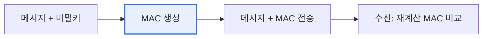

# 메시지 인증 코드(MAC, Message Authentication Code)

## 1. 개요

### 가. 정의
> **MAC(Message Authentication Code)** 은 메시지와 **비밀키를 함께 해시·암호화하여 생성하는 짧은 인증 태그**로, 메시지가 전송 중 **변조되지 않았음(무결성)** 과 **정당한 송신자가 보냈음(인증)** 을 동시에 검증한다.

MAC의 핵심 가치는 '**단순 해시로는 부족한 무결성 검증을 비밀키로 완성**'하는 데 있다. 메시지가 중간에 변조되지 않았는지 확인하려고 단순 해시값을 붙여 보내면, 공격자가 메시지를 바꾼 뒤 해시도 새로 계산해 붙이면 그만이다. 해시 함수는 누구나 계산할 수 있기 때문이다. MAC은 여기에 **송수신자만 아는 비밀키** 를 결합해 이 허점을 막는다. 비밀키 없이는 올바른 MAC을 만들 수 없으므로, 공격자가 메시지를 변조해도 유효한 MAC을 위조할 수 없다. 수신자는 받은 메시지와 자신의 비밀키로 MAC을 다시 계산해, 함께 온 MAC과 일치하면 "변조 안 됐고(무결성), 키를 아는 정당한 상대가 보냈다(인증)"고 확신한다. 즉 MAC은 무결성과 인증을 한 번에 제공한다.

### 나. 필요성
통신에서 메시지가 변조되거나 위장된 상대가 보낸 것을 막아야 한다. 대칭키 기반 MAC은 빠르고 효율적으로 무결성과 인증을 제공하는 핵심 수단이다.

## 2. 동작 원리

송신자는 메시지와 비밀키로 MAC을 생성해 메시지와 함께 보낸다. 수신자는 받은 메시지와 공유한 비밀키로 MAC을 다시 계산해, 함께 온 MAC과 비교한다. 일치하면 무결성·인증이 확인된다.

## 3. 유형

| 유형 | 내용 |
|---|---|
| **HMAC** | 해시 함수 기반(SHA-256 등)에 키 결합, 가장 널리 사용 |
| **CMAC** | 블록 암호(AES) 기반 |
| **GMAC** | GCM 모드의 인증 태그 |

## 4. 전자서명과의 비교

| 구분 | MAC | 전자서명 |
|---|---|---|
| **키** | 대칭키(비밀키 공유) | 비대칭키(개인키 서명) |
| **제공** | 무결성·인증 | 무결성·인증 + **부인방지** |
| **속도** | 빠름 | 느림 |
| **부인방지** | 불가(키 공유로) | 가능 |

MAC은 송수신자가 같은 비밀키를 공유하므로, 둘 중 누가 만들었는지 제3자에게 증명할 수 없어 **부인방지가 안 된다**. 부인방지가 필요하면 전자서명을 쓴다.

## 5. 고려사항 및 시사점

1. **부인방지가 필요하면 전자서명**을 쓴다. MAC은 무결성·인증에 효율적이지만 키를 공유하므로 부인방지가 불가능하다. 법적 증명이 필요한 경우 비대칭 전자서명이 적합하다.
2. **비밀키 관리가 보안의 핵심**이다. MAC의 안전성은 비밀키의 기밀성에 달렸으므로, 키 분배·보관·교체 등 키 관리가 철저해야 한다.
3. **암호화와 결합(AEAD)** 이 표준이다. 기밀성(암호화)과 무결성·인증(MAC)을 함께 제공하는 AES-GCM 같은 인증 암호화(AEAD)가 현대 통신 보안의 기본이 되었다.

---

> **한 줄 요약**: MAC은 *메시지와 비밀키로 인증 태그를 생성* 해 무결성과 인증을 동시에 검증하는 대칭키 기법으로, HMAC·CMAC 등이 있고 부인방지는 안 되므로(전자서명과 차이) 키 관리가 중요하며 AEAD로 암호화와 결합된다.
