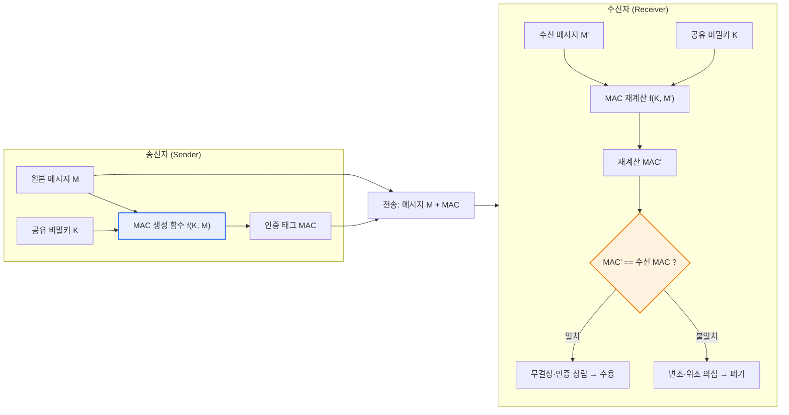
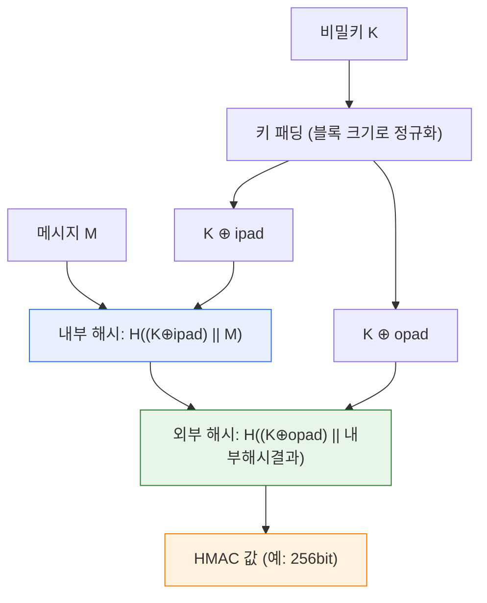

# 메시지 인증 코드(MAC, Message Authentication Code)

## 1. 개요

### 가. 정의
> **MAC(Message Authentication Code)** 은 메시지와 **송수신자만 공유하는 비밀키를 함께 입력으로 하여 생성하는 고정 길이의 인증 태그**로, 메시지가 전송 중 **변조되지 않았음(무결성, Integrity)** 과 **비밀키를 아는 정당한 송신자가 보냈음(출처 인증, Data-Origin Authentication)** 을 동시에 검증하는 대칭키 암호 기술이다.

MAC이 등장한 배경을 이해하려면 먼저 "단순 해시만으로는 왜 부족한가"라는 질문에서 출발해야 한다. 메시지의 무결성을 보장하려는 가장 소박한 방법은 메시지에 SHA-256 같은 해시값을 붙여 보내고, 수신자가 다시 해시를 계산해 비교하는 것이다. 그러나 해시 함수는 공개 알고리즘이어서 **누구나 계산할 수 있다**는 치명적 허점이 있다. 중간자(MITM) 공격자는 메시지를 자기 마음대로 위조한 뒤 그 위조 메시지의 해시를 새로 계산해 붙이기만 하면, 수신자는 변조 사실을 전혀 알아챌 수 없다. 즉 단순 해시는 **통신 오류(우발적 변경)** 는 잡아내지만 **악의적 공격(의도적 위조)** 은 막지 못한다.

MAC은 바로 이 지점을 비밀키로 봉합한다. MAC 생성 함수는 `MAC = f(K, M)` 형태로, 메시지 `M`뿐 아니라 **송수신자만 아는 비밀키 `K`** 를 함께 입력받는다. 공격자는 키 `K`를 모르므로 메시지를 변조해도 그에 맞는 올바른 MAC을 만들어낼 수 없다. 수신자는 받은 메시지와 자신이 보관한 동일한 키로 MAC을 재계산하여, 함께 도착한 MAC과 일치하는지 검사한다. 일치한다면 "① 메시지가 전송 중 바뀌지 않았고(무결성), ② 이 MAC을 만들 수 있는 것은 같은 키를 가진 정당한 상대뿐이므로 그가 보냈다(출처 인증)"는 두 가지 사실을 동시에 확신할 수 있다. 요컨대 MAC의 본질은 **'키가 있어야만 계산·검증 가능한 keyed hash(키 종속 해시)'** 이며, 이 keyed 성질이 무결성과 인증을 하나로 묶어 제공한다.

### 나. 등장 배경과 필요성
현대 통신은 인터넷·무선망 등 신뢰할 수 없는 채널을 전제로 한다. 금융 거래 메시지가 중간에 "송금액 100만 원"에서 "1,000만 원"으로 바뀌거나, 사물인터넷(IoT) 센서가 보내는 제어 명령이 위조된다면 막대한 피해가 발생한다. 이때 **기밀성(암호화)** 만으로는 부족하다. 암호문이라도 비트를 뒤집는 변조가 가능하며, 특히 스트림 암호나 CTR 모드에서는 특정 평문 비트를 예측 가능하게 조작하는 **비트 플리핑(bit-flipping) 공격** 이 가능하기 때문이다. 따라서 "내용을 감추는 것"과 별개로 "내용이 바뀌지 않았고 정당한 상대가 보냈음"을 보장하는 장치가 반드시 필요하며, 대칭키 기반으로 빠르고 효율적으로 이를 제공하는 것이 MAC이다. 실제로 TLS, IPSec, SSH, JWT(JSON Web Token), OAuth의 서명 검증 등 오늘날 거의 모든 보안 프로토콜의 밑바탕에 MAC이 깔려 있다.

## 2. 동작 원리와 전체 구조

### 가. 전체 구조도
MAC 기반 통신의 전체 흐름은 다음과 같이 "생성 측(송신)"과 "검증 측(수신)"이 동일한 비밀키를 공유한 상태에서 대칭적으로 이루어진다.

```mermaid
flowchart LR
  subgraph SND["송신자 (Sender)"]
    M1["원본 메시지 M"] --> GEN["MAC 생성 함수 f(K, M)"]
    K1["공유 비밀키 K"] --> GEN
    GEN --> T1["인증 태그 MAC"]
  end
  M1 --> CH["전송: 메시지 M + MAC"]
  T1 --> CH
  CH --> RCV
  subgraph RCV["수신자 (Receiver)"]
    M2["수신 메시지 M'"] --> GEN2["MAC 재계산 f(K, M')"]
    K2["공유 비밀키 K"] --> GEN2
    GEN2 --> T2["재계산 MAC'"]
    T2 --> CMP{"MAC' == 수신 MAC ?"}
    CMP -->|일치| OK["무결성·인증 성립 → 수용"]
    CMP -->|불일치| NG["변조·위조 의심 → 폐기"]
  end
  style GEN fill:#e8f0fe,stroke:#2f6fed,stroke-width:2px
  style CMP fill:#fff3e0,stroke:#f57c00,stroke-width:2px
```

이 구조의 핵심은 **송신자와 수신자가 완전히 같은 연산을 수행한다**는 대칭성에 있다. 비밀키 `K`는 사전에 안전한 채널(키 교환 프로토콜 또는 사전 공유)로 양측에 배포되어 있어야 하며, 이 키의 기밀성이 깨지는 순간 MAC 체계 전체가 무력화된다. 즉 MAC의 안전성은 알고리즘의 강도뿐 아니라 **키 관리 체계**에 결정적으로 의존한다.

### 나. 생성과 검증 절차의 세부
송신 측 절차는 ① 메시지 `M`과 비밀키 `K`를 MAC 함수에 입력해 태그를 계산하고, ② 메시지와 태그를 함께 전송하는 것으로 끝난다. 여기서 메시지 자체는 (기밀성이 필요 없다면) 평문으로 보내도 무방하다. MAC의 역할은 "감추기"가 아니라 "봉인(封印)"이기 때문이다.

수신 측 절차에서 가장 중요한 원리는 **재계산-비교(recompute and compare)** 다. 수신자는 도착한 메시지 `M'`로 직접 MAC을 다시 계산한다. 만약 전송 중 단 1비트라도 바뀌었다면, 해시 함수의 **쇄도 효과(avalanche effect)** 에 의해 재계산된 MAC은 원래 값과 전혀 다른 값이 되어 비교에 실패한다. 이때 반드시 지켜야 할 실무 원칙이 하나 있는데, MAC 비교는 반드시 **상수 시간 비교(constant-time comparison)** 로 해야 한다는 것이다. 바이트를 하나씩 비교하다 첫 불일치에서 즉시 반환하는 일반적 문자열 비교는, 응답 시간의 미세한 차이로부터 올바른 MAC을 한 바이트씩 알아내는 **타이밍 공격(timing attack)** 에 취약하다. 그래서 실무에서는 `hmac.compare_digest`(Python), `crypto.timingSafeEqual`(Node.js) 같은 상수 시간 함수를 쓴다.

### 다. 대표 알고리즘의 내부 구조(HMAC)
가장 널리 쓰이는 HMAC은 "해시 함수를 두 번 중첩해 키를 안전하게 결합"하는 구조로 설계되었다. 단순히 `H(K || M)`처럼 키를 앞에 붙이는 방식은 머클-담고르(Merkle-Damgård) 구조 해시의 **길이 확장 공격(length-extension attack)** 에 노출된다. HMAC은 이를 막기 위해 내부 패드(ipad)와 외부 패드(opad)를 사용한 이중 해시 구조를 취한다.

```mermaid
flowchart TB
  K["비밀키 K"] --> PAD["키 패딩 (블록 크기로 정규화)"]
  PAD --> XI["K ⊕ ipad"]
  PAD --> XO["K ⊕ opad"]
  M["메시지 M"] --> C1["내부 해시: H((K⊕ipad) || M)"]
  XI --> C1
  C1 --> C2["외부 해시: H((K⊕opad) || 내부해시결과)"]
  XO --> C2
  C2 --> OUT["HMAC 값 (예: 256bit)"]
  style C1 fill:#e8f0fe,stroke:#2f6fed
  style C2 fill:#e8f5e9,stroke:#2e7d32
  style OUT fill:#fff3e0,stroke:#f57c00
```

이 이중 구조 덕분에 HMAC은 사용하는 해시 함수(SHA-256, SHA-3 등)가 안전하다는 전제 아래 길이 확장 공격에 면역이며, 보안 증명(security proof)이 존재한다는 점에서 신뢰받는다. 실무에서는 `HMAC-SHA256`이 사실상 표준으로 자리 잡았고, JWT의 `HS256` 서명, AWS 서명 버전 4의 요청 인증, TLS의 무결성 검증 등에 광범위하게 쓰인다.

## 3. MAC의 유형

MAC은 **어떤 기반 원시함수(primitive)를 사용하는가**에 따라 크게 세 계열로 나뉜다. 각각은 성능 특성과 활용 환경이 다르므로, 무조건 하나가 우월한 것이 아니라 **환경에 맞춰 선택**한다는 관점이 중요하다.

| 유형 | 기반 | 특징과 활용 맥락 |
|---|---|---|
| **HMAC** | 해시 함수(SHA-256/512, SHA-3) | 가장 널리 사용. 소프트웨어 구현이 간단, 보안 증명 존재. JWT·TLS·API 서명에 표준적으로 사용 |
| **CMAC** | 블록 암호(AES) | 블록 암호 하드웨어 가속(AES-NI)이 있는 환경에서 유리. 별도 해시 모듈 없이 AES만으로 인증 제공 |
| **GMAC** | GCM 모드의 인증 부분 | GF(2¹²⁸) 유한체 곱셈 기반. 병렬 처리에 유리해 고속. AES-GCM(AEAD)의 인증 태그로 사용 |

**HMAC** 은 해시 함수만 있으면 구현되므로 이식성이 뛰어나고, 라이브러리 지원이 폭넓다. 반면 **CMAC** 은 블록 암호를 CBC 유사 방식으로 연쇄시켜 마지막 블록을 태그로 삼는 구조로, 이미 AES 하드웨어 가속을 쓰는 IoT·임베디드 환경에서 코드 크기를 줄일 수 있다. **GMAC** 은 GCM(Galois/Counter Mode)의 인증 성분만 떼어낸 것으로, 유한체 곱셈을 병렬화할 수 있어 10Gbps급 고속 네트워크 장비에서 선호된다. 예컨대 TLS 1.3은 `AES-128-GCM`, `ChaCha20-Poly1305` 같은 AEAD 방식만 남기고 구식 CBC+HMAC 조합을 폐기했는데, 이는 성능과 안전성을 함께 얻기 위한 선택이었다.

## 4. 전자서명·해시와의 비교 및 사례

### 가. 전자서명과의 비교 — 부인방지의 유무
MAC과 전자서명은 둘 다 "무결성 + 출처 인증"을 제공하지만, **부인방지(Non-repudiation)** 에서 결정적으로 갈린다. 이 차이가 생기는 근본 이유는 **키의 대칭/비대칭성**에 있다.

| 구분 | MAC | 전자서명(Digital Signature) |
|---|---|---|
| **키 체계** | 대칭키(하나의 비밀키를 양측이 공유) | 비대칭키(개인키로 서명, 공개키로 검증) |
| **제공 보안속성** | 무결성 + 출처 인증 | 무결성 + 출처 인증 + **부인방지** |
| **연산 속도** | 매우 빠름(대칭 연산) | 느림(공개키 연산, 수십~수백 배) |
| **부인방지** | 불가 — 키를 공유하므로 제3자 증명 불가 | 가능 — 개인키는 서명자만 보유 |
| **대표 알고리즘** | HMAC, CMAC, GMAC | RSA, ECDSA, EdDSA |

MAC으로 부인방지가 불가능한 이유는 명료하다. 송신자와 수신자가 **같은 비밀키**를 공유하므로, 어떤 MAC을 놓고 "이건 송신자가 만들었다"고 제3자(판사·중재자)에게 증명하려 해도, 수신자 역시 같은 키로 그 MAC을 만들 수 있으니 **송신자가 "나는 안 보냈다, 네가 만든 것 아니냐"고 부인**할 수 있다. 반면 전자서명은 서명자만 가진 개인키로 서명하고 누구나 공개키로 검증하므로, "이 서명을 만들 수 있는 것은 개인키 소유자뿐"이라는 논리로 부인방지가 성립한다. 따라서 **법적 증거력·계약·전자문서**처럼 부인방지가 요구되는 곳에는 전자서명을, **빠른 세션 내 무결성 검증**에는 MAC을 쓴다는 것이 실무 원칙이다.

### 나. 단순 해시와의 비교
단순 해시(SHA-256 단독)는 키가 없으므로 **우발적 오류 검출**에만 유효하다. 파일 다운로드 시 체크섬 비교가 그 예다. 그러나 앞서 설명했듯 공격자가 해시까지 다시 계산하면 무력하므로, **악의적 위조가 상정되는 통신**에는 반드시 keyed 방식인 MAC이 필요하다. "체크섬은 실수를 막고, MAC은 공격을 막는다"고 요약할 수 있다.

### 다. 구체적 적용 사례
첫째, **JWT(JSON Web Token)** 의 `HS256`은 헤더·페이로드를 `HMAC-SHA256`으로 서명한 태그를 붙여, 서버가 발급한 토큰이 클라이언트에서 위조되지 않았음을 검증한다. 다만 여기서 유명한 취약점이 있는데, 서명 알고리즘을 `none`으로 바꾸거나 HMAC의 키로 서버의 RSA 공개키를 오용하도록 유도하는 **알고리즘 혼동(algorithm confusion) 공격** 이 그것이다. 이는 MAC 자체의 결함이 아니라 검증 로직 구현의 문제로, 서버가 허용 알고리즘을 명시적으로 고정해야 함을 보여주는 대표 사례다.

둘째, **AWS Signature Version 4** 는 API 요청의 각 요소(HTTP 메서드, URI, 헤더, 타임스탬프)를 `HMAC-SHA256`으로 연쇄 서명해, 요청이 전송 중 변조되지 않았고 정당한 자격증명 소유자가 보냈음을 검증한다. 타임스탬프를 포함시켜 **재전송 공격(replay attack)** 까지 방어한다.

셋째, **금융 IC카드·EMV 결제** 에서는 CMAC 계열을 이용해 단말과 카드 간 거래 메시지의 무결성을 보장한다. 임베디드 환경 특성상 AES 하드웨어를 재활용하는 CMAC이 자원 효율적이기 때문이다.

## 5. 심화 — AEAD로의 진화와 최신 표준 동향

오늘날 MAC은 단독으로 쓰이기보다 **암호화와 결합된 인증 암호화(AEAD, Authenticated Encryption with Associated Data)** 형태로 발전했다. 과거에는 "암호화 후 MAC(Encrypt-then-MAC)", "MAC 후 암호화(MAC-then-Encrypt)" 등 조합 순서를 개발자가 직접 골라야 했고, 잘못 조합하면 **패딩 오라클 공격(Padding Oracle)**, **Lucky 13** 같은 심각한 취약점이 드러났다. 실제로 TLS의 CBC+HMAC 조합에서 이런 공격들이 연달아 보고되면서, 순서 실수의 여지를 없앤 통합 방식이 요구되었다.

그 결과가 AEAD다. **AES-GCM** 은 암호화와 GMAC 인증 태그 생성을 한 연산으로 묶어, 기밀성과 무결성·인증을 동시에 제공한다. 또한 헤더처럼 "암호화는 안 하지만 무결성은 보장해야 하는" 부가 데이터(Associated Data)까지 태그에 포함시킬 수 있다. 모바일·저전력 환경에서는 AES-NI 하드웨어 가속이 없어도 빠른 **ChaCha20-Poly1305** 가 선호되는데, 여기서 Poly1305가 MAC 역할을 한다. **TLS 1.3(RFC 8446)** 은 이러한 AEAD 방식만을 표준으로 남기고 CBC+HMAC 같은 구식 조합을 전면 폐기했다.

한편 양자 컴퓨팅 시대를 대비한 **양자내성암호(PQC)** 전환 논의에서도 MAC의 위상은 안정적이다. 쇼어 알고리즘이 위협하는 것은 RSA·ECC 같은 공개키(비대칭) 체계이며, 대칭키 기반 MAC은 그로버 알고리즘에 의해 실효 보안 강도가 절반으로 줄어드는 정도의 영향만 받는다. 즉 **키·태그 길이를 2배로 늘리면(예: HMAC-SHA512)** 양자 시대에도 충분한 안전성을 유지할 수 있어, 공개키 알고리즘처럼 근본적 대체가 필요하지 않다는 점이 MAC의 강점으로 재평가되고 있다.

## 6. 고려사항 및 시사점(기술사 관점)

1. **부인방지 요구 시 전자서명으로 전환** — MAC은 무결성·인증에 효율적이지만 키를 공유하는 대칭 구조상 부인방지가 원천적으로 불가능하다. 전자계약·감사증적·법적 증거가 필요한 영역에서는 반드시 비대칭 전자서명(ECDSA·EdDSA)을 적용하고, 성능이 중요한 세션 내부 검증에만 MAC을 쓰는 **계층적 조합 전략**이 바람직하다.

2. **키 관리(Key Management)가 보안의 급소** — MAC의 안전성은 알고리즘이 아니라 **비밀키의 기밀성**에 전적으로 달려 있다. 키 분배는 안전한 키 교환(예: ECDH)이나 KMS/HSM을 통해 이루어져야 하며, 정기적 키 교체(rotation), 용도별 키 분리, 노출 시 즉시 폐기 체계를 갖춰야 한다. 하나의 키를 장기간·다목적으로 재사용하는 것은 가장 흔하면서 치명적인 실무 실수다.

3. **구현 취약점 방어 — 상수 시간 비교와 알고리즘 고정** — MAC 알고리즘이 안전해도 검증 코드가 허술하면 무력화된다. 타이밍 공격을 막는 상수 시간 비교, JWT의 알고리즘 혼동을 막는 허용 알고리즘 명시적 고정, 재전송을 막는 타임스탬프·논스(nonce) 포함 등 **구현 수준의 방어**를 설계 단계부터 반영해야 한다.

4. **AEAD 우선 채택과 순서 실수 배제** — 기밀성이 함께 필요한 경우 개발자가 암호화·MAC 순서를 직접 조합하지 말고, 검증된 AEAD(AES-GCM, ChaCha20-Poly1305)를 표준으로 채택해야 한다. 이는 패딩 오라클·Lucky 13 같은 조합 실수 취약점을 구조적으로 제거하는 가장 안전한 선택이다.

5. **양자 시대 대비 관점의 균형** — 대칭키 MAC은 그로버 알고리즘 영향이 제한적이어서 키·태그 길이 확대(HMAC-SHA512 등)만으로 대응 가능하다. PQC 전환 로드맵을 세울 때 공개키 체계(서명·키 교환)에 자원을 집중하고, MAC은 파라미터 상향으로 대응하는 **우선순위 차등 전략**이 합리적이다.

## 참고자료
- RFC 2104, HMAC: Keyed-Hashing for Message Authentication — https://datatracker.ietf.org/doc/html/rfc2104
- RFC 8446, The Transport Layer Security (TLS) Protocol Version 1.3 — https://datatracker.ietf.org/doc/html/rfc8446
- NIST SP 800-38B, Recommendation for Block Cipher Modes: CMAC — https://csrc.nist.gov/pubs/sp/800/38/b/final
- NIST SP 800-38D, Recommendation for GCM and GMAC — https://csrc.nist.gov/pubs/sp/800/38/d/final

---

> **한 줄 요약**: MAC은 *메시지와 공유 비밀키로 keyed 인증 태그를 생성·재계산 비교* 하여 무결성과 출처 인증을 동시에 검증하는 대칭키 기법으로, HMAC·CMAC·GMAC 계열이 있고 키를 공유하는 특성상 부인방지는 전자서명에 맡기며, 오늘날에는 AES-GCM 같은 AEAD로 암호화와 통합되어 쓰이고 키 관리와 상수 시간 비교 등 구현 방어가 안전성의 관건이다.
