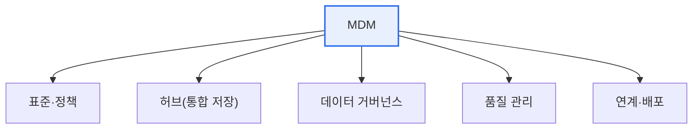

# 마스터 데이터 관리(MDM, Master Data Management)

## 1. 개요

### 가. 정의
> **마스터 데이터**는 고객·상품·조직처럼 여러 업무·시스템에서 **공통으로 참조하는 핵심 기준 데이터**이고, **MDM(Master Data Management)** 은 이 마스터 데이터를 조직 전체에서 **단일하고 일관되게 관리**하는 활동·시스템이다.

MDM이 필요한 근본 이유는 '**같은 고객·상품 정보가 시스템마다 다르게 존재하는 혼란**' 때문이다. 영업·회계·물류 시스템이 각각 고객 정보를 따로 관리하면, 한 고객의 주소가 시스템마다 다르고, 중복 등록되며, 누가 진짜인지 알 수 없게 된다. 이런 불일치는 잘못된 배송, 중복 청구, 부정확한 분석으로 이어진다. MDM은 이 문제를 '**신뢰할 수 있는 단일 진실 공급원(Single Source of Truth)**'을 만들어 해결한다. 흩어진 마스터 데이터를 하나의 기준으로 통합·정제·관리하고, 각 시스템이 이 기준 데이터를 참조하게 한다. 그러면 조직 전체가 동일한 고객·상품 정보를 공유해 데이터 정합성이 확보되고, 분석·의사결정의 신뢰성이 높아진다. 마스터 데이터는 자주 바뀌지 않지만 모든 업무의 뼈대가 되므로, 그 품질이 곧 전사 데이터 품질을 좌우한다.

### 나. 마스터 데이터의 필요성
거래 데이터(주문·매출)가 마스터 데이터(고객·상품)를 참조하므로, 마스터가 부정확하면 모든 거래·분석이 오염된다. 정확한 기준 데이터가 데이터 활용의 기반이다.

## 2. MDM 구성요소

| 구성요소 | 내용 |
|---|---|
| **표준·정책** | 마스터 데이터 정의·표준·규칙 |
| **MDM 허브** | 통합·정제된 마스터 데이터 저장소 |
| **거버넌스** | 데이터 오너·스튜어드, 책임 체계 |
| **품질 관리** | 중복 제거·정제·검증 |
| **연계·배포** | 각 시스템에 기준 데이터 제공·동기화 |

## 3. 구축 시 고려사항

MDM을 구축하는 방식은 데이터를 어떻게 통합·활용하느냐에 따라 여러 형태(레지스트리·통합·중앙집중)가 있으며, 조직 상황에 맞게 선택한다.

| 고려사항 | 내용 |
|---|---|
| **구축 방식 선택** | 레지스트리(참조)·통합·중앙집중 중 선택 |
| **데이터 통합·정제** | 중복 제거(매칭·병합), 표준화 |
| **거버넌스 확보** | 오너십·책임 체계 정립 |
| **연계 전략** | 기존 시스템과의 동기화 방식 |
| **점진적 확대** | 핵심 마스터부터 단계적 적용 |

## 4. 고려사항 및 시사점

1. **거버넌스가 성패를 좌우**한다. 기술적 통합만으로는 부족하고, 마스터 데이터를 누가 책임지고 관리할지(데이터 오너·스튜어드)를 정하는 거버넌스가 없으면 시간이 지나며 다시 불일치가 생긴다.
2. **데이터 표준화가 전제**다. 용어·코드·형식이 통일되어야 마스터 데이터를 통합할 수 있으므로, 데이터 표준화가 MDM의 기초가 된다.
3. **데이터 거버넌스·품질관리의 핵심**이다. MDM은 전사 데이터 품질의 뼈대인 마스터 데이터를 관리하므로, 데이터 거버넌스·품질관리 체계의 중심축이 되며 AI·분석의 신뢰성을 뒷받침한다.

---

> **한 줄 요약**: MDM은 *고객·상품 같은 핵심 기준(마스터) 데이터를 단일하게 통합·관리* 해 신뢰할 수 있는 단일 진실 공급원을 만드는 활동으로, 표준·허브·거버넌스·품질·연계로 구성되며 거버넌스와 표준화가 성공의 관건이다.
