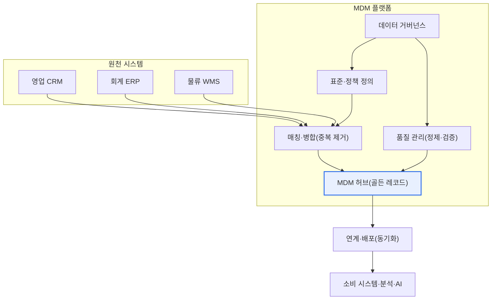
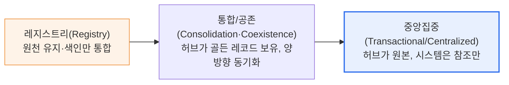

# 마스터 데이터 관리(MDM, Master Data Management)

## 1. 개요

### 가. 정의
> **마스터 데이터(Master Data)** 는 고객·상품·조직·거래처·계정처럼 여러 업무·시스템에서 **공통으로 반복 참조하는 핵심 기준 데이터**를 의미하며, **MDM(Master Data Management)** 은 이 마스터 데이터를 조직 전체에서 **단일하고 일관되게 정의·통합·정제·배포·관리**하는 활동과 이를 지원하는 시스템·거버넌스 체계를 총칭한다.

기업이 다루는 데이터는 크게 세 종류로 구분할 수 있다. 시시각각 발생하는 **거래 데이터(Transactional Data)** — 주문·매출·입출고 같은 이벤트 기록, 이 거래를 해석하는 데 필요한 **마스터 데이터** — 고객·상품·거래처 같은 기준 정보, 그리고 이들을 분석·집계한 **분석 데이터(Analytical Data)** 다. 이 중 마스터 데이터는 자주 바뀌지 않지만 거의 모든 업무 프로세스가 참조하는 **뼈대(Backbone)** 에 해당한다. 예컨대 하나의 '고객' 레코드는 영업의 계약, 회계의 청구, 물류의 배송, 마케팅의 캠페인, 데이터 분석의 세그먼트에 이르기까지 전사에 걸쳐 재사용된다. 따라서 마스터 데이터의 품질은 곧 그 데이터를 소비하는 모든 업무의 품질을 좌우한다.

MDM이 필요한 근본 이유는 '**같은 고객·상품 정보가 시스템마다 다르게 존재하는 혼란**'에 있다. 조직이 성장하면서 영업 CRM, 회계 ERP, 물류 WMS, 콜센터 시스템이 각기 다른 시점·다른 방식으로 도입되면, 동일한 고객이 시스템마다 별개로 등록된다. 어떤 시스템에는 '㈜한국전자', 다른 시스템에는 '한국전자(주)', 또 다른 곳에는 'Korea Electronics'로 기록되어 사실상 같은 실체가 세 명의 다른 고객처럼 취급된다. 이런 불일치는 곧 잘못된 배송, 중복 청구, 신용한도 오판, 부정확한 매출 집계, 신뢰할 수 없는 분석 결과로 이어진다. 실제로 한 통신사가 고객 통합 이전 여러 계열 시스템에 흩어진 고객을 정합화했을 때, 중복·오류 레코드가 전체의 20~30% 수준에 달하는 사례가 드물지 않게 보고된다.

MDM은 이 문제를 '**신뢰할 수 있는 단일 진실 공급원(Single Source of Truth, SSOT)**'을 구축하여 해결한다. 흩어진 마스터 데이터를 하나의 기준으로 수집·매칭·병합·정제하여 **골든 레코드(Golden Record)** — 여러 원천 값 중 가장 정확하고 완전한 대표 레코드 — 를 만들고, 각 업무 시스템이 이 기준 데이터를 참조하거나 동기화받게 한다. 그러면 조직 전체가 동일한 고객·상품 정보를 공유하여 데이터 정합성이 확보되고, 규제 대응(금융권 고객확인 KYC, 개인정보 정확성 원칙 등)과 분석·AI의 신뢰성이 함께 높아진다.

### 나. 마스터 데이터·MDM의 필요성
거래 데이터가 마스터 데이터를 참조하는 구조이기 때문에, 마스터가 부정확하면 그 위에 쌓인 모든 거래와 분석이 연쇄적으로 오염된다. 이를 흔히 "**Garbage In, Garbage Out**"이라 부른다. 데이터 웨어하우스·데이터 레이크·AI 학습 데이터의 신뢰성은 결국 입력되는 기준 데이터의 품질을 넘어설 수 없다. 최근 생성형 AI·머신러닝 활용이 확산되면서, 학습·추론의 기반이 되는 마스터 데이터 품질 확보 수단으로서 MDM의 전략적 중요성이 다시 부각되고 있다. 요약하면 MDM은 (1) 데이터 정합성 확보, (2) 업무 효율·비용 절감(중복 제거·재작업 감소), (3) 규제·컴플라이언스 대응, (4) 분석·AI 신뢰성 확보라는 네 가지 축에서 필요성을 갖는다.

## 2. MDM 개념 구조와 구성요소

MDM은 단일 저장소만으로 완성되지 않는다. 데이터를 정의하는 **표준·정책**, 이를 통합·저장하는 **허브**, 책임 체계를 세우는 **거버넌스**, 지속적으로 정제하는 **품질 관리**, 그리고 각 시스템으로 흘려보내는 **연계·배포**가 유기적으로 맞물려야 한다.

```mermaid
flowchart TB
  subgraph SRC["원천 시스템"]
    CRM[영업 CRM]
    ERP[회계 ERP]
    WMS[물류 WMS]
  end
  subgraph MDM["MDM 플랫폼"]
    STD[표준·정책 정의]
    MATCH["매칭·병합(중복 제거)"]
    HUB["MDM 허브(골든 레코드)"]
    QLT["품질 관리(정제·검증)"]
    GOV[데이터 거버넌스]
  end
  CRM --> MATCH
  ERP --> MATCH
  WMS --> MATCH
  STD --> MATCH
  MATCH --> HUB
  QLT --> HUB
  GOV --> STD
  GOV --> QLT
  HUB --> DIST["연계·배포(동기화)"]
  DIST --> CONS["소비 시스템·분석·AI"]
  style HUB fill:#e8f0fe,stroke:#2f6fed,stroke-width:2px
```

**표준·정책**은 MDM의 출발점이다. '고객이란 무엇인가', '상품 코드는 어떤 체계를 따르는가', '주소는 어떤 형식으로 표기하는가' 같은 마스터 데이터의 정의·표준·업무 규칙을 확정하는 단계다. 이 표준이 흔들리면 이후 어떤 통합도 사상누각이 된다. 예를 들어 사업부마다 '활성 고객'의 정의(최근 6개월 거래 vs 최근 1년 거래)가 다르면, 통합 후에도 같은 지표가 부서마다 다른 숫자를 내놓는다. 그래서 표준화는 기술 과제이기 이전에 업무 합의의 과제다.

**MDM 허브**는 통합·정제된 마스터 데이터가 담기는 중앙 저장소로, 골든 레코드를 보관하고 각 원천 레코드와의 연결(Cross-reference) 정보를 유지한다. 허브는 단순 DB가 아니라, 어떤 원천의 어떤 값이 언제 골든 레코드로 채택되었는지에 대한 **데이터 계보(Lineage)** 를 함께 관리한다. 이 덕분에 "이 고객의 대표 주소는 왜 이 값인가"를 추적할 수 있어, 감사와 분쟁 대응이 가능해진다.

**거버넌스**는 MDM의 지속성을 담보하는 조직·책임 체계다. 데이터의 사업적 책임을 지는 **데이터 오너(Data Owner)**, 실무적으로 품질을 돌보는 **데이터 스튜어드(Data Steward)**, 정책을 심의하는 협의체가 정의된다. 기술적 통합은 한 번의 프로젝트로 끝나지만, 데이터는 매일 새로 들어오므로 거버넌스가 없으면 시간이 지나며 다시 불일치가 쌓인다.

**품질 관리**는 중복 제거(매칭·병합), 결측·오류 보정, 표준화, 검증 규칙 적용을 통해 데이터를 지속적으로 정제한다. 특히 매칭은 완전 일치가 아니라 이름·주소·사업자번호의 유사도를 계산하는 **확률적/퍼지 매칭(Probabilistic Matching)** 을 활용해, '㈜한국전자'와 '한국전자(주)'를 같은 실체로 판단한다.

**연계·배포**는 정제된 골든 레코드를 각 소비 시스템으로 실시간(API/이벤트) 또는 배치로 동기화하여, 전 조직이 같은 기준 데이터를 쓰게 만든다. 이 채널의 신뢰성이 낮으면 허브만 깨끗하고 현업 시스템은 여전히 낡은 값을 쓰는 괴리가 생긴다.

| 구성요소 | 핵심 역할 | 실패 시 증상 |
|---|---|---|
| **표준·정책** | 마스터 데이터 정의·표준·업무 규칙 | 부서마다 지표 정의 상이 |
| **MDM 허브** | 골든 레코드 저장·계보 관리 | 대표 값 근거 추적 불가 |
| **거버넌스** | 오너·스튜어드·책임 체계 | 시간 경과 후 재불일치 |
| **품질 관리** | 중복 제거·정제·검증 | 중복·오류 레코드 잔존 |
| **연계·배포** | 각 시스템 동기화·제공 | 허브만 깨끗, 현업은 구값 |

## 3. MDM 구현 유형(아키텍처)과 구축 절차

MDM은 데이터를 어디까지 중앙에서 소유·관리하느냐에 따라 여러 구현 유형(스타일)으로 나뉜다. 조직의 성숙도·시스템 복잡도·거버넌스 역량에 맞게 선택하며, 흔히 낮은 단계에서 시작해 점진적으로 상위 단계로 발전시킨다.

```mermaid
flowchart LR
  R["레지스트리(Registry)<br/>원천 유지·색인만 통합"] --> C["통합/공존(Consolidation·Coexistence)<br/>허브가 골든 레코드 보유, 양방향 동기화"]
  C --> T["중앙집중(Transactional/Centralized)<br/>허브가 원본, 시스템은 참조만"]
  style R fill:#fef3e8,stroke:#ed8b2f
  style T fill:#e8f0fe,stroke:#2f6fed,stroke-width:2px
```

**레지스트리(Registry) 방식**은 원천 데이터를 그대로 두고, MDM은 각 시스템 레코드를 매칭하여 어느 것이 동일 실체인지 색인(참조 링크)만 관리한다. 원천 시스템을 거의 손대지 않아 도입이 가볍고 빠르지만, 실제 데이터는 여전히 분산되어 있어 '단일 값' 확보가 제한적이다. 이미 시스템이 많고 당장 큰 변경이 어려운 대기업이 첫 단계로 자주 택한다.

**통합/공존(Consolidation·Coexistence) 방식**은 원천 데이터를 허브로 모아 골든 레코드를 생성하고, 이를 다시 원천으로 되돌려주는(양방향) 절충형이다. 허브가 실질적 기준을 갖되 현업 시스템의 입력 자율성도 어느 정도 유지하므로, 현실의 대다수 MDM 프로젝트가 이 방식에 자리 잡는다.

**중앙집중(Transactional/Centralized) 방식**은 허브가 마스터 데이터의 원본(System of Record)이 되고, 모든 시스템은 허브를 참조·요청만 한다. 정합성은 가장 강력하지만, 모든 업무 프로세스를 허브 중심으로 재설계해야 하므로 거버넌스 성숙도와 조직적 결단이 필요하다.

구축 절차는 일반적으로 (1) 대상 마스터 도메인 선정(고객·상품 등 핵심부터), (2) 표준·데이터 모델 정의, (3) 원천 프로파일링·품질 진단, (4) 매칭·병합 규칙 설계 및 골든 레코드 생성, (5) 거버넌스 체계 수립, (6) 연계·배포 및 확산의 순으로 진행한다. **핵심 원칙은 '빅뱅'이 아니라 '점진적 확대'** 다. 가장 파급이 큰 하나의 도메인(대개 고객)에서 성공 사례를 만든 뒤, 상품·거래처로 넓혀 나가는 방식이 실패 위험을 크게 낮춘다.

| 고려사항 | 내용 | 실무 함의 |
|---|---|---|
| **구현 유형 선택** | 레지스트리·통합/공존·중앙집중 | 성숙도에 맞춰 단계적 상향 |
| **데이터 통합·정제** | 매칭·병합, 표준화, 결측 보정 | 퍼지 매칭 임계값 튜닝 필요 |
| **거버넌스 확보** | 오너·스튜어드·심의체 | 조직·KPI 연계 없이는 형해화 |
| **연계 전략** | 실시간(API/이벤트)·배치 동기화 | 소비 시스템 SLA에 맞춰 설계 |
| **점진적 확대** | 핵심 도메인부터 단계 적용 | 빅뱅 지양, 성공사례 확산 |

## 4. 유사 개념 비교와 적용 사례

MDM은 데이터 관리 계열의 여러 개념과 혼동되기 쉬우므로, 차이를 분명히 이해해야 실무에서 역할을 바르게 배치할 수 있다.

| 구분 | MDM | 데이터 웨어하우스(DW) | 데이터 거버넌스 |
|---|---|---|---|
| **주 대상** | 마스터(기준) 데이터 | 분석용 통합 이력 데이터 | 데이터 전반의 정책·책임 |
| **목적** | 단일 기준 데이터 운영 | 의사결정 분석·리포팅 | 관리 원칙·통제 |
| **성격** | 운영계(현행 기준) | 분석계(이력 축적) | 상위 관리 프레임 |
| **관계** | DW에 정확한 차원 제공 | MDM 기준을 소비 | MDM을 포함·규율 |

차이가 생기는 이유는 각자가 데이터 수명주기에서 맡는 위치가 다르기 때문이다. DW는 '과거를 분석'하려고 이력을 쌓지만, MDM은 '현재의 정확한 기준'을 운영계에 공급한다. DW의 고객 차원(Dimension)이 부정확하면 분석이 왜곡되므로, 잘 구축된 MDM은 DW·BI의 차원 데이터를 신뢰할 수 있게 만드는 상류(Upstream) 역할을 한다. 데이터 거버넌스는 이보다 상위 개념으로, MDM은 거버넌스가 관장하는 여러 영역 중 '기준 데이터 관리'라는 핵심 영역을 구현한 것으로 이해할 수 있다.

적용 사례로는, **글로벌 유통사**가 수백만 개 상품(SKU)의 명칭·규격·분류·이미지를 국가·채널별로 제각각 관리하다가 상품 MDM(흔히 PIM, Product Information Management과 결합)을 도입해 온라인·오프라인·모바일에 일관된 상품 정보를 제공한 사례가 있다. **금융기관**은 고객 MDM으로 여러 계좌·상품에 흩어진 동일 고객을 통합해 총 여신·리스크를 정확히 산정하고, KYC·자금세탁방지(AML) 규제에 대응한다. **제조사**는 공급업체·부품 마스터를 통합해 중복 발주와 사양 오류를 줄여 조달 비용을 절감한다. 세 사례 모두 공통적으로, 마스터 데이터 통합 이후 중복·오류율이 유의미하게 감소하고 분석 신뢰성이 개선되는 효과가 관찰된다.

## 5. 심화: 최신 동향과 AI·클라우드 시대의 MDM

MDM의 최근 흐름은 세 방향으로 요약된다. 첫째, **클라우드·SaaS형 MDM**의 확산이다. 과거 대형 온프레미스 구축이 주류였다면, 최근에는 클라우드 기반으로 도입 기간과 초기 비용을 낮추고 확장성을 확보하는 방향으로 이동하고 있다. 둘째, **AI·머신러닝을 접목한 매칭·정제 자동화**다. 규칙 기반 매칭의 한계를 보완하기 위해 유사도 학습·개체 해소(Entity Resolution)에 ML을 적용하여, 사람이 일일이 검토하던 병합 판단을 상당 부분 자동화·추천하는 기능이 확대되고 있다.

셋째이자 가장 중요한 흐름은 **생성형 AI·데이터 중심 조직에서의 재조명**이다. RAG(검색증강생성)·LLM 활용이 늘면서, 모델이 참조하는 기준 데이터의 정확성이 곧 답변 품질을 좌우한다는 인식이 확산되었다. 오염된 마스터 데이터 위에서 학습·추론하는 AI는 그럴듯하지만 틀린 답을 확신에 차 내놓는다. 이 때문에 MDM은 'AI 준비도(AI Readiness)'의 필수 기반으로 다시 평가받고 있으며, **데이터 패브릭(Data Fabric)·데이터 메시(Data Mesh)** 같은 현대 데이터 아키텍처 논의에서도 마스터 데이터의 신뢰 기준을 어디에 둘 것인가가 핵심 쟁점으로 다뤄진다. 다만 이러한 기술·제품 동향은 빠르게 변하므로, 특정 제품·버전을 단정하기보다 아키텍처 원칙 관점에서 이해하는 편이 안전하다.

## 6. 고려사항 및 시사점 (기술사 관점)

1. **거버넌스가 기술보다 성패를 좌우한다.** MDM은 도구 도입이 아니라 데이터에 대한 '주인'을 세우는 조직 변화 과제다. 데이터 오너·스튜어드의 역할과 책임(R&R)을 명확히 하고, 품질 지표를 KPI·성과평가와 연계해야 시간이 지나도 정합성이 유지된다. 거버넌스 없는 MDM은 프로젝트 종료와 함께 품질이 다시 저하된다.

2. **데이터 표준화가 선행 전제다.** 용어·코드·형식이 통일되지 않으면 통합 자체가 불가능하다. 전사 데이터 표준화·메타데이터 관리와 MDM은 병행 추진해야 하며, 표준화 없이 통합만 시도하면 '깨끗해 보이지만 기준이 뒤섞인' 데이터가 만들어진다.

3. **점진적·단계적 접근으로 위험을 관리한다.** 모든 마스터 도메인을 한 번에 통합하는 빅뱅은 실패 위험이 크다. 파급효과가 크고 성과가 가시적인 도메인(고객·상품)에서 성공 사례를 만들어 조직의 신뢰와 예산을 확보한 뒤 확산하는 전략이 현실적이다. 구현 유형도 레지스트리→통합→중앙집중으로 성숙도에 맞춰 올린다.

4. **AI·분석 신뢰성의 기반으로 전략적 가치를 재평가해야 한다.** MDM은 비용 부서의 정리 활동이 아니라, 데이터·AI 활용의 신뢰를 떠받치는 전사 인프라다. 데이터 품질관리·데이터 카탈로그·데이터 계보 관리와 연계하여 '신뢰할 수 있는 데이터 생태계'의 중심축으로 자리매김시켜야 한다.

5. **연계·배포의 무결성과 성능을 함께 설계한다.** 허브만 정제되고 소비 시스템에 제때 전파되지 않으면 현업의 괴리가 지속된다. 실시간(이벤트/API)·배치를 소비 시스템의 요구 수준(SLA)에 맞춰 혼합하고, 동기화 실패·지연에 대한 모니터링과 재처리 체계를 반드시 갖춰야 한다.

## 참고자료
- Gartner, "Master Data Management (MDM)" Glossary — https://www.gartner.com/en/information-technology/glossary/master-data-management-mdm
- DAMA International, DMBOK2 — Reference & Master Data Management (Chapter 10) — https://www.dama.org/cpages/body-of-knowledge
- IBM, "What is master data management (MDM)?" — https://www.ibm.com/topics/master-data-management

---

> **한 줄 요약**: MDM은 *고객·상품 같은 핵심 기준(마스터) 데이터를 매칭·병합·정제하여 단일 진실 공급원(골든 레코드)으로 통합·배포하는 활동*으로, 표준·허브·거버넌스·품질·연계로 구성되고 레지스트리→통합→중앙집중으로 성숙하며, 거버넌스와 표준화가 성패를 가르고 AI·분석 신뢰성의 필수 기반으로 재평가되고 있다.
