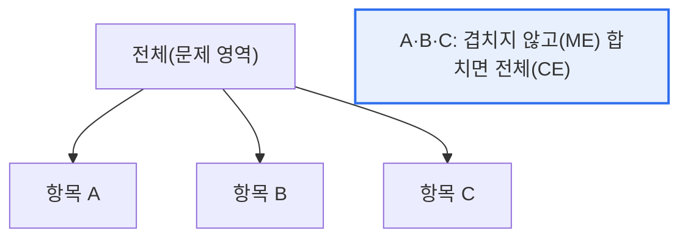

# MECE(Mutually Exclusive, Collectively Exhaustive)

## 1. 개요

### 가. 정의
> **MECE**는 어떤 대상을 분류·분석할 때 항목들이 **서로 중복되지 않고(상호 배타, Mutually Exclusive)**, **전체적으로 빠짐없이 완전한(전체 포괄, Collectively Exhaustive)** 상태를 뜻하는 논리적 분류 원칙이다.

MECE가 문제 해결·분석의 기본기로 꼽히는 이유는 '**중복과 누락을 없애야 정확하고 신뢰할 수 있는 분석이 된다**'는 데 있다. 어떤 문제를 나눠 분석할 때, 항목이 서로 겹치면(중복) 같은 것을 두 번 세거나 책임이 모호해지고, 빠진 부분이 있으면(누락) 중요한 요소를 놓쳐 결론이 틀린다. MECE는 이 두 가지 오류를 동시에 막는다. 상호 배타는 "겹치지 마라"(중복 제거), 전체 포괄은 "빠뜨리지 마라"(누락 방지)를 요구한다. 예를 들어 고객을 '신규/기존'으로 나누면 겹치지도 빠지지도 않아 MECE지만, '20대/직장인'으로 나누면 20대 직장인이 겹치고(중복) 다른 연령·비직장인이 빠져(누락) MECE가 아니다. 컨설팅에서 문제를 논리적으로 구조화(로직 트리)하거나 시장을 세분화할 때, MECE는 분석의 정확성과 설득력을 담보하는 출발점이 된다. 즉 MECE는 '잘 나누는 것'이 곧 '잘 분석하는 것'임을 보여주는 원칙이다.

### 나. 두 요건
| 요건 | 의미 |
|---|---|
| **ME(상호 배타)** | 항목 간 중복 없음 |
| **CE(전체 포괄)** | 전체를 빠짐없이 포함 |

## 2. 개념 도해

MECE한 분류는 전체를 조각낸 퍼즐과 같다. 조각들이 서로 겹치지 않으면서(ME), 다 합치면 원래 전체가 완성된다(CE). 겹치면 조각이 남고, 빠지면 구멍이 생긴다.

## 3. 활용

| 활용 | 내용 |
|---|---|
| **로직 트리** | 문제를 MECE하게 하위 요소로 분해 |
| **시장 세분화** | 중복·누락 없는 고객 그룹 분류 |
| **원인 분석** | 문제 원인을 빠짐없이·겹치지 않게 도출 |
| **보고서 구조화** | 논리적·설득력 있는 목차 구성 |

실무에서 MECE는 **로직 트리**(이슈 트리)와 결합해 위력을 발휘한다. 큰 문제를 MECE한 하위 문제로 계속 쪼개 내려가면, 누락 없이 원인·해결책을 도출할 수 있다. 3C·4P·가치사슬 같은 프레임워크도 MECE한 분류를 돕는 도구다.

## 4. 고려사항 및 시사점

1. **완벽한 MECE는 어렵다.** 실제 문제는 요소가 복잡하게 얽혀 완전한 상호 배타·전체 포괄이 어려운 경우가 많으므로, 분석 목적에 맞는 '실용적 MECE'를 지향하고 과도한 완벽주의는 경계한다.
2. **적절한 분류 기준 선택**이 핵심이다. 어떤 기준으로 나누느냐(연령·지역·행동 등)에 따라 MECE 여부가 갈리므로, 분석 목적에 부합하는 기준을 신중히 선택해야 한다.
3. **논리적 사고의 기본기**다. MECE는 컨설팅뿐 아니라 기획·의사결정·커뮤니케이션 전반에서 명료하고 설득력 있는 사고를 뒷받침하는 기초 역량으로, 다양한 프레임워크의 토대가 된다. [[swot-3c-pest]]

---

> **한 줄 요약**: MECE는 *항목이 서로 중복되지 않고(ME) 전체를 빠짐없이 포괄(CE)* 하는 분류 원칙으로, 중복·누락을 없애 정확한 분석을 담보하며 로직 트리·시장 세분화 등 문제 해결의 기본기로 활용된다.
