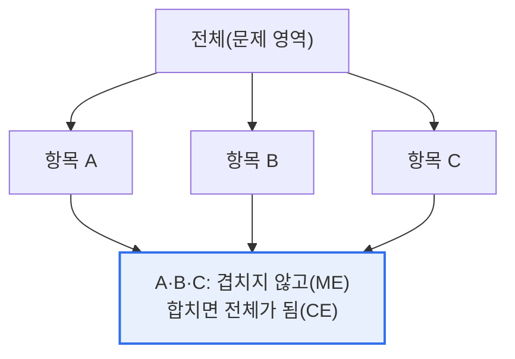
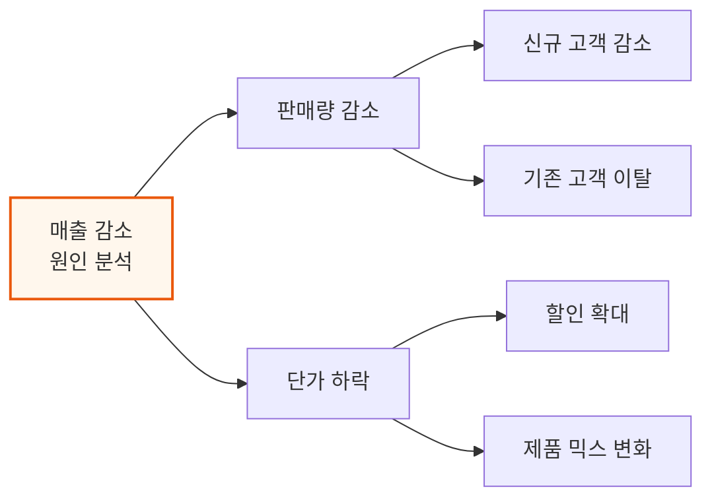

# MECE(Mutually Exclusive, Collectively Exhaustive)

## 1. 개요

### 가. 정의
> **MECE**는 어떤 대상을 분류·분석할 때 항목들이 **서로 중복되지 않고(상호 배타, Mutually Exclusive)**, **전체적으로 빠짐없이 완전한(전체 포괄, Collectively Exhaustive)** 상태를 갖추도록 하는 논리적 분류 원칙이다. 맥킨지(McKinsey)의 바바라 민토(Barbara Minto)가 정립한 사고 기법으로, 오늘날 컨설팅·전략·기획·의사결정 전반의 기본기로 자리 잡았다.

MECE가 문제 해결·분석의 출발점으로 꼽히는 이유는 '**중복과 누락을 없애야 정확하고 신뢰할 수 있는 분석이 된다**'는 데 있다. 어떤 문제를 나눠 분석할 때, 항목이 서로 겹치면(중복) 같은 것을 두 번 세거나 책임 소재가 모호해지고 자원이 낭비되며, 빠진 부분이 있으면(누락) 중요한 요소를 놓쳐 결론 자체가 틀린다. MECE는 이 두 가지 오류를 **동시에** 막는 장치다. 상호 배타는 "겹치지 마라"(중복 제거)를, 전체 포괄은 "빠뜨리지 마라"(누락 방지)를 요구한다.

예를 들어 고객을 '신규/기존'으로 나누면 겹치지도 빠지지도 않아 MECE지만, '20대/직장인'으로 나누면 20대 직장인이 양쪽에 겹치고(중복) 30대 비직장인 등은 어디에도 속하지 않아(누락) MECE가 아니다. 이 단순한 예가 보여주듯, MECE 여부는 **분류 기준의 선택**에서 결정된다. 컨설팅에서 문제를 논리적으로 구조화(로직 트리)하거나 시장을 세분화할 때, MECE는 분석의 정확성과 설득력을 담보하는 출발점이 된다. 즉 MECE는 '**잘 나누는 것**'이 곧 '**잘 분석하는 것**'임을 보여주는 원칙이며, 정보관리기술사 관점에서는 요구사항 분해·리스크 식별·대안 도출 같은 구조적 분석 활동의 품질을 좌우하는 사고 도구다.

### 나. 두 요건과 상호 관계
MECE는 두 요건이 **동시에** 충족되어야 성립한다. 하나만 만족하면 절반의 분류에 불과하다. 상호 배타만 지키고 전체 포괄을 놓치면 '깔끔하지만 불완전한' 분석이 되고, 전체 포괄만 지키고 상호 배타를 놓치면 '빠짐은 없지만 중복으로 혼란스러운' 분석이 된다.

| 요건 | 의미 | 위반 시 문제 |
|---|---|---|
| **ME(상호 배타)** | 항목 간 중복이 없음 | 이중 계산·책임 모호·자원 낭비 |
| **CE(전체 포괄)** | 전체를 빠짐없이 포함 | 핵심 요소 누락·오결론 |

### 다. 흔한 오해
MECE를 두고 흔히 하는 오해는 '항목 수가 많을수록 완전하다'는 생각이다. 그러나 항목이 아무리 많아도 서로 겹치면 ME 위반이고, 아무리 적어도 전체를 덮으면 CE는 충족된다. 핵심은 **개수가 아니라 기준의 일관성과 포괄성**이다. 또 하나의 오해는 MECE를 '완벽하게' 달성해야 한다는 강박인데, 뒤에서 보듯 실무에서는 목적에 맞는 '실용적 MECE'로 충분하다.

## 2. 개념 도해와 원리

### 가. 퍼즐 비유로 본 MECE
MECE한 분류는 전체를 조각낸 **퍼즐**과 같다. 조각들이 서로 겹치지 않으면서(ME), 다 합치면 원래 전체가 완성된다(CE). 겹치면 조각이 남아 혼란스럽고, 빠지면 그림에 구멍이 생긴다. 아래 도해는 전체(문제 영역)를 세 항목으로 나눈 MECE 분해의 기본 구조를 보여준다.

```mermaid
flowchart TB
  W["전체(문제 영역)"] --> A["항목 A"]
  W --> B["항목 B"]
  W --> C["항목 C"]
  A --> R["A·B·C: 겹치지 않고(ME)<br/>합치면 전체가 됨(CE)"]
  B --> R
  C --> R
  style R fill:#e8f0fe,stroke:#2f6fed,stroke-width:2px
```

### 나. 반복 적용과 로직 트리
이 구조가 위력을 발휘하는 지점은 **여러 단계로 반복 적용**할 때다. 큰 문제를 MECE하게 쪼갠 뒤, 각 하위 문제를 다시 MECE하게 쪼개 내려가면 '로직 트리(이슈 트리)'가 만들어진다. 각 계층에서 중복·누락이 없으므로, 트리 전체를 훑으면 원인·해결책을 빠짐없이·겹치지 않게 도출할 수 있다. 아래 도해는 '매출 감소'라는 문제를 MECE 로직 트리로 분해하는 예다.

```mermaid
flowchart LR
  S["매출 감소<br/>원인 분석"] --> P["판매량 감소"]
  S --> U["단가 하락"]
  P --> P1["신규 고객 감소"]
  P --> P2["기존 고객 이탈"]
  U --> U1["할인 확대"]
  U --> U2["제품 믹스 변화"]
  style S fill:#fff7ed,stroke:#ea580c,stroke-width:2px
```

### 다. 좋은 분해 기준의 조건
여기서 매출은 항등식 `매출 = 판매량 × 단가`로 분해되므로 두 하위 항목이 자연스럽게 MECE가 된다. 이처럼 **수식·구조에 기반한 분해**(예: 매출=수량×단가, 이익=매출−비용)는 MECE를 보장하기 쉬운 반면, 임의의 속성 나열(연령·직업·지역을 섞는 식)은 중복·누락을 부르기 쉽다. 좋은 분해 기준을 고르는 것이 MECE의 절반이라는 원리가 여기서 드러난다.

## 3. MECE를 달성하는 방법과 활용

### 가. 세 가지 분해 방법
MECE를 실무에서 달성하는 대표적 방법은 세 가지다.

**첫째, 요소 분해형(구성 요소 분해)**이다. 전체를 물리적·논리적 구성 부분으로 나눈다(예: 신체를 머리·몸통·팔·다리로, 시스템을 프론트엔드·백엔드·데이터·인프라로). 대상이 명확한 구성 요소를 가질 때 직관적이며 누락을 발견하기 쉽다. 다만 '어디까지가 한 요소인가'의 경계가 모호하면 중복이 스며들 수 있어, 경계 정의를 먼저 확정하는 것이 관건이다.

**둘째, 계산식 분해형(수식 분해)**이다. 항등식으로 나눠 수학적으로 겹침·빠짐이 없게 한다(예: 매출 = 고객수 × 구매빈도 × 객단가, 이익 = 매출 − 비용). 항등식은 정의상 좌변과 우변이 완전히 일치하므로 MECE가 구조적으로 보장된다. 계량 가능한 성과 문제(매출·비용·전환율)에 특히 강력하며, 각 인수를 다시 분해해 드라이버 트리를 구성할 수 있다.

**셋째, 검증된 프레임워크 활용형**이다. 3C(자사·경쟁사·고객)·4P(제품·가격·유통·촉진)·가치사슬·PEST 등 이미 MECE에 가깝도록 설계된 틀을 빌려 쓴다. 프레임워크는 '바퀴를 다시 발명하지 않고' 검증된 MECE 구조를 재사용하게 해주며, 이해관계자 간 공통 언어를 제공해 커뮤니케이션 비용을 낮춘다. 다만 프레임워크가 대상에 맞지 않으면 억지 분류가 되므로, 문제 성격에 맞는 틀을 고르는 판단이 필요하다.

### 나. 대표 활용 영역
실무에서 MECE는 **로직 트리**와 결합할 때 가장 큰 힘을 낸다. 큰 문제를 MECE한 하위 문제로 계속 쪼개 내려가면, 누락 없이 원인·해결책을 도출할 수 있고, 각 가지가 독립적이므로 팀이 분업해 병렬로 분석하기도 좋다. 또한 보고서·프레젠테이션의 **목차 구조화**에도 쓰여, 논리적 흐름과 설득력을 높인다. 청중은 "혹시 빠뜨린 것은 없나, 같은 얘기를 반복하는 것은 아닌가"라는 의심을 자연스럽게 거두게 된다.

정보관리기술사 실무에서는 이 원칙이 특히 유용하다. 예컨대 요구사항을 '기능 요구사항 / 비기능 요구사항'으로, 다시 비기능을 '성능·보안·가용성·유지보수성' 등 품질 속성으로 MECE하게 분해하면 요구사항 누락을 방지할 수 있다. 리스크 관리에서도 리스크 분류체계(RBS)를 MECE하게 설계해야 식별 단계에서 중요한 리스크 범주가 빠지지 않는다.

| 활용 영역 | 내용 | 실무 효과 |
|---|---|---|
| **로직 트리** | 문제를 MECE하게 하위 요소로 분해 | 원인·해결책 누락 방지, 분업 용이 |
| **시장 세분화** | 중복·누락 없는 고객 그룹 분류 | 타깃팅 정확도·자원 배분 효율 |
| **원인 분석** | 문제 원인을 빠짐없이·겹치지 않게 도출 | 근본 원인 식별, 재발 방지 |
| **보고서 구조화** | 논리적·설득력 있는 목차 구성 | 커뮤니케이션 명료성 |

## 4. 사례와 비교: MECE와 非MECE

### 가. 非MECE 사례의 교정
구체 사례로 차이를 보자. 어떤 기업이 '고객 이탈 원인'을 분석하며 후보를 '가격 불만, 품질 불만, 경쟁사 이동, 20대 고객'으로 나열했다고 하자. 이 분류는 MECE가 아니다. '경쟁사 이동'과 '가격 불만'은 겹칠 수 있고(가격 때문에 경쟁사로 이동), '20대 고객'은 원인이 아니라 속성이라 차원이 다르며(범주 혼동), 서비스 불만 등은 누락되어 있다.

이를 MECE하게 고치면 '제품 요인(가격·품질) / 서비스 요인(응대·A/S) / 관계 요인(경쟁사 유인·전환비용) / 기타'처럼 **동일 차원의 상호 배타적 범주**로 재구성해야 한다. 차이가 생기는 이유는 분류의 **기준(차원)을 하나로 통일**했는지 여부다. 실무적 함의는 명확하다 — 항목을 나열하기 전에 "지금 무슨 기준으로 나누는가"를 먼저 정의해야 한다. 기준을 먼저 정하면 자연히 상호 배타가 확보되고, 그 기준이 대상 전체를 덮는지 점검하면 전체 포괄이 확보된다.

### 나. 분해 방식의 비교와 혼합 전략
또 다른 비교로, **정성적 분해 vs. 계산식 분해**가 있다. 정성적 분해(예: 만족/불만족)는 직관적이지만 경계가 모호해 중복이 생기기 쉽고, 계산식 분해(매출=수량×단가)는 구조적으로 MECE를 보장하지만 모든 문제에 적용되지는 않는다. 따라서 계량화 가능한 문제는 계산식으로, 그렇지 않은 문제는 검증된 프레임워크나 명확한 이분(있음/없음, 내부/외부) 기준으로 나누는 것이 실무 정석이다.

컨설팅 현장에서는 3C로 '전체 그림'을 MECE하게 잡은 뒤, 각 C 내부를 다시 세부 기준으로 쪼개 내려가는 **혼합 전략**이 흔히 쓰인다. 상위 계층은 프레임워크로 큰 누락을 막고, 하위 계층은 계산식·이분 기준으로 정밀하게 나누는 방식이다. 이처럼 하나의 만능 기준을 고집하기보다 계층마다 적절한 분해 방법을 선택하는 것이 실전에서의 성숙한 MECE 활용이다.

## 5. 심화: 한계와 실무적 균형, 연계 프레임워크

MECE는 강력하지만 만능이 아니며, 그 **한계와 비용**을 이해해야 실무에서 오용하지 않는다.

### 가. 완벽한 MECE의 비현실성과 실용적 MECE
**완벽한 MECE는 비현실적**인 경우가 많다. 실제 문제는 요인이 복잡하게 얽혀 완전한 상호 배타가 어렵고, 완전한 전체 포괄을 위해 'ETC(기타)' 항목을 남발하면 분석의 초점이 흐려진다. 그래서 실무에서는 분석 목적에 부합하는 **'실용적 MECE(practically MECE)'**를 지향한다 — 중요한 축에서 중복·누락이 없으면 충분하며, 사소한 겹침에 집착해 분석을 지연시키지 않는다. 다시 말해 MECE는 '목표'가 아니라 '분석 품질을 높이기 위한 수단'이며, 수단에 매몰되어 목적(문제 해결)을 놓치는 것을 경계해야 한다.

### 나. MECE는 '나누기'일 뿐 '통찰'이 아니다
MECE하게 잘 나눴다고 해서 저절로 좋은 결론이 나오지 않는다. 나눈 뒤에는 '어느 가지가 가장 중요한가(80:20)'를 판단하는 우선순위화가 필요하다. 즉 MECE(빠짐없이 나누기)와 파레토 원칙(핵심에 집중하기)은 상호 보완적이다. MECE로 전체를 조망한 뒤, 임팩트가 큰 소수 가지에 자원을 집중하는 것이 실전 문제 해결의 형태다. MECE 분해만 잔뜩 하고 우선순위를 매기지 못하면 '분석을 위한 분석'에 그친다.

### 다. 연계 프레임워크와 기술사 적용
MECE는 로직 트리, 피라미드 구조(Minto의 Pyramid Principle), 가설 기반 사고(Hypothesis-Driven), So What?/Why So? 논리와 함께 쓰일 때 완성된다. 정보관리기술사 관점에서는 시스템 요구사항 분류(기능/비기능), 리스크 분해(WBS·리스크 분류체계), 품질 속성 분해 등 구조적 분석 산출물의 **누락·중복 검증 체크리스트**로 MECE를 활용할 수 있다. 최근에는 데이터 분석·AI 프롬프트 설계에서도 문제를 MECE하게 구조화한 뒤 각 부분을 처리하는(분할 정복) 방식이 강조되는 등, 적용 범위가 넓어지고 있다. 이는 복잡한 문제를 독립적이고 완전한 하위 문제로 쪼개면 각 부분을 병렬·개별적으로 다루기 쉬워진다는, 소프트웨어 공학의 모듈화·관심사 분리(Separation of Concerns) 원리와도 상통한다.

## 6. 고려사항 및 시사점 (기술사 관점)

1. **적절한 분류 기준(차원) 선택이 핵심이다.** MECE 여부는 무엇으로 나누느냐(연령·지역·행동·계산식 등)에서 갈리므로, 분석 목적에 부합하는 단일 차원의 기준을 신중히 선택해야 한다. 서로 다른 차원을 섞는 순간 중복·누락이 발생한다.
2. **완벽주의를 경계하고 실용적 MECE를 지향한다.** 현실 문제는 완전한 상호 배타·전체 포괄이 어렵다. 중요한 축에서 중복·누락을 없애되, 사소한 겹침 때문에 분석을 지연시키는 과도한 완벽주의는 오히려 비효율이다.
3. **MECE는 우선순위화·통찰과 결합해야 한다.** 빠짐없이 나누는 것만으로는 결론이 나오지 않으므로, 파레토 원칙으로 핵심 소수를 식별하고 So What?으로 시사점을 도출하는 후속 사고와 반드시 연계해야 한다.
4. **구조적 분석의 품질 검증 도구로 활용한다.** 요구사항 분해·리스크 식별·대안 도출 등 기술사 실무 산출물에 대해 "겹치는 항목은 없는가, 빠진 차원은 없는가"를 점검하는 검증 체크리스트로 MECE를 적용하면 분석의 신뢰성과 설득력을 높일 수 있다.
5. **논리적 사고·커뮤니케이션의 기본기다.** MECE는 컨설팅뿐 아니라 기획·의사결정·보고 전반에서 명료하고 설득력 있는 사고를 뒷받침하는 토대이며, 3C·4P·SWOT 등 다양한 프레임워크의 밑바탕이 된다. [[swot-3c-pest]]

## 참고자료
- Barbara Minto, "The Pyramid Principle: Logic in Writing and Thinking" — 피라미드 구조와 MECE 원칙의 원전
- McKinsey & Company, "The McKinsey Way"(Ethan Rasiel) — MECE·로직 트리의 실무 적용
- Wikipedia, "MECE principle" — https://en.wikipedia.org/wiki/MECE_principle
- 관련 주제: [[swot-3c-pest]] — MECE에 기반한 전략 분석 프레임워크

---

> **한 줄 요약**: MECE는 *항목이 서로 중복되지 않고(ME) 전체를 빠짐없이 포괄(CE)* 하도록 나누는 논리적 분류 원칙으로, 올바른 분류 기준 선택이 관건이며 로직 트리·시장 세분화·원인 분석의 기본기가 된다. 다만 완벽주의를 경계한 '실용적 MECE'로, 파레토·So What? 등 우선순위화·통찰 사고와 결합할 때 비로소 실전 문제 해결로 완성된다.
