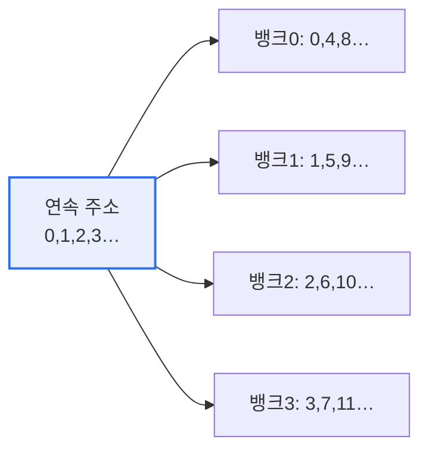

# 메모리 인터리빙(Memory Interleaving)

## 1. 개요

### 가. 정의
> **메모리 인터리빙**은 메모리를 여러 개의 **뱅크(Bank)로 나누고, 연속된 주소를 서로 다른 뱅크에 분산 배치**하여, 여러 뱅크를 동시·중첩 접근함으로써 메모리 접근 성능을 높이는 기법이다.

메모리 인터리빙의 핵심 발상은 '**하나씩 순서대로 기다리지 말고, 여러 창구에서 동시에 처리하자**'는 것이다. 메모리는 한 번 접근하면 다음 접근까지 재충전 등으로 대기 시간이 필요한데, 하나의 메모리 모듈만 쓰면 이 대기 시간 동안 CPU가 놀게 된다. 인터리빙은 메모리를 여러 뱅크로 나누고 연속 주소(0,1,2,3…)를 뱅크에 번갈아(0→뱅크0, 1→뱅크1, 2→뱅크2…) 배치한다. 그러면 연속된 데이터를 읽을 때 여러 뱅크가 겹쳐서(pipeline) 동작해, 한 뱅크가 대기하는 동안 다른 뱅크가 데이터를 내보낸다. 마치 은행 창구를 여러 개 열어 대기 줄을 분산하는 것과 같다. 이렇게 하면 실효 대역폭이 크게 향상되어, CPU가 메모리를 기다리는 병목을 완화한다.

### 나. 필요성
CPU 속도는 빠르게 발전했지만 메모리 접근 속도는 상대적으로 느려, 그 격차(메모리 벽)가 성능 병목이 되었다. 인터리빙은 메모리 대역폭을 높여 이 격차를 줄인다.

## 2. 동작 원리

연속된 주소가 여러 뱅크에 분산되므로, 순차 접근 시 뱅크들이 병렬·중첩으로 동작해 접근 지연이 숨겨진다(latency hiding).

## 3. 방식

| 방식 | 내용 |
|---|---|
| **상위 인터리빙** | 상위 주소 비트로 뱅크 선택(연속 블록이 한 뱅크) |
| **하위 인터리빙** | 하위 주소 비트로 뱅크 선택(연속 주소가 여러 뱅크에 분산) |

성능 향상에는 하위 인터리빙이 유리하다(연속 접근이 여러 뱅크로 퍼지므로). 상위 인터리빙은 오류 격리·모듈 확장에 유리하다.

## 4. 고려사항 및 시사점

1. **순차 접근에서 효과가 크다**. 연속된 주소를 읽는 패턴(배열 처리 등)에서 여러 뱅크의 병렬성이 극대화되어 대역폭이 크게 향상된다. 반대로 무작위 접근이 특정 뱅크에 몰리면 효과가 줄어든다(뱅크 충돌).
2. **현대 메모리·GPU의 기본 기술**이다. 멀티채널 메모리, DDR의 뱅크 구조, HBM의 다중 채널 등이 모두 인터리빙 원리로 대역폭을 확보한다.
3. **캐시·메모리 계층과 함께 최적화**한다. 인터리빙은 메모리 대역폭을, 캐시는 지연을 다루므로, 두 기법이 함께 작동해 메모리 병목(메모리 벽)을 완화한다.

---

> **한 줄 요약**: 메모리 인터리빙은 *메모리를 여러 뱅크로 나누고 연속 주소를 분산 배치* 해 병렬·중첩 접근으로 대역폭을 높이는 기법으로, 하위 인터리빙이 순차 접근 성능에 유리하며 현대 멀티채널 메모리·HBM의 기반이 된다.
