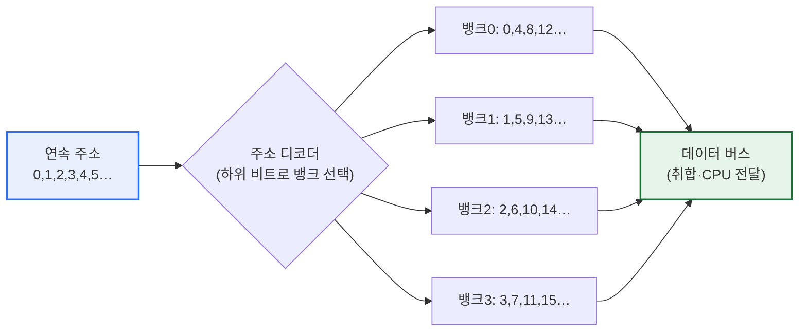
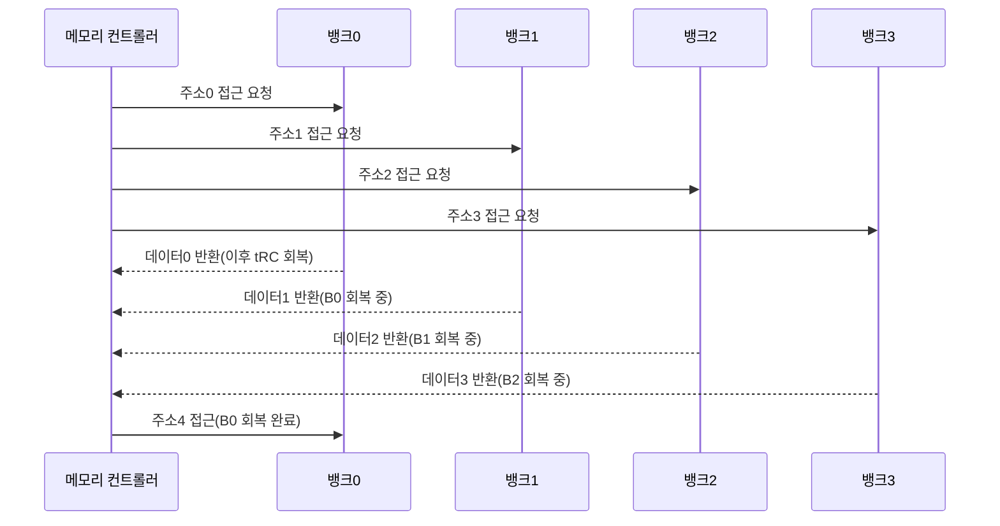

# 메모리 인터리빙(Memory Interleaving)

## 1. 개요

### 가. 정의

> **메모리 인터리빙(Memory Interleaving)** 은 물리 메모리를 여러 개의 독립적인 **뱅크(Bank)** 또는 **채널(Channel)** 로 나누고, 연속된 주소를 서로 다른 뱅크에 번갈아 분산 배치하여, 여러 뱅크를 **동시·중첩(overlap)** 으로 접근함으로써 메모리의 실효 대역폭(effective bandwidth)을 높이는 기법이다.

메모리 인터리빙의 핵심 발상은 '하나씩 순서대로 기다리지 말고, 여러 창구에서 동시에 처리하자'는 것이다. DRAM은 한 번 접근하면 다음 접근을 받기까지 셀 전하 재충전(precharge)과 행 활성화(row activation) 등에 일정 시간을 소비하며, 이 회복 시간을 흔히 **뱅크 사이클 타임(bank cycle time)** 또는 tRC라 부른다. 하나의 메모리 모듈만 사용하면 CPU는 이 회복 시간 동안 아무 데이터도 받지 못하고 대기(stall)하게 된다. 인터리빙은 메모리를 여러 뱅크로 나눈 뒤 연속 주소(0, 1, 2, 3…)를 뱅크에 번갈아(0→뱅크0, 1→뱅크1, 2→뱅크2, 3→뱅크3, 4→다시 뱅크0…) 배치한다. 그러면 연속된 데이터를 읽을 때 여러 뱅크의 동작이 시간축에서 겹쳐서(pipeline) 진행되어, 한 뱅크가 회복 대기하는 동안 다른 뱅크가 이미 다음 데이터를 내보낸다.

이 구조는 은행 창구 여러 개를 동시에 열어 대기 줄을 분산하는 것에 비유할 수 있다. 창구가 하나면 앞사람이 업무를 마칠 때까지 뒷사람은 무조건 기다려야 하지만, 창구가 네 개면 네 사람이 동시에 처리되어 전체 처리량(throughput)이 이론상 네 배까지 늘어난다. 다만 지연(latency), 즉 한 사람이 창구에 들어가 업무를 마치기까지 걸리는 절대 시간 자체가 줄지는 않는다는 점이 중요하다. 인터리빙이 개선하는 것은 개별 접근의 지연이 아니라 **단위 시간당 처리할 수 있는 접근 수(대역폭)** 이며, 이는 이후 캐시가 지연을 다루는 방식과 명확히 구분해야 한다.

### 나. 등장 배경과 필요성

CPU의 동작 속도는 무어의 법칙에 힘입어 급격히 향상되어 온 반면, DRAM의 접근 속도는 상대적으로 완만하게만 개선되어 그 격차가 매년 벌어졌다. 이 누적된 성능 격차를 **메모리 벽(Memory Wall)** 이라 부르며, 아무리 CPU가 빨라도 데이터를 제때 공급받지 못하면 연산 유닛이 놀게 되는 병목이 발생한다. 특히 배열·행렬 연산, 스트리밍 미디어 처리, 그래픽 렌더링, 딥러닝의 텐서 연산처럼 대량의 연속 데이터를 훑는 작업일수록 이 병목이 치명적이다.

메모리 인터리빙은 소자 자체를 빠르게 만드는 대신 **병렬성(parallelism)** 을 통해 대역폭을 확보하는 접근이다. 소자 속도(tRC)는 물리적 한계에 부딪히지만, 뱅크 수를 늘려 동시에 처리하는 접근의 수를 키우는 것은 상대적으로 저렴하다. 이런 이유로 인터리빙은 초기 대형 컴퓨터의 메모리 설계에서 출발해 오늘날 멀티채널 DIMM, DDR의 내부 뱅크 그룹, GPU의 HBM에 이르기까지 사실상 모든 고성능 메모리 서브시스템의 기본 원리로 자리 잡았다.

## 2. 동작 원리와 전체 구조

전체 구조는 '주소 분해 → 뱅크 선택 → 병렬 접근 → 결과 취합'의 흐름으로 이해할 수 있다. 메모리 컨트롤러는 CPU가 요청한 물리 주소를 받아, 그 주소의 특정 비트를 이용해 어느 뱅크로 보낼지 결정한다. 하위 인터리빙에서는 주소의 최하위 비트가 뱅크 번호가 되고, 나머지 상위 비트가 뱅크 내부의 오프셋이 된다.

```mermaid
flowchart LR
  A["연속 주소<br/>0,1,2,3,4,5…"] --> D{"주소 디코더<br/>(하위 비트로 뱅크 선택)"}
  D --> B0["뱅크0: 0,4,8,12…"]
  D --> B1["뱅크1: 1,5,9,13…"]
  D --> B2["뱅크2: 2,6,10,14…"]
  D --> B3["뱅크3: 3,7,11,15…"]
  B0 --> M["데이터 버스<br/>(취합·CPU 전달)"]
  B1 --> M
  B2 --> M
  B3 --> M
  style A fill:#e8f0fe,stroke:#2f6fed,stroke-width:2px
  style M fill:#e6f4ea,stroke:#137333,stroke-width:2px
```

위 그림처럼 연속된 주소가 4개 뱅크에 순환 분산되므로, 순차 접근 시 네 뱅크가 병렬·중첩으로 동작해 각 뱅크의 회복 지연이 다른 뱅크의 동작 뒤에 숨겨진다(latency hiding). 즉 뱅크 하나만으로는 tRC마다 한 번씩만 데이터를 낼 수 있지만, 4-way 인터리빙에서는 tRC의 1/4 간격마다 순차적으로 데이터가 흘러나오는 파이프라인이 형성된다.

이 파이프라인 효과는 시간축에서 보면 더욱 분명하다. 아래 시퀀스 다이어그램은 4개 뱅크가 회복 시간을 겹쳐 가며 연속 데이터를 내보내는 과정을 보여준다.

```mermaid
sequenceDiagram
  participant C as 메모리 컨트롤러
  participant B0 as 뱅크0
  participant B1 as 뱅크1
  participant B2 as 뱅크2
  participant B3 as 뱅크3
  C->>B0: 주소0 접근 요청
  C->>B1: 주소1 접근 요청
  C->>B2: 주소2 접근 요청
  C->>B3: 주소3 접근 요청
  B0-->>C: 데이터0 반환(이후 tRC 회복)
  B1-->>C: 데이터1 반환(B0 회복 중)
  B2-->>C: 데이터2 반환(B1 회복 중)
  B3-->>C: 데이터3 반환(B2 회복 중)
  C->>B0: 주소4 접근(B0 회복 완료)
```

핵심은 뱅크0이 데이터0을 내보낸 뒤 회복하는 동안 컨트롤러가 놀지 않고 뱅크1·2·3에서 순차적으로 데이터를 받아온다는 점이다. 뱅크0의 회복이 끝날 즈음이면 이미 주소4 요청을 넣을 수 있어, 이상적인 순차 접근에서는 뱅크의 회복 지연이 완전히 가려지고 버스는 거의 쉬지 않고 데이터를 전송한다.

## 3. 인터리빙 방식의 유형

인터리빙은 주소의 어느 부분을 뱅크 선택에 쓰느냐에 따라 크게 하위(low-order)와 상위(high-order)로 나뉜다. 이 둘은 단순한 구현 차이가 아니라 성능과 신뢰성 사이의 설계 철학 차이를 드러낸다.

**하위 인터리빙(Low-order Interleaving)** 은 주소의 최하위 비트를 뱅크 번호로 사용한다. 그 결과 연속된 주소가 자연스럽게 여러 뱅크로 퍼지므로, 배열을 순차적으로 훑는 것과 같은 접근 패턴에서 뱅크 병렬성이 극대화된다. 순차 접근 대역폭을 높이는 것이 목적이라면 하위 인터리빙이 정답에 가깝다. 대부분의 성능 지향 메모리 시스템이 이 방식을 기본으로 채택한다.

**상위 인터리빙(High-order Interleaving)** 은 주소의 최상위 비트를 뱅크 번호로 사용한다. 그러면 하나의 뱅크가 연속된 커다란 주소 블록을 통째로 담당하게 된다. 성능 병렬성은 떨어지지만, 특정 뱅크에 고장이 나도 그 뱅크가 담당하는 주소 영역만 영향을 받으므로 **오류 격리(fault isolation)** 와 뱅크 단위의 모듈 확장·교체에 유리하다. 예컨대 메모리 모듈을 뽑아 용량을 늘리거나, 결함 뱅크를 비활성화하고 나머지로 운용하는 시나리오에서 상위 인터리빙이 관리상 편리하다.

| 방식 | 뱅크 선택 비트 | 데이터 배치 | 강점 | 약점 |
|---|---|---|---|---|
| **하위 인터리빙** | 하위 주소 비트 | 연속 주소를 여러 뱅크에 분산 | 순차 접근 대역폭 극대화 | 뱅크 고장 시 영향 광범위 |
| **상위 인터리빙** | 상위 주소 비트 | 연속 블록이 한 뱅크에 집중 | 오류 격리·모듈 확장 용이 | 순차 접근 병렬성 낮음 |

실제 시스템은 둘을 혼합하기도 한다. 상위 몇 비트로 채널을, 하위 몇 비트로 뱅크를 고르는 다단계 매핑을 써서 성능과 관리성을 절충하는 것이 현대 메모리 컨트롤러의 일반적인 설계다.

## 4. 성능 특성과 뱅크 충돌

인터리빙의 효과는 접근 패턴에 크게 좌우된다. 가장 이상적인 경우는 앞서 본 것처럼 연속 주소를 차례로 읽는 순차 접근으로, 이때 N-way 인터리빙은 이론상 N배에 가까운 대역폭을 낸다. 예를 들어 단일 뱅크의 회복 시간이 60ns이고 4-way 인터리빙이라면, 이상적 순차 접근에서는 15ns마다 한 워드씩 흘러나오는 셈이 되어 실효 처리량이 크게 증가한다(실제로는 버스 폭·전송 오버헤드로 이상치에는 못 미친다).

문제는 무작위 접근이나 특정 주소 간격(stride)을 가진 접근이다. 만약 접근 주소들이 공교롭게 모두 같은 뱅크로 매핑되면, 여러 접근이 하나의 뱅크에서 직렬로 처리되어 병렬성이 사라진다. 이를 **뱅크 충돌(bank conflict)** 이라 한다. 대표적 사례가 2의 거듭제곱 stride 접근이다. 예컨대 4-way 인터리빙에서 stride가 4의 배수인 접근(주소 0, 4, 8, 12…)은 모두 뱅크0으로만 향해, 병렬성이 완전히 무너지고 성능이 단일 뱅크 수준으로 떨어진다. 행렬을 열 우선(column-major)으로 훑을 때 이런 병리적 패턴이 자주 발생한다.

이 문제를 완화하기 위해 실무에서는 뱅크 수를 소수(prime number)에 가깝게 잡거나, 주소 비트를 XOR·해시로 섞어 뱅크에 매핑하는 **XOR/permutation 인터리빙** 기법을 사용한다. 소프트웨어 측면에서는 배열 padding으로 stride가 뱅크 수의 배수가 되지 않도록 조정하거나, 행렬 연산을 타일링(tiling)해 접근 패턴을 국소화하는 최적화가 함께 쓰인다. 즉 인터리빙의 실효 성능은 하드웨어 매핑과 소프트웨어 접근 패턴이 함께 결정한다.

## 5. 캐시·메모리 계층과의 관계 비교

인터리빙과 자주 함께 언급되는 것이 캐시이지만, 두 기법이 다루는 문제는 근본적으로 다르다. 캐시는 자주 쓰는 데이터를 CPU 가까운 고속 저장소에 두어 **개별 접근의 지연(latency)** 을 줄인다. 반면 인터리빙은 여러 뱅크를 병렬로 굴려 **단위 시간당 대역폭(bandwidth)** 을 늘린다. 이 둘은 대체재가 아니라 상호 보완재다.

| 관점 | 캐시(Cache) | 메모리 인터리빙 |
|---|---|---|
| 다루는 병목 | 접근 지연(latency) | 접근 대역폭(bandwidth) |
| 핵심 원리 | 지역성(locality) 활용 재사용 | 뱅크 병렬성 활용 중첩 |
| 효과가 큰 상황 | 반복 재접근(temporal locality) | 대량 순차 접근(streaming) |
| 한계 | 캐시 미스 시 무력 | 뱅크 충돌 시 무력 |

실제 시스템에서 캐시가 미스를 낸 순간, 그 미스를 메모리에서 채우는 캐시 라인 충전(cache line fill)은 여러 워드를 연속으로 가져오는 전형적인 순차 접근이므로 인터리빙의 대역폭이 그대로 효과를 낸다. 즉 캐시는 언제 메모리에 가느냐를, 인터리빙은 갔을 때 얼마나 빨리 채우느냐를 담당한다. 두 기법이 협력해야 메모리 벽 완화가 완성된다.

## 6. 심화: 현대 메모리에서의 인터리빙

오늘날 인터리빙은 여러 계층에서 동시에 작동하는 다층적 병렬성으로 확장되었다. 먼저 **DDR SDRAM** 은 하나의 칩 내부에 이미 여러 뱅크(예: DDR4는 뱅크 그룹당 다수 뱅크)를 두고 뱅크 인터리빙으로 연속 접근 시 회복 지연을 숨긴다. 그 위에 메모리 컨트롤러는 여러 DIMM·채널을 묶는 **채널 인터리빙(멀티채널)** 을 적용한다. 듀얼·쿼드 채널 구성이 흔히 광고하는 대역폭 향상이 바로 채널 단위 인터리빙의 결과다. 예를 들어 듀얼 채널은 두 채널로 데이터를 분산해 이론상 단일 채널 대비 약 2배의 대역폭을 제공한다(실제 애플리케이션 이득은 접근 패턴에 따라 그보다 작다).

GPU와 AI 가속기 영역에서는 **HBM(High Bandwidth Memory)** 이 인터리빙 원리를 극단까지 밀어붙인 사례다. HBM은 여러 DRAM 다이를 수직으로 쌓고(TSV로 연결) 매우 넓은 수천 비트 급의 인터페이스와 다수의 독립 채널을 두어, 한 스택에서 수백 GB/s에서 TB/s급 대역폭을 확보한다. 딥러닝 학습처럼 거대한 텐서를 스트리밍으로 읽어야 하는 워크로드에서 이 채널·뱅크 병렬성이 없다면 연산 유닛은 데이터 굶주림(starvation)에 빠질 것이다. 이런 맥락에서 인터리빙은 단순한 고전 기법이 아니라 AI 시대 하드웨어의 핵심 대역폭 전략으로 재조명되고 있다.

NUMA(Non-Uniform Memory Access) 다중 소켓 서버에서는 인터리빙이 성능과 지역성 사이의 트레이드오프를 만든다. 여러 소켓의 메모리를 인터리빙해 대역폭을 고르게 쓰면 특정 노드 병목은 줄지만, 접근이 원격 노드로 흩어져 지역성 이점이 약해질 수 있다. 그래서 운영체제·하이퍼바이저는 `numactl`의 interleave 정책처럼 워크로드 성격에 맞춰 인터리빙 여부를 선택하도록 한다. 대역폭 지향 배치·분석 워크로드는 인터리빙이, 지연 민감·지역성 높은 워크로드는 노드 로컬 배치가 유리한 경우가 많다.

## 7. 고려사항 및 시사점

기술사 관점에서 메모리 인터리빙은 다음과 같이 정리·활용할 수 있다.

1. **접근 패턴 정합성의 설계 원칙**: 인터리빙은 순차 접근에서 대역폭을 극대화하지만 2의 거듭제곱 stride 등에서 뱅크 충돌로 무력해진다. 따라서 데이터 구조 정렬·padding, 행렬 타일링, XOR 뱅크 매핑을 함께 적용해 하드웨어 병렬성과 소프트웨어 접근 패턴을 정합시키는 것이 성능 설계의 핵심이다.

2. **대역폭과 지연의 계층적 협력**: 인터리빙(대역폭)과 캐시(지연)는 상호 보완재이므로, 시스템 성능 튜닝은 어느 한쪽이 아니라 캐시 미스율과 메모리 대역폭 활용률을 함께 계측해 병목의 성격을 규명한 뒤 접근해야 한다.

3. **AI·HPC 워크로드에서의 전략적 중요성**: HBM의 다중 채널·뱅크 병렬성은 딥러닝·과학 계산의 텐서 스트리밍 대역폭을 좌우한다. 가속기 선택·시스템 설계 시 이론 연산량(FLOPS)만이 아니라 메모리 대역폭과 연산 강도(arithmetic intensity)를 함께 검토하는 루프라인(roofline) 관점이 필요하다.

4. **NUMA 환경의 배치 정책 트레이드오프**: 다중 소켓·다중 노드에서 인터리빙은 대역폭 균형과 지역성 손실 사이의 선택이므로, 워크로드가 대역폭 지향인지 지연·지역성 지향인지 프로파일링한 뒤 OS 메모리 정책(interleave vs. local)을 결정해야 한다.

5. **신뢰성·확장성과의 균형**: 순수 성능은 하위 인터리빙이 유리하나, 오류 격리와 모듈 단위 확장·교체가 중요한 미션 크리티컬 시스템에서는 상위 인터리빙이나 혼합 매핑을 검토해 가용성과 성능을 절충해야 한다.

## 참고자료

- Hennessy & Patterson, *Computer Architecture: A Quantitative Approach* — 메모리 계층·인터리빙 관련 장
- JEDEC DDR/HBM 표준 개요: https://www.jedec.org/standards-documents/technology-focus-areas/main-memory-ddr3-ddr4-sdram
- Linux `numactl`/`numa(7)` 매뉴얼: https://man7.org/linux/man-pages/man8/numactl.8.html

---

> **한 줄 요약**: 메모리 인터리빙은 *메모리를 여러 뱅크·채널로 나누고 연속 주소를 분산 배치* 해 병렬·중첩 접근으로 대역폭을 높이는 기법으로, 순차 접근에 강한 하위 인터리빙이 성능 표준이나 뱅크 충돌·NUMA 지역성 등의 트레이드오프가 있으며, 캐시(지연)와 협력해 메모리 벽을 완화하고 현대 멀티채널 메모리·HBM·AI 가속기의 대역폭 기반이 된다.
