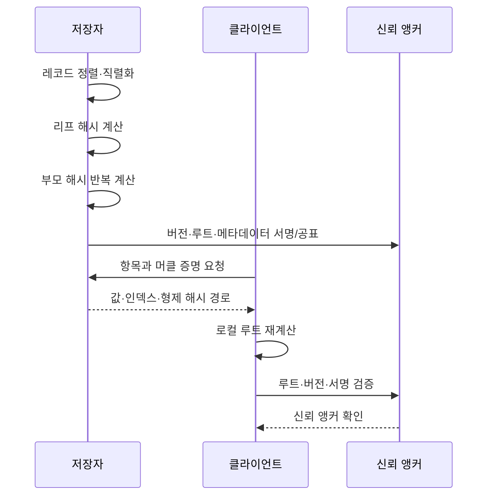

# 머클 트리(Merkle Tree)와 데이터 무결성 검증

## 1. 개요

> **정의**: 머클 트리(Merkle Tree)는 데이터 조각을 반복적으로 해시하여 부모 해시로 결합하고, 최종 루트 해시(root hash) 하나로 전체 집합의 상태를 요약하는 해시 트리이다.

분산 시스템에서는 데이터를 보관하는 노드와 데이터를 조회하는 노드가 서로 다르고, 네트워크를 통해 전달되는 데이터가 중간에 변조될 수 있다. 이때 검증자가 전체 원본과 모든 레코드를 다시 받지 않고도 특정 항목이 집합에 포함되었는지, 또는 동일한 상태를 가리키는지를 확인할 수 있어야 한다.

단순히 파일 하나의 해시를 비교하는 방식은 전체 파일을 다시 내려받아야 한다는 한계가 있다. 반면 머클 트리는 리프(leaf)에서 루트까지의 형제 해시만 전달하는 머클 증명(Merkle proof)을 사용하므로, 전체 데이터가 커져도 검증에 필요한 증명 크기가 대체로 로그 수준으로 증가한다.

머클 트리의 핵심은 암호학적 해시 자체가 아니라 **요약값을 계층적으로 구성하는 방식**이다. 해시 함수가 충돌 저항성, 역상 저항성, 눈사태 효과를 충분히 제공한다면 한 개의 루트 해시는 많은 하위 데이터의 변화를 민감하게 반영하는 커밋먼트(commitment)로 동작한다.

예를 들어 1,048,576개의 레코드를 2개씩 묶어 이진 트리로 만들면, 특정 레코드의 포함 여부를 보여 주는 증명에는 이상적인 경우 약 20개의 형제 해시가 필요하다. 전체 레코드를 전달하는 방식과 비교하면 통신량이 크게 줄지만, 루트 해시가 신뢰할 수 있는 채널을 통해 배포되어야 한다는 전제가 남는다.

### 등장 배경과 필요성

분산 원장, 콘텐츠 배포망, 소프트웨어 저장소, 로그 투명성 시스템은 모두 “원본 데이터와 검증 데이터가 분리되는” 문제를 갖는다. 저장소는 데이터 전체를 보유하지만 클라이언트는 일부만 조회하거나 경량 검증만 수행하려 한다.

머클 트리는 이 문제를 데이터 구조 관점에서 해결한다. 저장자는 전체 트리를 계산하고 루트 해시를 공표하며, 검증자는 관심 항목과 형제 노드 해시를 받아 같은 결합 규칙으로 루트를 재계산한다.

다만 머클 트리가 데이터의 진실성이나 의미적 정확성을 보장하는 것은 아니다. 신뢰할 수 없는 데이터가 처음부터 입력되었다면 트리는 그 잘못된 데이터의 일관성만 증명한다. 따라서 루트의 생성 주체, 배포 채널, 키 관리, 시간 순서, 최신성 검증까지 함께 설계해야 한다.

### 기술사 관점의 문제 정의

논술 답안에서는 머클 트리를 “해시를 연결한 그림”으로만 설명하지 말고, 검증 비용·신뢰 경계·변경 감지·최신성이라는 품질속성의 관점에서 서술하는 것이 중요하다.

첫째, 검증자가 전체 데이터를 보유하지 않아도 포함 증명을 만들 수 있는지 확인한다. 둘째, 동일한 데이터라도 직렬화 방식과 해시 도메인 분리가 다르면 다른 루트가 생성될 수 있음을 설명한다.

셋째, 루트 해시의 신뢰성을 확보하는 키 서명, 합의, TLS, 투명성 로그 등의 보완 수단을 구분한다. 넷째, 추가·삭제·갱신이 빈번한 환경에서는 정적 이진 트리와 동적 자료구조의 비용 차이를 비교한다.

## 2. 기본 구조와 동작 원리

### 가. 노드 구성과 해시 계층

리프 노드는 원본 데이터 블록 또는 레코드에서 계산한 해시다. 내부 노드는 왼쪽 자식과 오른쪽 자식의 해시를 정해진 순서로 연결하여 다시 해시한 값이다. 루트는 모든 리프의 영향이 전파된 최상위 요약값이다.

실제 구현에서는 단순히 `H(left || right)`만 쓰기보다 리프와 내부 노드의 의미를 구별하는 도메인 분리(domain separation)를 적용하는 편이 안전하다. 예를 들어 리프는 `H(0x00 || data)`, 내부 노드는 `H(0x01 || left || right)`로 계산하면 서로 다른 종류의 입력이 같은 해석 경로로 섞이는 위험을 줄일 수 있다.

입력 데이터의 직렬화도 합의된 규칙이어야 한다. JSON 객체의 키 순서, 숫자 표현, 문자 인코딩, 줄바꿈, 공백이 달라지면 같은 의미의 데이터라도 서로 다른 바이트열이 된다. 따라서 canonical serialization 또는 명시적인 바이너리 인코딩을 사용해야 한다.

```mermaid
graph TD
    D1[데이터 블록 A] --> L1[H(0x00 || A)]
    D2[데이터 블록 B] --> L2[H(0x00 || B)]
    D3[데이터 블록 C] --> L3[H(0x00 || C)]
    D4[데이터 블록 D] --> L4[H(0x00 || D)]
    L1 --> P1[H(0x01 || L1 || L2)]
    L2 --> P1
    L3 --> P2[H(0x01 || L3 || L4)]
    L4 --> P2
    P1 --> R[Merkle Root]
    P2 --> R
```

위 구조에서 루트는 특정 데이터 블록을 직접 저장하지 않는다. 루트는 모든 하위 해시의 결합 결과이므로 데이터가 한 바이트만 바뀌어도 변경된 리프부터 루트까지의 경로가 달라진다.

노드 수가 2의 거듭제곱이 아닌 경우에는 프로토콜이 홀수 레벨을 처리하는 규칙을 명시해야 한다. 마지막 노드를 복제하는 방식, 마지막 노드를 승격하는 방식, 불완전한 노드를 별도 처리하는 방식은 서로 다른 루트를 만든다.

따라서 머클 트리는 알고리즘 이름만으로 상호운용되지 않는다. 해시 함수, 리프 도메인, 내부 노드 결합 순서, 홀수 처리, 인덱스 기준, 직렬화 규칙이 모두 프로토콜의 일부다.

### 나. 루트 해시의 의미

루트 해시는 전체 데이터 집합에 대한 짧은 커밋먼트다. 검증자는 루트와 증명을 비교함으로써 특정 데이터가 그 시점의 집합에 속한다는 사실을 확인할 수 있다.

그러나 루트 해시만 공개한다고 해서 검증 가능한 시스템이 자동으로 완성되는 것은 아니다. 공격자가 가짜 루트를 배포하면 클라이언트는 그 가짜 루트에 맞는 증명을 받을 수 있다. 그러므로 루트는 디지털 서명, 블록 헤더, 합의된 체크포인트, 공개 로그 등 신뢰할 수 있는 외부 앵커(anchor)에 연결해야 한다.

루트에 시간과 버전 정보를 함께 묶는 것도 중요하다. 동일한 데이터 집합의 루트를 재사용하면 오래된 상태를 최신 상태처럼 제시하는 재생 공격(replay attack)이 발생할 수 있다. 실무에서는 루트에 epoch, 블록 높이, 스냅샷 버전, 생성 시각, 체인 식별자 등을 바인딩한다.

### 다. 완전성·무결성·최신성의 분리

머클 증명은 보통 포함 증명과 무결성 검증을 제공한다. “이 항목의 해시가 이 루트에 포함된다”는 사실은 확인할 수 있지만, 그 항목이 유일한지, 누락된 항목이 없는지까지 자동으로 보장하지는 않는다.

예를 들어 키-값 저장소에서 `user-100`의 존재를 증명하는 것과 `user-100`이 유일하게 존재한다는 것을 증명하는 것은 다르다. 후자는 정렬 규칙, 인접 키, 비존재 증명 또는 별도 인덱스 구조가 필요하다.

최신성은 더욱 별도 문제다. 검증자는 올바른 과거 루트와 현재 루트를 구분할 기준이 있어야 한다. 서명된 체크포인트, 단조 증가하는 버전, 합의된 헤더, 투명성 로그의 일관성 증명이 이를 보완한다.

## 3. 머클 트리 생성과 머클 증명 검증

### 가. 생성 절차

첫 단계는 원본 레코드를 결정론적으로 정렬하고 직렬화하는 것이다. 입력 순서가 노드마다 다르면 동일한 데이터셋도 서로 다른 트리를 만들기 때문에, 키 정렬과 인코딩 규칙을 문서화해야 한다.

둘째, 각 레코드에 리프 도메인 태그를 붙여 해시한다. 이때 빈 데이터와 빈 리스트를 구분하고, 레코드 식별자와 버전 같은 문맥을 포함할지 결정한다.

셋째, 인접한 두 리프를 내부 노드로 결합한다. 왼쪽과 오른쪽의 순서를 바꾸면 결과가 달라지므로, 정렬된 머클 트리인지 위치 기반 머클 트리인지 명확히 한다.

넷째, 최상위 노드 하나가 남을 때까지 같은 작업을 반복한다. 홀수 노드가 남는 레벨에서는 명세에 따라 복제 또는 승격을 적용하고, 이 규칙을 검증 코드와 테스트 벡터에 반영한다.

다섯째, 생성한 루트와 트리 버전, 해시 알고리즘, 레코드 범위를 함께 저장한다. 루트만 저장하면 나중에 어떤 규칙으로 만들어졌는지 재현하기 어렵다.



생성 파이프라인은 데이터 처리와 루트 공표를 원자적으로 연결해야 한다. 데이터 파일은 새 버전인데 루트는 이전 버전으로 남는다면 검증자가 혼란을 겪는다. 따라서 스냅샷 ID를 먼저 확정하고, 스냅샷·루트·서명을 동일한 릴리스 단위로 관리한다.

### 나. 포함 증명과 검증 절차

특정 리프의 포함 증명은 대상 리프의 위치와 루트까지 올라가는 경로의 형제 해시 목록으로 구성된다. 검증자는 대상 데이터에서 리프 해시를 계산한 뒤, 각 단계에서 형제 해시가 왼쪽인지 오른쪽인지에 따라 결합한다.

예를 들어 네 개의 리프 중 세 번째 항목을 검증할 때는 네 번째 리프의 해시, 첫 번째와 두 번째 리프를 결합한 부모 해시가 필요하다. 이 두 단계 결과가 루트와 같으면 해당 항목이 그 트리에 포함된 것으로 판단한다.

검증자는 증명에 들어 있는 인덱스가 범위 안인지, 경로 길이가 예상 높이와 맞는지, 해시 알고리즘과 도메인 태그가 루트 메타데이터와 일치하는지도 확인해야 한다. 길이 검증이 없으면 비정상적으로 긴 증명이나 메모리 고갈 입력이 서비스 거부로 이어질 수 있다.

검증 비용은 해시 계산 횟수와 증명 크기에 비례한다. 균형 이진 트리에서 레코드 수를 n이라 하면 경로 길이는 대략 \(\lceil log_2 n 
ceil\)이고, 전체 데이터 크기 O(n)에 비해 증명 데이터는 O(log n) 수준이다.

### 다. 비존재 증명과 범위 증명

존재하지 않는 키를 증명하려면 단순한 포함 증명만으로는 부족하다. 정렬된 머클 트리나 머클 Patricia 트리에서는 탐색 경로와 인접한 두 키를 제시해 해당 위치에 대상 키가 들어갈 수 없음을 보인다.

비존재 증명은 개인정보 조회나 권한 확인처럼 “목록에 없다는 사실”이 중요한 서비스에 활용할 수 있다. 그러나 키 정렬 규칙이 검증자에게 알려져 있어야 하며, 인접 키의 공개가 정보 노출을 일으키지 않는지도 평가해야 한다.

여러 항목을 한 번에 증명하는 다중 증명은 공통 조상 해시를 공유하여 중복을 줄인다. 예를 들어 같은 서브트리에 속한 100개 항목을 각각 증명하는 대신, 한 번만 필요한 형제 해시를 묶어 전송할 수 있다.

범위 증명은 특정 구간의 모든 항목이 포함되었음을 보여 주는 요구사항이다. 이는 단일 항목의 포함 증명보다 완전성 요구가 강하므로, 정렬·경계·누락 검증을 명시하고 응답 사업자가 중간 항목을 임의로 생략하지 못하도록 설계해야 한다.

## 4. 유형과 관련 자료구조 비교

### 가. 위치 기반 이진 머클 트리

위치 기반 이진 머클 트리는 배열의 순서와 인덱스를 기준으로 부모를 계산한다. 블록체인의 거래 목록, 파일 청크 검증, 버전 스냅샷처럼 데이터 순서가 의미를 갖는 경우에 적합하다.

이 구조는 구현이 단순하고 검증 비용을 예측하기 쉽다. 반면 중간에 항목을 삽입하면 이후 항목의 위치와 많은 부모 해시가 바뀌므로, 빈번한 삽입에는 비효율적일 수 있다.

홀수 노드 규칙이 구현마다 다르면 서로 다른 루트가 산출된다. 따라서 테스트 벡터로 1개, 2개, 3개, 5개 노드와 빈 입력을 모두 검증해야 한다.

### 나. 정렬 머클 트리

정렬 머클 트리는 키를 정렬하여 동일 키의 위치를 결정한다. 여러 노드가 같은 키 집합을 독립적으로 구성해도 동일한 루트를 만들기 쉽고, 비존재 증명이나 범위 증명에 유리하다.

대신 정렬 비용과 갱신 비용을 부담해야 한다. 실시간 이벤트가 많이 유입되는 서비스는 매번 전체 정렬을 수행하기보다 배치 스냅샷, 증분 트리, 로그 구조 저장소와 조합하는 방식을 검토한다.

키 자체를 공개하면 개인정보나 사업 정보가 노출될 수 있으므로, 키 해싱이나 프라이버시 보존형 트리 구조가 필요할 수 있다. 다만 키를 단순 해시해도 사전 대입이 쉬운 값은 추측될 수 있어 솔트와 접근통제를 별도로 고려해야 한다.

### 다. 머클 패트리샤 트리와 트라이

머클 패트리샤 트리는 키의 접두사 경로와 압축 노드를 함께 사용하여 키-값 상태를 효율적으로 표현한다. 상태가 변경되면 영향을 받는 경로의 노드만 새로 계산할 수 있어 동적 상태 저장소에 적합하다.

트라이 계열은 문자열 또는 비트 경로를 활용하므로 단순한 배열형 머클 트리보다 조회 의미가 풍부하다. 반면 노드 인코딩과 분기 규칙이 복잡하여 구현 호환성, 악의적 입력, 저장 공간을 세심하게 관리해야 한다.

다음 표는 구조의 선택 기준을 요약한 것이다. 표 자체는 결론이 아니라 요구사항을 구조에 매핑하기 위한 보조 도구이며, 실제 설계에서는 갱신 빈도와 증명 대상까지 함께 판단한다.

| 구분 | 위치 기반 이진 트리 | 정렬 머클 트리 | 머클 패트리샤/트라이 |
|---|---|---|---|
| 핵심 기준 | 배열 위치 | 키의 정렬 순서 | 키의 경로·접두사 |
| 강점 | 단순성·예측 가능한 경로 | 결정론·비존재 증명 | 동적 키-값 상태 갱신 |
| 약점 | 중간 삽입에 취약 | 정렬·재구성 비용 | 복잡한 인코딩과 운영 |
| 적합 사례 | 블록·파일 청크 | 스냅샷·목록 완전성 | 상태 저장소·계정 조회 |

### 라. 일반 해시·디지털 서명·블록체인과의 차이

일반 해시는 단일 메시지의 변경을 감지하는 데 효율적이지만, 부분 데이터에 대한 포함 경로를 제공하지 않는다. 머클 트리는 여러 해시를 계층화하여 부분 검증을 가능하게 한다.

디지털 서명은 서명자가 메시지 또는 루트를 승인했음을 증명하지만, 대규모 데이터의 부분 포함 관계를 자체적으로 표현하지 않는다. 실무에서는 머클 루트를 서명해 “서명된 요약값”을 만들고, 개별 항목은 머클 증명으로 검증하는 조합이 흔하다.

블록체인은 머클 트리를 구성요소로 사용할 수 있지만 머클 트리와 블록체인은 같은 개념이 아니다. 머클 트리는 데이터 집합을 요약하는 자료구조이고, 블록체인은 블록 연결·합의·원장 규칙까지 포함하는 시스템이다.

| 비교 대상 | 주된 보장 | 부분 검증 | 신뢰 전제 |
|---|---|---|---|
| 단일 해시 | 메시지 변경 감지 | 어려움 | 해시 알고리즘과 값 전달 |
| 머클 트리 | 집합 내 포함·일관성 | 가능 | 신뢰할 루트·규칙 |
| 디지털 서명 | 승인 주체·무결성 | 루트 서명과 조합 | 개인키와 인증서 |
| 블록체인 | 합의된 순서·원장 상태 | 머클 구조와 조합 | 합의·경제적 보안 등 |

## 5. 적용 사례와 위협 대응

### 가. 블록체인 경량 검증

블록체인 블록 헤더에 거래 머클 루트를 넣으면 경량 클라이언트가 전체 블록의 모든 거래를 저장하지 않고도 특정 거래가 블록에 포함되었는지 확인할 수 있다. 클라이언트는 블록 헤더의 신뢰성과 거래의 머클 경로를 함께 검증한다.

이 방식은 저장 공간과 네트워크 비용을 줄이지만, 포함 여부가 곧 거래의 최종성이나 유효성을 뜻하지는 않는다. 충분한 블록 확인, 합의 규칙, 이중 지불 방지 정책을 별도로 확인해야 한다.

거래 순서와 블록 높이를 증명에 바인딩하면 동일 거래가 다른 맥락에서 재사용되는 위험을 줄일 수 있다. 또한 노드가 상충하는 헤더를 제시할 때 어떤 앵커를 기준으로 선택할지 정의해야 한다.

### 나. Git 객체 모델과 분산 저장소

Git은 콘텐츠 주소 지정 방식으로 객체 내용의 해시를 식별자처럼 사용하고, 트리 객체와 커밋 객체가 하위 내용을 가리키는 구조를 갖는다. 파일 내용이 바뀌면 관련 트리와 커밋의 식별자도 연쇄적으로 달라져 스냅샷의 무결성을 추적할 수 있다.

이 사례는 “데이터를 위치가 아니라 내용으로 식별한다”는 원리를 보여 준다. 다만 Git의 객체 그래프는 전형적인 완전 이진 머클 트리와 동일하지 않으며, DAG 형태의 참조와 커밋 메타데이터를 이용한다는 차이를 답안에서 구분해야 한다.

저장소의 원격 서버나 태그 서명이 신뢰되지 않으면 로컬 해시만으로 공급망의 출처를 완전히 보장할 수 없다. 서명된 커밋, 보호된 브랜치, 리뷰 정책, 재현 가능한 빌드와 결합해야 실무적인 신뢰 사슬이 만들어진다.

### 다. Certificate Transparency 로그

공개키 인증서 투명성 로그는 발급된 인증서를 추가 전용 로그에 기록하고, 로그의 상태를 머클 트리 계열 구조로 요약한다. 모니터와 감사자는 포함 증명 및 로그 일관성 증명을 사용해 특정 인증서가 기록되었는지와 로그가 뒤에서 조작되지 않았는지 확인한다.

여기서 중요한 점은 단순 포함 증명과 일관성 증명이 다르다는 사실이다. 포함 증명은 하나의 항목이 특정 트리에 들어갔음을 보이고, 일관성 증명은 이전 트리가 새로운 트리의 접두사로 유지되었음을 확인하게 한다.

로그 운영자는 루트 또는 트리 헤더를 신뢰 가능한 프로토콜로 제공해야 한다. 감사 시스템은 서로 다른 클라이언트에 상충하는 트리를 보여 주는 분기(equivocation)를 탐지하고 보고할 수 있어야 한다.

### 라. 백업·파일 배포·데이터 레이크

대용량 파일을 청크로 나누어 각 청크의 해시와 루트를 저장하면 병렬 다운로드 중 손상된 청크만 재전송할 수 있다. 데이터 레이크의 불변 스냅샷도 파일 목록과 파티션 메타데이터를 머클 루트로 요약해 배치 재현성을 높일 수 있다.

다만 청크 경계가 바뀌면 동일한 파일도 다른 루트를 갖는다. 콘텐츠 정의 청킹, 고정 크기 청킹, 롤링 해시 청킹 중 요구사항에 맞는 방식을 선택하고, 버전 간 비교에서 청크 ID가 어떻게 유지되는지 정해야 한다.

랜섬웨어나 내부자 공격에 대비하려면 루트를 운영 서버와 분리된 보관소에 주기적으로 앵커링하고, 루트 메타데이터에 접근통제와 변경 이력을 적용한다. 루트가 데이터와 같은 저장소에서 함께 변조되면 검증 구조가 무력화될 수 있다.

## 6. 심화: 설계·구현·운영의 품질 기준

### 가. 보안 설계

해시 함수는 충돌 공격과 길이 확장 공격 가능성을 평가하여 선택한다. Merkle–Damgård 계열 해시를 내부 노드에서 사용할 때는 도메인 분리와 길이 인코딩을 적용해 서로 다른 입력 문맥이 충돌하지 않도록 한다.

인덱스와 방향 비트를 증명에 포함해야 한다. 형제 해시 목록만 보내고 방향을 생략하면 검증자가 좌우 결합을 추측해야 하거나, 구현마다 다른 해석으로 동일 증명이 상이한 결과를 만들 수 있다.

검증 API는 증명 깊이, 노드 수, 전체 바이트 길이, 버전, 알고리즘 식별자를 제한하고 검사해야 한다. 공격자가 비정상적으로 큰 증명을 전송해 CPU나 메모리를 점유하는 상황을 방지할 수 있다.

### 나. 성능과 저장 전략

정적 배치 데이터는 전체 트리를 한 번 만들고 루트를 캐시하는 방식이 효율적이다. 업데이트가 적으면 계산 비용보다 증명 생성의 단순성이 더 큰 이점이 된다.

변경이 많은 데이터는 로그 구조 저장소, 증분 머클 트리, 서브트리 캐시를 활용할 수 있다. 변경된 리프에서 루트까지의 경로만 다시 계산하면 되지만, 랜덤 업데이트가 폭증하면 저장 노드 수와 가비지 컬렉션 비용이 커진다.

다중 증명과 배치 증명을 사용하면 공통 형제 해시를 제거할 수 있다. CDN이나 RPC 서비스에서는 동일한 루트에 대한 증명을 캐시하되, 인증 대상의 권한과 응답 최신성을 함께 검증해야 한다.

### 다. 테스트와 운영

테스트 벡터에는 빈 트리, 단일 리프, 홀수 리프, 균형 트리, 중복 데이터, 최대 길이 데이터, 비 ASCII 문자열을 포함해야 한다. 특히 홀수 노드 복제 규칙은 가장 흔한 상호운용성 오류 지점이다.

속성 기반 테스트에서는 임의의 데이터셋을 생성하고, 생성한 모든 리프의 증명이 동일한 루트로 검증되는지 확인한다. 한 바이트를 바꾼 데이터, 방향 비트를 바꾼 증명, 다른 버전의 루트를 사용한 증명은 실패해야 한다.

운영 모니터링은 검증 실패율, 증명 크기, 검증 지연, 루트 생성 지연, 루트 간 불일치, 버전 역행을 수집해야 한다. 검증 실패를 단순한 404로 처리하지 말고 데이터 손상·공격·구현 불일치로 분류할 수 있는 진단 정보를 남긴다.

키로 루트를 서명하는 경우 서명키의 교체, 폐기, HSM 보관, 다중 서명, 감사 로그를 설계한다. 서명키가 탈취되면 공격자는 일관된 가짜 루트를 배포할 수 있으므로, 키 신뢰만으로 모든 위험을 해결할 수 없다.

## 7. 고려사항 및 시사점

### 가. 신뢰 경계와 앵커 설계

머클 트리는 루트를 신뢰하는 순간부터 유효하다. 루트의 출처가 불명확하면 아무리 정확한 증명도 공격자의 데이터에 대한 증명이 될 수 있다.

따라서 루트를 서명된 메타데이터, 블록 헤더, 공인된 투명성 로그, 별도 WORM 저장소 등 하나 이상의 독립 앵커에 연결한다. 서로 다른 운영 주체가 루트를 교차 서명하면 단일 장애점을 줄일 수 있다.

### 나. 표준화와 상호운용성

해시 함수만 합의하는 것은 충분하지 않다. 직렬화, 도메인 분리, 바이트 순서, 홀수 노드 처리, 증명 포맷, 오류 코드, 버전 협상까지 명세에 포함해야 한다.

프로토콜 버전을 루트와 증명에 함께 기록하면 알고리즘 전환 시 구형 클라이언트와 신형 클라이언트의 해석 충돌을 줄일 수 있다. 서로 다른 구현이 동일한 공개 테스트 벡터를 통과하는지 확인한 뒤 운영에 투입한다.

### 다. 개인정보와 정보 노출

머클 루트는 원본을 직접 노출하지 않지만, 증명 경로와 키·메타데이터가 간접적인 존재 정보를 노출할 수 있다. 희소한 값이나 추측 가능한 식별자는 해시만으로 익명화되지 않는다.

개인정보 항목을 리프에 넣을 때는 최소수집, 가명화, 접근통제, 증명 유효기간, 삭제 요청 처리 방안을 함께 검토한다. 불변 원장에 루트를 남기는 경우에도 원본 삭제와 루트에 남은 추론 가능성 사이의 법적·운영적 관계를 평가해야 한다.

### 라. 최신성·가용성·장애 대응

정확한 과거 루트에 대한 증명은 최신 상태를 보장하지 않는다. 클라이언트가 허용할 수 있는 최대 루트 나이, 버전 단조성, 타임스탬프 오차, 재동기화 절차를 정의해야 한다.

증명 제공자가 장애를 일으키면 검증 자체는 가능해도 서비스를 이용할 수 없다. 루트와 스냅샷을 다중 리전에 복제하고, 증명 API를 여러 공급자에서 조회할 수 있도록 하며, 캐시된 증명의 만료 정책을 둔다.

### 마. 적용 우선순위와 전망

작은 정적 목록에는 단일 해시나 서명만으로 충분할 수 있으므로 머클 트리를 무조건 도입하지 않는다. 부분 검증, 대규모 데이터, 분산 보관, 독립 감사가 실제 요구사항인지 먼저 확인한다.

도입한다면 데이터 모델링 단계에서 검증 대상과 신뢰 앵커를 먼저 결정하고, 이후 자료구조와 증명 포맷을 선택한다. 이 순서를 뒤집으면 저장 구조는 복잡해졌는데도 최신성과 출처를 보장하지 못하는 결과가 생긴다.

향후에는 투명성 로그, 분산 저장, 영지식증명, 콘텐츠 주소 지정, 데이터 공급망 추적이 머클 구조와 결합될 가능성이 높다. 다만 영지식증명이나 블록체인을 적용해도 직렬화·키 관리·운영 감사라는 기본 문제는 사라지지 않는다.

## 참고자료

- RFC 6962, Certificate Transparency: https://www.rfc-editor.org/rfc/rfc6962
- Git 공식 문서, Git Internals - Git Objects: https://git-scm.com/book/en/v2/Git-Internals-Git-Objects
- Bitcoin Developer Guide, Block Chain: https://developer.bitcoin.org/devguide/block_chain.html
- Ethereum Developers Documentation, Patricia Merkle Trie: https://ethereum.org/en/developers/docs/data-structures-and-encoding/patricia-merkle-trie/

---

> **한 줄 요약**: 머클 트리는 데이터를 해시 계층으로 요약한 루트와 로그 크기의 경로 증명으로 대규모 분산 데이터의 부분 무결성·포함 검증을 가능하게 하지만, 루트의 신뢰 앵커·최신성·직렬화·개인정보 노출까지 함께 설계해야 한다.
