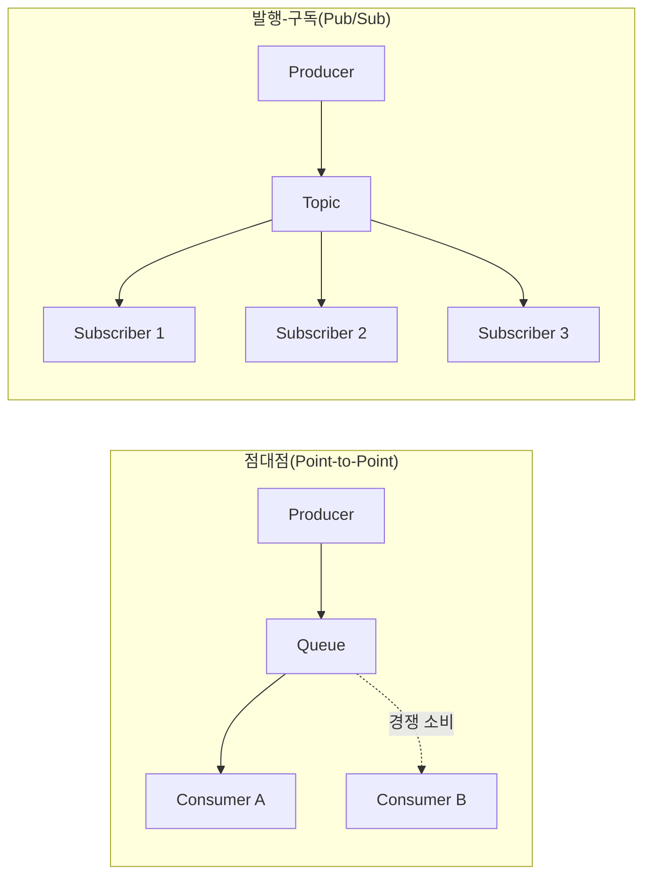
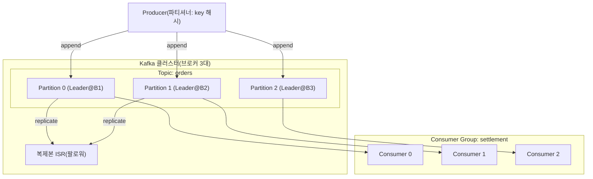

# 메시지 큐(Message Queue)와 Apache Kafka

## 1. 개요

> **정의**: 메시지 큐(Message Queue)는 송신자(Producer)와 수신자(Consumer) 사이에 **메시지를 임시 저장하는 중간 버퍼**를 두어, 양측이 서로의 존재나 처리 속도를 알지 못한 채 **비동기·느슨한 결합(loose coupling)**으로 통신하도록 하는 메시지 지향 미들웨어(MOM, Message-Oriented Middleware)이다. Apache Kafka는 이 개념을 **분산 커밋 로그(distributed commit log)** 기반으로 재해석해, 대용량 이벤트를 지속 저장하면서 다수의 소비자가 재생(replay)·재처리할 수 있게 한 **분산 이벤트 스트리밍 플랫폼**이다.

현대 시스템은 주문·결제·알림·정산·추천처럼 서로 다른 속도로 동작하는 다수의 서비스가 협력한다. 만약 이들이 직접 동기 호출(synchronous call)로만 연결되면, 하나의 하위 서비스가 느려지거나 장애가 나는 순간 그 지연과 실패가 호출 사슬 전체로 전파된다. 예컨대 주문 서비스가 결제·재고·알림을 순차 동기 호출하면, 알림 서비스의 응답이 3초 지연될 때 사용자는 주문 완료 화면을 3초 늦게 보게 된다. 이처럼 **시간적 결합(temporal coupling)**과 **장애 전파**는 마이크로서비스가 커질수록 심각한 병목이 된다.

메시지 큐는 이 문제를 **"중간에 완충 버퍼를 두어 시간축을 분리"**함으로써 해결한다. 생산자는 메시지를 큐에 넣고 즉시 자기 일을 끝내며(fire-and-forget), 소비자는 자신이 감당 가능한 속도로 메시지를 꺼내 처리한다. 그 결과 ① 생산·소비 속도 차이를 큐가 흡수해 **버스트 트래픽을 평탄화(load leveling)**하고, ② 소비자가 잠시 죽어도 메시지가 큐에 남아 **유실 없이 나중에 처리**되며, ③ 생산자와 소비자가 서로를 직접 참조하지 않으므로 **한쪽을 교체·확장해도 다른 쪽에 영향이 없다**. 이 세 가지가 메시지 큐 도입의 본질적 효익이다.

메시지 큐의 특징은 다음과 같이 정리된다. 첫째, **비동기(asynchronous)** 통신으로 생산자가 소비 완료를 기다리지 않아 응답성이 향상된다. 둘째, **버퍼링(buffering)**으로 순간적 트래픽 폭증을 흡수해 하위 시스템을 보호한다. 셋째, **느슨한 결합**으로 생산자·소비자가 서로를 직접 참조하지 않아 독립 배포·확장이 가능하다. 넷째, **내구성(durability)**으로 소비자 장애 시에도 메시지를 보존해 최종적 처리를 보장한다. 이 네 특징이 결합되어 시스템의 탄력성(resilience)과 확장성(scalability)을 동시에 높인다.

다만 비동기화에는 대가가 따른다. 처리 순서 보장, 중복 없는 정확히 한 번(exactly-once) 처리, 메시지 유실 방지, 그리고 "언제 처리가 끝났는지 알 수 없는" 최종 일관성(eventual consistency)의 관측성 문제가 새로 등장한다. 따라서 메시지 큐는 "던지면 끝"이 아니라 **전달 보장 수준(delivery semantics)과 순서·중복 정책을 명시적으로 설계**해야 하는 기술이며, 기술사 관점에서는 이 트레이드오프를 어떻게 조율하는지가 핵심 논점이다.

## 2. 메시지 큐의 통신 모델과 구성요소

메시지 큐의 통신은 크게 **점대점(Point-to-Point)**과 **발행-구독(Publish-Subscribe)** 두 모델로 나뉜다. 점대점 모델에서는 하나의 메시지를 여러 소비자가 경쟁적으로 가져가되 **정확히 한 소비자만** 소비한다(작업 분배·부하 분산에 적합). 발행-구독 모델에서는 하나의 메시지가 **구독한 모든 소비자에게 복제**되어 전달된다(이벤트 브로드캐스트에 적합). 아래 구조도는 두 모델과 브로커의 위치를 함께 보여준다.

**가. 생산자(Producer)와 소비자(Consumer)** — 생산자는 비즈니스 이벤트를 메시지로 직렬화(serialize)해 브로커에 전송하는 주체이고, 소비자는 브로커로부터 메시지를 수신해 실제 처리를 수행하는 주체다. 둘 사이의 핵심 설계 결정은 **푸시(push)와 풀(pull)** 방식의 선택이다. 전통적 큐(ActiveMQ 등)는 브로커가 소비자에게 메시지를 밀어 넣는 푸시 방식을 쓰지만, 소비자가 감당 못 할 속도로 밀려들면 소비자가 무너진다. Kafka는 반대로 소비자가 자신의 처리 속도에 맞춰 브로커에서 당겨오는 **풀 방식**을 채택해, 소비자가 스스로 백프레셔(backpressure)를 조절하도록 설계했다. 이 차이는 대용량 처리 안정성에서 결정적 우위를 만든다.

**나. 브로커(Broker)와 큐/토픽** — 브로커는 메시지를 수신·저장·전달하는 서버로서, 메시지 큐의 심장이다. 브로커는 메시지를 메모리 또는 디스크에 보관하며, 소비자가 확인(acknowledge)할 때까지 메시지를 유지해 유실을 방지한다. 여기서 중요한 철학적 차이가 있다. RabbitMQ 같은 **전통 브로커는 "소비되면 큐에서 삭제"**하는 반면, Kafka는 소비 여부와 무관하게 메시지를 설정된 보존 기간(retention) 동안 **디스크에 계속 남겨** 여러 소비자가 각자의 위치에서 반복해 읽을 수 있게 한다. 즉 전통 큐가 "우편함"이라면 Kafka는 "다시 되감아 읽는 녹화 테이프"에 가깝다. 보존 정책도 두 가지로 나뉘는데, 시간·용량 기준으로 오래된 메시지를 지우는 **시간 기반 보존**과, 같은 키의 최신 값만 남기고 이전 값을 정리하는 **로그 압축(log compaction)**이 그것이다. 로그 압축은 "키별 최종 상태"를 영구 보관해야 하는 경우(예: 사용자 프로필의 현재 값)에 유용하며, 이벤트 소싱·상태 저장소로 Kafka를 활용할 때 핵심 기능이 된다.

**다. 메시지와 확인 응답(Acknowledgement)** — 메시지는 헤더(메타데이터)와 페이로드(본문)로 구성되며, 순서·중복 제어를 위한 키(key)나 시퀀스 번호를 포함할 수 있다. 소비자가 메시지를 성공 처리한 뒤 브로커에 보내는 확인 응답(ack)은 전달 보장의 핵심 장치다. ack를 **처리 이전에** 보내면 처리 중 장애 시 메시지가 사라지고(at-most-once), ack를 **처리 완료 후에** 보내면 ack 유실 시 재전송으로 중복이 생긴다(at-least-once). 이 미묘한 타이밍이 뒤에서 다룰 전달 시맨틱의 근원이다.

확인 응답과 짝을 이루는 개념이 **재전송과 데드레터 큐(DLQ, Dead Letter Queue)**다. 소비자가 특정 메시지를 반복 처리 실패하면 브로커는 이를 무한 재전송하려 하는데, 이때 손상된 메시지 하나가 큐 전체의 처리를 막는 **독약 메시지(poison message)** 현상이 생길 수 있다. 이를 막기 위해 일정 횟수 이상 실패한 메시지를 별도의 DLQ로 격리해 정상 처리 흐름을 보호하고, 운영자가 나중에 원인을 분석·재처리하도록 한다. 즉 확인 응답이 "성공의 신호"라면 DLQ는 "실패의 안전망"으로, 둘을 함께 설계해야 메시지 파이프라인이 견고해진다.

전통 메시지 큐 제품을 비교하면 다음과 같다. 표는 선택의 출발점일 뿐, 각 제품이 그런 특성을 갖는 이유는 위 문단의 저장·전달 철학 차이에서 비롯된다.

| 구분 | RabbitMQ | ActiveMQ | Amazon SQS | Apache Kafka |
|---|---|---|---|---|
| 모델 | 점대점·Pub/Sub | 점대점·Pub/Sub | 점대점(관리형) | 분산 로그(Pub/Sub) |
| 소비 후 | 삭제(ack 시) | 삭제 | 삭제(가시성 타임아웃) | 보존(재생 가능) |
| 전달 방식 | 푸시 | 푸시 | 풀(폴링) | 풀 |
| 강점 | 유연한 라우팅 | 표준(JMS) | 운영 부담 제로 | 초대용량·재처리 |
| 처리량 | 중 | 중 | 중 | 초대용량 |

## 3. Apache Kafka 아키텍처와 처리 절차

Kafka는 메시지를 **토픽(Topic)**이라는 논리 채널로 묶고, 각 토픽을 다시 여러 **파티션(Partition)**으로 분할한다. 파티션은 추가만 되고 수정되지 않는 **순차적 커밋 로그**이며, 각 메시지는 파티션 내에서 단조 증가하는 **오프셋(offset)**으로 식별된다. 이 파티셔닝이 Kafka의 병렬성과 확장성의 원천이다. 아래는 브로커 클러스터·파티션·소비자 그룹의 관계를 나타낸 상세 아키텍처다.

**가. 파티션과 순서 보장** — Kafka는 **파티션 단위로만 순서를 보장**한다. 같은 파티션에 들어간 메시지는 오프셋 순서대로 소비되지만, 서로 다른 파티션 간에는 전역 순서가 보장되지 않는다. 이는 성능과 순서의 근본적 트레이드오프에서 나온 설계다. 만약 전체 토픽에 대해 전역 순서를 강제하면 파티션을 하나만 두어야 하고, 그러면 병렬성이 사라져 처리량이 급감한다. 따라서 실무에서는 **순서가 중요한 단위(예: 동일 계좌·동일 주문번호)를 메시지 키로 지정**해 같은 파티션으로 라우팅한다. 예를 들어 계좌번호를 키로 쓰면 특정 계좌의 입출금 이벤트는 항상 같은 파티션에 순서대로 쌓여 잔액 계산의 정합성을 지킬 수 있다.

**나. 소비자 그룹(Consumer Group)과 확장** — 여러 소비자를 하나의 그룹으로 묶으면 Kafka가 파티션을 그룹 내 소비자들에게 **배타적으로 분배(assignment)**한다. 파티션 하나는 그룹 내에서 정확히 한 소비자만 담당하므로, 파티션 수가 곧 그룹의 최대 병렬 소비 한계가 된다. 소비자를 늘리면 파티션이 재분배(rebalancing)되어 수평 확장되고, 소비자가 죽으면 그가 맡던 파티션이 다른 소비자에게 재할당되어 고가용성이 확보된다. 다만 리밸런싱 중에는 잠시 소비가 멈추므로, 파티션·소비자 수를 과도하게 바꾸면 잦은 리밸런싱으로 오히려 지연이 늘 수 있다. 실무에서는 대개 **파티션 수를 예상 최대 병렬도보다 여유 있게(예: 향후 2~3배) 미리 잡아** 두어 잦은 재조정을 피한다.

**다. 복제(Replication)와 내구성** — 각 파티션은 여러 브로커에 복제되며, 하나의 리더(leader)와 다수의 팔로워(follower)로 구성된다. 생산자는 리더에만 쓰고 팔로워가 이를 복제하며, 리더와 동기화된 복제본 집합을 **ISR(In-Sync Replica)**이라 부른다. 생산자의 `acks` 설정이 내구성 수준을 결정한다. `acks=0`은 전송 후 응답을 기다리지 않아 가장 빠르지만 유실 위험이 크고, `acks=1`은 리더 기록만 확인하며, `acks=all`은 모든 ISR이 기록을 마쳐야 성공으로 간주해 브로커 장애에도 유실이 없다. 금융권처럼 유실이 허용되지 않는 도메인에서는 `acks=all`과 `min.insync.replicas=2` 이상을 함께 설정해, 리더가 죽어도 최소 1개의 동기 복제본이 데이터를 보존하도록 한다.

파티션 수를 정하는 것은 되돌리기 어려운 초기 설계 결정이라는 점도 유의해야 한다. Kafka에서 파티션은 늘릴 수는 있어도 줄일 수 없으며, 키 기반 라우팅을 쓰는 경우 파티션 수를 바꾸면 키→파티션 매핑이 달라져 기존 순서 보장이 깨질 수 있다. 따라서 목표 처리량(초당 메시지 수 ÷ 소비자 한 대의 처리 속도)을 기준으로 필요한 병렬도를 산정하고, 여기에 성장 여유를 더해 파티션 수를 신중히 결정해야 한다. 예컨대 초당 20만 건을 처리하는데 소비자 한 대가 초당 2만 건을 처리한다면 최소 10개 파티션이 필요하며, 향후 성장을 고려해 20~30개로 잡는 식이다.

**라. 전달 시맨틱(Delivery Semantics)** — 메시지 전달 보장은 세 수준으로 나뉜다. **At-most-once(최대 한 번)**는 중복은 없으나 유실 가능성이 있어 로그·메트릭처럼 일부 손실이 무방한 경우에 쓴다. **At-least-once(최소 한 번)**는 유실은 없으나 중복이 생길 수 있어, 소비 측이 **멱등(idempotent) 처리**로 중복을 흡수해야 한다. **Exactly-once(정확히 한 번)**는 유실도 중복도 없는 이상적 수준으로, Kafka는 생산자 멱등성(idempotent producer)과 트랜잭션(transactional API)을 결합해 이를 지원한다. 다만 정확히 한 번은 트랜잭션 코디네이션 비용 때문에 처리량이 떨어지므로, 결제·정산처럼 정합성이 절대적인 구간에만 선택적으로 적용하고, 나머지는 "at-least-once + 멱등 소비자" 조합으로 설계하는 것이 실무의 정석이다. 세 시맨틱의 특성과 적용 지침을 정리하면 다음과 같다.

| 전달 시맨틱 | 유실 | 중복 | 처리량 | 소비자 요구 | 적용 예 |
|---|---|---|---|---|---|
| At-most-once | 가능 | 없음 | 최고 | 없음 | 로그·메트릭 수집 |
| At-least-once | 없음 | 가능 | 높음 | 멱등 처리 필수 | 일반 이벤트·알림 |
| Exactly-once | 없음 | 없음 | 낮음 | 트랜잭션 연동 | 결제·정산 |

여기서 **멱등 소비자(idempotent consumer)** 설계는 실무에서 가장 자주 요구되는 기법이다. 같은 메시지가 두 번 도착해도 결과가 한 번 처리한 것과 동일하도록, 메시지의 고유 키(예: 주문ID+이벤트타입)를 처리 이력 테이블에 기록하고 이미 처리된 키면 건너뛰는 방식이 대표적이다. 이렇게 하면 at-least-once의 중복을 소비 측에서 흡수할 수 있어, 값비싼 exactly-once 없이도 실질적 정확성을 확보한다. 이 "브로커는 at-least-once, 애플리케이션은 멱등"이라는 역할 분담이 대용량 시스템에서 성능과 정합성을 동시에 잡는 현실적 해법이다.

## 4. 비교와 적용 사례

**가. Kafka vs 전통 메시지 큐 — 왜 다른가** — RabbitMQ로 대표되는 전통 브로커와 Kafka의 차이는 단순한 성능 우열이 아니라 **설계 목적의 차이**에서 나온다. RabbitMQ는 복잡한 라우팅(exchange, binding, routing key)과 즉시 소비-삭제에 최적화된 **"작업 큐(task queue)"**로, 소비 후 사라지는 명령·태스크 전달에 강하다. 반면 Kafka는 이벤트를 로그로 **영속 저장**해 여러 소비자가 각자 시점에서 재생하는 **"이벤트 저장소(event log)"**로, 대용량 스트림 처리와 재처리에 강하다. 따라서 "주문 처리 명령을 하나의 워커가 받아 실행" 같은 시나리오는 RabbitMQ가, "모든 주문 이벤트를 정산·추천·감사 시스템이 각각 소비" 같은 시나리오는 Kafka가 자연스럽다. 하나가 다른 하나를 완전히 대체하지 않으며, 두 미들웨어를 역할에 따라 병용하는 아키텍처도 흔하다. 선택 기준을 요구사항별로 정리하면 다음과 같다.

| 요구사항 | 권장 | 이유 |
|---|---|---|
| 이벤트 재처리·재생 필요 | Kafka | 로그를 보존해 임의 시점부터 재소비 가능 |
| 초당 수십만 건 이상 대용량 | Kafka | 파티션 병렬성·순차 디스크 쓰기로 고처리량 |
| 복잡한 라우팅·우선순위 큐 | RabbitMQ | exchange·binding 기반 유연한 라우팅 |
| 운영 부담 최소(관리형) | SQS/클라우드 | 서버리스 관리형으로 운영 제로 |
| 메시지별 개별 확인·짧은 태스크 | RabbitMQ | 소비-삭제 모델이 작업 큐에 적합 |

이 표에서 보듯 선택은 "성능 우열"이 아니라 **재처리 필요성·처리량·라우팅 복잡도·운영 여력**이라는 요구사항의 조합으로 결정된다. 핵심은 이벤트를 "한 번 쓰고 버릴 명령"으로 볼지 "여러 소비자가 재사용할 사실의 기록"으로 볼지에 대한 관점 차이이며, 이 관점이 미들웨어 선택과 전체 아키텍처의 성격을 좌우한다.

**나. 이벤트 기반 아키텍처(EDA)·CDC와의 결합** — Kafka는 마이크로서비스의 이벤트 백본(backbone) 역할을 한다. 서비스가 상태 변경을 이벤트로 발행하면 다른 서비스가 이를 구독해 반응하는 EDA에서, Kafka는 이벤트의 신뢰성 있는 전달과 보존을 담당한다. 특히 **CDC(Change Data Capture)**와 결합하면 강력하다. Debezium 같은 커넥터가 데이터베이스의 트랜잭션 로그(WAL/binlog)를 읽어 변경분을 Kafka 토픽으로 흘려보내면, 원본 DB에 부하를 주지 않고도 데이터 웨어하우스·검색엔진·캐시를 실시간 동기화할 수 있다. 이 패턴은 모놀리식 DB에서 마이크로서비스로 점진 전환할 때 데이터 정합성을 유지하는 **스트랭글러(strangler) 마이그레이션**의 핵심 도구로 쓰인다.

**다. 구체 산업 적용 사례** — Kafka는 원래 LinkedIn이 하루 수조 건의 활동 로그를 처리하기 위해 개발해 2011년 오픈소스화한 것으로, 이후 사실상의 스트리밍 표준이 되었다. 실무 수치로 보면, 대형 이커머스는 주문·클릭·재고 이벤트를 초당 수십만~수백만 건 규모로 Kafka에 수집해 실시간 추천과 이상탐지에 활용한다. 국내에서도 대형 포털·금융사가 로그 수집(ELK 파이프라인의 앞단 버퍼), 실시간 정산, MSA 이벤트 버스로 Kafka를 광범위하게 채택한다. 예컨대 결제 시스템은 결제 승인 이벤트를 `acks=all`·트랜잭션으로 발행하고, 정산·알림·부정탐지 서비스가 동일 토픽을 각각 소비함으로써 하나의 이벤트를 여러 목적에 재사용하면서도 서비스 간 결합을 제거한다.

또 다른 대표 사례는 **로그·모니터링 파이프라인의 완충 버퍼**다. 수천 대 서버가 쏟아내는 로그를 Elasticsearch에 직접 적재하면 순간 폭증 시 색인 서버가 과부하로 무너지지만, 그 앞단에 Kafka를 두면 로그를 일단 토픽에 안전하게 적재하고 Logstash·색인기가 감당 가능한 속도로 당겨가 부하를 평탄화할 수 있다. 이 구조에서 Kafka는 데이터 유실을 막는 안전 버퍼이자, 색인·검색·이상탐지 등 다수 소비자가 같은 로그 스트림을 각기 다른 목적으로 재사용하는 공유 파이프라인 역할을 동시에 수행한다.

**라. 백프레셔와 컨슈머 랙 관리** — 대용량 파이프라인에서 생산 속도가 소비 속도를 지속적으로 초과하면 처리되지 않은 메시지가 계속 쌓인다. 이 미처리 누적량을 **컨슈머 랙(consumer lag)**이라 하며, 최신 오프셋과 소비자가 확인한 오프셋의 차이로 측정된다. 랙이 커진다는 것은 실시간성이 무너지고 있다는 신호이므로, Kafka 운영의 최우선 관측 지표다. 대응 방법은 소비자(파티션) 수를 늘려 병렬도를 높이거나, 소비 로직을 배치화·비동기화해 처리량을 끌어올리는 것이다. 예를 들어 한 국내 커머스는 세일 이벤트 중 주문 이벤트 랙이 급증하자 소비자를 오토스케일링으로 확장해 수 분 내 랙을 해소한 바 있다. 이처럼 Kafka는 풀 방식으로 소비자가 스스로 속도를 조절(backpressure)하므로 브로커가 무너지지 않고 버퍼가 부하를 흡수하지만, 랙 자체를 방치하면 최종 일관성 지연이 사용자 경험을 해치므로 지속 모니터링이 필수다.

## 5. 심화 — 최신 동향과 예상 출제 방향

Kafka 생태계는 최근 몇 년간 운영 복잡도를 낮추는 방향으로 빠르게 진화하고 있다. 가장 큰 변화는 오랫동안 클러스터 메타데이터·리더 선출을 담당하던 **ZooKeeper 의존을 제거**하고, Kafka 자체의 합의 프로토콜인 **KRaft(Kafka Raft)**로 통합한 것이다. KRaft는 별도의 ZooKeeper 클러스터를 운영·튜닝해야 하는 부담을 없애고, 메타데이터를 내부 로그로 관리해 대규모 파티션 환경에서 컨트롤러 장애 복구 시간을 크게 단축했다. 기술사 답안에서 "Kafka 운영 복잡도 개선"을 묻는다면 ZooKeeper→KRaft 전환이 핵심 논거가 된다.

또 하나의 흐름은 **Tiered Storage(계층형 저장)**이다. 브로커의 로컬 디스크에는 최근 데이터만 두고 오래된 로그는 오브젝트 스토리지(S3 등)로 내려, 저장 비용을 낮추면서도 장기 보존과 재처리를 가능하게 한다. 이는 "저장과 연산의 분리"라는 클라우드 네이티브 원칙을 스트리밍에 적용한 사례로, 데이터 레이크하우스·데이터 메시 아키텍처와 자연스럽게 맞물린다. 아울러 **Kafka Streams·ksqlDB** 같은 스트림 처리 계층이 성숙하면서, 단순 메시지 전달을 넘어 실시간 조인·집계·윈도우 연산을 Kafka 위에서 직접 수행하는 사례도 늘고 있다.

경쟁·대안 기술의 등장도 주목할 만하다. **Apache Pulsar**는 저장과 서빙을 분리한 계층형 구조로 멀티테넌시와 지리적 복제에 강점을 내세우며, 클라우드 사업자들은 완전관리형 스트리밍(Amazon MSK/Kinesis, Confluent Cloud, GCP Pub/Sub)을 제공해 브로커 운영 부담 자체를 없애는 방향으로 경쟁한다. 이는 "Kafka를 직접 운영할 것인가, 관리형으로 위임할 것인가"라는 새로운 의사결정 축을 만든다. 동시에 스트리밍의 사실상 표준 인터페이스로 Kafka 프로토콜 호환성이 요구되면서, 다수 신규 제품이 Kafka API 호환을 표방하는 것도 생태계 고착(lock-in)과 표준화의 긴장을 보여주는 대목이다.

아울러 스트리밍이 배치(batch) 처리를 상당 부분 대체하면서, 데이터 파이프라인의 무게중심이 "밤에 한 번 도는 ETL"에서 "끊김 없이 흐르는 실시간 스트림"으로 이동하고 있다. 이 흐름 속에서 Kafka는 데이터 레이크·웨어하우스로 데이터를 실어 나르는 수집 계층이자, 실시간 분석·ML 피처 공급의 공통 백본으로 자리매김하고 있으며, 이는 데이터 메시가 강조하는 "데이터를 제품으로 다루는" 분산 소유 모델과도 잘 맞물린다.

예상 출제 방향으로는 ① 전달 시맨틱(at-least/exactly-once)과 멱등 소비자 설계, ② 파티션·키·순서 보장의 트레이드오프, ③ Kafka vs RabbitMQ 선택 기준, ④ CDC·EDA·MSA와의 연계, ⑤ 대용량 로그 파이프라인에서의 백프레셔·재처리 전략이 자주 다뤄진다. 답안 구성 시에는 "왜 비동기·느슨한 결합이 필요한가"라는 배경에서 출발해, 구체 시맨틱과 수치·사례로 깊이를 더한 뒤, 트레이드오프와 최신 동향(KRaft·Tiered Storage)으로 마무리하는 흐름이 설득력 있다.

## 6. 고려사항 및 시사점

메시지 큐·Kafka 도입은 기술사 관점에서 다음과 같은 전략적 판단을 요구한다.

- **적용 전략(도구의 목적 적합성)**: "명령 전달·작업 분배"인지 "이벤트 스트림·재처리"인지에 따라 RabbitMQ·SQS와 Kafka를 구분 선택해야 한다. 모든 통신을 무조건 Kafka로 통일하면 단순 작업 큐에는 과도한 운영 부담이 되고, 반대로 대용량 이벤트 백본에 전통 큐를 쓰면 확장·재처리에서 한계에 부딪힌다. 목적-도구 정합이 첫 번째 고려사항이다.
- **정합성 트레이드오프(시맨틱·비용의 균형)**: exactly-once는 매력적이지만 트랜잭션 코디네이션으로 처리량과 지연을 희생한다. 따라서 도메인별로 정합성 등급을 나눠, 금융·결제 구간에만 exactly-once를 적용하고 로그·메트릭은 at-most-once, 일반 이벤트는 "at-least-once + 멱등 소비자"로 차등 설계하는 것이 비용 대비 효과적이다.
- **운영·관측성(비동기의 그림자 관리)**: 비동기화는 "언제 처리가 끝났는지 알기 어려운" 최종 일관성 문제를 낳는다. 컨슈머 랙(consumer lag) 모니터링, 데드레터 큐(DLQ)를 통한 실패 메시지 격리, 분산 추적(OpenTelemetry) 연계를 통해 메시지 흐름의 관측성을 확보하지 않으면 장애 원인 추적이 극히 어려워진다.
- **데이터 거버넌스·스키마 진화**: 여러 서비스가 같은 토픽을 소비하므로, 생산자가 메시지 구조를 함부로 바꾸면 하위 소비자가 일제히 깨진다. Schema Registry와 호환성 규칙(backward/forward compatibility), 데이터 계약(Data Contract)을 통해 스키마 진화를 통제해야 장기적으로 안전하다.
- **전망과 연계 기술**: KRaft·Tiered Storage로 운영 복잡도와 비용이 낮아지고, Kafka Streams·Flink 등 스트림 처리와 결합하며, CDC·데이터 메시·이벤트 소싱과 함께 실시간 데이터 아키텍처의 중추로 자리잡을 전망이다. 메시지 큐는 단일 기술이 아니라 EDA·MSA·데이터 파이프라인을 관통하는 **연결 기반(fabric)**으로 이해해야 한다.

## 참고자료
- Apache Kafka 공식 문서, https://kafka.apache.org/documentation/
- Apache Software Foundation, "KRaft: Apache Kafka Without ZooKeeper", https://developer.confluent.io/learn/kraft/
- AWS, "메시지 큐란 무엇인가", https://aws.amazon.com/message-queue/
- RabbitMQ 공식 문서, https://www.rabbitmq.com/documentation.html

---

> **한 줄 요약**: 메시지 큐는 생산자와 소비자를 완충 버퍼로 분리해 비동기·느슨한 결합을 실현하는 미들웨어이며, Apache Kafka는 이를 분산 커밋 로그로 재해석해 대용량 이벤트의 영속 저장·재처리·수평 확장을 가능케 한 스트리밍 플랫폼으로, 전달 시맨틱·파티션 순서·복제·정합성의 트레이드오프를 명시적으로 설계하는 것이 성공의 핵심이다.
