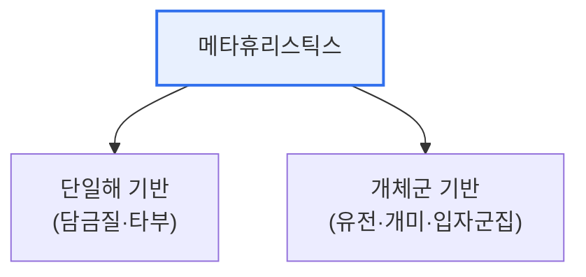

# 메타휴리스틱스(Metaheuristics)

## 1. 개요

### 가. 정의
> **메타휴리스틱스**는 복잡한 최적화 문제에서 **최적해에 가까운 좋은 해를 현실적 시간 안에 찾아내는 상위 수준의 경험적(휴리스틱) 탐색 전략**으로, 특정 문제에 얽매이지 않는 범용 최적화 기법이다.

메타휴리스틱스가 필요한 근본 이유는 '**현실의 최적화 문제는 완전 탐색이 불가능할 만큼 크다**'는 데 있다. 외판원 문제(TSP)처럼 경우의 수가 조합적으로 폭발하는 NP-hard 문제는, 모든 경우를 다 따져 최적해를 찾으려면 수백 년이 걸릴 수도 있다. 그렇다고 손 놓을 수는 없으니, '완벽하진 않아도 충분히 좋은 해를 빠르게' 찾는 실용적 접근이 필요하다. 메타휴리스틱스가 그 답이다. 자연 현상(진화·담금질·개미 떼)에서 영감을 얻어, 해 공간을 지능적으로 탐색하며 점점 좋은 해로 개선해 간다. 핵심은 **탐험(Exploration, 새 영역 탐색)과 활용(Exploitation, 좋은 해 주변 집중)의 균형**이다. 이 균형으로 국소 최적(local optimum)에 갇히지 않고 전역 최적에 가까이 다가간다. 문제 종류를 가리지 않는 범용성이 최대 강점이다.

### 나. 등장 배경
NP-hard 등 완전 탐색이 불가능한 대규모 조합 최적화 문제에서, 실용적 시간 안에 우수한 근사해가 필요해지며 발전했다.

## 2. 주요 기법

| 기법 | 영감·원리 |
|---|---|
| **유전 알고리즘(GA)** | 진화(선택·교배·돌연변이)로 해 개선 |
| **담금질(SA)** | 금속 담금질, 확률적으로 나쁜 해 수용해 국소최적 탈출 |
| **개미 군집(ACO)** | 개미의 페로몬 경로 탐색 |
| **입자 군집(PSO)** | 새 떼의 군집 이동 |
| **타부 탐색(Tabu)** | 최근 방문 해를 금지해 순환 방지 |

메타휴리스틱스는 크게 **단일해 기반**(하나의 해를 개선, 담금질·타부)과 **개체군 기반**(여러 해를 동시 진화, 유전·개미·입자군집)으로 나뉜다. 개체군 기반은 다양한 해를 병렬 탐색해 전역 탐색에 유리하다.

## 3. 특징과 트레이드오프

| 특징 | 내용 |
|---|---|
| **범용성** | 문제 종류에 무관하게 적용 |
| **근사해** | 최적 보장 없이 '충분히 좋은' 해 |
| **탐험-활용 균형** | 국소최적 탈출 vs 수렴 속도 |
| **파라미터 의존** | 온도·개체 수 등 튜닝 필요 |

메타휴리스틱스는 최적해를 보장하지 않는 대신 현실적 시간에 우수한 해를 준다. 탐험을 늘리면 전역 최적 가능성은 높지만 느리고, 활용을 늘리면 빠르지만 국소최적에 갇힐 위험이 있다.

## 4. 고려사항 및 시사점

1. **문제 특성에 맞는 기법 선택**이 중요하다. 연속 최적화는 PSO, 조합 최적화는 GA·ACO가 유리한 식으로, 문제 구조에 맞춰 기법과 파라미터를 선택·튜닝해야 성능이 난다.
2. **탐험과 활용의 균형**이 성패를 가른다. 초기엔 탐험 위주로 넓게 탐색하고 후반엔 활용 위주로 수렴시키는 적응적 전략이 효과적이다.
3. **AI·물류·설계 등 광범위 활용**된다. 하이퍼파라미터 최적화, 물류 경로·일정 최적화, 신경망 구조 탐색 등에 쓰이며, 최근에는 여러 기법을 결합한 하이브리드 메타휴리스틱스가 발전하고 있다.

---

> **한 줄 요약**: 메타휴리스틱스는 *완전 탐색이 불가능한 대규모 최적화에서 우수한 근사해를 실용적 시간에 찾는 범용 탐색 전략* 으로, 자연 현상에서 영감을 얻어 탐험과 활용의 균형으로 국소최적을 탈출하며 전역 최적에 다가간다.
