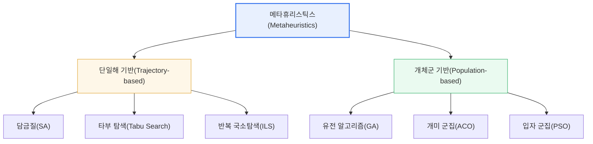
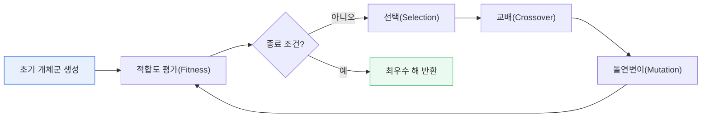

# 메타휴리스틱스(Metaheuristics)

## 1. 개요

### 가. 정의
> **메타휴리스틱스(Metaheuristics)** 는 복잡한 최적화 문제에서 **최적해에 가까운 우수한 해를 현실적 시간 안에 찾아내는 상위 수준(meta)의 경험적(heuristic) 탐색 전략**으로, 특정 문제의 구조에 얽매이지 않고 해 공간을 지능적으로 탐색하는 범용(problem-independent) 최적화 프레임워크이다.

메타휴리스틱스가 필요한 근본 이유는 "**현실의 최적화 문제는 완전 탐색(exhaustive search)이 불가능할 만큼 크다**"는 데 있다. 대표적 예가 외판원 문제(TSP, Traveling Salesman Problem)다. 도시가 *n*개일 때 가능한 경로의 수는 (*n*−1)!/2로, 도시 30개만 되어도 경로 수가 약 4.4×10³¹개에 이른다. 초당 10억 개의 경로를 검사하는 컴퓨터로도 이를 모두 따지려면 우주의 나이보다 긴 시간이 걸린다. 이처럼 경우의 수가 조합적으로 폭발하는 **NP-hard** 문제는 다항 시간 안에 전역 최적해(global optimum)를 보장하는 알고리즘이 알려져 있지 않다. 그렇다고 최적화를 포기할 수는 없으니, "완벽하지는 않아도 충분히 좋은 해(good-enough solution)를 충분히 빠르게" 찾는 실용적 접근이 요구된다. 메타휴리스틱스가 바로 그 답이다.

메타휴리스틱스의 발상은 **자연과 물리 현상을 모방**하는 데서 출발한다. 생물의 진화, 금속의 담금질, 개미 떼의 먹이 탐색, 새 떼의 군집 이동처럼 "자연이 오랜 시간에 걸쳐 좋은 해를 찾아온 방식"을 계산 절차로 옮긴 것이다. 이들은 단순한 탐욕적(greedy) 규칙과 달리, 때로는 당장 나빠 보이는 해도 확률적으로 수용하면서 넓은 영역을 살피고, 좋은 해 주변은 집중적으로 파고든다. 이러한 **메타(상위) 수준의 제어 논리**가 문제별 휴리스틱을 지휘한다는 점에서 "메타"휴리스틱이라 불린다.

핵심 원리는 **탐험(Exploration)과 활용(Exploitation)의 균형**이다. 탐험은 아직 가보지 않은 새로운 영역을 넓게 탐색해 다양성을 확보하는 활동이고, 활용은 지금까지 찾은 좋은 해 주변을 집중적으로 개선해 수렴을 꾀하는 활동이다. 탐험이 지나치면 무작위 탐색에 가까워져 수렴이 느리고, 활용이 지나치면 **국소 최적(local optimum)** 에 일찍 갇혀 전역 최적을 놓친다. 우수한 메타휴리스틱은 초기에는 탐험 위주로 해 공간을 넓게 훑고, 후반으로 갈수록 활용 위주로 좁혀 가는 적응적 스케줄을 통해 이 두 힘의 긴장을 정교하게 조율한다.

### 나. 등장 배경과 필요성
전통적 최적화는 선형계획법(LP)·정수계획법(IP)처럼 **문제의 수학적 구조(미분가능성·볼록성 등)를 전제로 정확해(exact solution)를 구하는 방식**이 주류였다. 그러나 물류 경로, 생산 일정, 신경망 구조 설계처럼 현실 문제 상당수는 목적 함수가 불연속·비선형이거나 미분 불가능하고, 제약이 복잡하며, 탐색 공간이 천문학적이다. 이런 문제에는 정확해법을 그대로 적용하기 어렵다. 메타휴리스틱스는 목적 함수를 "블랙박스"로만 평가(해를 넣으면 점수가 나오는)해도 동작하므로, 문제 구조에 대한 가정이 거의 필요 없다. 바로 이 **범용성과 유연성**이 1980~1990년대 이후 담금질·유전 알고리즘·타부 탐색 등이 폭넓게 확산된 배경이다.

## 2. 전체 분류와 구조

메타휴리스틱스는 탐색 과정에서 **유지하는 해의 개수**를 기준으로 크게 두 계열로 나뉜다. 하나의 해를 점진적으로 개선하는 **단일해 기반(trajectory-based)** 과, 여러 해의 집합을 동시에 진화시키는 **개체군 기반(population-based)** 이다. 전자는 한 점이 해 공간을 이동하는 궤적을 그리며 국소 탐색(local search)을 정교화하는 데 강하고, 후자는 여러 해가 병렬로 공간을 훑고 서로 정보를 교환하므로 전역 탐색과 다양성 확보에 유리하다.


```mermaid
flowchart TB
  M["메타휴리스틱스(Metaheuristics)"] --> S["단일해 기반(Trajectory-based)"]
  M --> P["개체군 기반(Population-based)"]
  S --> SA["담금질(SA)"]
  S --> TS["타부 탐색(Tabu Search)"]
  S --> ILS["반복 국소탐색(ILS)"]
  P --> GA["유전 알고리즘(GA)"]
  P --> ACO["개미 군집(ACO)"]
  P --> PSO["입자 군집(PSO)"]
  style M fill:#e8f0fe,stroke:#2f6fed,stroke-width:2px
  style S fill:#fef7e8,stroke:#e0a42f,stroke-width:1px
  style P fill:#eafaf0,stroke:#2fae66,stroke-width:1px
```

단일해 기반은 구현이 단순하고 메모리 부담이 작지만, 하나의 궤적에 의존하므로 탐험 능력을 별도 장치(담금질의 확률 수용, 타부의 금지 목록)로 보강해야 국소 최적을 벗어난다. 개체군 기반은 여러 후보가 서로 다른 영역을 동시에 탐색하고 우수한 해의 정보를 집단에 퍼뜨리므로 넓은 탐험이 자연스럽지만, 해마다 목적 함수를 평가해야 해 **평가 비용이 크고 파라미터(개체 수·교배율 등) 튜닝 부담**이 크다. 실무에서는 문제의 성격과 목적 함수 평가 비용을 보고 둘 중 하나를 택하거나 결합한다.

| 계열 | 대표 기법 | 장점 | 한계 |
|---|---|---|---|
| **단일해 기반** | 담금질(SA), 타부 탐색, ILS | 단순·경량, 국소 탐색 정교 | 전역 탐험이 약해 별도 탈출 장치 필요 |
| **개체군 기반** | 유전(GA), 개미(ACO), 입자군집(PSO) | 병렬 탐색·다양성, 전역 탐색 유리 | 평가 비용·파라미터 튜닝 부담 |

## 3. 주요 기법 상세

### 가. 유전 알고리즘(GA, Genetic Algorithm)
유전 알고리즘은 **생물의 진화**를 모방한다. 해 하나를 염색체(chromosome)로 인코딩하고, 여러 해로 이루어진 개체군을 놓은 뒤, 적합도(fitness)가 높은 개체를 **선택(selection)** 하여 두 부모의 유전자를 섞는 **교배(crossover)** 와 일부 유전자를 무작위로 바꾸는 **돌연변이(mutation)** 로 다음 세대를 만든다. 세대를 거듭하며 적합도가 높은 해가 살아남아 집단 전체의 품질이 점진적으로 향상된다.

여기서 교배는 주로 **활용**의 역할을, 돌연변이는 **탐험**의 역할을 한다. 돌연변이율이 너무 낮으면 집단이 한 지점으로 조기 수렴(premature convergence)해 국소 최적에 갇히고, 너무 높으면 무작위 탐색처럼 되어 수렴하지 못한다. 따라서 돌연변이율은 대개 0.1~1% 수준의 작은 값으로 시작해 상황에 맞게 조정한다. GA는 해를 자유롭게 인코딩할 수 있어 조합 최적화(일정·배치·경로)에 특히 폭넓게 쓰인다.


```mermaid
flowchart LR
  A["초기 개체군 생성"] --> B["적합도 평가(Fitness)"]
  B --> C{"종료 조건?"}
  C -->|"아니오"| D["선택(Selection)"]
  D --> E["교배(Crossover)"]
  E --> F["돌연변이(Mutation)"]
  F --> B
  C -->|"예"| G["최우수 해 반환"]
  style A fill:#e8f0fe,stroke:#2f6fed,stroke-width:1px
  style G fill:#eafaf0,stroke:#2fae66,stroke-width:1px
```

실제 적용 예로, 위성 안테나 설계에서 NASA는 유전 알고리즘으로 사람이 직관적으로 떠올리기 어려운 비대칭 형상의 고성능 안테나를 찾아낸 바 있다. 이처럼 설계 공간이 넓고 직관이 통하지 않는 문제에서 GA는 인간 설계자가 미처 보지 못한 해를 발굴하는 강점을 보인다.

### 나. 담금질(SA, Simulated Annealing)
담금질은 **금속을 고온에서 서서히 식혀 결정 구조를 안정화**하는 물리 과정에서 이름을 땄다. 현재 해에서 이웃 해로 이동할 때, 더 좋은 해는 항상 받아들이고 더 나쁜 해도 **확률적으로 수용**한다. 이 수용 확률은 온도(T)가 높을수록, 그리고 나빠지는 정도가 작을수록 커지며(볼츠만 분포에 기반), 반복이 진행될수록 온도를 낮춰(cooling schedule) 점차 나쁜 해를 덜 받아들이게 한다.

이 "나쁜 해도 가끔 수용"하는 장치가 담금질의 핵심이다. 초반 고온에서는 국소 최적의 골짜기를 넘나들며 넓게 탐험하고, 후반 저온에서는 좋은 영역에 집중해 활용하면서 수렴한다. 온도를 너무 빨리 낮추면 탐험이 부족해 국소 최적에 갇히고, 너무 천천히 낮추면 수렴이 느려 계산이 길어진다. 냉각 일정(초기 온도·감소율)이 성능을 좌우하는 이유다. VLSI 반도체 배치·배선 최적화가 담금질의 고전적 성공 사례다. 아래 의사코드는 이 확률적 수용과 냉각의 흐름을 요약한 것이다.

```text
T ← T_초기             # 높은 온도에서 시작
s ← 초기해 생성
반복:
    s' ← s의 이웃 해 생성
    Δ ← cost(s') - cost(s)
    if Δ < 0:          # 더 좋은 해면 항상 수용
        s ← s'
    else if rand() < exp(-Δ / T):   # 나쁜 해도 확률적으로 수용
        s ← s'
    T ← T × α          # 냉각(0<α<1), 온도 점차 감소
until 종료 조건(T 충분히 낮음)
return s
```

### 다. 개미 군집(ACO)·입자 군집(PSO)·타부 탐색(Tabu Search)
개미 군집 최적화(ACO)는 개미가 먹이를 나를 때 경로에 **페로몬**을 남기고, 짧은 경로일수록 페로몬이 빨리 쌓여 다른 개미를 유인한다는 집단 지능을 모방한다. 여러 개미(해)가 남긴 페로몬이 좋은 경로에 누적되며 집단이 점차 우수한 해로 수렴한다. 경로·네트워크 라우팅 문제에 적합하다.

입자 군집 최적화(PSO)는 새 떼·물고기 떼의 군집 이동을 모방한다. 각 입자(해)는 자신이 찾은 최고 위치(pbest)와 무리 전체의 최고 위치(gbest)를 함께 참고해 속도를 갱신하며 이동한다. 연속 공간 최적화에서 구현이 간단하고 수렴이 빨라 널리 쓰인다. 타부 탐색은 **최근 방문한 해를 금지 목록(tabu list)에 올려 재방문을 막음**으로써, 같은 자리를 맴도는 순환을 방지하고 국소 최적을 빠져나오도록 강제한다. 이처럼 각 기법은 "국소 최적을 어떻게 탈출하는가"라는 같은 질문에 서로 다른 장치로 답한다.

## 4. 비교와 선택 기준

기법 선택은 "어떤 알고리즘이 절대적으로 우수한가"가 아니라 **문제의 구조에 어떤 기법의 탐색 방식이 맞는가**로 판단해야 한다. 이는 "모든 문제에 최적인 단일 알고리즘은 없다"는 **공짜 점심 없음 정리(No Free Lunch Theorem)** 의 실천적 함의이기도 하다. 연속 변수 최적화(함수 최소화·파라미터 튜닝)에는 PSO·담금질이, 순서·배치가 중요한 조합 최적화(TSP·스케줄링)에는 GA·ACO·타부가 유리한 경향이 있다.

| 기법 | 영감·원리 | 탐험/활용 장치 | 적합 문제 |
|---|---|---|---|
| **유전(GA)** | 진화(선택·교배·돌연변이) | 돌연변이(탐험)+교배(활용) | 조합·설계 최적화 |
| **담금질(SA)** | 금속 담금질·확률 수용 | 온도에 따른 확률 수용 | 연속·배치(VLSI) |
| **개미(ACO)** | 페로몬 경로 탐색 | 페로몬 증발·누적 | 경로·라우팅 |
| **입자군집(PSO)** | 새 떼 군집 이동 | pbest/gbest 가중 | 연속 함수 최적화 |
| **타부(Tabu)** | 최근 해 금지 | 금지 목록으로 순환 방지 | 조합 최적화 |

비교에서 중요한 것은 "왜 차이가 나는가"다. 예컨대 PSO가 연속 공간에서 강한 이유는 입자의 위치·속도가 실수 벡터로 표현되어 gradient 없이도 매끄러운 이동이 가능하기 때문이고, ACO가 경로 문제에서 강한 이유는 페로몬이라는 누적 정보가 "좋은 부분 경로"를 자연스럽게 기억·재사용하기 때문이다. 실무에서는 단일 기법에 의존하기보다, 예컨대 GA로 넓게 탐험한 뒤 담금질·타부로 국소 정제하는 식의 **하이브리드**로 각 기법의 강점을 결합한다.

## 5. 심화 — 최신 동향과 실무 적용

오늘날 메타휴리스틱스는 **AI/ML 파이프라인의 핵심 구성요소**로 재부상했다. 대표적인 것이 **하이퍼파라미터 최적화(HPO)** 와 **신경망 구조 탐색(NAS, Neural Architecture Search)** 이다. 학습률·층수·배치 크기 같은 하이퍼파라미터나 신경망 아키텍처 자체는 미분이 불가능한 이산·혼합 탐색 공간을 이루므로, 진화 알고리즘·PSO 같은 메타휴리스틱이 자연스러운 도구가 된다. 구글의 AmoebaNet 등은 진화 기반 탐색으로 사람이 설계한 모델에 필적하거나 능가하는 구조를 찾아낸 사례로 알려져 있다.

또한 **하이브리드·밈(Memetic) 알고리즘**과 **다목적 최적화(Multi-objective)** 가 주류 연구 방향이다. 밈 알고리즘은 개체군 기반 전역 탐색(GA)에 국소 탐색(담금질 등)을 결합해 수렴 품질을 높이고, NSGA-II 같은 다목적 진화 알고리즘은 비용·성능·전력처럼 상충하는 여러 목표를 동시에 고려해 **파레토 최적 해 집합(Pareto front)** 을 제시한다. 실무에서는 물류 기업의 차량 경로 문제(VRP), 반도체 공정의 생산 일정, 통신망 설계, 금융 포트폴리오 최적화 등 제약이 복잡하고 목표가 다수인 문제에 이런 기법이 적용된다. 다만 메타휴리스틱은 근사해만 제공하므로, 해의 품질 보증이 중요한 영역에서는 정확해법(수리계획)이나 경계 기법과 병행해 검증하는 것이 바람직하다.

## 6. 고려사항 및 시사점 (기술사 관점)

1. **문제 특성 기반 기법·파라미터 선택**: No Free Lunch 정리가 말하듯 만능 기법은 없다. 연속·이산 여부, 제약 구조, 목적 함수 평가 비용(한 번 평가에 시뮬레이션이 필요한지 등)을 먼저 분석하고 기법과 파라미터(개체 수·온도·돌연변이율)를 선택·튜닝해야 성능이 난다. 파라미터 자기조정(self-adaptive) 기법을 함께 고려한다.
2. **탐험-활용 균형의 적응적 제어**: 초기에는 탐험, 후반에는 활용으로 전환하는 동적 스케줄이 성패를 가른다. 조기 수렴(premature convergence) 징후(다양성 급감)를 모니터링해 돌연변이율을 높이거나 재시작(restart)하는 전략이 유효하다.
3. **평가 비용과 계산 자원의 트레이드오프**: 개체군 기반은 해마다 목적 함수를 평가하므로 병렬화(여러 해 동시 평가)로 가속할 수 있으나 자원이 든다. 평가 비용이 큰 문제에는 대리 모델(surrogate model)로 목적 함수를 근사해 평가 횟수를 줄이는 전략을 적용한다.
4. **근사해의 품질 보증과 정확해법 병행**: 메타휴리스틱은 최적해를 보장하지 않으므로, 안전·금전이 걸린 의사결정에서는 하한/상한(bound) 계산이나 수리계획과 교차 검증해 해의 신뢰 구간을 확보해야 한다.
5. **AI 시대의 연계 활용 전망**: HPO·NAS·강화학습 정책 탐색 등 메타휴리스틱과 기계학습의 결합이 확대되고 있으며, 반대로 학습된 모델을 대리 평가자로 쓰는 학습-최적화 융합(learn-to-optimize)이 새로운 흐름으로 부상하고 있다.

## 참고자료
- Wikipedia, "Metaheuristic" — https://en.wikipedia.org/wiki/Metaheuristic
- Wikipedia, "No free lunch theorem" — https://en.wikipedia.org/wiki/No_free_lunch_theorem
- Wikipedia, "Neural architecture search" — https://en.wikipedia.org/wiki/Neural_architecture_search

---

> **한 줄 요약**: 메타휴리스틱스는 *완전 탐색이 불가능한 대규모 NP-hard 최적화에서 우수한 근사해를 실용적 시간에 찾는 범용 탐색 전략* 으로, 자연·물리 현상을 모방해 **탐험과 활용의 균형**으로 국소 최적을 탈출하며, 오늘날 HPO·NAS 등 AI 파이프라인의 핵심 도구로 재부상하고 있다.
