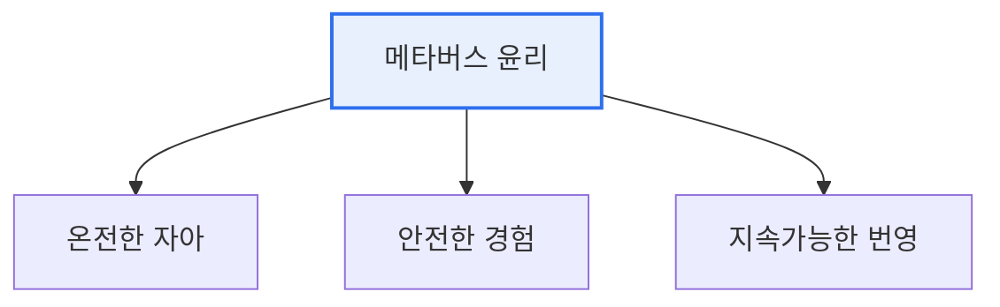

# 메타버스 윤리원칙

## 1. 개요

### 가. 배경
> 과학기술정보통신부가 2022년 발표한 지침으로, 메타버스가 야기할 수 있는 **윤리적 문제(정체성 혼란·프라이버시·중독·범죄 등)에 선제 대응**하기 위한 자율 규범이다. 지향가치와 실천원칙을 제시한다.

메타버스 윤리가 별도로 필요한 이유는, 메타버스가 현실과 가상이 융합된 **새로운 사회 공간**이기 때문이다. 아바타를 통한 상호작용, 몰입적 경험, 경제 활동이 일어나면서 기존 인터넷·AI 윤리로는 다 담기 어려운 정체성·실재감 관련 문제가 새로 생긴다.

## 2. 3대 지향가치와 8대 실천원칙 (1)

| 3대 지향가치 | 의미 |
|---|---|
| **온전한 자아(Sincere Identity)** | 진정성 있는 자아 실현 |
| **안전한 경험(Safe Experience)** | 안전하고 신뢰할 수 있는 이용 |
| **지속가능한 번영(Sustainable Prosperity)** | 함께 번영하는 지속가능성 |

| 8대 실천원칙(요지) |
|---|
| 진정성, 자율성, 호혜성, 사생활 존중, 공정성, 개인정보 보호, 포용성, 책임성 |

## 3. 인터넷·AI·메타버스 윤리 비교 (2)

| 구분 | 인터넷 윤리 | AI 윤리 | 메타버스 윤리 |
|---|---|---|---|
| **대상** | 온라인 정보·소통 | AI 시스템의 판단 | 가상융합 공간·아바타 |
| **핵심 이슈** | 정보 신뢰·저작권·예절 | 편향·투명성·책임 | 정체성·실재감·몰입·프라이버시 |
| **특성** | 익명성·개방성 | 자동화·자율성 | 몰입·체화·현실융합 |

## 4. 시사점
- 강제 규제가 아닌 **자율 규범**으로 선제 대응(기술 발전 저해 최소화)
- 아바타·몰입 경험 특유의 정체성·심리 문제에 주목
- 인터넷·AI 윤리와 상호 보완, 이용자·사업자 공동 실천 필요

---

> **한 줄 요약**: 메타버스 윤리원칙은 *온전한 자아·안전한 경험·지속가능한 번영* 3대 지향가치와 8대 실천원칙을 제시하며, 정체성·실재감·몰입 등 메타버스 특유의 문제를 다뤄 인터넷·AI 윤리를 보완한다.
