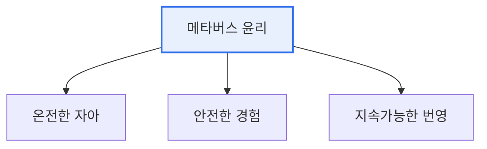

# 메타버스 윤리원칙

## 1. 개요

### 가. 배경
> 과학기술정보통신부가 발표한 지침으로, 메타버스 확산이 야기할 수 있는 **정체성 혼란·프라이버시 침해·중독·가상범죄 등 윤리적 문제에 선제적으로 대응**하기 위한 자율 규범이다. 지향가치와 실천원칙을 제시한다.

메타버스 윤리가 별도로 필요한 이유는, 메타버스가 현실과 가상이 융합된 **새로운 사회적 공간**이기 때문이다. 사람들은 아바타라는 또 다른 자아로 상호작용하고, 몰입적 경험을 하며, 가상 경제 활동을 벌인다. 이 과정에서 기존 인터넷·AI 윤리로는 온전히 담기 어려운 새로운 문제가 생긴다. 아바타 뒤의 정체성 혼란, 현실처럼 느껴지는 몰입 속 폭력·괴롭힘의 심리적 충격, 생체·행동 데이터 수집으로 인한 프라이버시 문제 등이 그것이다. 강제 규제로 신기술의 발전을 위축시키기보다, 이용자·기업이 함께 지킬 자율 규범을 선제적으로 제시해 건강한 생태계를 유도하려는 것이 이 원칙의 취지다.

### 나. 필요성
메타버스는 아직 형성 중인 공간이라 문제가 터진 뒤 규제하면 늦다. 발전 초기에 지향할 가치와 실천 원칙을 제시함으로써, 기술 발전과 이용자 보호의 균형을 잡으려는 선제적 접근이 요구되었다.

## 2. 3대 지향가치와 8대 실천원칙

메타버스 윤리원칙은 세 가지 지향가치를 축으로 한다. **온전한 자아** 는 아바타를 통해서도 진정성 있는 자아를 실현하며 정체성을 건강하게 유지하는 것이고, **안전한 경험** 은 이용자가 폭력·범죄·중독의 위험 없이 신뢰할 수 있는 환경에서 활동하는 것이며, **지속가능한 번영** 은 특정 주체의 독점이 아니라 참여자 모두가 함께 성장하는 생태계를 지향하는 것이다. 이 세 가치 아래 진정성·자율성·호혜성·사생활 존중·공정성·개인정보 보호·포용성·책임성의 실천원칙이 놓인다.

| 3대 지향가치 | 의미 |
|---|---|
| **온전한 자아** | 진정성 있는 자아 실현, 정체성 존중 |
| **안전한 경험** | 안전하고 신뢰할 수 있는 이용 |
| **지속가능한 번영** | 함께 성장하는 지속가능한 생태계 |

| 8대 실천원칙(요지) |
|---|
| 진정성, 자율성, 호혜성, 사생활 존중, 공정성, 개인정보 보호, 포용성, 책임성 |

## 3. 인터넷·AI·메타버스 윤리 비교

세 윤리는 대상과 핵심 이슈가 다르다. 인터넷 윤리가 온라인 정보·소통의 문제(익명성 속 예절·저작권)를 다루고, AI 윤리가 AI의 판단이 공정·투명한가(편향·책임)를 다룬다면, 메타버스 윤리는 몰입적 가상 공간 특유의 문제(정체성·실재감·프라이버시)를 다룬다. 메타버스는 인터넷의 연결성과 AI의 자동화를 모두 포함하면서, 몰입·체화라는 고유한 차원을 더한다.

| 구분 | 인터넷 윤리 | AI 윤리 | 메타버스 윤리 |
|---|---|---|---|
| **대상** | 온라인 정보·소통 | AI 시스템의 판단 | 가상융합 공간·아바타 |
| **핵심 이슈** | 정보 신뢰·저작권·예절 | 편향·투명성·책임 | 정체성·실재감·몰입·프라이버시 |
| **특성** | 익명성·개방성 | 자동화·자율성 | 몰입·체화·현실융합 |

## 4. 고려사항 및 시사점

1. **자율 규범을 통한 선제적 대응**이 핵심 전략이다. 강제 규제로 신산업을 위축시키기보다, 지향가치와 실천원칙을 제시해 이용자·기업의 자발적 실천을 유도한다.
2. **몰입·체화 특유의 문제에 주목**해야 한다. 가상 공간에서의 괴롭힘·폭력은 실제처럼 느껴져 심리적 충격이 크고, 정체성 혼란·중독 위험도 크므로 기존 온라인 윤리와 다른 접근이 필요하다.
3. **인터넷·AI 윤리와 상호 보완**한다. 메타버스는 여러 기술이 융합된 공간이므로, 세 윤리가 함께 작동해야 하며 이용자·플랫폼·개발자가 공동으로 책임을 진다.

---

> **한 줄 요약**: 메타버스 윤리원칙은 *온전한 자아·안전한 경험·지속가능한 번영* 3대 지향가치와 8대 실천원칙을 제시하며, 정체성·실재감·몰입 등 메타버스 특유의 문제를 자율 규범으로 선제 대응해 인터넷·AI 윤리를 보완한다.
