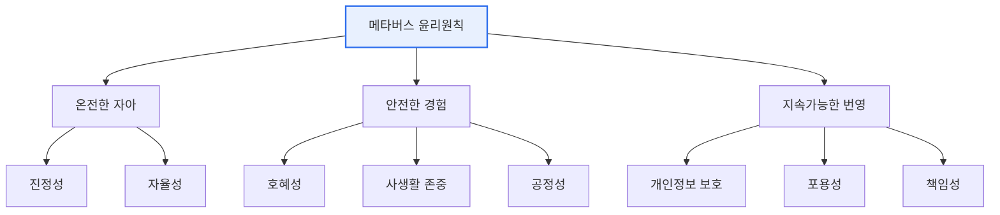

# 메타버스 윤리원칙

## 1. 개요

### 가. 정의

> **메타버스 윤리원칙** 은 과학기술정보통신부가 발표한 지침으로, 메타버스 확산이 야기할 수 있는 **정체성 혼란·프라이버시 침해·중독·가상범죄 등 윤리적 문제에 선제적으로 대응**하기 위한 자율 규범이다. 강제 규제가 아니라 이용자·기업·개발자가 함께 지향할 가치와 실천원칙을 제시한다.

메타버스 윤리원칙의 성격을 이해하는 열쇠는 '**자율 규범(soft law)**'이라는 점이다. 법적 강제력을 가진 규제가 아니라, 산업이 아직 형성 중인 단계에서 관계자들이 자발적으로 지향할 방향을 제시하는 연성 규범이다. 이는 신기술의 발전 여지를 열어두면서도, 문제가 심각해지기 전에 사회적 합의의 밑그림을 그려두려는 접근이다.

### 나. 등장 배경

메타버스 윤리가 인터넷·AI 윤리와 별도로 필요한 이유는, 메타버스가 현실과 가상이 융합된 **새로운 사회적 공간**이라는 데 있다. 사람들은 아바타라는 또 다른 자아로 상호작용하고, 헤드셋을 통한 몰입적 경험을 하며, 가상 자산·가상 화폐로 경제 활동을 벌인다. 이 과정에서 기존 온라인 윤리로는 온전히 담기 어려운 새로운 문제가 생긴다.

첫째는 **정체성 문제**다. 아바타 뒤에 여러 자아를 둘 수 있고, 익명성과 몰입이 결합되면서 현실의 자아와 가상의 자아 사이에 혼란이나 이탈이 생길 수 있다. 둘째는 **실재감에서 오는 충격**이다. 가상 공간의 괴롭힘·폭력·성희롱은 몰입 때문에 실제처럼 체감되어, 텍스트 기반 온라인 폭력보다 심리적 충격이 클 수 있다. 실제로 소셜 VR 플랫폼에서 아바타에 대한 성추행·괴롭힘 사례가 보고되면서 '가상 공간에서의 신체 침해'라는 새로운 쟁점이 부상했다. 셋째는 **데이터 문제**다. 시선 추적·동작 인식·생체 반응 등 몰입형 기기가 수집하는 데이터는 기존 인터넷 서비스보다 훨씬 민감하고 개인을 깊이 드러낸다.

### 다. 필요성

메타버스는 아직 형성 중인 공간이라, 문제가 터진 뒤에 규제하면 이미 늦다. 발전 초기에 지향할 가치와 실천 원칙을 제시함으로써 기술 발전과 이용자 보호의 균형을 잡으려는 선제적 접근이 요구되었다. 강제 규제로 신산업을 위축시키기보다, 이해관계자가 공유할 규범을 먼저 제시해 건강한 생태계를 유도하려는 것이 이 원칙의 취지다. 이는 청소년·아동 등 취약 이용자가 빠르게 유입되는 현실을 고려한 예방적 성격도 띤다.

## 2. 전체 구조 — 3대 지향가치와 8대 실천원칙

먼저 윤리원칙의 전체 구조를 개념도로 조망하고, 이어서 실천원칙이 실제로 어떻게 적용되는지의 절차를 세부 흐름으로 설명한다.

```mermaid
flowchart TB
  M[메타버스 윤리원칙] --> V1[온전한 자아]
  M --> V2[안전한 경험]
  M --> V3[지속가능한 번영]
  V1 --> P1[진정성]
  V1 --> P2[자율성]
  V2 --> P3[호혜성]
  V2 --> P4[사생활 존중]
  V2 --> P5[공정성]
  V3 --> P6[개인정보 보호]
  V3 --> P7[포용성]
  V3 --> P8[책임성]
  style M fill:#e8f0fe,stroke:#2f6fed,stroke-width:2px
```

메타버스 윤리원칙은 세 가지 지향가치를 축으로 하고, 그 아래에 여덟 가지 실천원칙을 둔다. **온전한 자아** 는 아바타를 통해서도 진정성 있는 자아를 실현하며 정체성을 건강하게 유지하는 것으로, 진정성·자율성의 원칙이 이를 뒷받침한다. **안전한 경험** 은 이용자가 폭력·범죄·중독의 위험 없이 신뢰할 수 있는 환경에서 활동하는 것으로, 호혜성·사생활 존중·공정성이 여기에 해당한다. **지속가능한 번영** 은 특정 주체의 독점이 아니라 참여자 모두가 함께 성장하는 생태계를 지향하는 것으로, 개인정보 보호·포용성·책임성이 뒷받침한다.

세 가치는 개인(자아)→상호작용(경험)→공동체(생태계)로 시야가 확장되는 구조로 읽을 수 있다. 즉 개인의 건강한 정체성에서 출발해, 타인과의 안전한 상호작용을 거쳐, 지속가능한 사회로 나아가는 동심원적 배치다.

| 3대 지향가치 | 의미 | 연결되는 실천원칙(요지) |
|---|---|---|
| **온전한 자아** | 진정성 있는 자아 실현·정체성 존중 | 진정성, 자율성 |
| **안전한 경험** | 안전하고 신뢰할 수 있는 이용 | 호혜성, 사생활 존중, 공정성 |
| **지속가능한 번영** | 함께 성장하는 지속가능한 생태계 | 개인정보 보호, 포용성, 책임성 |

각 실천원칙은 추상적 구호가 아니라 설계·운영에 반영될 행동 지침으로 이해해야 한다. 여덟 원칙을 조금 더 구체적으로 풀면 다음과 같다.

- **진정성**: 딥페이크 아바타로 타인을 사칭하거나 허위 정체성으로 기만하지 않고, 아바타 뒤의 자아가 왜곡되지 않도록 한다.
- **자율성**: 이용자가 자신의 데이터·경험·참여 여부를 스스로 결정·통제할 수 있게 하고, 강요나 조작(다크패턴)을 배제한다.
- **호혜성**: 타인을 존중하고 상호 이익이 되는 상호작용을 지향하며, 일방적 착취나 괴롭힘을 금한다.
- **사생활 존중**: 가상 공간에서도 개인의 사적 영역·경계를 존중하고, 원치 않는 접근·감시를 막는다.
- **공정성**: 특정 이용자·집단이 차별받지 않고 규칙이 투명·일관되게 적용되도록 한다.
- **개인정보 보호**: 몰입형 기기가 수집하는 민감 데이터를 최소 수집·목적 제한 원칙으로 보호한다.
- **포용성**: 장애·연령·소득에 따른 접근 격차를 줄여 누구나 참여할 수 있게 한다.
- **책임성**: 문제 발생 시 플랫폼·개발자·이용자가 각자의 몫을 책임지고 구제·개선한다.

이처럼 원칙을 구체적 행위로 번역하는 것이 윤리원칙 실효성의 관건이다. 원칙이 선언에 그치면 실제 서비스의 행동을 바꾸지 못하므로, 각 원칙을 '금지 행위'와 '요구 기능'으로 구체화해 설계 체크리스트로 전환하는 작업이 뒤따라야 한다.

## 3. 실천원칙의 적용 절차와 이해관계자

윤리원칙은 선언에 그치지 않고 서비스 기획·운영 전 단계에 녹아들어야 한다. 다음은 실천원칙이 실제 서비스에 반영되는 과정을 이해관계자 관점에서 세부화한 흐름이다.

```mermaid
flowchart LR
  A["기획<br/>(가치 설계)"] --> B["개발<br/>(설계 반영)"]
  B --> C["운영<br/>(모니터링·신고)"]
  C --> D["대응<br/>(제재·구제)"]
  D --> E["개선<br/>(피드백 반영)"]
  E --> A
  style C fill:#e8f0fe,stroke:#2f6fed,stroke-width:2px
```

**기획 단계**에서는 서비스가 어떤 이용자를 대상으로 하는지, 어떤 상호작용이 일어날지를 예상해 위험 요소를 미리 식별한다. 예컨대 청소년이 주 이용자라면 중독 방지·유해 콘텐츠 차단을 설계 요건으로 못 박는다. **개발 단계**에서는 프라이버시 중심 설계(Privacy by Design)처럼, 원칙을 기본값(default)으로 구현한다. 신고·차단·거리두기(개인 공간 보호) 기능을 사후 추가가 아니라 처음부터 내장하는 것이 예다.

**운영 단계**에서는 실시간 모니터링과 이용자 신고 체계로 문제를 조기에 포착하고, **대응 단계**에서 제재(경고·이용 제한)와 피해자 구제를 수행한다. **개선 단계**에서는 사고 사례와 이용자 피드백을 다시 기획에 반영하는 순환 구조를 만든다. 이 순환에서 책임 주체가 셋으로 나뉜다는 점이 중요하다. **플랫폼**은 안전한 환경과 신고·대응 체계를, **개발자**는 윤리를 반영한 설계를, **이용자**는 타인 존중과 규범 준수를 각각 책임진다. 어느 한 주체에게만 책임을 지우면 실효성이 떨어지므로, 공동 책임(shared responsibility) 구조가 강조된다.

## 4. 인터넷·AI·메타버스 윤리 비교

세 윤리는 대상과 핵심 이슈, 그리고 문제가 발생하는 메커니즘이 다르다. 단순히 항목을 나열하기보다, 왜 차이가 생기는지를 짚어야 한다.

| 구분 | 인터넷 윤리 | AI 윤리 | 메타버스 윤리 |
|---|---|---|---|
| **대상** | 온라인 정보·소통 | AI 시스템의 판단 | 가상융합 공간·아바타 |
| **핵심 이슈** | 정보 신뢰·저작권·예절 | 편향·투명성·책임 | 정체성·실재감·몰입·프라이버시 |
| **특성** | 익명성·개방성 | 자동화·자율성 | 몰입·체화·현실융합 |
| **피해 체감** | 텍스트·이미지 기반 | 결정의 결과로 나타남 | 실재감으로 즉각·신체적 |

인터넷 윤리가 온라인 정보·소통의 문제(익명성 속 예절·저작권·허위정보)를 다루고, AI 윤리가 AI의 판단이 공정·투명한가(편향·설명책임)를 다룬다면, 메타버스 윤리는 몰입적 가상 공간 특유의 문제(정체성·실재감·프라이버시)를 다룬다. 차이의 근원은 '몰입과 체화(embodiment)'다. 인터넷에서의 모욕은 화면 속 텍스트이지만, 메타버스에서 아바타에 대한 침해는 몰입 때문에 자기 신체에 대한 침해처럼 체감된다. 이 실재감이 피해의 강도와 성격을 바꾸므로, 기존 온라인 윤리를 그대로 적용하기 어렵다.

또한 메타버스는 인터넷의 연결성과 AI의 자동화(NPC·생성형 아바타)를 모두 포함하면서, 몰입·체화라는 고유 차원을 더한다. 따라서 메타버스 윤리는 앞의 두 윤리를 대체하는 것이 아니라 그 위에 새로운 층을 얹는 것으로 이해해야 한다. 예를 들어 생성형 AI로 만든 딥페이크 아바타 문제는 AI 윤리(생성물의 진위)와 메타버스 윤리(정체성·사칭)가 겹치는 지점이다.

## 5. 심화 — 국내외 동향과 예상 출제 방향

메타버스 윤리는 국내 지침에 그치지 않고 국제적 논의와 맞물려 있다. 국내에서는 과기정통부의 윤리원칙 외에도 메타버스 진흥을 위한 법제 정비가 추진되었고, 산업 자율규제와 이용자 보호 장치를 함께 마련하는 방향으로 논의가 이어지고 있다. 국제적으로는 유네스코·OECD 등에서 몰입형 기술의 프라이버시·아동 보호·포용성 논의가 진행되며, 특히 시선·동작 등 **몰입형 데이터(immersive/neural data)** 의 민감성이 새로운 규제 쟁점으로 떠올랐다. 이 데이터는 개인의 관심·감정·건강 상태까지 추론할 수 있어, 기존 개인정보 개념을 넘어서는 보호가 필요하다는 문제 제기가 있다.

실무 적용 사례로는, 소셜 VR 플랫폼들이 아바타 간 최소 거리를 강제하는 '개인 경계(personal boundary)' 기능을 도입해 가상 공간 괴롭힘을 기술적으로 완화한 것을 들 수 있다. 이는 윤리원칙의 '안전한 경험'과 '사생활 존중'을 설계로 구현한 구체적 예다. 또한 청소년 이용 시간 관리·유해 콘텐츠 필터링 등은 '온전한 자아(중독 방지)'와 '포용성'을 반영한 조치다.

기술사 시험 관점에서 예상 출제 방향은 다음과 같이 정리할 수 있다. ① 메타버스 윤리원칙의 3대 가치·8대 원칙을 서술하고 인터넷·AI 윤리와 비교하는 유형, ② 특정 윤리 문제(가상범죄·중독·프라이버시)를 제시하고 기술적·제도적 대응방안을 논하는 유형, ③ 프라이버시 중심 설계·이용자 보호 기능 등 원칙의 구현 방안을 설계 관점에서 서술하는 유형이다. 답안 구성 시에는 원칙의 나열에 그치지 말고 '왜 필요한가(배경)→무엇인가(구조)→어떻게 구현하는가(방안)'의 흐름으로 전개하는 것이 유리하다.

## 6. 고려사항 및 시사점

기술사 관점에서 메타버스 윤리를 다룰 때는 다음을 종합적으로 고려해야 한다.

1. **자율 규범을 통한 선제적 대응 전략.** 강제 규제는 형성기 산업을 위축시킬 수 있으므로, 지향가치와 실천원칙을 먼저 제시해 이용자·기업의 자발적 실천을 유도한다. 다만 자율 규범은 실효성 확보가 어렵다는 한계가 있어, 자율규제와 최소한의 법적 안전망(특히 아동·청소년 보호)을 조합하는 트레이드오프 설계가 필요하다.

2. **몰입·체화 특유의 문제에 대한 별도 접근.** 가상 공간의 괴롭힘·폭력은 실재감으로 인해 심리적 충격이 크고, 정체성 혼란·중독 위험도 높다. 따라서 기존 온라인 윤리를 준용하는 데 그치지 말고, 개인 경계 기능·신고 체계·실시간 모니터링 등 몰입 환경에 특화된 기술적·운영적 통제를 설계에 내장해야 한다.

3. **몰입형·생체 데이터의 프라이버시 보호.** 시선·동작·생체 반응 데이터는 개인의 감정·건강까지 추론 가능한 고민감 정보다. 프라이버시 중심 설계(수집 최소화·기기 내 처리·목적 제한)를 기본값으로 삼고, 개인정보보호법상 민감정보 요건과 국제 규제 동향에 부합하도록 관리해야 한다.

4. **다중 이해관계자의 공동 책임 구조.** 메타버스는 플랫폼·개발자·이용자가 함께 만드는 공간이므로, 책임을 어느 한 주체에 몰지 말고 각자의 역할(안전한 환경·윤리적 설계·규범 준수)을 명확히 분담해야 한다. 인터넷·AI 윤리와 상호 보완하며, 융합 기술 특성상 여러 윤리 체계가 함께 작동하도록 정합성을 유지하는 것도 과제다.

5. **포용성과 접근성의 확보.** 몰입형 기기는 비용·신체 조건에 따라 접근 격차(디지털 디바이드)를 키울 수 있다. 지속가능한 번영을 위해서는 장애인·고령자·저소득층도 소외되지 않도록 접근성을 설계 요건으로 반영해야 한다.

## 참고자료

- 과학기술정보통신부, 메타버스 윤리원칙 발표 보도자료 — https://www.msit.go.kr/
- UNESCO, Ethics of immersive technologies 논의 — https://www.unesco.org/
- OECD, Immersive technologies and privacy 관련 자료 — https://www.oecd.org/

---

> **한 줄 요약**: 메타버스 윤리원칙은 *온전한 자아·안전한 경험·지속가능한 번영* 3대 지향가치와 8대 실천원칙을 제시하는 자율 규범으로, 몰입·체화에서 비롯되는 정체성·실재감·프라이버시 문제에 선제 대응하며, 기획→운영→개선의 순환과 플랫폼·개발자·이용자의 공동 책임을 통해 인터넷·AI 윤리를 보완한다.
