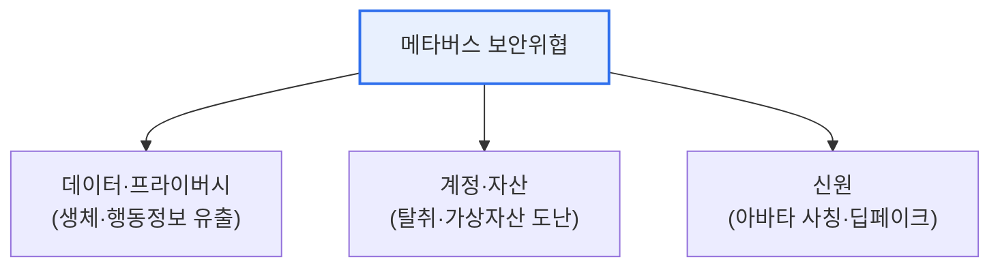

# 메타버스 보안 위협과 사회적 문제

## 1. 개요

### 가. 메타버스의 특징
> **메타버스**는 현실 세계와 가상 세계가 융합된 **3차원 가상 공간**으로, 아바타를 통해 사회·경제·문화 활동을 수행하는 몰입형 인터넷 환경이다.

메타버스가 편리함과 동시에 새로운 위협을 낳는 근본 이유는 '**현실과 가상의 경계가 무너지며, 방대한 개인·생체 데이터가 오간다**'는 데 있다. 메타버스는 단순한 게임이 아니라, 사람들이 아바타로 만나 일하고 거래하고 소통하는 '또 하나의 현실'을 지향한다. 이 몰입과 실재감이 편리함의 원천이지만, 동시에 위협의 근원이기도 하다. 현실처럼 느껴지기에 가상에서의 폭력·괴롭힘이 실제 심리적 충격을 주고, 몰입을 위해 수집하는 시선·동작·생체 데이터가 유출되면 극도로 민감한 프라이버시 침해가 된다. 게다가 가상 자산(NFT·가상화폐)이 거래되면서 금전적 공격 대상이 되고, 아바타로 신원을 숨길 수 있어 범죄·사칭이 쉬워진다. 즉 메타버스는 현실 세계의 위협에 더해, 가상·몰입·데이터라는 고유 특성에서 비롯된 새로운 보안·사회 문제를 함께 안고 있다.

### 나. 주요 특징
| 특징 | 내용 |
|---|---|
| **몰입감·실재감** | 3D·VR/AR로 현실 같은 경험 |
| **아바타** | 가상 자아로 활동, 익명성 |
| **가상 경제** | NFT·가상화폐 기반 경제 활동 |
| **상호작용** | 실시간 다중 사용자 소통 |

## 2. 정보시스템 측면의 보안 위협

| 위협 | 내용 |
|---|---|
| **개인·생체정보 유출** | 시선·동작·음성 등 민감 데이터 탈취 |
| **계정 탈취** | 가상 자산·신원 도용 |
| **가상자산 공격** | NFT·가상화폐 도난, 스마트컨트랙트 취약점 |
| **아바타 사칭·딥페이크** | 타인 아바타 위조, 가짜 신원 |
| **악성코드·피싱** | 가상 아이템·링크를 통한 감염 |

## 3. 사회적 문제와 안전한 메타버스 방안

**사회적 문제**로는 아바타 뒤의 정체성 혼란, 가상 공간의 성희롱·폭력·괴롭힘, 과몰입·중독, 현실과 가상의 혼동, 가상 재화를 둘러싼 사기·경제 범죄가 있다. 익명성과 몰입감이 이런 문제를 키운다.

**안전한 메타버스 방안**은 기술·제도·윤리를 함께 갖추는 것이다.

| 구분 | 방안 |
|---|---|
| **기술** | 강력한 인증(MFA)·암호화, 데이터 최소수집·비식별, 이상행위 탐지 |
| **제도** | 가상 범죄 처벌·규제, 가상자산 보호 법제 |
| **윤리·자율규범** | 메타버스 윤리원칙, 신고·제재 체계 |
| **이용자 보호** | 미성년자 보호, 과몰입 방지, 안전 가이드 |

## 4. 고려사항 및 시사점

1. **프라이버시 보호가 최우선 과제**다. 메타버스는 몰입을 위해 시선·표정·동작 등 극히 민감한 생체·행동 데이터를 수집하므로, 최소 수집·비식별·개인정보보호 설계(Privacy by Design)를 기본으로 삼아야 한다. [[privacy-by-design]]
2. **기술·제도·윤리의 균형**이 필요하다. 기술적 보안만으로는 아바타 사칭·가상 폭력 같은 사회 문제를 막을 수 없어, 법제도와 자율 윤리규범을 함께 갖춰야 한다. [[metaverse-ethics]]
3. **신뢰가 확산의 전제**다. 안전·프라이버시가 보장되지 않으면 이용자가 떠나므로, 보안은 메타버스 산업 성장의 걸림돌이 아니라 지속 가능성의 필수 기반이다. [[digital-twin-metaverse]]

---

> **한 줄 요약**: 메타버스는 *몰입·아바타·가상경제* 특성으로 편리하나, 생체정보 유출·계정/가상자산 탈취·아바타 사칭 등 보안 위협과 정체성 혼란·가상폭력·중독 등 사회 문제를 안고 있어, 기술·제도·윤리를 아우른 안전 방안이 필요하다.
